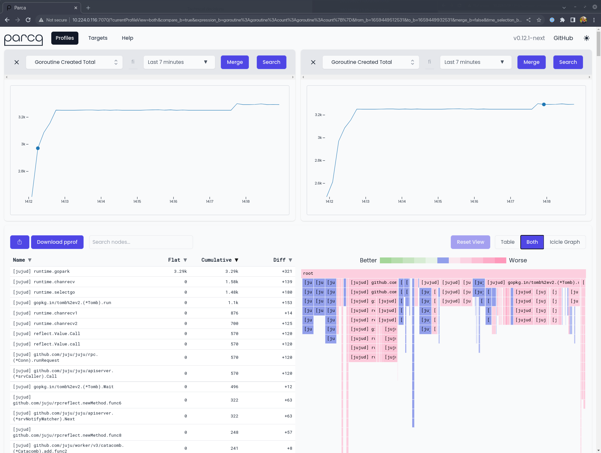
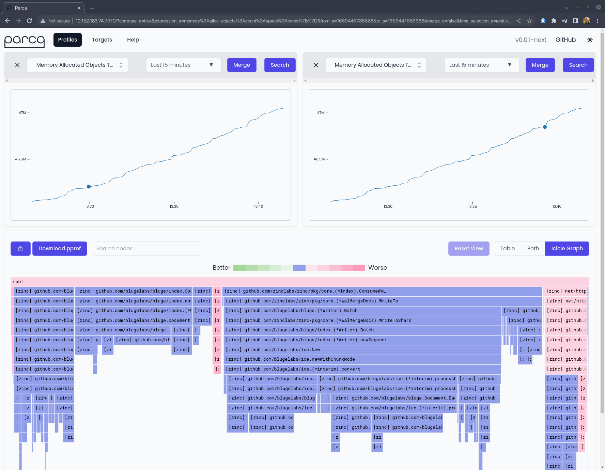
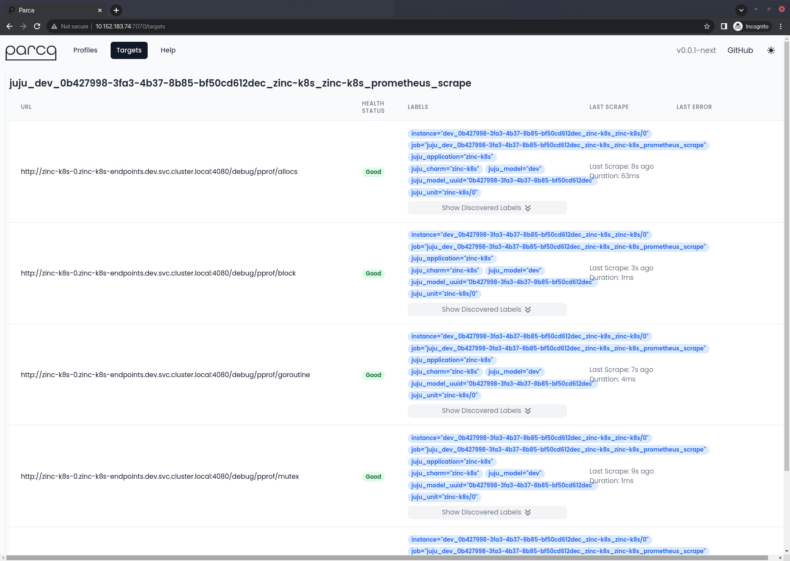
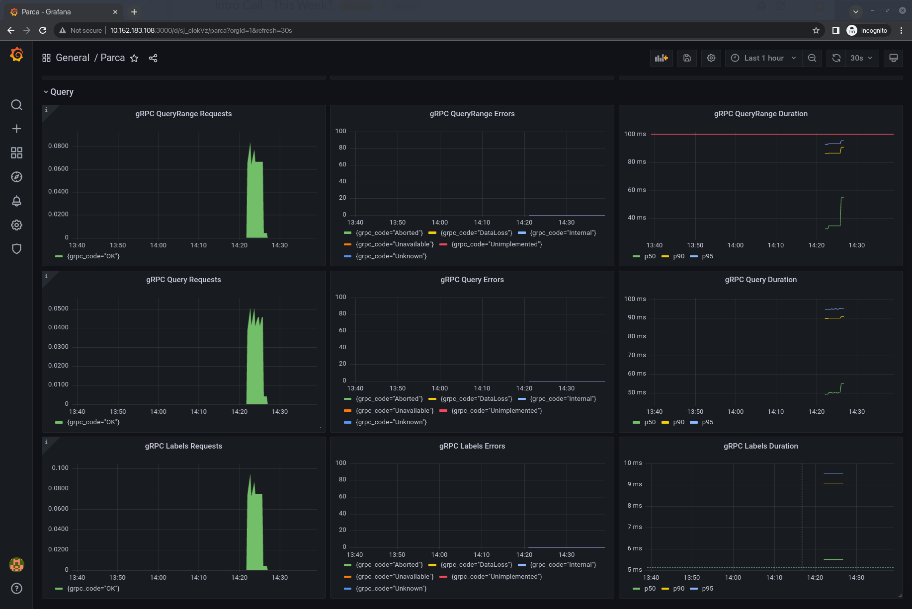

> This post was originally posted [on Charmhub](https://discourse.charmhub.io/t/continuous-profiling-for-juju-parca-on-machines-and-kubernetes/6815) on 02 August 2022. I've posted it to my blog retrospectively, but the article is unchanged. Some commands may need slight adjustments today, feel free to reach out if you get stuck!

## Introduction

Over the past few days, I've been diving into some charm development to get a hands-on feel for where Juju and the Charmed Operator ecosystem has gotten to over the past 15 months. In this post we will:

- Outline the progress we've made, and the current state of charm development and integration
- Show how the Observability libraries can be used to rapidly instrument charmed operators
- Highlight a nice open source continuous profiling tool

But first, let's start with a juicy screenshot showing where we're headed with this post!

[](./01.png)

## What is continuous profiling?

Profiling itself is not a new concept. Profiling is all about measuring applications dynamically at runtime to understand their CPU usage, memory usage, and other important metrics. Profiling can yield deep insights about your application's performance at runtime right down to the line of code that allocated some memory, or created a thread

Previously profiling was almost always performed on a "point in time" basis; continuous profiling improves upon this methodology by introducing a new dimension to your profiling results: time. The basic principle is that by profiling your code at regular intervals, you can understand more easily how different stimuli and runtime conditions affect the performance of your code, and its effect in turn on the underlying system.

Continuous profiling itself is not particularly new either, but its certainly a more regular topic of conversation for many in the last twelve months. Google wrote about it back in 2010 in a paper named [Google Wide Profiling](https://research.google/pubs/pub36575/). They also stewarded the [`pprof`](https://github.com/google/pprof) project which not only defines a data format for profiles themselves, but resulted in the inclusion of the [`pprof` Go package](https://pkg.go.dev/gopkg.in/gin-contrib/pprof.v1) which provides a trivial means for including an HTTP server that's ready to serve performance profiles in the `pprof` format, giving insights into memory allocations, CPU usage and goroutines created in the Go runtime.

## Enter Parca

[Parca](https://parca.dev) is an open source continuous profiling tool by [Polar Signals](https://www.polarsignals.com/). It's written in Go, and takes inspiration from Prometheus in its configuration and storage of data. Better still, while Polar Signals are the primary stewards of Parca, the project is fully open source and has an [open governance model](https://www.parca.dev/docs/governance) which means anyone can become a maintainer.

We have been troubleshooting some crunchy performance issues in the Juju controller code of late, and it led me to think more carefully about profiling tools and start experimenting with Parca

Polar Signals [distribute two key components](https://www.parca.dev/docs/parca) for their solution: the Parca server, and the Parca agent. The server is responsible for collecting profiles across applications (and hosts) and making them available for viewing, filtering and analysis in a nice modern web interface. The agent is focused on specific hosts and unlocks some very powerful capabilities, including host-wide profiling using eBPF, which means you can benefit from profiling even if the applications themselves are not natively instrumented for profiling.

I read a little about Parca, and dived right in to configuring it in an SSH session on my controller (I even [tweeted](https://twitter.com/jnsgruk/status/1550184107568762880) about it!). After I'd got things running, I decided to write a simple charm for Parca, but at the time it was just distributed by means of signed binaries in a Github release. I wanted an easier way to get access to Parca from within my charm that would save me the hassle of working out which architecture to fetch, verifying checksums and figuring out an escape hatch for "airgapped" systems. I decided to start building a snap package…

## `snap install parca`

Building a snap for Parca turned out to be a dream

Being written in Go gives it an unfair advantage, but at this early stage there isn't a huge amount of config to contend with either. Even better, the server component requires very little access to the underlying host, making it a great candidate for a strictly confined snap. You can find the code for the Parca snap [on Github](https://github.com/parca-dev/parca/blob/64e853a94dc382feae3481f3f64efa47e8f5709c/.goreleaser.yml#L37-L85). You get started right away with:

```bash
sudo snap install parca --channel edge
```

At the time of writing, the snap has two modes of operation: firstly it'll make the `parca` command available for you to run one-shot. Parca is configured using command line flags in conjunction with a YAML file for specifying scrape targets and object storage. Because the snap is strictly confined, it can only read from `/var/snap/parca/current` and `/var/snap/parca/common`, so you'll need to be careful about where you place your config file. The snap is also automatically granted access to `/etc/parca`, so you can drop the config file in `/etc/parca/parca.yaml` like the upstream docs [suggest](https://www.parca.dev/docs/systemd).

In addition to the "one-shot" mode of operation, the snap also provides a service. This essentially provides an out-of-the-box systemd configuration with a set of sensible defaults. Once installed you can start Parca immediately using the default configuration like so:

```bash
# Start the service
sudo snap start parca
# Follow the logs
sudo snap logs -f parca
```

There are a couple of configuration options, though they're intentionally limited for now. If you look around carefully you'll find options to configure the in-memory profile storage limit, and the experimental on-disk storage mode.

## Charmed Parca

With a nice convenient way to install and basically configure Parca on any Linux machine, it was time to craft a simple charm! I'll not delve too deep here, as the details of writing Charmed Operators is well covered in the [SDK Docs](https://juju.is/docs/sdk). I do want to highlight some interesting points from those early commits, though…

- I created a simple [class](https://github.com/jnsgruk/parca-operator/blob/a63ae8ba18d01c6bf3f002853cf043846ba79605/src/parca.py) that represents Parca in the codebase. This is a very simple wrapper around a set of snap commands.
- I'm utilising the snap [library](https://charmhub.io/operator-libs-linux/libraries/snap) from Charmhub to keep things brief
- The above class enables us to keep the actual [charm class](https://github.com/jnsgruk/parca-operator/blob/a63ae8ba18d01c6bf3f002853cf043846ba79605/src/charm.py) very simple indeed!

I used to opportunity to test out a new way of testing "machine charms". If you're so inclined, you can dig in and see that there are [unit tests](https://github.com/jnsgruk/parca-operator/tree/a63ae8ba18d01c6bf3f002853cf043846ba79605/tests/unit) that focus solely on the lifecycle of the charm and its interation with the Juju hook tools, followed by [functional tests](https://github.com/jnsgruk/parca-operator/tree/a63ae8ba18d01c6bf3f002853cf043846ba79605/tests/functional) which make no assumptions about being run in the context of Juju and validate only the system-level behaviour of installing and manipulating the snap, and finally [integration tests](https://github.com/jnsgruk/parca-operator/blob/a63ae8ba18d01c6bf3f002853cf043846ba79605/tests/integration/test_charm.py) which build and deploy the charm on a real LXD cluster.

But what about Kubernetes, I hear you ask? Well thankfully, because the kind folks at Polar Signals provide OCI images for each of their builds , it wasn't much trouble to get it running on Kubernetes either, as early commits [would indicate](https://github.com/jnsgruk/parca-k8s-operator/blob/0a45421025d381fcb21629095e84e33c56e827fd/src/charm.py).

## Integrating Parca with the Canonical Observability Stack

Here's where things got a bit magic Over the past 12 months, the Observability charm team have been busily working on the [Canonical Observability Stack](https://charmhub.io/topics/canonical-observability-stack), which combines Prometheus, Grafana, Loki and Alertmanager into a turn-key observability solution on top of MicroK8s (or any other CNCF-conformant Kubernetes , for that matter.).

I mentioned earlier on that Parca took inspiration from Prometheus' configuration when it comes to defining its profiling targets. This made my life very easy in this case. The Observability team have defined the [prometheus_scrape](https://charmhub.io/prometheus-k8s/libraries/prometheus_scrape) relation which provides a Charm library that anyone can use to integrate their application such that prometheus can scrape it for metrics. In my case, I wanted to re-use the other side of that library! While the overall changes I made to the charm in this phase were large, this [diff](https://github.com/jnsgruk/parca-operator/commit/7537ae0526dbbadf9f22c5968193d126c104618b#diff-b9ed39bbc9c0387bd3e07da31d13373745534a1cd723d3e292c73496b12e307c) highlights they key changes I needed to make in order to reuse the existing implementation. I later forked this library and updated the interface name to `parca_scrape` to ensure that there are no mistakes when relating charms at runtime.

This meant that any charmed application could now trivially implement a relation that enabled it to be profiled by Parca . I chose to do this initially with a small stub operator called `juju-introspect` ([Charmhub](https://charmhub.io/juju-introspect)/[Github](https://github.com/jnsgruk/juju-introspect-operator)).

Of course, once I'd worked this out, the implementation was relatively trivial to port to the Kubernetes charm too. Over a total of a few hours, I had created and published a Charmed Operator for Parca for both Kubernetes and machines that:

- Installs Parca from the Snap store (machines only)
- Starts and manages Parca's configuration with minimal overhead on human operators
- Enables Parca to profile other applications using relations
- [Provide integrations with Prometheus](https://github.com/jnsgruk/parca-operator/commit/53f6f078ed5fa1489f5526ef501f17a2e1c9ad1e) so that Parca can be scraped for metrics
- [Provide integrations with Grafana](https://github.com/jnsgruk/parca-k8s-operator/commit/2160139ab427a528f9b4597969b7ac224fdfd949) and include a [default dashboard](https://github.com/jnsgruk/parca-k8s-operator/commit/2160139ab427a528f9b4597969b7ac224fdfd949#diff-dd822e68fe3d5e5e25161716bce5afdc7ac65b1d9754b622cce1d3690f38ddb2) for both charms
- [Integrate with the Traefik ingress](https://github.com/jnsgruk/parca-k8s-operator/commit/60543697a59c148a0408105901d542472e0d5623) on Kubernetes

The other side of the coin is similarly approachable. Take the [Zinc](https://charmhub.io/zinc-k8s) operator as an example - Zinc is a modern, efficient alternative to Elasticsearch written in Go, and happens to provide a profiling endpoint when configured correctly - you can see _all of the effort_ required to enable that integration in the Juju model in [this diff](https://github.com/jnsgruk/zinc-k8s-operator/commit/ac64482af13f92777841f7782a7b1320c5454e3c) .

## Try it out!

So what if you want to get started?! I think there are two interesting experiments for the reader as a result of this article:

- Profiling a Juju controller on LXD
- Profiling Zinc on Kubernetes
- Integrating Parca with the Canonical Observability Stack

The following sections assume that you have access to a machine with a LXD setup, and a [MicroK8s](https://microk8s.io) setup. I use [Multipass](https://multipass.run) for this, but you can find a nice break down [in the Juju docs](https://juju.is/docs/sdk/dev-setup) if you need to get set up.

### Profiling a Juju controller on LXD

Make sure you've got access to a LXD cluster, and the perform the following steps to bootstrap a Juju controller, then augment the controller machine with the `juju-introspect` operator (I'm going to give this some more thought in coming months; as Juju 3.0 releases we'll introduce a 'controller charm' that'll be able to handle this natively!)

Check out the asciinema recording below for a detailed walkthrough, or follow the instructions below:

[](https://asciinema.org/a/517942)

[](./01.jpg)

```shell
# Bootstrap a new Juju controller on LXD
juju bootstrap localhost lxd

# Switch to the controller model
juju switch controller

# Deploy the charm to the controller machine
juju deploy juju-introspect -to 0 --channel edge

# Now you've got a controller machine up, you're ready to start profiling.
# Deploy the Parca operator
juju deploy parca --channel edge

# Relate Parca to the juju-introspect operator to configure a profiling target
juju relate parca juju-introspect
```

You can monitor the status of these operations with `juju status`, once things are settled you should be able to browse to the address of the Parca charm (on port `7070`) and start exploring profiles.

### Profiling Zinc on Kubernetes

In this section, we'll explore how to profile Zinc with Parca on Kubernetes with Juju, but also the integrations with Prometheus and Grafana. I've included a short recording here to show the process, and some abbreviated instructions…

Check out the asciinema recording below for a detailed walkthrough, or follow the instructions below:

[](https://asciinema.org/a/517947)

Once you're done with that, you can login to the Parca dashboard and start comparing profiles:

[](./02.png)

And also take time to check out the targets page, and notice that the target has been automatically labelled with information about the target application's location in the Juju model:

[](./03.png)

To try out profiling Zinc with Parca yourself, try the following:

```bash
# Bootstrap a Juju controller on MicroK8s
juju bootstrap microk8s micro

# Add a model for us to deploy into
juju add-model dev

# Deploy Zinc
juju deploy zinc-k8s --trust

# Deploy Parca
juju deploy parca-k8s --channel edge --trust

# Relate the two apps to configure profiling
juju relate parca-k8s zinc-k8s:profiling-endpoint
```

As before, if you login to the Parca dashboard you should now see Zinc as a profiling target.

### Integrating Parca with the Canonical Observability Stack

As a bonus step, you can now deploy Prometheus and Grafana, and use them to monitor Parca itself!

Check out the asciinema recording below for a detailed walkthrough, or follow the instructions below. It assumes the starting point is the end-state of the Kubernetes walkthrough above:

[](https://asciinema.org/a/517948)

Once you're done, you can login to the Grafana instance and check the dashboard for Parca:

[](./04.png)

To try out the COS x Parca integration yourself, try the following:

```bash
# Deploy Prometheus
juju deploy prometheus-k8s --trust --channel edge

# Deploy Grafana
juju deploy grafana-k8s --trust --channel edge

# Setup the relations
juju relate grafana-k8s:grafana-source prometheus-k8s
juju relate prometheus-k8s parca-k8s:metrics-endpoint
juju relate grafana-k8s parca-k8s

# Wait for things to settle in the Juju status output
# Get the admin password for Grafana
juju run-action grafana-k8s/0 get-admin-password --wait

# Now you should be able to login to the Grafana application at http://<app address>:3000
# and see the Parca dashboard!
```

And that's it! You're now profiling Zinc with Parca, which is being scraped by Prometheus for metrics, and dashboarded in Grafana.

## Conclusions

Well, that was fun! What have we learned?

- The combination of snap packaging and Charmed Operators can make for a powerful, yet readable and maintainable set of automation for deploying applications _anywhere_
- With the proliferation of more charm libraries (particularly from the Observability team!) it's getting easier and easier for developers to integrate pieces of the Charmed Operator ecosystem
- The Operator Framework makes it trivial to share code between operators designed for machines/bare-metal and Kubernetes, reducing the development time for operators
- Parca looks really nice

I'm going to continue to play with Parca. I'd like to have a continuous profiling tool better integrated with Juju 3.0 so that the team, and others, can use it to help us improve the performance of Juju itself. With the introduction of the controller charm, this should be eminently feasible. We may seek one day to integrate a continuous profiling tool into the Canonical Observability Stack. If you've got ideas about this, or you'd like to contribute then get in touch and let's talk about it!

Additionally, this post only really explored the possibility of using the Parca Server to scrape applications that are already set up for profiling. In the future I'd like to have a go at packaging the Parca Agent, so that we can unlock that juicy host-level, eBPF powered profiling and enable you get the benefit of continuous profiling in all of your deployments, irrespective of the technologies you're deploying with Juju.

## Links

I've collected some links from throughout the article for reference:

- Parca - [Homepage](https://parca.dev) / [Github](https://github.com/parca-dev/parca) / [Snap Store](https://snapcraft.io/parca)
- Parca Operator - [Github](https://github.com/jnsgruk/parca-operator) / [Charmhub](https://charmhub.io/parca)
- Parca Kubernetes Operator - [Github](https://github.com/jnsgruk/parca-k8s-operator) / [Charmhub](https://charmhub.io/parca-k8s)
