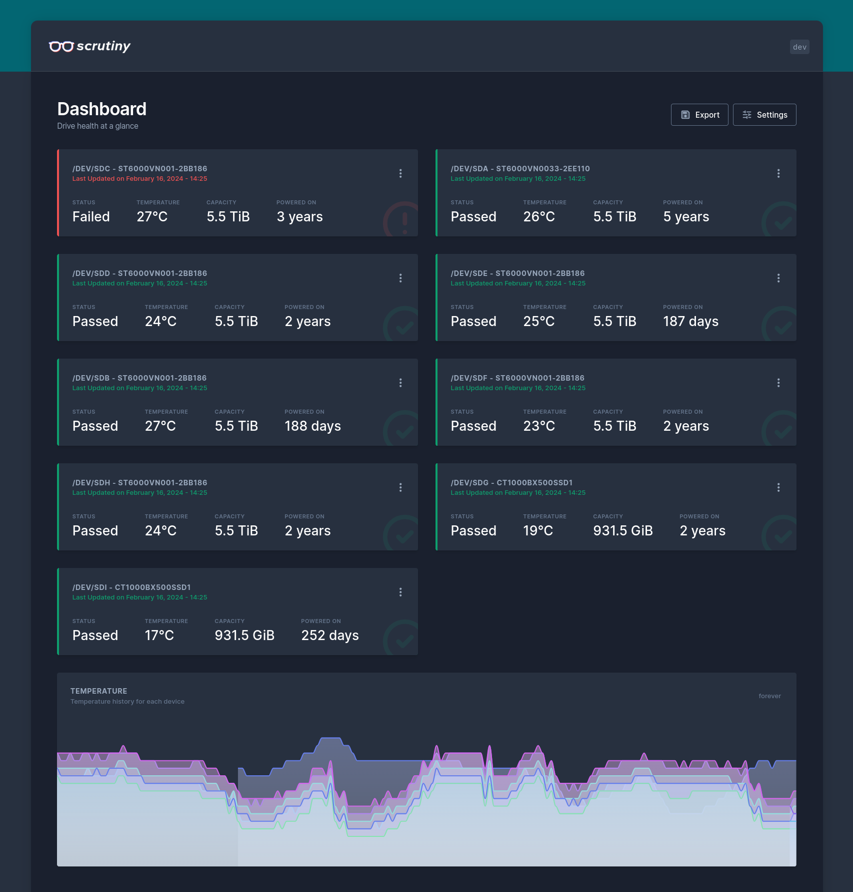
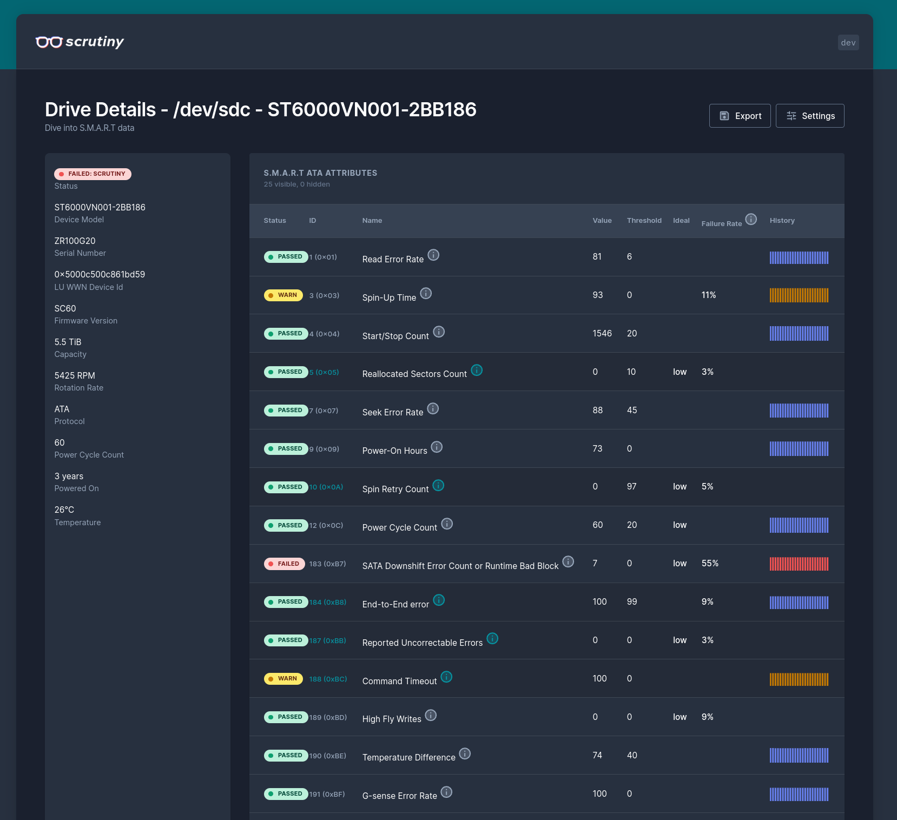

## Introduction

In a recent (well, recent-ish) [episode of the Self Hosted Show](https://selfhosted.show/28), there was some talk of a hard drive monitoring tool called Scrutiny. Scrutiny is a hard drive monitoring tool that exposes S.M.A.R.T data in a nice, clean dashboard. It gathers that S.M.A.R.T data using the venerable [smartd](https://www.smartmontools.org/), which is a Linux daemon that monitors S.M.A.R.T data from a huge number of ATA, IDE, SCSI-3 drives. The code is available [on Github](https://github.com/AnalogJ/scrutiny).

The aim of running such monitoring is to detect and replace failing hard drives before they cause an outage, or any data loss. Depending on the firmware of a drive, there are potentially hundreds of S.M.A.R.T attributes that can be collected, so it can be hard to understand which to pay attention to.

As good as `smartd` is, it has some shortcomings such as not recording historical data for each attribute, and relying upon value thresholds that are set by the manufacturers of the drive. Scrutiny aims to provide historical tracking of attribute readings, and thresholds based on real-world data from [Backblaze](https://www.backblaze.com/).

This all looked very compelling, but it hasn't been packaged for NixOS as far as I can tell. This post is quite "code heavy" and is intended as a bit of a deep-dive/walkthrough for people who are new to packaging in Nix. I'm certainly no expert here, and if you spot something I've done wrong - I'd love to hear about it!

Below is a screenshot of Scrutiny's dashboard:

[](01.png)

## Architecture

In order to get Scrutiny up and running, there were a few components that all needed packaging separately.

Scrutiny itself is made up of the following:

- A web application [backend](https://github.com/AnalogJ/scrutiny/tree/master/webapp/backend) - written in Go
- A web application [frontend](https://github.com/AnalogJ/scrutiny/tree/master/webapp/frontend) - written in NodeJs/Angular
- A [collector](https://github.com/AnalogJ/scrutiny/tree/master/collector) service - written in Go

The web application is the dashboard that you'll see the pretty screenshots of. The collector service is designed to be run on an interval to collect information from `smartd`, and send it to the web application's API.

Scrutiny relies upon [InfluxDB](https://www.influxdata.com/products/influxdb/) to store data about smart attributes in a timeseries.

Thinking about how to structure things, I decided that I would build two separate Nix packages: one for the dashboard and UI, and another for the collector. It seems one could run the collector and dashboard on different machines, so this seemed like a logical split.

## Packaging for NixOS

### Packaging the Dashboard

I decided to start with the web application. Because of how the project is laid out, this means combining two separate derivations based built from the same source code: one for the UI and one for the backend. I began by creating [a file](https://github.com/jnsgruk/nixos-config/blob/1ae03d09e2fba5b53dfe56087d523fd7493e776e/pkgs/scrutiny/common.nix) that would carry common attributes for each of the derivations, such as the version, repository information, hash, etc.

```nix
# common.nix
{ pkgs , ... }:
let
  name = "scrutiny";
  version = "0.7.2";
in
{
  inherit name version;

  # Fetch the source code from Github, referring to
  # the version required by Git tag.
  repo = pkgs.fetchFromGitHub {
    owner = "AnalogJ";
    repo = name;
    rev = "v${version}";
    sha256 = "sha256-UYKi+WTsasUaE6irzMAHr66k7wXyec8FXc8AWjEk0qs=";
  };

  # ...
}
```

I then started packaging the frontend:

```nix
{ pkgs, ... }: {
  # Import some common attributes such
  # as name, version, src repo
  common = import ./common.nix { inherit pkgs; };
  inherit (common) name version repo vendorHash;

  # Create a package for the Javascript frontend
  frontend = pkgs.buildNpmPackage rec {
      inherit version;
      pname = "${name}-webapp-frontend";
      src = "${repo}/webapp/frontend";

      # This hash is generated at build time, and uniquely identifies
      # the cache of NodeJS dependencies used for the build.
      npmDepsHash = "sha256-M8P41LPg7oJ/C9abDuNM5Mn+OO0zK56CKi2BwLxv8oQ=";

      # Override the build phase to match the
      # upstream build process.
      buildPhase = ''
        runHook preBuild
        mkdir dist
        npm run build:prod --offline -- --output-path=dist
        runHook postBuild
      '';

      # Copy the output of the compiled javascript bundle
      # and site assets to the package output.
      installPhase = ''
        runHook preInstall
        mkdir $out
        cp -r dist/* $out
        runHook postInstall
      '';
    };
  # ...
}
```

This is a relatively simple derivation, mostly thanks to the magic of the [`buildNpmPackage`](https://nixos.org/manual/nixpkgs/stable/#javascript-tool-specific) function. This helper function takes care of creating an offline cache containing all of the NodeJS dependencies required to build the frontend. Nix builds are always done in an offline environment to help ensure reproducibility, so source code and dependencies are fetched (and hashed) early in the process before any software is actually built.

I chose to override the build phase to match the process used by the upstream [Makefile](https://github.com/AnalogJ/scrutiny/blob/a3dfce3561bcddcd8b70e4e7f483e22594c8af4d/Makefile#L103-L106). The result of this derivation is a package named `scrutiny-webapp-frontend`, which contains just the built output from the `npm run build:prod` command.

Next up was the dashboard backend. Another pleasingly simple derivation thanks to some help from `buildGoModule`:

```nix
pkgs.buildGoModule rec {
  # The vendor hash is used for multiple packages, and
  # thus centralised and imported here.
  inherit version vendorHash;
  pname = "${name}-webapp-backend";

  # Use the source block defined in 'common.nix'
  src = repo;

  CGO_ENABLED = 0;

  # Override the build phase to ensure the correct
  # binary is built. This project ships both Go applications
  # and the NodeJS frontend in the same repository, so some
  # specificity is required.
  buildPhase = ''
    runHook preBuild
    go build \
      -o scrutiny-web \
      -ldflags="-extldflags=-static" \
      -tags "static netgo" \
      ./webapp/backend/cmd/scrutiny
    runHook postBuild
  '';

  # Add the built binary to the package output, as well
  # as the build output from the frontend.
  installPhase = ''
    mkdir -p $out/bin $out/share/scrutiny
    cp scrutiny-web $out/bin/scrutiny-web
    cp -r ${frontend}/* $out/share/scrutiny
  '';
}
```

This one is a little more interesting. There are some commonalities, such as setting the `vendorHash` to ensure the correct Go dependencies are used (imported from `common.nix` in this case), and overriding the build to match the upstream process and ensure the right binary is built.

Where things differ is in the install phase, where the contents of the `scrutiny-webapp-frontend` derivation is copied into the output of this derivation - which will ultimately result in a single Nix package (named `scrutiny-webapp-backend`) which will contain both the frontend and backend components of the application. This is [ultimately exposed](https://github.com/jnsgruk/nixos-config/blob/1ae03d09e2fba5b53dfe56087d523fd7493e776e/pkgs/default.nix#L8-L9) in an overlay as a package simply named `scrutiny`.

You can see the finished product (with additional package metadata) in [`app.nix`](https://github.com/jnsgruk/nixos-config/blob/1ae03d09e2fba5b53dfe56087d523fd7493e776e/pkgs/scrutiny/app.nix) and [`common.nix`](https://github.com/jnsgruk/nixos-config/blob/1ae03d09e2fba5b53dfe56087d523fd7493e776e/pkgs/scrutiny/common.nix) on Github.

### Packaging the Collector

The collector is just a single, statically compiled Go binary, and as such the derivation very much resembles that of the web application backend above:

```nix
{ pkgs, lib, ... }:
let
  # Again import common attributes from 'common.nix'
  common = import ./common.nix { inherit pkgs; };
  inherit (common) name version repo vendorHash;
in
pkgs.buildGoModule rec {
  inherit version vendorHash;
  pname = "${name}-collector";
  src = repo;

  # We'll create a wrapper script for the
  # collector, which makeWrapper helps with.
  buildInputs = with pkgs; [ makeWrapper ];

  CGO_ENABLED = 0;

  # Override the build phase to ensure the correct
  # binary is built.
  buildPhase = ''
    runHook preBuild
    go build \
      -o scrutiny-collector-metrics \
      -ldflags="-extldflags=-static" \
      -tags "static netgo" \
      ./collector/cmd/collector-metrics
    runHook postBuild
  '';

  # Install both the binary, and a generated wrapper script
  # which ensures that 'smartctl' is in the PATH of the collector.
  installPhase = ''
    mkdir -p $out/bin
    cp scrutiny-collector-metrics $out/bin/scrutiny-collector-metrics

    wrapProgram $out/bin/scrutiny-collector-metrics \
      --prefix PATH : ${lib.makeBinPath [ pkgs.smartmontools ]}
  '';
}
```

Of interest here is the `installPhase`. The collector works by invoking `smartctl` to scrape information from `smartd`. Scrutiny itself expects that tool to be readily available in it's `PATH`, and to accomplish that I used the `makeWrapper` package to create a wrapper script that ensures `scrutiny-collector-metrics` is executed with the `PATH` correctly set such that `smartctl` can be found.

The final derivation for the collector can be seen in [`collector.nix`](https://github.com/jnsgruk/nixos-config/blob/1ae03d09e2fba5b53dfe56087d523fd7493e776e/pkgs/scrutiny/collector.nix) on Github.

## Writing a NixOS Module

While I now had functioning packages for all of Scrutiny's components, for them to function correctly on a machine there are a few things that need to be in place:

- The dashboard package must be installed and started
- The collector collector package must be installed and started
- InfluxDB must be installed and started
- Scrutiny dashboard must be configured to speak to the host's InfluxDB
- `smartd` must be installed and running

This sort of challenge is exactly what the [NixOS modules system](https://nixos.wiki/wiki/NixOS_modules) aims to solve. Modules take a set of configuration attributes, and convert them into rendered system configuration in the form of `systemd` units, configuration files and more.

It's tempting to try to support all possible configurations when writing a module, but I generally prefer to start small, and support only the configuration I need for my use-case. This keeps things easy to test (and leaves some fun for the future!). In this case, the module would be first installed on a server which hosts a set of services behind the [Traefik](https://traefik.io/traefik/) reverse proxy. To work out what configuration I wanted to provide, I looked at the upstream's [example config file](https://github.com/AnalogJ/scrutiny/blob/a3dfce3561bcddcd8b70e4e7f483e22594c8af4d/example.scrutiny.yaml). The important things that stood out to me for consideration were:

- The location of the web UI files to serve
- The host/port of the InfluxDB instance
- The "base path" - Scrutiny will be exposed at `https://<tailscale node>/scrutiny`

As mentioned before - each NixOS module consists of some options, and some rendered config. The options block for my Scrutiny web app looks like the below snippet. I've omitted comments this time, as I think the language is quite descriptive here:

```nix
{
  let
    cfg = config.services.scrutiny;
  in
  options = {
    services.scrutiny = {
      enable = lib.mkEnableOption "Enables the scrutiny web application";

      # Use the `scrutiny` package by default.
      package = lib.mkPackageOptionMD pkgs "scrutiny" { };

      port = lib.mkOption {
        type = lib.types.port;
        default = 8080;
        description = lib.mdDoc "Port for web application to listen on";
      };

      host = lib.mkOption {
        type = lib.types.str;
        default = "0.0.0.0";
        description = lib.mdDoc "Interface address for web application to bind to";
      };

      basepath = lib.mkOption {
        type = lib.types.str;
        default = "";
        description = lib.mdDoc ''
          If Scrutiny will be behind a path prefixed reverse proxy, you can override this
          value to serve Scrutiny on a subpath.

          Do not include the leading '/'.
        '';
      };

      openFirewall = lib.mkOption {
        type = lib.types.bool;
        default = false;
        description = "Open the default ports in the firewall for Scrutiny.";
      };

      logLevel = lib.mkOption {
        type = lib.types.enum [ "INFO" "DEBUG" ];
        default = "INFO";
        description = lib.mdDoc "Log level for Scrutiny.";
      };
    };
  };
}
```

This provides some basic configuration for the attributes I care about - noticeably missing is any advanced configuration for InfluxDB (such as `org`, `bucket`, `token`), and and any ability to configure notifications which Scrutiny supports through the excellent [shoutrrr](https://github.com/containrrr/shoutrrr) library. These things will come later.

I needed a convenient way to convert this Nix-native configuration format into the right format for Scrutiny - I wrote a small Nix function to help with that, which takes configuration elements from the options defined above, and writes them into a small YAML file:

```nix
{
  mkScrutinyCfg = cfg: pkgs.writeTextFile {
    name = "scrutiny.yaml";
    text = ''
      version: 1
      web:
        listen:
          port: ${builtins.toString cfg.port}
          host: "${cfg.host}"
          basepath: "/${cfg.basepath}"

        database:
            location: "/var/lib/scrutiny/scrutiny.db"

        src:
            frontend:
                path: "${pkgs.scrutiny}/share/scrutiny"

      log:
        level: "${cfg.logLevel}"
    '';
  };
}
```

Note that this hard-codes some key elements, such as the path of the web application assets which are shipped as part of the `scrutiny` package.

Let's take a look at the part of the module which turns these options into a rendered system configuration:

```nix
{
  config = {
    # If scrutiny is enabled, also enable InfluxDB with default settings
    services.influxdb2 = lib.mkIf cfg.enable {
      enable = true;
    };

    # Open the relevant ports in the system firewall if configured
    networking.firewall = lib.mkIf cfg.openFirewall {
      allowedTCPPorts = [ 8080 ];
    };

    # If Scrutiny is enabled, create a systemd unit to start it
    systemd = {
      services = {
        scrutiny = lib.mkIf cfg.enable {
          description = "Hard Drive S.M.A.R.T Monitoring, Historical Trends & Real World Failure Thresholds";
          wantedBy = [ "multi-user.target" ];
          after = [ "network.target" ];
          serviceConfig = {
            # Don't run the application a root - create a dynamic user as it starts
            DynamicUser = true;
            # Start the application with a config rendered by the helper function
            ExecStart = "${cfg.package}/bin/scrutiny-web start --config ${mkScrutinyCfg cfg}";
            Restart = "always";
            StateDirectory = "scrutiny";
            StateDirectoryMode = "0750";
          };
        };
      };
    };
  };
}
```

That's enough to get the dashboard started, but it doesn't take care of starting the collector. For that, I added a couple more configuration options to the module:

```nix
{
  let
    collectorCfg = config.services.scrutiny.collector;
  in
  {
    options = {
      services.scrutiny = {
        # ...
        collector = {
          enable = lib.mkOption {
            type = lib.types.bool;
            default = cfg.enable;
            description = lib.mdDoc "Enables the scrutiny collector";
          };

          # Use the `scrutiny-collector` package by default.
          package = lib.mkPackageOptionMD pkgs "scrutiny-collector" { };

          endpoint = lib.mkOption {
            type = lib.types.str;
            default = "http://localhost:${builtins.toString cfg.port}/${cfg.basepath}";
            description = lib.mdDoc "Scrutiny app API endpoint for sending metrics to.";
          };

          interval = lib.mkOption {
            type = lib.types.str;
            default = "15m";
            description = lib.mdDoc ''
              Interval on which to collect information about disks.

              Examples: 15m, 10s, 2h.
            '';
          };
        };
      };
    };
  }
}
```

With that configuration in place, I needed to adjust the rendered configuration to include starting the collector. The collector is designed to run on an interval to post metrics to the dashboard. The upstream achieves this with `cron`, but I decided to use systemd timers:

```nix
{
  config = {
    # ...
    # If the collector is enabled, enable smartd so that the
    # collector can scrape metrics from it
    services.smartd = {
      enable = collectorCfg.enable;
      extraOptions = [ "-A /var/log/smartd/" "--interval=600" ];
    };

    systemd = {
      services = {
        # Setup a systemd unit to start the collector
        scrutiny-collector = lib.mkIf collectorCfg.enable {
          description = "Scrutiny Collector Service";
          environment = {
            COLLECTOR_API_ENDPOINT = "${collectorCfg.endpoint}";
          };
          serviceConfig = {
            Type = "oneshot";
            ExecStart = "${cfg.collector.package}/bin/scrutiny-collector-metrics run";
          };
        };
      };

      # Set up a systemd timer to trigger the collector at an
      # interval (default 15m).
      timers = {
        scrutiny-collector = lib.mkIf collectorCfg.enable {
          timerConfig = {
            OnBootSec = "5m";
            OnUnitActiveSec = "${collectorCfg.interval}";
            Unit = "scrutiny-collector.service";
          };
        };
      };
    };
  };
}
```

And that's it! You can see the final module all stitched together [on Github](https://github.com/jnsgruk/nixos-config/blob/1ae03d09e2fba5b53dfe56087d523fd7493e776e/modules/nixos/scrutiny.nix).

## Automated Testing

To me, a super exciting part of the NixOS ecosystem is its automated testing framework, which is used to great effect for testing [hundreds of packages](https://github.com/NixOS/nixpkgs/tree/master/nixos/tests) end-to-end before they're released to the various NixOS channels. The NixOS testing framework provides a set of helpers for spawning fresh NixOS virtual machines, and ensuring that applications can start, services have the right side effects, etc.

I wanted to write a simple test to validate that Scrutiny will continue to work as I update my flake. In my view, the test needed to:

- Ensure that the packages could be built
- Ensure that when `services.scrutiny.enable = true` is set, the services start
- Ensure that the dashboard app renders the UI
- Ensure that the metrics collector can speak to the dashboard

Most of these are relatively trivial - one piece that's a little harder is testing that the UI renders correctly. The application is rendered using Javascript client-side, so a simple `curl` won't get us the results we're expecting. I had previously used `selenium` for this purpose when I [submitted a test for the LXD UI](https://github.com/NixOS/nixpkgs/blob/1225df86908f6f5b23553e9d77da4df4bfdd58ef/nixos/tests/lxd/ui.nix#L4), so I chose to use that approach again.

The test code can be seen below, or on [Github](https://github.com/jnsgruk/nixos-config/blob/1ae03d09e2fba5b53dfe56087d523fd7493e776e/modules/nixos/tests/scrutiny.nix):

```nix
{
  name = "scrutiny";
  nodes = {
    # Configure a NixOS virtual machine for the test
    machine = { self, pkgs, lib, ... }: {
      # Ensure that my NixOS module is imported
      imports = [ self.nixosModules.scrutiny ];
      # Add the package overlay from my flake so that `pkgs.scrutiny` resolves.
      nixpkgs.overlays = [ self.outputs.overlays.additions ];

      # Configure the VM to use my module and enable it
      services.scrutiny.enable = true;


      environment.systemPackages =
        let
          # A selenium script that fetches the dashboard using geckodriver
          seleniumScript = pkgs.writers.writePython3Bin "selenium-script"
            {
              libraries = with pkgs.python3Packages; [ selenium ];
            } ''
            from selenium import webdriver
            from selenium.webdriver.common.by import By
            from selenium.webdriver.firefox.options import Options
            from selenium.webdriver.support.ui import WebDriverWait

            options = Options()
            options.add_argument("--headless")
            service = webdriver.FirefoxService(executable_path="${lib.getExe pkgs.geckodriver}")  # noqa: E501

            driver = webdriver.Firefox(options=options, service=service)
            driver.implicitly_wait(10)
            driver.get("http://localhost:8080/web/dashboard")

            wait = WebDriverWait(driver, 60)

            # Look for some elements that should be rendered by the Javascript bundle in the UI
            assert len(driver.find_elements(By.CLASS_NAME, "mat-button-wrapper")) > 0
            assert len(driver.find_elements(By.CLASS_NAME, "top-bar")) > 0

            driver.close()
          '';
        in
        with pkgs; [ curl firefox-unwrapped geckodriver seleniumScript ];
    };
  };
  # This is the test code that will check if our service is running correctly:
  testScript = ''
    start_all()

    # Wait for InfluxDB to be available
    machine.wait_for_unit("influxdb2")
    machine.wait_for_open_port(8086)

    # Wait for Scrutiny to be available
    machine.wait_for_unit("scrutiny")
    machine.wait_for_open_port(8080)

    # Ensure the API responds as we expect
    output = machine.succeed("curl localhost:8080/api/health")
    assert output == '{"success":true}'

    # Start the collector service to send some metrics
    collect = machine.succeed("systemctl start scrutiny-collector.service")

    # Ensure the application is actually rendered by the Javascript
    machine.succeed("PYTHONUNBUFFERED=1 selenium-script")
  '';
}
```

This relatively short code snippet will take care of:

- Building a dedicated virtual machine according to the `machine` spec
- Starting the VM
- Running the tests inside the VM (specified in `testScript)
- Collecting the results

I ended up adding this check in a Github Actions [workflow](https://github.com/jnsgruk/nixos-config/blob/1ae03d09e2fba5b53dfe56087d523fd7493e776e/.github/workflows/flake-check.yaml#L20-L33) so that it's run each time I make a change to my flake.

## Try It!

You can give this a go too! If you've got a NixOS machine, or perhaps a virtual machine you've been experimenting with, then you need only add the following to your flake:

```nix
{
  inputs = {
    nixpkgs-unstable.url = "github:nixos/nixpkgs/nixos-unstable";
    jnsgruk.url = "github:jnsgruk/nixos-config";
    jnsgruk.inputs.nixpkgs.follows = "nixpkgs-unstable";
    # ...
  }
  # ...
}
```

And in your NixOS machine configuration:

```nix
# Where 'inputs' is the inputs attribute of your flake
{ inputs, ... }: {
    imports = [ inputs.jnsgruk.nixosModules.scrutiny ];
    nixpkgs.overlays = [ inputs.jnsgruk.overlays.additions ];
    services.scrutiny.enable = true;
}
```

The next time you rebuild your system, you should be able to browse to [http://localhost:8080](http://localhost:8080) and see some hard drive metrics!

## What's Next?

This was a pretty quick exercise - I'd estimate at about 3 hours in total. No doubt I will find some bugs, but already in my mind are the following future improvements:

- Add some more tests that exercise more of the config options
- Enable notifications configuration in the module
- Submit the packages/module to the upstream or to nixpkgs

I also need to go and investigate this rather sad looking hard disk...

[](02.png)

That's all for now! Thanks for reading if you got this far!
