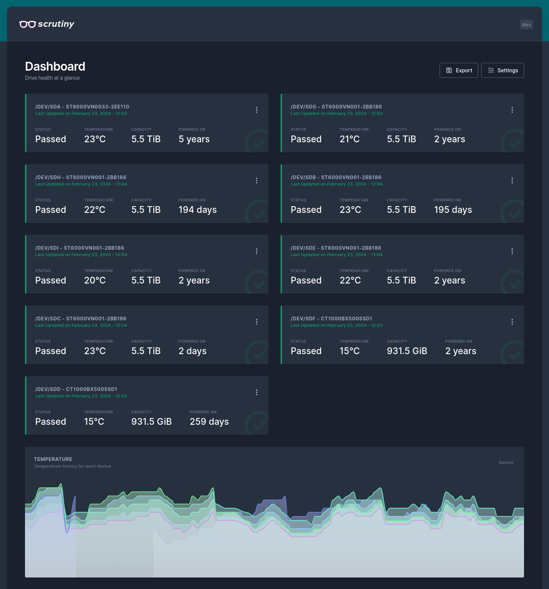
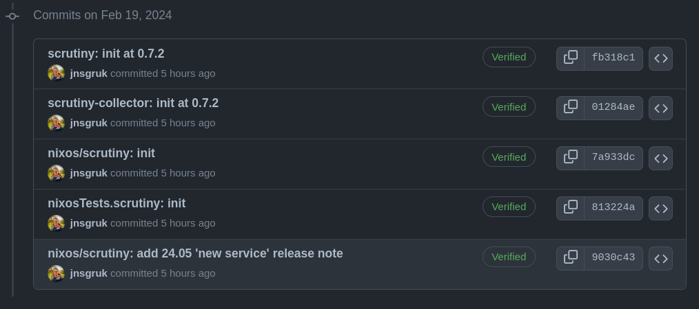
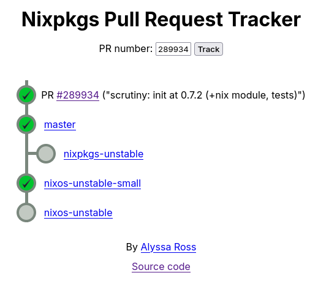

## Introduction

I'm quite overwhelmed by the number of people who read, and engaged with my [last post](https://jnsgr.uk/2024/02/packaging-scrutiny-for-nixos/) on packaging [Scrutiny](https://github.com/AnalogJ/scrutiny) for NixOS. I hadn't intended on posting to this blog more than maybe once per month, but I decided to continue documenting the journey of landing Scrutiny upstream in [nixpkgs](https://github.com/NixOS/nixpkgs).

One of the things that really struck me about NixOS early on was how simple the contribution process is. A single Github repository contains all the packages, all the modules, and all the tests.

I've found the community incredibly helpful and respectful in all of my contributions - often with 2-3 people quickly providing reviews to help shape the contribution. I've heard complaints that reviews can be quite pedantic, and while I agree to some extent, the reviews nearly always come with concrete suggestions which are a great way to learn. Notwithstanding the fact that you are contributing to an operating system package that could land on many thousands of machines - it's important to be careful!

If you've been deliberating about whether or not to submit your package, module or otherwise, I'd encourage you to go for it. I've always found it rewarding and it's taught me a lot about Nix and NixOS.

My [first contribution](https://github.com/NixOS/nixpkgs/pull/214193) was adding a package, module and test for [multipass](https://multipass.run) - as you can see I had plenty to learn, but people were generous with their time and it resulted in a contribution that I use daily to get my work done on NixOS.

For those losing sleep over the poorly disk I showed in my last post, you'll be relieved to know that it's now been replaced! Incidentally this was the first time I've replaced a disk in a ZFS array and I was super impressed with how easy the process was!

[](02.png)

## Improving My Work

Over the weekend following my first post about Scrutiny, a couple of people identified some small issues and made pull requests to resolve them - thank you to those people! You can see their work [here](https://github.com/jnsgruk/nixos-config/pull/14), [here](https://github.com/jnsgruk/nixos-config/pull/17) and [here](https://github.com/jnsgruk/nixos-config/pull/15). Someone also [pointed out](https://toot.community/@bouk/111951919753119887) to me that string-interpolating YAML wasn't the most ideal solution to rendering the configuration file, and the I could have used [`builtins.toJSON`](https://nixos.org/manual/nix/stable/language/builtins.html#builtins-toJSON), taking advantage of the fact that JSON is also valid YAML.

I also wanted to make sure that there was a way for people to use the module with an existing InfluxDB deployment. My original implementation assumed that it could just add `services.influxdb2.enable = true` to the system configuration and use the default credentials to connect. I added [some options](https://github.com/jnsgruk/nixos-config/blob/34d91414594d1e492b5a6dfe43514da01c594e83/modules/nixos/scrutiny.nix#L72-L126) to the module for configuring a different InfluxDB instance if required. These were later modified slightly to use `lib.types.nullOr lib.types.str` following a helpful [review comment](https://github.com/NixOS/nixpkgs/pull/289934#discussion_r1495476364).

Next up was refactoring the helper function I wrote for generating the configuration file. As mentioned above, Nix comes with a handy [`builtins.toJSON`](https://nixos.org/manual/nix/stable/language/builtins.html#builtins-toJSON) function which takes a native Nix expression (an [attribute set](https://nixos.org/guides/nix-pills/basics-of-language#id1366) in this case) and renders it to JSON. This obviates the need to string-interpolate YAML, which is error prone at the best of times. The renewed function looked like this:

```nix
{
  mkScrutinyCfg = cfg: pkgs.writeTextFile {
    name = "scrutiny.yaml";
    text = builtins.toJSON {
      version = 1;
      web = {
        listen = {
          inherit (cfg) host port;
          basepath = if cfg.basepath != "" then "/" + cfg.basepath else "";
        };

        database = {
          location = "/var/lib/scrutiny/scrutiny.db";
        };

        src = {
          frontend.path = "${pkgs.scrutiny}/share/scrutiny";
        };

        influxdb = {
          inherit (cfg.influxdb) scheme host port token org bucket;
          tls.insecure_skip_verify = cfg.influxdb.tlsSkipVerify;
        };
      };
      log = {
        level = cfg.logLevel;
      };
    };
  };
}
```

I also noticed that I had hard-coded the path to the binaries in the rendered systemd units. You might recall that each Nix package contains `meta` block, which adds information about the package such as the license, maintainer, etc. For each of the packages, [I added](https://github.com/jnsgruk/nixos-config/commit/13b9a0e1d640266fe6b6b6eafad579152198d384) a `mainProgram` attribute which enables the use of something like `lib.getExe pkgs.scrutiny` rather than `${pkgs.scrutiny}/bin/scrutiny`.

```nix
{
  # ...
  meta = {
    mainProgram = "scrutiny";
    # ...
  };
}
```

Finally, I wanted to simplify the packaging of the Go programs slightly. In the previous post I used `buildPhase` to override the default build behaviour of the `buildGoModule` function. I later discovered the `subPackages` attribute, which enabled me to achieve the same effect without overriding the process manually. You can see the commit with all the changes [on Github](https://github.com/jnsgruk/nixos-config/commit/34d91414594d1e492b5a6dfe43514da01c594e83), but below is a (slightly modified) preview of the simplified collector derivation:

```nix
{ pkgs, lib, ... }:
pkgs.buildGoModule rec {
    # (source, name, version, vendor hash omitted)

    subPackages = "collector/cmd/collector-metrics/collector-metrics.go";

    buildInputs = with pkgs; [ makeWrapper ];

    CGO_ENABLED = 0;
    ldflags = [ "-extldflags=-static" ];
    tags = [ "netgo" "static" ];

    installPhase = ''
      mkdir -p $out/bin
      cp $GOPATH/bin/collector-metrics $out/bin/scrutiny-collector-metrics
      wrapProgram $out/bin/scrutiny-collector-metrics \
        --prefix PATH : ${lib.makeBinPath [ pkgs.smartmontools ]}
    '';

    # (meta block omitted)
}
```

## Contributing To nixpkgs

With these changes made, it was time to open a pull request. The NixOS community provide some [contributing guidelines](https://github.com/NixOS/nixpkgs/blob/master/CONTRIBUTING.md) which are worth a read before you start.

There was a structural transition in the `pkgs` directory lately, so this was my first contribution under that new structure. There was a [detailed talk](https://media.ccc.de/v/nixcon-2023-35713-not-all-packages-anymore-nix) about that transition at Nixcon if you'd like more information.

I needed to do the following:

- Create the `scrutiny` and `scrutiny-collector` packages
- Add the `scrutiny` module
- Add the tests
- Update the release notes for the next release of NixOS

Which translated into the following stack of commits on [PR #289934](https://github.com/NixOS/nixpkgs/pull/289934):

[](01.png)

There were a few other minor changes, such as how input packages (like `smartmontools` and `makeWrapper`) are passed to the packages. In the nixpkgs repository, packages are passed directly to the derivations, rather than `pkgs` being passed as a top-level argument and packages being referred to by `pkgs.smartmontools` etc.

I also learned something new about module configuration. In the first iteration I had set the default value of `services.scrutiny.collector.enable` to the value of `services.scrutiny.enable`, meaning that the collector would be enabled automatically when Scrutiny was enabled if no other configuration was specified. It transpires that this is not permitted in nixpkgs, and resulted in [this CI failure](https://github.com/NixOS/nixpkgs/actions/runs/7957910596/job/21721675050?pr=289934). I updated the module with a subtle API change, meaning that consumers of the module will now need to do the following to get the same behaviour.

```nix
{
  services = {
    scrutiny.enable = true;
    scrutiny.collector.enable = true;
  };
}
```

## Review Feedback

From the first review I learned about the [`lib.types.nullOr`](https://github.com/NixOS/nixpkgs/blob/c6aa0f73ec0204b16a7245c2b39679b5e11bd307/lib/types.nix#L632-L649) meta-type which enables the specification of optionally `null` configuration options in a NixOS module.

What followed was [a suggestion](https://github.com/NixOS/nixpkgs/pull/289934#pullrequestreview-1890026984) to embrace a different configuration format according to [RFC42](https://github.com/NixOS/rfcs/blob/master/rfcs/0042-config-option.md): a proposal for structured module configuration which is more rigorously type checked, and more flexible as new options are added to the underlying workload.

Many NixOS modules solve this problem today with options like `extraConfig` or `configLines`, which append strings to the end of any options-generated configuration file. What RFC42 proposes is a hybrid approach whereby certain options are well-defined (and thus feature [in the documentation](https://search.nixos.org/options?channel=unstable&from=0&size=50&sort=relevance&type=packages&query=services.scrutiny.)), but additional options can be injected as needed. The has the nice side-effect that modules do not need to support dozens of options which can become a burden to maintain and test over time, but consumers can still make use of new features and options that are introduced to the underlying workload.

You can see the full resulting options definition [on Github](https://github.com/NixOS/nixpkgs/blob/master/nixos/modules/services/monitoring/scrutiny.nix), and small annotated excerpt below:

```nix
{
  services.scrutiny = {
    enable = lib.mkEnableOption "Enables the scrutiny web application.";

    # ...

    settings = lib.mkOption {
      description = lib.mdDoc ''
        Scrutiny settings to be rendered into the configuration file.

        See https://github.com/AnalogJ/scrutiny/blob/master/example.scrutiny.yaml.
      '';

      default = { };

      # This is the key to RFC42 - defining `settings` as type `submodule`.
      type = lib.types.submodule {
        # This ensures that attrsets, lists, etc. are rendered as JSON
        freeformType = (pkgs.formats.yaml { }).type;

        # The following are examples of "well-defined" options with
        # formal types and metadata.
        options.web.listen.port = lib.mkOption {
          type = lib.types.port;
          default = 8080;
          description = lib.mdDoc "Port for web application to listen on.";
        };

        options.web.listen.host = lib.mkOption {
          type = lib.types.str;
          default = "0.0.0.0";
          description = lib.mdDoc "Interface address for web application to bind to.";
        };

        # ...
      };
  };
}
```

This enables the following user configurations:

```nix
{
  services.scrutiny = {
    enable = true;
    settings = {
      # These options are well-defined in the module with types,
      # examples, descriptions and are rendered in the docs.
      web.listen = {
        port = 8080;
        host = "100.64.12.34";
      };

      # These are not, but will be rendered still as JSON and enable
      # people to make use of options supported by Scrutiny, but
      # not directly by the module.
      notify = {
        urls = [
          "discord://token@channel"
        ];
      };
    };
  };
}
```

I was impressed by the simplicity of the approach, and subsequently adopted the same for the collector, which now has the ability to take configuration through the [`services.scrutiny.collector.settings`](https://github.com/NixOS/nixpkgs/blob/7713853c8624abf65e020ee7f07c081ac7dbf07b/nixos/modules/services/monitoring/scrutiny.nix#L127-L153) attribute.

One aspect of Scrutiny's design that helped is the ability to take configuration either through from file, or through environment variables, or both! I chose to supply some fixed options [as environment variables](https://github.com/NixOS/nixpkgs/blob/7713853c8624abf65e020ee7f07c081ac7dbf07b/nixos/modules/services/monitoring/scrutiny.nix#L181-L185) to the systemd services, and allow the rest of the configuration to be set using the generated file.

[@JulienMalka](https://github.com/JulienMalka) reviewed next, suggesting changes to ensure that various `preInstall` and `postInstall` hooks were being called where I was overriding `installPhase`, though what followed from [@katexochen](https://github.com/katexochen)'s review was a simplification that reduced this need slightly.

[@katexochen](https://github.com/katexochen) suggested a couple of nice changes, among which was the ability to drop explicitly mentioning the `netgo` tag in the Go packages, since `CGO_ENABLED` is disabled already, this implies using the Go internal version of many libraries. They also [suggested](https://github.com/NixOS/nixpkgs/pull/289934#discussion_r1497170464) moving the install of the frontend pieces to `postInstall`, rather than overriding the standard `installPhase`.

And finally [@SuperSandro2000](https://github.com/SuperSandro2000) reviewed with some naming changes to simplify the package definitions and reduce repetition. I also noticed that I was unnecessarily declaring the `frontend` definition using the [`rec` keyword](https://nixos.org/manual/nix/stable/language/constructs.html#recursive-sets). Once these were fixed the PR was merged!

## Contribution Tips

I'm still relatively new to this - you can see that my [list of contributions](https://github.com/NixOS/nixpkgs/commits?author=jnsgruk) is not extensive, but I've been through the process of adding, updating and refining packages and modules a few times.

Take this advice for what it is, but I hope you find it helpful:

1. **Read the [contribution guidelines](https://github.com/NixOS/nixpkgs/blob/master/CONTRIBUTING.md)**: This is probably the best start. Try to follow the guidance as best you can, and take a look at some other [recently closed Pull Requests](https://github.com/NixOS/nixpkgs/pulls?q=is%3Apr+sort%3Aupdated-desc+is%3Aclosed) to see if you can pick up on any patterns.
2. **Be humble**: Everyone is new when they start. You might find some reviews a little terse. Rest assured that this is only because the maintainers are incredibly busy. Assume good intentions, remain polite and respectful. Nixpkgs is one of the [busiest Github repositories](https://github.com/NixOS/nixpkgs/pulse) I've seen, and it's largely maintained by volunteers who often have limited time to give for a huge number of contributions.
3. **Be patient**: Don't expect a review immediately. If you're looking for a preliminary review, feel free to ping me [on Mastodon](https://jnsgr.uk/mastodon) and I'll try to offer any guidance I can.
4. **Use the Discourse**: Because of the volume of PRs, the community run ongoing "PRs Ready for Review" threads [on Discourse](https://discourse.nixos.org/c/dev/14) which you can use to attract reviewers if your PR has been stale a while. It's also a great place to [ask for help](https://discourse.nixos.org/c/learn/9).

Once merged, commits trickle through the various branches of the repository. You can track the progress of your PR in that process once it's merged using the [PR Tracker](https://nixpk.gs/pr-tracker.html). You can see an example of this by [tracking the Scrutiny PR](https://nixpk.gs/pr-tracker.html?pr=289934):

[](03.png)

## Summary & Thanks

My Scrutiny packages, module and tests landed in nixpkgs approximately 4 days after I submitted the pull request. As ever, I received a bunch of helpful reviews from the community, and Scrutiny is now easier than ever to consume on NixOS.

You can see the finished components here:

- [scrutiny package](https://github.com/NixOS/nixpkgs/blob/master/pkgs/by-name/sc/scrutiny/package.nix)
- [scrutiny-collector package](https://github.com/NixOS/nixpkgs/blob/master/pkgs/by-name/sc/scrutiny-collector/package.nix)
- [nixos module](https://github.com/NixOS/nixpkgs/blob/master/nixos/modules/services/monitoring/scrutiny.nix)
- [nixos test](https://github.com/NixOS/nixpkgs/blob/master/nixos/tests/scrutiny.nix)

If you were previously using my flake to consume Scrutiny, you'll now see a deprecation warning. To migrate over, import the module from `unstable` in your flake and ensure that you explicitly enable the collector:

```nix
{
  services = {
    scrutiny.enable = true;
    scrutiny.collector.enable = true;
  };
}
```

Before I wrap up, I'd like to thank all those people who took the time to review the PR, and especially [@JulienMalka](https://github.com/JulienMalka) and [@RaitoBezarius](https://github.com/RaitoBezarius) who have helped me through countless contributions over the past months and been incredibly responsive to my questions.

Give it a go and let me know how you get on!
