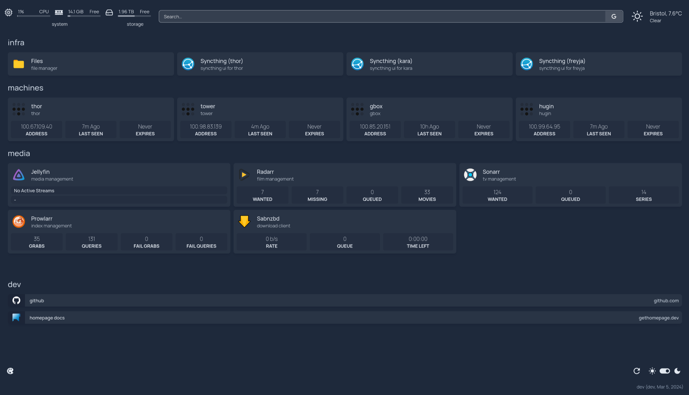
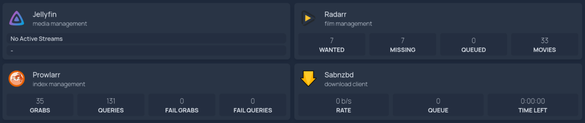
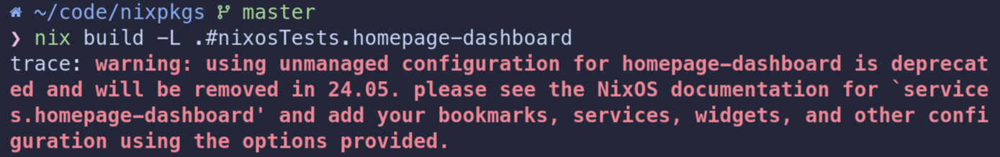
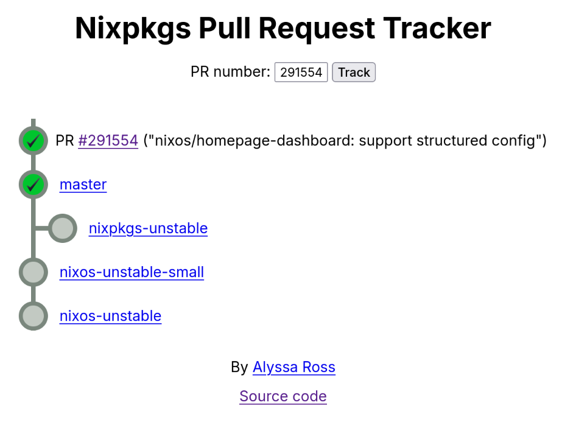

## Introduction

I run a very small homelab that provides some basic services to my home network. I'm not much of a data hoarder, but my lab consists of some redundant storage in a [`raidz2`](https://www.raidz-calculator.com/raidz-types-reference.aspx) ZFS pool, and I use the homelab as a receive-only target for [Syncthing](https://syncthing.net/), and as the point from which backups of my critical data are made using [Borg](https://www.borgbackup.org/) & [Borgbase](https://www.borgbase.com/).

It also runs a few other small services - all of which are exclusively available over Tailscale to my other devices. I wanted a small dashboard solution that could give me links to each of those services with a nice simple URL.

There are certainly plenty of options; this seems to be a highly crowded space in the open source homelab world. I settled on the rather ambiguously named [homepage](https://gethomepage.dev). At the time of writing, my dashboard looks like so, though there are people who have been far more creative with the appearance!

[](01.png)

Naturally, I wanted to run this on NixOS, so in July 2023 I landed one of my early contributions to the project in the form of PR [#243094](https://github.com/NixOS/nixpkgs/pull/243094) which added the package (named `homepage-dashboard`), a basic NixOS module and a basic test.

## Homepage's Configuration

Homepage is configured using a [set of YAML files](https://github.com/gethomepage/homepage/tree/6b961abc4e73b924f780b1cb32481640213fd477/src/skeleton) named `services.yaml`, `bookmarks.yaml`, `widgets.yaml`, etc. When I originally started writing the module, it would look for those config files in a hard-coded location (`/config`), and if the files were missing it would copy a [skeleton config](https://github.com/gethomepage/homepage/tree/6b961abc4e73b924f780b1cb32481640213fd477/src/skeleton) into place with some defaults to get you going.

The hard-coded location results from the fact that the upstream primarily support deploying Homepage using Docker. They expect the config directory to be bind-mounted into the container from the host. As part of the initial packaging effort, I contributed a [patch](https://github.com/gethomepage/homepage/pull/1673) upstream to allow customising this location by setting the `HOMEPAGE_CONFIG_DIR` environment variable, which I then set in the systemd unit configuration [in the NixOS module](https://github.com/NixOS/nixpkgs/pull/243094/files#diff-e4532095c5cc6e132e60ca8a1fa0589898576aa2073624135c1086cbc7e78a7cR38) to `/var/lib/homepage-dashboard`.

This has been working fine for a few months, but it's been bugging me that my dashboard configuration is not part of the declarative system configuration. Once the initial skeleton had been copied in place, you were left to edit the files manually (and back them up) if you wanted to make changes. Moreover, `homepage` defaults to creating a `logs` directory as a subdirectory of the `config` directory. This makes some sense in a container environment, but given that homepage also logs to stdout (which is collected by the systemd journal on NixOS), it's really just unnecessary duplication.

## Evolving The Module Design

Before writing the actual implementation of the module, I decided to first sketch out what I wanted my NixOS configuration to look like:

```nix
{
  services.homepage-dashboard = {
    # These options were already present in my configuration.
    enable = true;
    package = unstable.homepage-dashboard;

    # The following options were what I planned to add.

    # https://gethomepage.dev/latest/configs/settings/
    settings = {};

    # https://gethomepage.dev/latest/configs/bookmarks/
    bookmarks = [];

    # https://gethomepage.dev/latest/configs/services/
    services = [];

    # https://gethomepage.dev/latest/configs/service-widgets/
    widgets = [];

    # https://gethomepage.dev/latest/configs/kubernetes/
    kubernetes = { };

    # https://gethomepage.dev/latest/configs/docker/
    docker = { };

    # https://gethomepage.dev/latest/configs/custom-css-js/
    customJS = "";
    customCSS = "";
  };
}
```

Each of the new sections would then map neatly to the [different configuration section](https://gethomepage.dev/latest/configs/) in the upstream documentation. Based on my learning from [the Scrutiny module](https://jnsgr.uk/2024/02/contributing-scrutiny-to-nixpkgs/), I wanted to utilise the same [RFC42](https://github.com/NixOS/rfcs/blob/master/rfcs/0042-config-option.md) approach which would obviate the need for the module to specify every possible supported configuration option, resulting in a large, difficult to maintain module which could quickly fall behind the upstream project.

Homepage supports a large number of [widgets](https://gethomepage.dev/latest/widgets/) (see below) which are able to scrape information from the API of various devices and services. These often require an API key or token of some kind, and having those in plaintext as part of the machine configuration is undesirable from a security perspective - even if your services are all on a private network like mine. Luckily I found out (tucked away [in the docs](https://gethomepage.dev/latest/installation/docker/#using-environment-secrets)) that Homepage can inject secret values into the configuration using environment variables.

Given the template value of `{{HOMEPAGE_VAR_FOOBAR}}` as part of the configuration, Homepage will automatically substitute the value of the variable `HOMEPAGE_VAR_FOOBAR`.

[](./02.png)

I decided to provide a single configuration option named `environmentFile` so that users can supply the path to an environment file containing all of their variables. This file can be omitted from Git repositories and configurations, or included in encrypted form. I achieve this by including the file encrypted using [`agenix`](https://github.com/ryantm/agenix) which integrates [@FiloSottile](https://github.com/FiloSottile)'s wonderful [`age`](https://age-encryption.org/) into NixOS. You can see how that's supplied as [part of my nixos-config](https://github.com/jnsgruk/nixos-config/blob/ab46f2b45aea11634c85c2c2024eac1c4f5601e0/host/common/services/homepage/thor.nix#L2-L9).

## Backwards Compatibility

According to my [relatively naive Github search](https://github.com/search?q=language%3Anix+homepage-dashboard+NOT+is%3Afork+NOT+repo%3ANixOS%2Fnixpkgs&type=code) I estimated that there are not _that many_ users of the module - likely in the tens, rather than the hundreds or thousands. That said, I think its important not to break those users. There's no reason to expect that a `nix flake update` should break your system.

The way I chose to handle this in the module was to check if any of the _new config options_ are set. If they're not, the module behaves as before, but displays a deprecation warning:

[](./03.png)

The implementation of this check is relatively crude, but it works, and it will only be around until the release of NixOS 24.05 (in May 24):

```nix
config =
  let
    # If homepage-dashboard is enabled, but none of the configuration values have been updated,
    # then default to "unmanaged" configuration which is manually updated in
    # var/lib/homepage-dashboard. This is to maintain backwards compatibility, and should be
    # deprecated in a future release.
    managedConfig = !(
      cfg.bookmarks == [ ] &&
      cfg.customCSS == "" &&
      cfg.customJS == "" &&
      cfg.docker == { } &&
      cfg.kubernetes == { } &&
      cfg.services == [ ] &&
      cfg.settings == { } &&
      cfg.widgets == [ ]
    );

    configDir = if managedConfig then "/etc/homepage-dashboard" else "/var/lib/homepage-dashboard";

    msg = "using unmanaged configuration for homepage-dashboard is deprecated and will be removed"
      + " in 24.05. please see the NixOS documentation for `services.homepage-dashboard' and add"
      + " your bookmarks, services, widgets, and other configuration using the options provided.";
  in
  lib.mkIf cfg.enable {
    # Display the deprecation warning if the configuration isn't managed
    warnings = lib.optional (!managedConfig) msg;

# ...
```

## Solving Log Duplication

I mentioned in a previous section that Homepage logs to both stdout and a logs directory by default. While the log file path [can be customised](https://gethomepage.dev/latest/configs/settings/#log-path), it's not currently possible to disable the file logging completely. It's not desirable to have the log file in this context, because all of the logs are collected by systemd anyway.

Looking at the upstream implementation, the logger is instantiated and configured in a single [`logger.js`](https://github.com/gethomepage/homepage/blob/6b961abc4e73b924f780b1cb32481640213fd477/src/utils/logger.js#L41-L68) file. Homepage has a policy that they won't accept feature contributions (even if you do the implementation) unless the feature gets at least 10 upvotes. I filed a [feature request](https://github.com/gethomepage/homepage/discussions/3067), but it's yet to get enough votes to be accepted.

In the mean time I wrote [a short patch](https://github.com/gethomepage/homepage/commit/3be28a2c8b68f2404e4083e7f32eebbccdc4d293) on a branch in my personal fork which makes Homepage adhere to an environment variable named `LOG_TARGETS`. The possible values are `both`, `file` or `stdout` with a default value of `both` to respect the existing behaviour and remain backward compatible. The patch is now [applied](https://github.com/NixOS/nixpkgs/blob/6dc8cbe3cc1520315d85c3e4490b50a73c7c7381/pkgs/servers/homepage-dashboard/default.nix#L42-L54) in the Nix package as part of nixpkgs, and the module [configures the systemd unit](https://github.com/NixOS/nixpkgs/blob/6dc8cbe3cc1520315d85c3e4490b50a73c7c7381/nixos/modules/services/misc/homepage-dashboard.nix#L223-L227) by setting the `LOG_TARGETS` variable to `stdout` in cases where the configuration is managed:

```nix
{
  # ...
  environment = {
    HOMEPAGE_CONFIG_DIR = configDir;
    PORT = toString cfg.listenPort;
    LOG_TARGETS = lib.mkIf managedConfig "stdout";
  };
  # ...
}
```

## Bolstering The Test Suite

When I originally implemented the tests for the module, they simply enabled the service and ensure that it responded on the specified port. I wanted to include some logic in the test that ensured the ability to detect when managed configuration should be used, and when the module should respect an existing implementation.

The NixOS test suite supports specifying multiple machines as part of a given test, so extending the previous implementation wasn't particularly cumbersome. See below for the (annotated) implementation:

```nix
import ./make-test-python.nix ({ lib, ... }: {
  name = "homepage-dashboard";
  meta.maintainers = with lib.maintainers; [ jnsgruk ];

  # Create a machine that uses the legacy module format,
  # where configuration is unmanaged by nix, and relies
  # upon YAML files.
  nodes.unmanaged_conf = { pkgs, ... }: {
    services.homepage-dashboard.enable = true;
  };

  # Create another machine that sets some simple
  # configuration using the new module system. This
  # doesn't need to be exhaustive, just enough to trigger
  # the condition that makes the module use managed config.
  nodes.managed_conf = { pkgs, ... }: {
    services.homepage-dashboard = {
      enable = true;
      settings.title = "custom";
    };
  };

  testScript = ''
    # Ensure the services are started on unmanaged machine,
    # and that the service responds to HTTP requests on the
    # expected port.
    unmanaged_conf.wait_for_unit("homepage-dashboard.service")
    unmanaged_conf.wait_for_open_port(8082)
    unmanaged_conf.succeed("curl --fail http://localhost:8082/")

    # Ensure that /etc/homepage-dashboard doesn't exist, and boilerplate
    # configs are copied into place in `/var/lib/homepage-dashboard`.
    # This validates the existing behaviour.
    unmanaged_conf.fail("test -d /etc/homepage-dashboard")
    unmanaged_conf.succeed("test -f /var/lib/private/homepage-dashboard/settings.yaml")

    # Ensure the services are started on managed machine,
    # and that the service responds to HTTP requests on the
    # expected port.
    managed_conf.wait_for_unit("homepage-dashboard.service")
    managed_conf.wait_for_open_port(8082)
    managed_conf.succeed("curl --fail http://localhost:8082/")

    # Ensure /etc/homepage-dashboard is created and unmanaged
    # conf location isn't present
    managed_conf.succeed("test -d /etc/homepage-dashboard")
    managed_conf.fail("test -f /var/lib/private/homepage-dashboard/settings.yaml")
  '';
})
```

This is by no means exhaustive, and I can certainly imagine increasing the coverage here at a later date, but it does at least give some confidence when working on the module that the two basic modes of operation are functioning correctly.

## Migrating Existing Configurations

If you have been using the module in its past form, you may be wondering what the easiest way to migrate to the new format is...

I made the shift using [`yaml2nix`](https://github.com/euank/yaml2nix) to convert my existing YAML configurations to Nix expressions, and then formatted the output using [`nixpkgs-fmt`](https://github.com/nix-community/nixpkgs-fmt). For example, given the following `settings.yaml` (which came from my homelab before I moved over):

```yaml
---
# For configuration options and examples, please see:
# https://gethomepage.dev/en/configs/settings

title: sgrs dashboard
favicon: https://jnsgr.uk/favicon.ico
headerStyle: clean

layout:
  media:
    style: row
    columns: 3
  infra:
    style: row
    columns: 4
  machines:
    style: row
    columns: 4
```

You can do the following to get a Nix expression that can be assigned to `services.homepage-dashboard.settings` in your machine configuration, converting the YAML to a Nix expression:

```
 ~/temp
❯ nix run nixpkgs#yaml2nix settings.yaml
{ title = "sgrs dashboard"; favicon = "https://jnsgr.uk/favicon.ico"; headerStyle = "clean"; layout = { media = { style = "row"; columns = 3; }; infra = { style = "row"; columns = 4; }; machines = { style = "row"; columns = 4; }; }; }
```

With that output, you can insert a few line breaks and rely on `nixpkgs-fmt` to get everything lined up properly. You can see my complete dashboard configuration in Nix format as part of my [nixos-config](https://github.com/jnsgruk/nixos-config/blob/ab46f2b45aea11634c85c2c2024eac1c4f5601e0/host/common/services/homepage/thor.nix) repository.

## Summary

The PR was merged earlier today, and will now need to trickle through the branches on its way to `nixos-unstable`. At the time of writing, it hasn't quite made it there:

[](04.png)

You can track for yourself on the [nixpkgs tracker](https://nixpk.gs/pr-tracker.html?pr=291554), but the time delay should give you a chance to migrate your configuration!

See Github for the full [module](https://github.com/NixOS/nixpkgs/blob/6dc8cbe3cc1520315d85c3e4490b50a73c7c7381/nixos/modules/services/misc/homepage-dashboard.nix) implementation, [package](https://github.com/NixOS/nixpkgs/blob/6dc8cbe3cc1520315d85c3e4490b50a73c7c7381/pkgs/servers/homepage-dashboard/default.nix#L42-L54) and [tests](https://github.com/NixOS/nixpkgs/blob/6dc8cbe3cc1520315d85c3e4490b50a73c7c7381/nixos/tests/homepage-dashboard.nix).

Let me know if you're using the module, or if you run into any issues! If you're a fan of Homepage, then consider helping out with the project or [sponsoring them on Github](https://github.com/sponsors/gethomepage), and once again thank you to those who helped review and shape the module as part of this upgrade!
