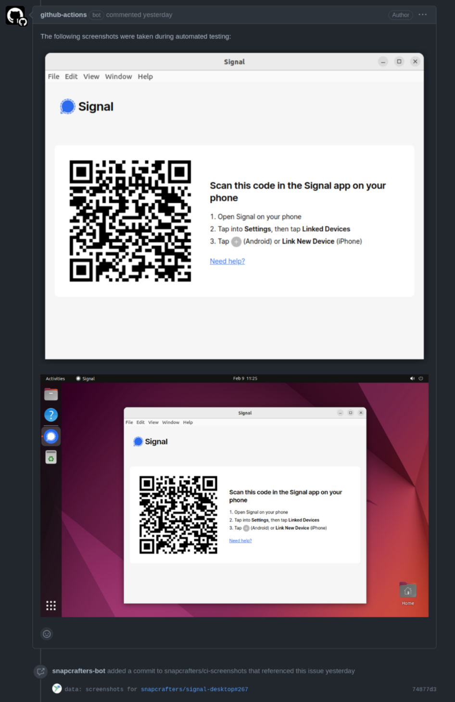

## Introduction

For the past few months, I've been getting steadily more involved in [Snapcrafters](https://github.com/snapcrafters). The Snapcrafters are a community dedicated to the creation and maintenance of ~100 snap packages. They're currently maintaining snaps for applications like [Signal Desktop](https://snapcraft.io/signal-desktop), [Discord](https://snapcraft.io/discord), [Gimp](https://snapcraft.io/gimp), [Terraform](https://snapcraft.io/terraform) and [many more](https://snapcraft.io/search?q=publisher%3Asnapcrafters), some with _hundreds of thousands of weekly active users_. As with any community organisation, maintainer participation can ebb and flow over time as people find themselves with competing priorities.

One of my personal goals for participation in the Snapcrafters org was to help them build more automated, sustainable processes for bumping versions of snaps as the upstreams move forward, and find a more robust way to test GUI applications before they're released to the masses.

The snap store comes with a surprisingly rich delivery mechanism consisting of [tracks, risks and branches](https://snapcraft.io/docs/channels). This means that (among other things) changes to applications can be tested by way of an incremental roll out by those willing to help out - by subscribing to the `edge` or `candidate` channels.

## The Problem

While bumping the versions of the applications in snap packages [can be done trivially](https://github.com/snapcrafters/signal-desktop/blob/325c06602d6bbb976afbabe48e16c688f1d70c94/.github/workflows/sync-version-with-upstream.yml), testing that the new application can launch on the Linux desktop and function correctly is more difficult - especially given the "headless" nature of CI systems, and the inherent complexity of some of the applications involved.

Electron has, in my opinion, been a huge net win for the Linux desktop. Performance and early Wayland compatibility aside, the selection of mainstream applications available to the Linux desktop user is certainly much greater as a result. One downside is that each app is essentially a browser with lots of complex moving parts which can be difficult to maintain for packagers over time - and particularly so for a team of volunteers who may not be experts in the applications they help to maintain.

In a [previous post](https://jnsgr.uk/2024/02/nixos-vms-in-github-actions/) I wrote about how KVM-acceleration is now available on Github Actions runners. While it's certainly possible to just pull in various pieces of the Linux desktop using `apt` directly on a Github Actions runner, the resulting configuration normally involves convoluted setup with VNC or similar. Such setups are usually fragile, and can be more difficult to reproduce locally - making it slower to debug any issues that do arise.

## LXD Desktop VMs

Before working at Canonical, I must confess to having paid _very little_ attention to [LXD](https://canonical.com/lxd). Since joining, it's become one of my most used tools in my daily workflow. I had some early experience with LXD a few years ago when it essentially "just" did Ubuntu containers, but it's evolved into a very competent hypervisor in its own right, providing both container and virtual machine images for numerous different Linux distributions. In more recent history, desktop virtual machines were introduced which gives a very fast way to boot into a desktop across multiple distributions.

To boot into a Ubuntu 22.04 LTS desktop virtual machine, for example:

```bash
lxc launch images:ubuntu/22.04/desktop ubuntu --vm --console=vga
```

As a side note, last year Canonical [announced](https://ubuntu.com/blog/lxd_ui) the LXD UI, which is a beautiful web UI for managing clusters of LXD servers, and includes a graphical web console for virtual machines - which is incredibly useful for testing software across versions and desktops.

## Wrapping LXD

After playing with LXD a bunch locally, I confirmed that between `lxc exec`, `lxc file pull` I had all I need. The commands were all relatively simple, but I wanted to ensure that the Github Actions I wrote were as maintainable as possible, so I decided to write a small wrapper for LXD, which ended up being named `ghvmctl` (Github Virtual Machine Control) because naming is…. hard!

There is nothing special about `ghvmctl`, it is just a `bash` script. Perhaps one day I'll implement it in something a little more… rigorous? That said, it's wrapping relatively few shell commands, with very few variables, and it's been solid for several months now. The sum of `ghvmctl`'s capabilities can be summarised as:

- Launch Ubuntu desktop VMs
- Dismiss any initial setup wizards
- Ensure that `gnome-screenshot` is installed
- Provide a simple way to install and run snaps
- Provide a simple way to screenshot the whole screen, and the active window

The script is mostly contained in a [single file](https://github.com/snapcrafters/ghvmctl/blob/1ac4a99dd1c6f78226b60eda205cd06c6ac20dfa/src/ghvmctl), apart from [`ghvmctl-runner`](https://github.com/snapcrafters/ghvmctl/blob/1ac4a99dd1c6f78226b60eda205cd06c6ac20dfa/src/ghvmctl-runner) which is pushed automatically into any VMs started by `ghvmctl`, and provides a way for applications to be run with all the appropriate environment variables such that graphical applications can run when the VM is being controlled headlessly (such as `DISPLAY`, `WAYLAND_DISPLAY`, `XDG_SESSION_TYPE`, etc.).

There are very few dependencies for the script, but I decided to [package it as a snap](https://github.com/snapcrafters/ghvmctl/blob/1ac4a99dd1c6f78226b60eda205cd06c6ac20dfa/src/ghvmctl-runner) to simplify installing it on Github runners. The snap is simple, containing just the two scripts mentioned above, and the LXC client. This also means you can install and use the tool locally should you wish to experiment with it:

```bash
# Install ghvmctl
sudo snap install ghvmctl
# Allow ghvmctl to access the LXD socket
sudo snap connect ghvmctl:lxd lxd:lxd
# Launch a VM and prepare for testing
ghvmctl prepare
# Install a snap from the store
ghvmctl snap-install signal-desktop
# Run the snap on the desktop
ghvmctl snap-run signal-desktop

# Wait a few seconds for the app to start...

# Take screenshots and pull them back to $HOME/ghvmctl-screenshots
ghvmctl screenshot-full
ghvmctl screenshot-window
```

To simplify the installation and setup of `ghvmctl`, there is also a [Github Action](https://github.com/snapcrafters/ci/tree/8eb0566a765cd0196d7223734dd4cc0f3eb4521f/setup-ghvmctl) which takes care of enabling KVM on the runner, initialising LXD, installing `ghvmctl` and ensuring it has access to the LXD socket.

## Building An Integrated Workflow

By now, the Snapcrafters have quite a [sophisticated collection](https://github.com/snapcrafters/ci) of Github Actions which are used for managing the release lifecycle of snaps, but for me it was this piece that tied it all together for GUI applications. The actions can be summarised as:

- Parsing `snapcraft.yaml` files for details such as name, architectures, version
- Building snaps locally on Github Actions runners when Pull Requests are made
- Building snaps across architectures on the Launchpad build farm when changes are merged
- Create a "Call for Testing" Github Issue with details of the `candidate` revisions
- Follow up on the issue with screenshots in a comment
- Promote the snap to `stable` when a maintainer issues the command

None of these things are particularly hard in their own right, but they amount to some complicated juggling of Github Actions artefacts and tokens for various repositories and external services.

## Building A Screenshot Action

The Github Action [responsible for collecting screenshots](https://github.com/snapcrafters/ci/tree/8eb0566a765cd0196d7223734dd4cc0f3eb4521f/get-screenshots) is used across multiple snaps to give maintainers a bit more confidence when releasing changes into the `stable` channels for their snaps.

The action makes use of `ghvmctl` to launch VMs, install the `candidate` snaps and collect screenshots of them. This turned out to be simple with the introduction of `ghvmctl` - the complicated part turned out to be where to store the screenshots such that they could be published in a comment! Github provides image/file hosting for comments on issue _when the comments are made through the web UI_. As far as I can tell, there is no way to submit a comment with an embedded picture from the Github API (let me know!), and I wasn't keen to rely on a third party service such as Imgur.

The solution we settled on was to create a [`ci-screenshots`](https://github.com/snapcrafters/ci-screenshots), which could be published to by the workflows of each snap repository. We will, over time, clear out older screenshots.

## End Result

An example of the end result can be seen in [this Github Issue](https://github.com/snapcrafters/signal-desktop/issues/267). Let's break down what happened.

First, once a change was merged into the Signal Desktop snap repository, and the resulting snap was built for each of its target architectures:

[](01.png)

As part of this process an issue was automatically created containing information about the new `candidate` versions:

[](02.png)

A couple of minutes later, the bot followed up with a comment containing screenshots of the application running on the desktop:

[](03.png)

Once I was content that the snap was working correctly, and I'd tested the revision out locally, I then issued a command to promote the snap into the `stable` channel, where it was slowly rolled out across the user base:

[](04.png)

You can see examples of this working across multiple snaps:

- [gimp](https://github.com/snapcrafters/gimp/issues/260)
- [discord](https://github.com/snapcrafters/discord/issues/184)
- [sublime-text](https://github.com/snapcrafters/sublime-text/issues/59)
- [sublime-merge](https://github.com/snapcrafters/sublime-merge/issues/31)
- [mattermost-desktop](https://github.com/snapcrafters/mattermost-desktop/issues/100)

## Summary

We're still in the process of refining and rolling out this process, but I hope that it will help reduce burden on maintainers over time, and result in fresher and more reliable desktop snaps in the [Snap Store](https://snapcraft.io). If you'd like to get involved in Snapcrafters, reach out to me, post on the [Snapcraft Discourse](https://forum.snapcraft.io/t/snapcrafters-reboot/24625) or join the [Matrix room](https://matrix.to/#/#snapcrafters:matrix.org).
