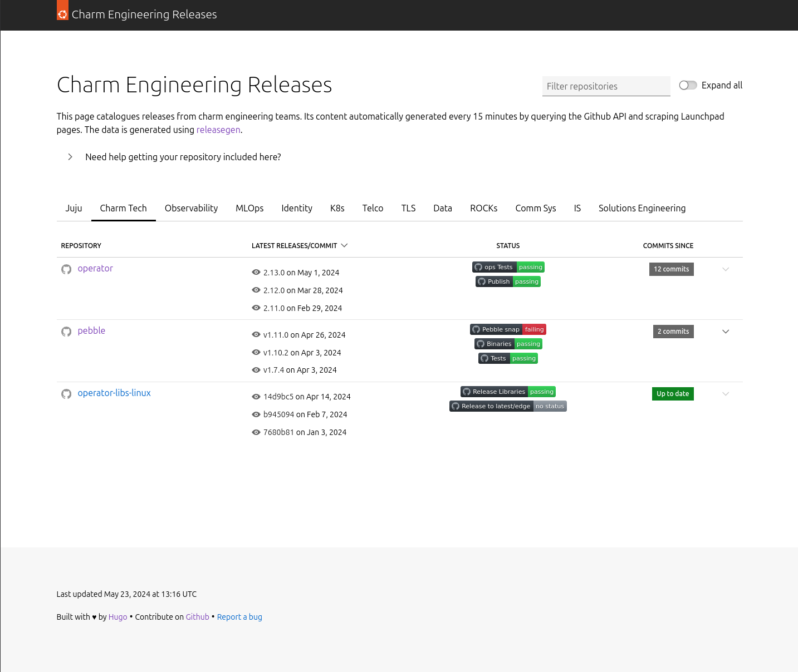
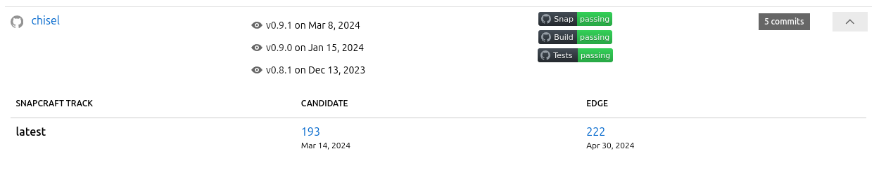
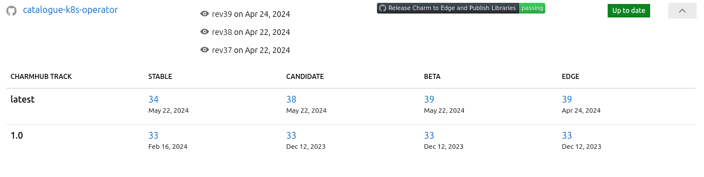
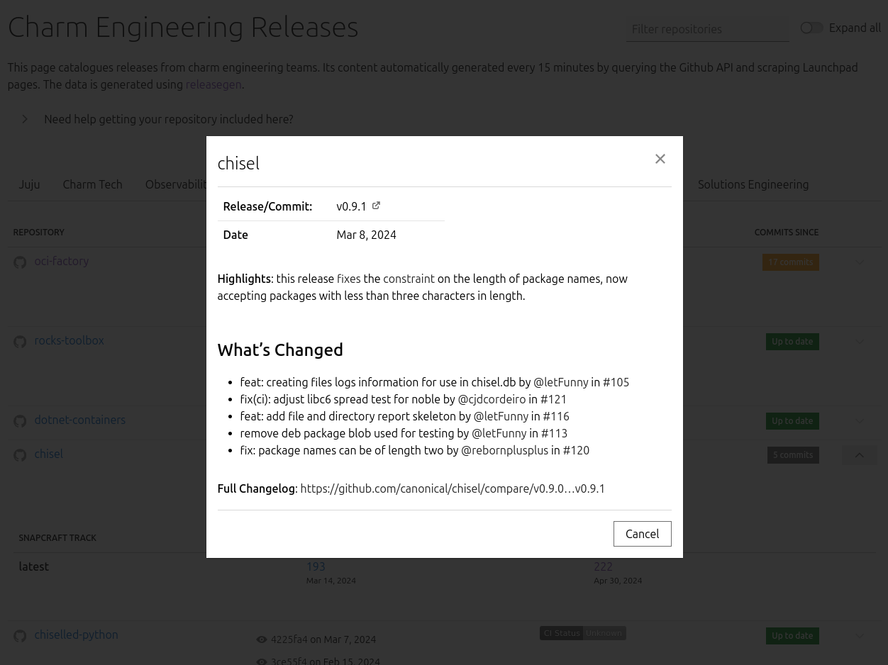
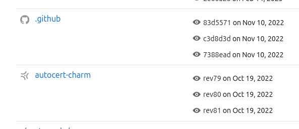
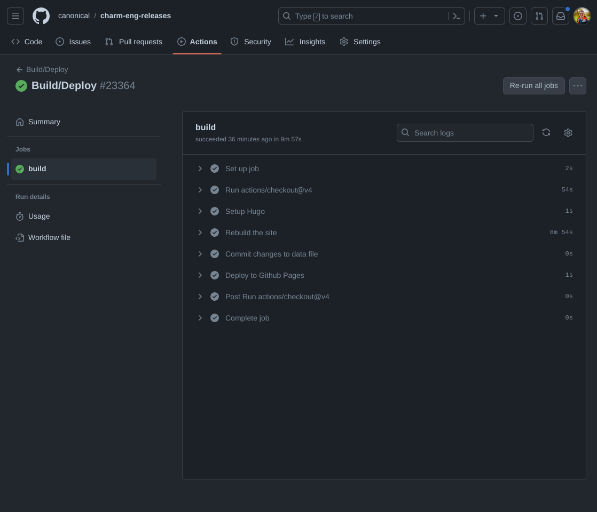

## Introduction

In my day job at Canonical, I lead the teams developing [Juju](https://juju.is), and a whole host of [charms](https://charmhub.io). Charms are software packages used for deploying applications on any infrastructure you have available. The packages are portable, meaning you can use our PostgreSQL operator on AWS, on Azure, on Openstack, on Google Cloud, etc. We're building up quite the portfolio of popular open source applications across data engineering, observability, identity, telco, MLOps and more. I won't go into detail about Juju or charms in this post, but I likely will in a future post.

The important thing for this post is that I look after >10 software teams, who use two different software forges (Github and Launchpad), and all push artifacts into both the [Snap Store](https://snapcraft.io) and the [Charmhub](https://charmhub.io). I wanted a way to keep track of their releases, and provide a tool that my managers could use to do the same. Put simply, I wanted a unified view of:

- The latest Github releases
- The latest Launchpad tags
- [Channels](https://snapcraft.io/docs/channels) in the [Snap Store](https://snapcraft.io)
- [Channels](https://snapcraft.io/docs/channels) in [Charmhub](https://charmhub.io)
- CI status

In particular, I wanted an easy way to be able to tie releases/commits in a forge to specific revisions in our various stores. This would enable us to troubleshoot more easily when issues are reported in customer environments by making it easier to jump to the code for the specific revision they're running.

At the time I started working on this, the effort at Canonical to build the portfolio of charms was really ramping up - and the only way of tracking which team owned which charm (between product teams, our IS department and our datacentre team) was a giant spreadsheet which was perpetually out of date (obviously!). The one thing that could be relied upon was which team owned a repo on Github or Launchpad - so my hope was to also reliably answer the question "which team owns the `foo` charm?".

You can see the result of this effort at [https://releases.juju.is](https://releases.juju.is), and a sneak peek below:

[](01.png)

## Prior Art

I wasn't the first to have these problems. The idea to start tracking information in this way came from the [elementaryOS releases tracker](https://releases.elementary.io/). This was a tool they built for keeping track of their various repositories, and in particular those which had seen many commits since the last release. The code for the site is available [on Github](https://github.com/elementary/releases).

The elementaryOS tracker uses a [Python script](https://github.com/elementary/releases/blob/main/release.py) to scrape the Github API, which outputs a [JSON representation](https://github.com/elementary/releases/blob/main/_data/repos.json) of the state of their repositories. This is then parsed during the build of a [Jekyll site](https://docs.github.com/en/pages/setting-up-a-github-pages-site-with-jekyll), which is published on Github Pages using [a Github Workflow](https://github.com/elementary/releases/blob/main/.github/workflows/build.yml).

This actually got me very close, and in fact my first attempt was a trivial fork of this project with a few slight modifications to the Python script. However, their tool wasn't designed to be used across multiple distinct teams, and there are some limitations such as not rendering Markdown in the release notes.

I also wanted to make some stylistic changes. I'm not particularly familiar with [Jekyll](https://jekyllrb.com/) and have generally used [Hugo](https://gohugo.io) for such tasks. I did maintain a Jekyll version for some months, but my lack of (recent) familiarity with the Ruby & gems ecosystem was making updates and maintenance more tedious than I liked.

Another tool I came across when I was looking to solve this was [willow](https://git.sr.ht/~amolith/willow) by [Amolith](https://secluded.site/). According to the README:

> Willow helps developers, sysadmins, and homelabbers keep up with software releases across arbitrary forge platforms, including full-featured forges like GitHub, GitLab, or Forgejo as well as more minimal options like cgit or stagit.

This is super close - but it doesn't have the snap/charm tracking I sought, and probably won't do given the scope of the project.

## `releasegen`

As I started to modify the Python script used in the elementaryOS release tracker, it started to get quite large, and I became a little uncomfortable with the state of it. At the time I was reintroducing myself into Go after a couple of years out, and decided that I would essentially "start again" and write a tool for my release tracker from scratch.

What I came up with is [`releasegen`](https://github.com/jnsgruk/releasegen). A terribly boring and unimaginative name that I originally intended to change, but never got around to! Nevertheless, `releasegen` solved a number of problems for me even in its first release. The first important change was support for separating releases across multiple Github organisations and teams, through the use of a simple config format:

```yaml
teams:
  - name: Frontend
    github:
      - org: acme-corp
        teams:
          - frontend-bots
        ignores:
          - some-old-project

  - name: Backend
    github:
      - org: acme-corp
        teams:
          - backend-engineers

  - name: Packaging
    launchpad:
      project-groups:
        - acme-corp-debs
```

You can see the config file used to generated `releases.juju.is` [on Github](https://github.com/canonical/charm-eng-releases/blob/main/releasegen.yaml).

The output format is heavily inspired by that of the original Python script, but has been enriched with a few more fields over time.

This tool is really quite simple: it takes a config file which points it at a combination of Github Orgs/Teams and Launchpad project groups, and outputs a big JSON file containing details of releases and associated packages. You can see an example of the output [in the `charm-eng-releases` repo](https://github.com/canonical/charm-eng-releases/blob/main/data/repos.json).

One of the main reasons I chose Go in the first place was because of it's great support for concurrency. Data from Github is gathered using the [`google/go-github`](https://github.com/google/go-github) package, which provides an interface to the Github API. When I first started adding repos to the original Python version, the run time quickly grew to 10+ minutes. My intention was to spin up a goroutine per repository in `releasegen`, but I quickly ran into secondary rate-limits. It turns out that the Github API prohibits you from making [too many concurrent requests](https://docs.github.com/en/rest/using-the-rest-api/rate-limits-for-the-rest-api?apiVersion=2022-11-28#about-secondary-rate-limits).

For Launchpad, things are more complicated. There is [an API](https://help.launchpad.net/API/Hacking) but it lacks methods for grabbing tags, specific commits etc. I also wanted to avoid cloning all of the repos for which information is gathered. The Launchpad code browsing UI is based on [cgit](https://git.zx2c4.com/cgit/about/), and hasn't fundamentally changed in a **long** time. For now, releasegen relies upon scraping the Launchpad web pages (using [goquery](https://github.com/PuerkitoBio/goquery)) to get the information it needs. This is not ideal, but has been functioning better than you might expect for around 18 months. There's also no limit on the requests that can be made to the web frontend of Launchpad - so processing is able to be done concurrently across repos in this case.

In more recent times, `releasegen` grew the ability to read badges out of project READMEs, and use those badges to link repos to a particular store (either the Snap store or the Charmhub). Support for reading badges and parsing Github CI badges was [kindly contributed by one of my colleagues](https://github.com/jnsgruk/releasegen/pull/1). I have subsequently generalised that initial implementation and added support for the Snap store too.

## Parsing `releasegen` with Hugo

Pleasingly, Hugo has [the ability](https://gohugo.io/templates/data-templates/#the-data-directory) to read data from YAML, JSON, XML, or TOML files, which can then be rendered throughout the site.

Given that this tool was to be used for tracking releases from Canonical teams, I created a basic [layout](https://gohugo.io/methods/page/layout/) using the excellent [Vanilla Framework](https://vanillaframework.io/). A layout in Hugo is nothing more than a collection of HTML/CSS/JS into which data can be rendered. The entry point for that in my project is this [index.html](https://github.com/canonical/charm-eng-releases/blob/main/layouts/index.html). Here I layout the basic structure of the page, and use a number of [partials](https://gohugo.io/templates/partials/) to render common components across the site. There are [very few adjustments](https://github.com/canonical/charm-eng-releases/blob/85fb452086419a89ccba40dcbb2e811803e4e8e2/layouts/partials/head.html#L23-L90) to the standard Vanilla Framework style, and a couple of [small Javascript files](https://github.com/canonical/charm-eng-releases/tree/85fb452086419a89ccba40dcbb2e811803e4e8e2/layouts/partials/js) to provide tabs, modals, expanding table rows, table sorting and suchlike.

Aside from the big screenshot at the start of this post, I want to highlight a couple of details in the UI. Firstly, if there is an associated artifact for a given repository (a Snap or a Charm), the row can be expanded to show details of that artifact:

[](02.png)

[](03.png)

Each individual release can also be expanded using the "eye" icon, at which point a modal will be displayed containing the release notes, complete with links:

[](04.png)

There is also some visual distinction between those repos on Github, and those on Launchpad:

[](05.png)

## Publishing with Github Actions

The site is hosted on Github Pages, and if you've been following along, you'll notice that the site would need to be "regenerated" for the information to remain fresh - Hugo is ultimately a _static site generator_. This problem is solved in my case with Github Actions. I created a workflow which is triggered every hour to dump the latest report using `releasegen`, regenerate the Hugo site, and commit the outcome to branch of the repo which is used to serve the page. The workflow itself is pretty simple, and can be seen [on Github](https://github.com/canonical/charm-eng-releases/blob/main/.github/workflows/build.yml).

[](06.png)

## Summary

This tool scratched an itch for me. It's a little flawed in places: it doesn't update in real time, `releasegen` could do with some ~~more~~ tests, and I'm not super proud of how it parses data about Launchpad projects. That said, it's been fairly reliable over the past 18 months, and it does present information in a pretty consistent way (though I'm no designer!). I personally think it's a good example of how things can be automated and simplified by combining existing tools in a short space of time.

I have an idea about how to generalise the processing of data, which would both remove my reliance on the Github API, and also unify the approach for gathering information about Git repos across forges (making it easier to support the likes of Codeberg and Sourcehut). I read an interesting blog recently about [Serving a Website from a Git Repo Without Cloning It](https://mediocregopher.com/posts/git-proxy) which implies that a lot of the information I require such as commits, tags, etc. could be gleaned directly from the git endpoint over HTTP, but I haven't yet looked in detail.

It _did_ solve the problem of keeping a big spreadsheet up to date as a means of tracking project ownership, and it's certainly proved a useful tool for me to understand the relationship between commits, Github Releases and released revisions in our stores across teams. Some of my managers/seniors have found it really valuable, others not so much - this is generally reflected by how complete the information is for each team's repos. Over the past few months, I've had a couple of teams reach out to me and ask to be added despite them not being part of my org, because they see it as a useful tool, so there's that!

This tooling was also adopted by the [Snapcrafters](https://snapcrafters.org) who run their own version of the [dashboard](https://snapcrafters.org/snap-packages/). There are some subtle differences here - the UI in this case also displays each snap's base (e.g. `core18`, `core22`, etc.). You can see the source code for that [on Github](https://github.com/snapcrafters/snapcrafters.org).

That's all for now! If you've built something similar or you think I've missed a trick, let me know!
