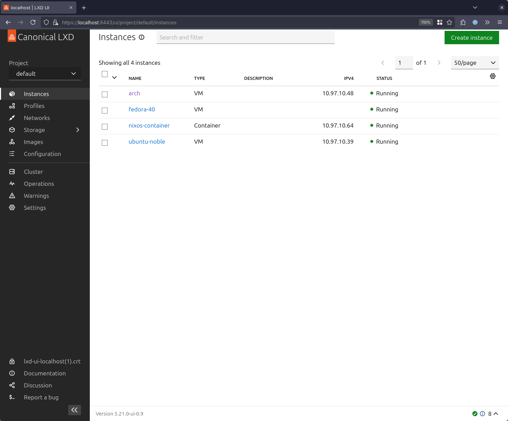
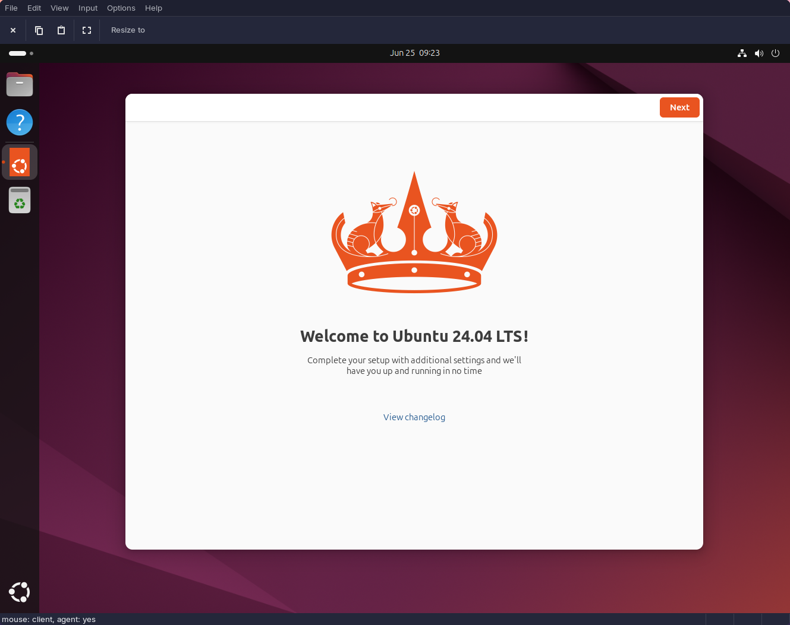
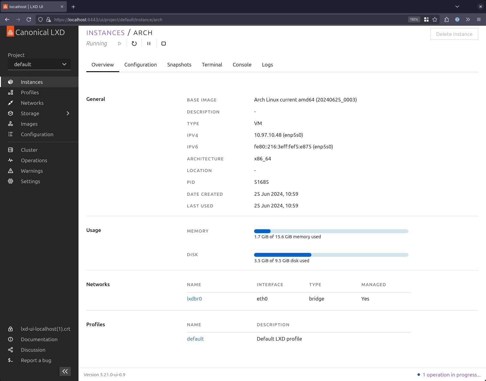
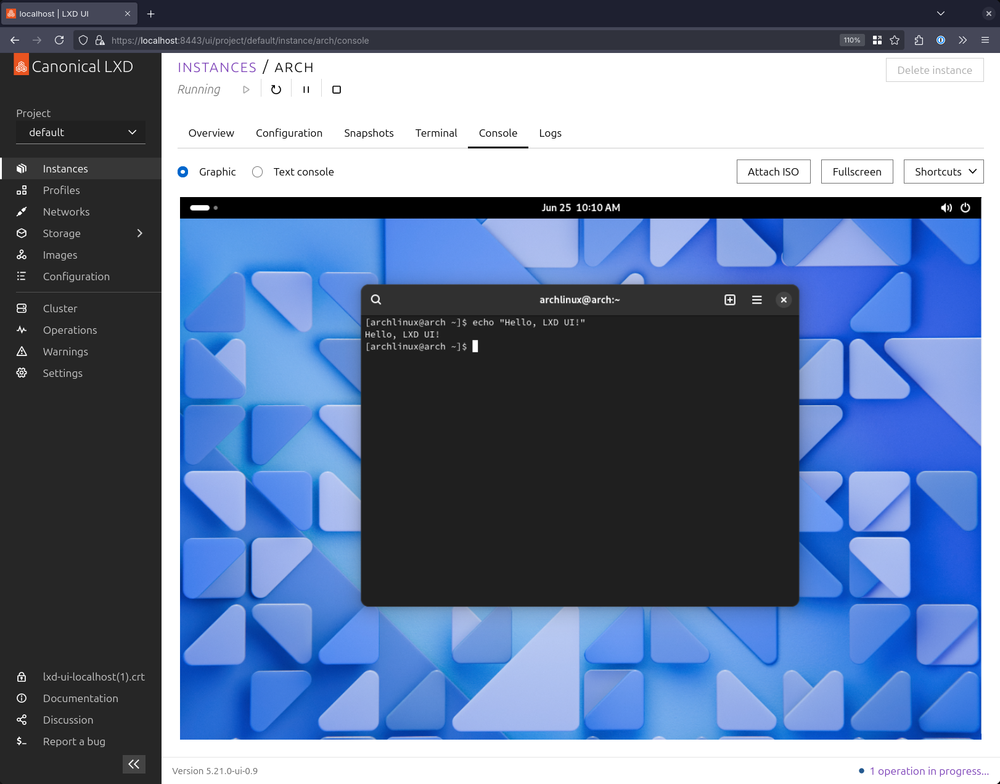

## Introduction

Over the years, I've used countless tools for creating virtual machines - often just for short periods of time when testing new software, trying out a new desktop environment, or creating a more isolated development environment. I've gone from just using the venerable [qemu](https://www.qemu.org/) at the command line, to full-blown desktop applications like [Virtualbox](https://www.virtualbox.org/), to using [virt-manager](https://virt-manager.org/) with [libvirt](https://libvirt.org/).

When I joined Canonical back in March 2021, I'd hardly used [LXD](https://canonical.com/lxd), and I hadn't ever used [Multipass](https://multipass.run). Since then, they've both become indispensable parts of my workflow, so I thought I'd share why I like them, and how I use each of them in my day to day work.

I work for Canonical, and am therefore invested in the success of their products, but at the time of writing I'm not responsible for either LXD or Multipass, and this post represents my honest opinions as a user of the products, and nothing more.

[](01.png)

## Installation / Distribution

Both [LXD](https://snapcraft.io/lxd) and [Multipass](https://snapcraft.io/multipass) are available as [snap packages](https://snapcraft.io), and that's the most supported and recommended route for installation. LXD is available in the repos of a few other Linux distributions (including [NixOS](https://search.nixos.org/options?channel=24.05&from=0&size=50&sort=relevance&type=packages&query=virtualisation.lxd.), [Arch Linux](https://wiki.archlinux.org/title/LXD)), but the snap package also works great on Arch, Fedora, etc. I personally ran Multipass and LXD as [snaps on Arch Linux](https://wiki.archlinux.org/title/Snap) for a couple of years without issue.

If you'd like to follow along with the commands in this post, you can get setup like so:

```shell
sudo snap install lxd
sudo lxd init --minimal

# If you'd like to use LXD/LXC commands without sudo
# run the following command and logout/login:
#
# sudo usermod -aG lxd $USER

sudo snap install multipass
```

Early on in my journey with NixOS, I [packaged](https://github.com/NixOS/nixpkgs/pull/214193) Multipass for Nix. I still maintain (and use!) the NixOS module. This was my first ever contribution to NixOS -- a fairly colourful review process to say the least...

The result is that you can use something like the following in your configuration, and have multipass be available to you after a `nixos-rebuild switch`:

```nix
{
  virtualisation.multipass.enable = true;
}
```

LXD has been maintained in NixOS for many years now - and around this time last year I [added support](https://github.com/NixOS/nixpkgs/pull/241314) for the LXD UI. The screenshots you see throughout this post are all from LXD UI running on a NixOS machine using the following configuration:

```nix
{
  virtualisation.lxd = {
    enable = true;
    zfsSupport = true;
    ui.enable = true;
  };

  networking = {
    firewall = {
      trustedInterfaces = [ "lxdbr0" ];
    };
  };
}
```

## Ubuntu on-demand with Multipass

[Multipass](https://multipass.run/) is designed to provide simple on-demand access to Ubuntu VMs from any workstation - whether that workstation is running Linux, macOS or Windows. It is designed to replicate, in a lightweight way, the experience of provisioning a simple Ubuntu VM on a cloud.

Multipass makes use of whichever the most appropriate hypervisor is on a given platform. On Linux, it can use QEMU, LXD or libvirt as backends, on Windows it can use Hyper-V or Virtualbox, and on macOS it can use QEMU or Virtualbox. Multipass refers to these backends as [drivers](https://multipass.run/docs/driver).

Multipass' scope is relatively limited, but in my opinion that's what makes it so delightful to use. Once installed, the basic operation of Multipass couldn't be simpler:

```shell
❯ multipass shell
Launched: primary
Mounted '/home/jon' into 'primary:Home'
Welcome to Ubuntu 24.04 LTS (GNU/Linux 6.8.0-35-generic x86_64)

 * Documentation:  https://help.ubuntu.com
 * Management:     https://landscape.canonical.com
 * Support:        https://ubuntu.com/pro

 System information as of Tue Jun 25 11:17:55 BST 2024

  System load:  0.4               Processes:             132
  Usage of /:   38.9% of 3.80GB   Users logged in:       0
  Memory usage: 31%               IPv4 address for ens3: 10.93.253.20
  Swap usage:   0%


Expanded Security Maintenance for Applications is not enabled.

3 updates can be applied immediately.
1 of these updates is a standard security update.
To see these additional updates run: apt list --upgradable

Enable ESM Apps to receive additional future security updates.
See https://ubuntu.com/esm or run: sudo pro status


ubuntu@primary:~$
```

This one command will take care of creating the `primary` instance if it doesn't already exist, start the instance and drop you into a `bash` shell - normally in under a minute.

Multipass has a neat trick: it bundles a reverse SSHFS server that enables easy mounting of the host's home directory into the VM. This happens by default for the `primary` instance. As a result the instance I created above has my home directory mounted at `/home/ubuntu/Home` - making it trivial to jump between editing code/files on my host and in the VM. I find this really useful - I can edit files on my workstation in my own editor, using my Yubikey to sign and push commits without having to worry about complicated provisioning or passthrough to the VM, and any files resulting from a build process on my workstation are instantly available in the VM for testing.

Multipass instances can be customised a little. You won't find complicated features like PCI-passthrough, but basic parameters can be tweaked. The commands I usually run for setting up a development machine when I'm working on Juju/Charms are:

```shell
# Create a machine named 'dev' with 16 cores, 40GiB RAM and 100GiB disk
multipass launch noble -n dev -c 16 -m 40G -d 100G
# Mount my home directory into the VM
multipass mount /home/jon dev:/home/ubuntu/Home
# Get a shell in the VM
multipass shell dev
```

Once you're done with an instance, you can remove it like so:

```shell
multipass remove dev
multipass purge
```

Multipass does have some more interesting features, though most of my usage is represented above. One feature that might be of more interest for MacOS or Windows users is [aliases](https://multipass.run/docs/using-aliases). This feature enables you to alias local commands to their counterparts in a Multipass VM, meaning for example that every time you run `docker` on your Mac, the command is actually executed inside the Multipass VM:

```shell
# Example of mapping the local `mdocker` command -> `docker` in
# the multipass VM
multipass alias dev:docker mdocker
```

Multipass will launch the latest Ubuntu LTS by default, but there are a number of other images available - including some "appliance" images for applications like Nextcloud, Mosquitto, etc.

There is also the concept of [Blueprints](https://multipass.run/docs/blueprint) which are essentially recipes for virtual machines with a given purpose. These are curated partly by the Multipass team, and partly by the community. A blueprint enables the author to specify cores, memory, disk, cloud-init data, aliases, health checks and more. The recipes themselves are maintained [on Github](https://github.com/canonical/multipass-blueprints/tree/main/v1), and you can see the list of available images/blueprints using `multipass find`:

```shell
❯ multipass find
Image                       Aliases           Version          Description
core                        core16            20200818         Ubuntu Core 16
core18                                        20211124         Ubuntu Core 18
core20                                        20230119         Ubuntu Core 20
core22                                        20230717         Ubuntu Core 22
20.04                       focal             20240612         Ubuntu 20.04 LTS
22.04                       jammy             20240614         Ubuntu 22.04 LTS
23.10                       mantic            20240619         Ubuntu 23.10
24.04                       noble,lts         20240622         Ubuntu 24.04 LTS
daily:24.10                 oracular,devel    20240622         Ubuntu 24.10
appliance:adguard-home                        20200812         Ubuntu AdGuard Home Appliance
appliance:mosquitto                           20200812         Ubuntu Mosquitto Appliance
appliance:nextcloud                           20200812         Ubuntu Nextcloud Appliance
appliance:openhab                             20200812         Ubuntu openHAB Home Appliance
appliance:plexmediaserver                     20200812         Ubuntu Plex Media Server Appliance

Blueprint                   Aliases           Version          Description
anbox-cloud-appliance                         latest           Anbox Cloud Appliance
charm-dev                                     latest           A development and testing environment for charmers
docker                                        0.4              A Docker environment with Portainer and related tools
jellyfin                                      latest           Jellyfin is a Free Software Media System that puts you in control of managing and streaming your media.
minikube                                      latest           minikube is local Kubernetes
ros-noetic                                    0.1              A development and testing environment for ROS Noetic.
ros2-humble                                   0.1              A development and testing environment for ROS 2 Humble.
```

The team also recently introduced the ability to [snapshot](https://multipass.run/docs/snapshot) virtual machines, though I must confess I've not tried it out in anger yet.

## LXD… for VMs?

For many people, LXD is a container manager - and indeed for many years it could "only" manage containers. LXD was built for running "system containers", as opposed to "application containers" like Docker/Podman (or Kubernetes). Running a container with LXD is more similar to to running a container with `systemd-nspawn`, but with the added bonus that it can [cluster](https://documentation.ubuntu.com/lxd/en/latest/clustering/) across machines, [authenticate against different identity backends](https://documentation.ubuntu.com/lxd/en/latest/authentication/), and manage more sophisticated [storage](https://documentation.ubuntu.com/lxd/en/latest/explanation/storage/).

Because LXD manages system containers, each container gets its own `systemd`, and behaves more like a 'lightweight VM' sharing the host's kernel. This turns out to be a very interesting property for people who want to get some of the benefits of containerisation (i.e. higher workload density, easier snapshotting, migration, etc.) with more legacy applications that might struggle to run effectively in application containers.

But this post is about virtual machines. Since the 4.0 LTS release, LXD has also supported running VMs with `qemu`. The API for launching a container is identical to launching a virtual machine. Better still, Canonical provides images for lots of different Linux distributions, and even desktop variants of some images - meaning you can quickly get up and running with a wide range of distributions, for example:

```shell
# Launch a Ubuntu 24.04 LTS VM
lxc launch ubuntu:noble ubuntu --vm
# Get a shell inside the VM
lxc exec ubuntu bash

# Launch a Fedora 40 VM
lxc launch images:fedora/40 fedora --vm
# Get a shell inside the VM
lxc exec fedora bash

# Launch an Arch Linux VM (doesn't support secure boot yet)
lxc launch images:archlinux arch --vm -c security.secureboot=false
# Get a shell inside the VM
lxc exec arch bash
```

You can get a full list of virtual machine images like so:

```shell
lxc image ls images: --format=compact | grep VIRTUAL-MACHINE
```

## LXD Desktop VMs

Another neat trick for LXD is desktop virtual machines. These are launched with curated images that drop you into a minimal desktop environment that's configured to automatically login. This has to be one of my favourite features of LXD!

```shell
# Launch a Ubuntu 24.04 LTS desktop VM and get a console
lxc launch images:ubuntu/24.04/desktop ubuntu --vm --console=vga
```

[](02.png)

The guest is pre-configured to work correctly with SPICE, so that means clipboard integration, automatic resizing with the viewer window, USB redirection, etc. The same also works for other distros, as before:

```shell
# Launch an Arch desktop VM
lxc launch images:archlinux/desktop-gnome arch --vm \
  -c limits.cpu=8 \
  -c limits.memory=16GiB \
  -c security.secureboot=false

# Get a console using a separate command (if preferred!)
lxc console --type=vga arch
```

## LXD UI 😍

Back in June 2023, Canonical announced early access to the LXD graphical user interface [on their blog](https://ubuntu.com/blog/lxd_ui). The LXD UI is now generally available and enabled by default from LXD 5.21 onwards - though you can find instructions for enabling it on earlier versions in the [docs](https://documentation.ubuntu.com/lxd/en/latest/howto/access_ui/). The summary is:

```shell
lxc config set core.https_address :8443

sudo snap set lxd ui.enable=true
sudo systemctl reload snap.lxd.daemon
```

In my opinion, the LXD UI is one of the best, if not _the best_ way to interact with a hypervisor yet. Being a full-stack web application, it gains independence from different GUI toolkits on Linux and, provided the cluster is remote, can be accessed the same way from Windows, Mac and Linux.

I've used other hypervisors with web UIs, particularly Proxmox, and I've found the experience with LXD UI to be very smooth, even from the early days. The UI can walk you through the creation and management of VMs, containers, storage and networking. The UI can also give you a nice concise summary of each instance (below is the summary of the VM created using the command in the last section):

[](03.png)

One of my favourite features is the web-based SPICE console for desktop VMs, which combined with the management features makes it trivial to stand up a desktop VM and start testing:

[](04.png)

## Why both?

By now you've probably realised that LXD can do everything Multipass can do, and give much more flexibility - and that's true. LXD is a full-featured hypervisor which supports much more sophisticated networking, [PCI-passthrough](https://documentation.ubuntu.com/lxd/en/latest/reference/devices/#devices), clustering, integration with enterprise identity providers, observability through Prometheus [metrics](https://documentation.ubuntu.com/lxd/en/latest/metrics/) and [Loki log-forwarding](https://documentation.ubuntu.com/lxd/en/latest/howto/logs_loki/), etc.

Multipass is small, lean and very easy to configure. If I just want a quick command-line only Ubuntu VM to play with, I still find `multipass shell` to be most convenient - especially with the automatic home directory mounting.

When I want to work with desktop VMs, interact with non-Ubuntu distributions, or work more closely with hardware, then I use LXD. I was already a bit of a closet LXD fan, having previously described it as a bit of a "secret weapon" for Canonical, but since the introduction of the LXD UI, I'm a fully paid up member of the LXD fan club 😉

## Summary

As I mentioned in the opening paragraphs - both LXD and Multipass have become central to a lot of my technical workflows. The reason I packaged Multipass for NixOS, was that I wanted to dive into daily-driving NixOS, but not without Multipass! In my opinion, the LXD UI is one of the most polished experiences for managing containers and VMs on Linux, and I'm really excited for what that team cooks up next.
