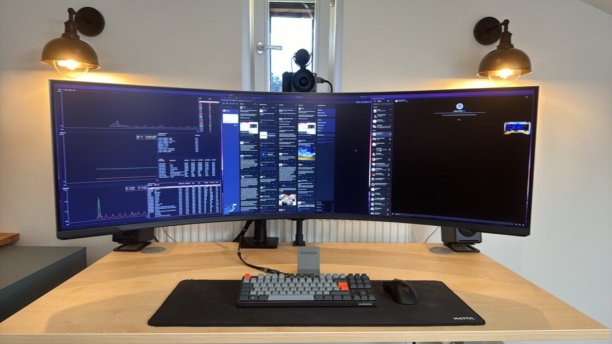
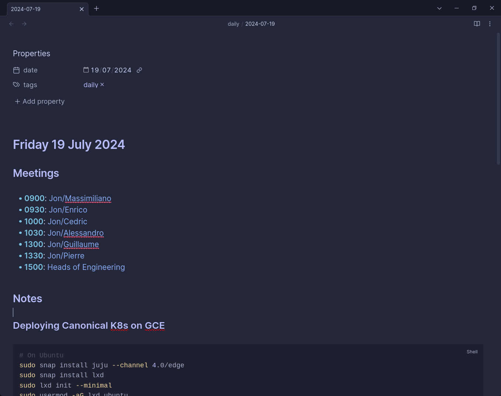
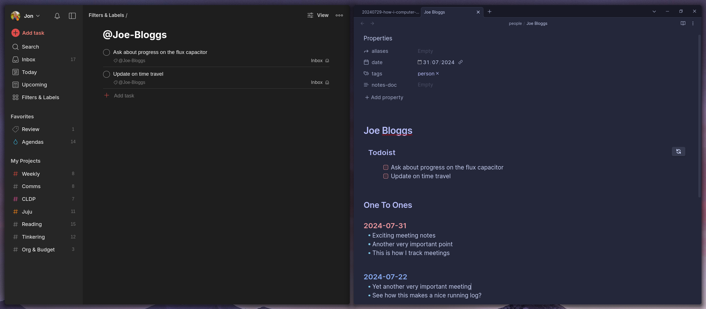
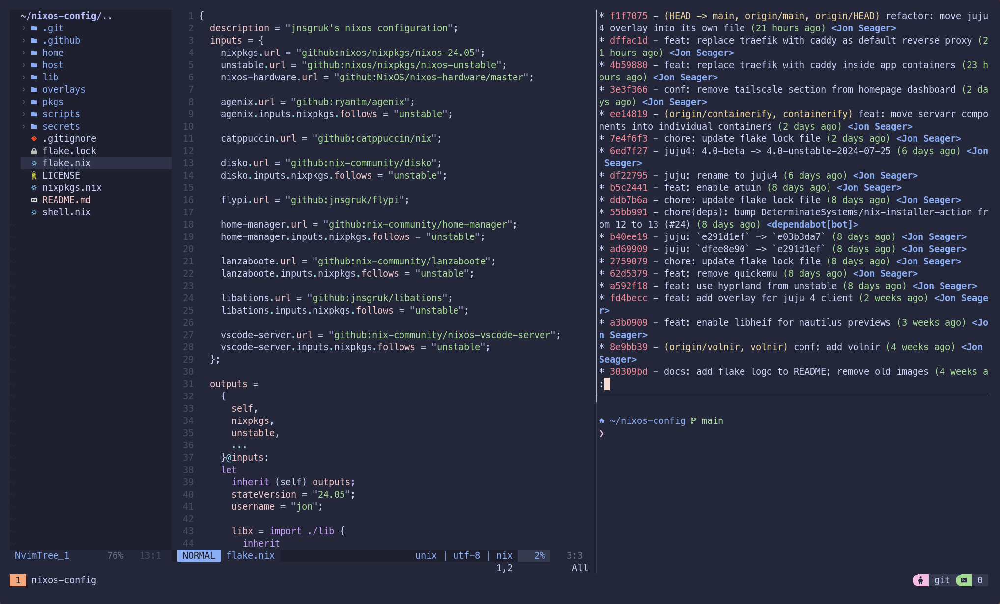
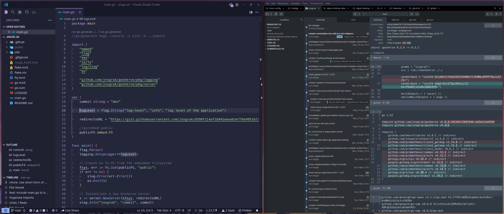
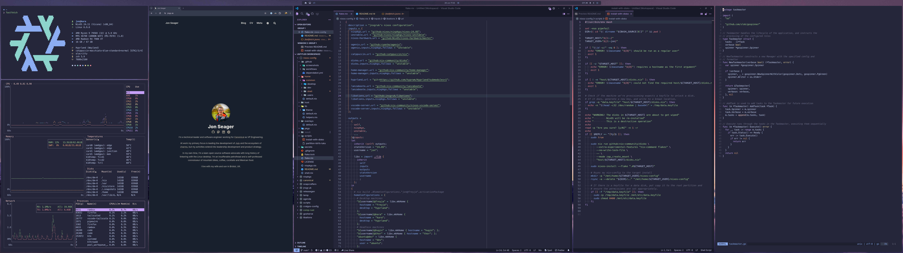
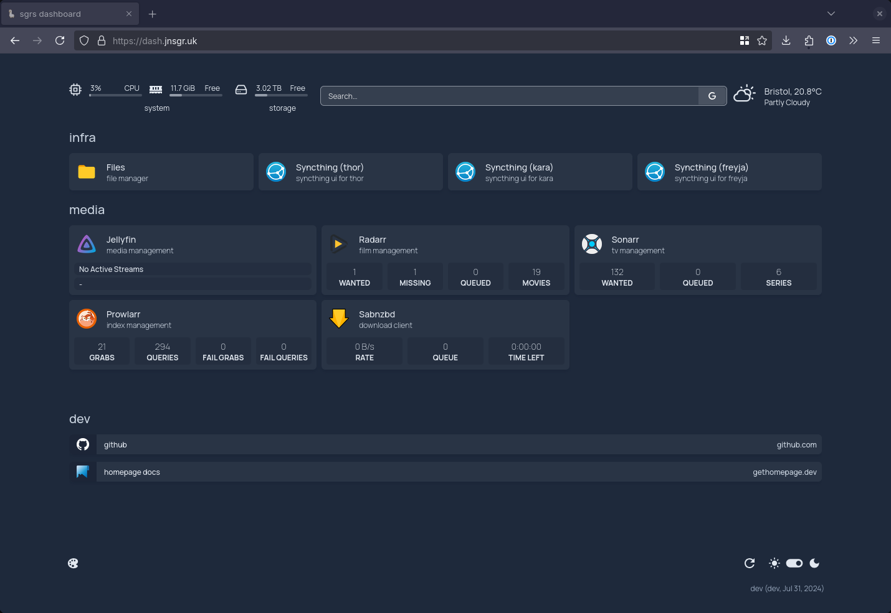

## Introduction

I'm always fascinated to see how people use their computers - which applications they choose, how they set up their desktop environments and even how their screens are laid out on their desk. I've learned some great tricks from friends and colleagues over the years, so I thought I'd write up how I use my machines in 2024.

The setup I'm using today has been quite static for a couple of years, with only minor adjustments. Each time I change something significant, I leave it for at least a couple of months to try and build muscle memory and see if I'm going to make the adjustment permanent.

## Hardware

### Desktop

My main machine is a custom built desktop machine. It's in a sombre looking, all black [beQuiet Silent Base 600](https://www.bequiet.com/en/case/1501) case. I've never been into RGB lights - I'm much more into good thermals and _silent_ operation. The full spec is as follows:

**CPU**: [AMD Ryzen 9 7950X](https://www.amd.com/en/products/processors/desktops/ryzen/7000-series/amd-ryzen-9-7950x.html) 
**GPU**: [AMD Radeon RX 7900XT](https://www.xfxforce.com/shop/xfx-speedster-merc310-7900xt) 
**RAM**: [G.SKILL Trident Z5 Neo RGB 64GB DDR5-6000](https://www.gskill.com/product/165/390/1665020865/F5-6000J3040G32GX2-TZ5NR) 
**PSU**: [Corsair HX1000i](https://www.corsair.com/uk/en/p/psu/cp-9020259-uk/hx1000i-fully-modular-ultra-low-noise-platinum-atx-1000-watt-pc-power-supply-cp-9020259-uk) 
**Disk**: [1TB SN850X](https://www.westerndigital.com/products/internal-drives/wd-black-sn850x-nvme-ssd?sku=WDS100T2X0E) + [2TB SN850X](https://www.westerndigital.com/products/internal-drives/wd-black-sn850x-nvme-ssd?sku=WDS200T2X0E) 
**Board**: [MSI MPG X670E CARBON WIFI](https://www.msi.com/Motherboard/MPG-X670E-CARBON-WIFI) 
**Cooler**: [beQuiet Dark Rock Pro 5](https://www.bequiet.com/en/cpucooler/4466) 
**Case**: [beQuiet Silent Base 600](https://www.bequiet.com/en/case/1501) with 3x [beQuiet Silent Wings 4 PWM](https://www.bequiet.com/en/casefans/3703) fans 
**Keyboard**: [DURGOD Taurus K320 TKL](https://www.durgod.com/product/k320-space-gray/) with Cherry MX Brown switches 
**Mouse**: [Razer Deathadder V2 Pro](https://www.razer.com/ap-en/gaming-mice/razer-deathadder-v2-pro) 
**Monitor**: [57" Samsung G95NC Odessey Neo G9](https://www.samsung.com/uk/monitors/gaming/odyssey-neo-g9-g95nc-57-inch-240hz-curved-dual-uhd-ls57cg952nuxxu/) 
**Camera**: [Sony ILME-FX3](https://www.sony.co.uk/interchangeable-lens-cameras/products/ilme-fx3-body---kit) / [FE 28-70mm F3.5-5.6](https://www.sony.co.uk/electronics/camera-lenses/sel2870) / [Elgato Cam Link 4K](https://www.elgato.com/uk/en/p/cam-link-4k) 
**Speakers**: [Audioengine A2+](https://audioengineeu.com/products/audioengine-a2-wireless-bluetooth-computer-speakers-60w-bluetooth-speaker-system-for-home-studio-gaming) 
**Mic**: [RODE VideoMic GO II](https://rode.com/en/microphones/on-camera/videomic-go-ii) 

On my desk, you'll find a [57" Samsung G95NC Odessey Neo G9](https://www.samsung.com/uk/monitors/gaming/odyssey-neo-g9-g95nc-57-inch-240hz-curved-dual-uhd-ls57cg952nuxxu/) monitor mounted on a [gas spring arm](https://www.amazon.co.uk/gp/product/B0B73XXDP5/ref=ppx_yo_dt_b_search_asin_title?ie=UTF8&psc=1), which is the newest addition to my setup. For 5 years, I'd been running a pair of 27" [LG 27" UN850 4K](https://www.lg.com/us/monitors/lg-27un850-w-4k-uhd-led-monitor) monitors mounted on a dual monitor arm and had toyed with the idea of moving to an ultra-wide for a while. The Samsung display is the first I have found that doesn't compromise on resolution - it's the same resolution as my two LG monitors combined, but on a single panel. I must admit that I'm quite surprised how much of a productivity booster it is _not_ having the split down the middle.

At the time of writing, I work for [Canonical](https://canonical.com) which is an all remote company. The combination of the company itself and my role as VP Engineering means I spend a good portion of my day on video calls. In my opinion, investing in a solid AV setup is a service to your colleagues, particularly where your role involves managing people. I'm currently running a [Sony ILME-FX3](https://www.sony.co.uk/interchangeable-lens-cameras/products/ilme-fx3-body---kit) with the standard [FE 28-70mm F3.5-5.6](https://www.sony.co.uk/electronics/camera-lenses/sel2870) lens, hooked up to an [Elgato Cam Link 4K](https://www.elgato.com/uk/en/p/cam-link-4k). For audio, I use a [RODE VideoMic GO II](https://rode.com/en/microphones/on-camera/videomic-go-ii) and a pair of [Audioengine A2+](https://audioengineeu.com/products/audioengine-a2-wireless-bluetooth-computer-speakers-60w-bluetooth-speaker-system-for-home-studio-gaming) speakers.

In the world of Linux desktops, I've found audio devices that present their own USB interface to be much less hassle. I completely disable the motherboard's onboard sound, as well as the HDMI/DisplayPort sound outputs on my machine and leave just the USB audio interfaces from my mic and speakers enabled.

### Server

I use the term "server" loosely… my homelab has gone through many iterations over the years, from all "on-prem", to a mix of cloud services and devices, and back again.

My current setup is very modest, partly because my workstation is such a monster, meaning I can easily spin up multiple VMs/containers there when I want to experiment and not really impact the performance of the machine for more routine tasks.

Most of my services run on a single [Intel NUC6i7KYK](https://ark.intel.com/content/www/us/en/ark/products/89187/intel-nuc-kit-nuc6i7kyk.html). This machine has an Intel i7-6770HQ CPU, 16GB RAM and a 512GB Samsung 970 Pro NVMe drive internally. It's connected to a Samsung 840 EVO 4TB SATA drive by USB. I'm not much of a data-hoarder so I don't require too much storage.

This machine is getting a bit tired and I'm thinking about replacing it with something a little more modern later this year.

### Laptop

If I'm not at my desk, then I'm using my [Lenovo Z13 Gen 1](<https://www.lenovo.com/gb/en/p/laptops/thinkpad/thinkpadz/thinkpad-z13-(13-inch-amd)/len101t0036?srsltid=AfmBOor-8ic5yZrW3rlDXTTRwK8r05y-gjCpJK04fA4qtote0u2HZ7I6>). I specified this machine with the AMD Ryzen 7 Pro 6860Z, 32GB RAM and a Hi-DPI display.

I can't rate this machine highly enough. The build quality is a cut above even Lenovo's normal standard - it feels very premium and much more in the style of Apple's uni-body aluminium laptops. It's got plenty of power, and the battery lasts most of the day under moderate usage.

I tend towards ultralight machines when I travel because I can always use my desktop machine remotely if I need more grunt (more on that later…), and I'm certainly not interested in trying to make dual integrated/discrete GPUs work properly.

### Phone

I carry an [Apple iPhone 15 Pro](https://www.apple.com/uk/iphone-15-pro/). I've been an iPhone user since around 2011 and likely won't change any time soon. My family all use iPhones (and therefore FaceTime) and I like the particular trade-off of convenience/privacy that's provided by Apple - however flawed that might be in absolute terms. The phone works great with my Airpods, the camera is better than I am at taking photos, and the battery life seems pretty good too.

I wrap the phone in a [Mous Limitless 5.0 Aramid Fibre](https://uk.mous.co/products/limitless-5-0-magsafe-compatible-phone-case-aramid_fibre) case to avoid too many oops moments!

I find it difficult to get too excited about phones these days, I see them more as a commodity.

## Connectivity & Security

In 2021 I started using [Tailscale](https://tailscale.com/) in place of my hand-rolled Wireguard setup, and I haven't looked back. It has to be one of my favourite pieces of technology ever. It runs on all of my things - desktops, laptops, servers, phones, tablets, etc.

I also recently took advantage of their [partnership with Mullvad](https://tailscale.com/kb/1258/mullvad-exit-nodes). I've used [Mullvad](https://mullvad.net/en) as my default VPN provider when using untrusted networks for a few years - but using it through Tailscale means I can still access my tailnet while my internet traffic egresses through Mullvad without any extra configuration.

I use [NextDNS](https://nextdns.io/) as an alternative to running a [Pi-Hole](https://pi-hole.net/) or similar. Tailscale have a nice [integration](https://tailscale.com/kb/1218/nextdns) which means that all the devices on my tailnet automatically get [DNS-over-HTTPS](https://en.wikipedia.org/wiki/DNS_over_HTTPS) without any additional configuration, as well as DNS-level ad-blocking.

I've got a couple of shared nodes in my tailnet - including one that my family can use as an exit node when they travel. As a result, I make quite extensive use of Tailscale [ACLs](https://tailscale.com/kb/1018/acls) to ensure people can only access what I want them to.

I've been a [1Password](https://1password.com/) user for more than a decade now and I think their products are fantastic. Their Linux app sets the bar for modern cross-platform applications in my view. I recently started using their secrets capability at the CLI - the ability to store a `.env` file with a bunch of benign secret references, and have the actual [secrets injected into the environment](https://developer.1password.com/docs/cli/secrets-scripts) or a [config file](https://developer.1password.com/docs/cli/secrets-config-files) is very handy.

I also have a small collection of [Yubikeys](https://www.yubico.com/products/yubikey-5-overview/) with different connectors. One lives on my desk attached to my desktop, another lives in my pocket or otherwise on my person, and another is in a safe. They're all NFC enabled so they work nicely with my mobile devices. I configure my Yubikeys with ed25519 [resident keys](https://developers.yubico.com/SSH/Securing_git_with_SSH_and_FIDO2.html) for SSH, along with storing my GPG key (which rarely gets used these days...).

One of my favourite things about the Yubikey is their ability to store TOTP codes. It's a bit of a pain when I onboard a new account having to add the new secret to each key, but the upside is I don't have to work out how to update/transfer them all each time I get a new phone! It's also handy on the desktop to be able to run `ykman oath accounts code <name>`.

## Productivity Apps

A lot of my work is done in a browser. Canonical uses [Google Workspace](https://workspace.google.com/intl/en_uk/) for emails, documents, slides, etc., so my default mode since joining has been to use Google Chrome for work things, and Firefox for personal things. I know that Firefox has [Account Containers](https://addons.mozilla.org/en-US/firefox/addon/multi-account-containers/) and other features that would help segregate the two, but I've found keeping my work and personal concerns in completely separate browsers to be useful.

After having run a [Nextcloud](https://nextcloud.com/) server for several years on a Droplet ([using `docker-compose`](https://github.com/jnsgruk/nextcloud-docker-compose)), I ultimately realised that I was _only_ using the file syncing capability, and wasn't moving much data even then. I switched to using [Syncthing](https://syncthing.net/) to avoid the overhead of running a server instance, which works particularly well when combined with Tailscale.

All of my notes, both work and personal, live in [Obsidian](https://obsidian.md/). When I first discovered Obsidian I fell for the classic trick of installing **all the extensions**, and have since paired that back. I went very deep with [Dataview](https://blacksmithgu.github.io/obsidian-dataview/), using it to collate actions from across my vault into various categories (meeting agendas, personal, reviews, etc.), but I found that as my vault grew the performance suffered quite a lot. A few months ago, I removed dataview, did some painful refactoring of my notes (lots of `sed`erry and `grep`pery!) and reverted to using Obsidian's [embedded search queries](https://help.obsidian.md/Plugins/Search#Embed%20search%20results%20in%20a%20note).

I tried to get into [Zettelkasten](https://zettelkasten.de/introduction/) but found the maintenance a little... boring? I've ended up with a simple structure that I find really helps me in my day-to-day at work. Each day gets its own "Daily Note" which includes my agenda, linking to ongoing notes with the people or regular meetings I'm in. The daily notes are also a place for me to collate loose notes which might be searched later:

The agenda and the links are automatically generated using a small Go application I wrote - this application scrapes my Google Calendar, and according to some rules and the knowledge it has of my vault, generates the Markdown for the agenda and copies it to the clipboard. Each day, I sit down and type `agenda` at the command line, then paste into Obsidian. The notes for each person contain a running log of my notes with that person or group by date.

I use a few Obsidian plugins to help here - including [Templater](https://github.com/SilentVoid13/Templater), [QuickAdd](https://github.com/chhoumann/quickadd), [Omnisearch](https://github.com/scambier/obsidian-omnisearch) and [Linter](https://github.com/platers/obsidian-linter). The first two are particularly handy for quickly inserting common meeting agendas, sets of interview questions, playbooks, etc.

I moved away from tracking tasks in Obsidian, and started using [Todoist](https://todoist.com/) late last year. Todoist is great - I like to keep running lists of tasks per person, so that when I next meet them in a 1:1 or otherwise, I have a quick reference of all the things I'm meant to speak with them about - and I can achieve that very easily with Todoist labels. The Obsidian integration means I can integrate the agenda with the meeting note for a specific person:

## Development

I've been a long-time user of [Alacritty](https://alacritty.org/) as a terminal emulator. I mostly use [Visual Studio Code](https://code.visualstudio.com/) on the desktop - I like the community support for plugins, themes, etc. I'm also pretty handy in vim - I still have quite a snazzy [Neovim](https://neovim.io/) setup which I use whenever I'm at the terminal. You can see my [neovim config](https://github.com/jnsgruk/nixos-config/blob/main/home/common/shell/vim.nix) on Github - I don't go too wild on plugins, but I've come to like [lightline](https://github.com/itchyny/lightline.vim), [telescope](https://github.com/nvim-telescope/telescope.nvim), and [nvim-tree-lua](https://github.com/nvim-tree/nvim-tree.lua).

I mostly drive `git` from the command line, but I've recently taken to using [Sublime Merge](https://www.sublimemerge.com/) for complicated rebases, or where I want to stage lots of small hunks in files. I was a dedicated user of [Sublime Text](https://www.sublimetext.com/) for some years, but felt like it lagged behind Visual Studio Code on features after a while - despite being somewhat addicted to how lightning fast Sublime Text felt in comparison.

## OS / Desktop

If you've read my blog before, it'll be no surprise to you that I'm all-in on NixOS for all the things. I started that journey around 2 years ago and haven't looked back. My journey on the Linux desktop has been quite varied over the years: my first ever Linux desktop experience was with [Knoppix](https://www.knopper.net/knoppix/index-en.html) back in 2003. I then spent a few years dabbling with the various releases of Ubuntu before starting to use Linux on the desktop full-time in around 2014. From there I spent years on Arch Linux swapping between Plasma and GNOME about every 12 months.

I've become a fairly dedicated tiling window manager user, though I'll admit that I bounced off it a few times before it stuck. When I made the switch to [Sway](https://swaywm.org/) in 2021, something clicked and I've not gone back from tiling since. I stuck with Sway in various configurations for quite a while, before moving to an almost identical looking setup based on [Hyprland](https://hyprland.org/) around 15 months ago. Hyprland seems nice - it's mostly stable and I like the eye-candy.

Absolutely everything is themed with [Catppuccin Macchiato](https://github.com/catppuccin/catppuccin). Not only do I love the theme, but I love how pervasive it is across all the apps/tools I use - and I'm a sucker for consistency!

You can see all the gory details of my Hyprland, waybar, rofi, mako, etc. [on Github](https://github.com/jnsgruk/nixos-config).

## Server / Homelab

My server machine also runs NixOS, with a collection of media services and utilities. Where possible all of the services are run as "native" NixOS modules, with some running inside [systemd-nspawn](https://www.freedesktop.org/software/systemd/man/latest/systemd-nspawn.html) containers using the built-in language for [NixOS Containers](https://nixos.wiki/wiki/NixOS_Containers). If I'm experimenting with a new service, I sometimes run them in Docker to start with, especially if there isn't already a NixOS module and I want to decide whether or not to invest the time in writing one!

I run [Caddy](https://caddyserver.com/) as a reverse proxy ([recently switched](https://github.com/jnsgruk/nixos-config/commit/dffac1dc0635f377865bcdfc2349387d41fc965d) from Traefik). It can [talk directly to the Tailscale daemon](https://tailscale.com/kb/1190/caddy-certificates) to issue LetsEncrypt certs for devices on your tailnet. This Caddy instance acts as a reverse proxy onto all the services running on the server, along with some other services on my home LAN, all over TLS. I tend to access each of these services through [Homepage](https://gethomepage.dev/latest/) (which I previously [blogged about](https://jnsgr.uk/2024/03/a-homelab-dashboard-for-nixos/)):

Each night, the contents of my iCloud Photos library is dumped using [icloud-photos-downloader](https://github.com/icloud-photos-downloader/icloud_photos_downloader) so that I have a local (and backed up) copy of my photos should anything untoward ever happen to my iCloud account.

It also runs a [Home Assistant](https://www.home-assistant.io/) instance which runs my (in-progress!) custom integration for the underfloor heating and solar inverter in my house. I haven't yet spent enough time with Home Assistant, but I plan to get it better set up over the coming months. I recently moved to a house with lots of "smart" devices, and I'd like to bring control of all the various devices into a single application. Once my experimenting is done, I'll probably move the Home Assistant deployment to a dedicated low-power device.

This machine's data is backed up nightly to [Borgbase](https://www.borgbase.com/). As mentioned above, I use [Syncthing](https://syncthing.net/) to move files around, and I configure this server to act as a "receive only" target for all the directories that I sync. This means that my data is always in at least three places: on my desktop or laptop, on my server, and backed up to Borgbase. Sometimes I'll ad-hoc access files that aren't synced to a given machine using [Files](https://www.files.gallery/), which is a nice looking, single PHP-file gallery for your files. I keep meaning to replace this with something that _isn't PHP_, but I've yet to find a more compelling blend of simplicity and compelling user experience.

## Summary

I don't know how many other people are interested in how other people use their computers - but I hope you enjoyed the article. Feel free to reach out if you think I could be doing something better, or if you think you've got a killer app I might enjoy using!
