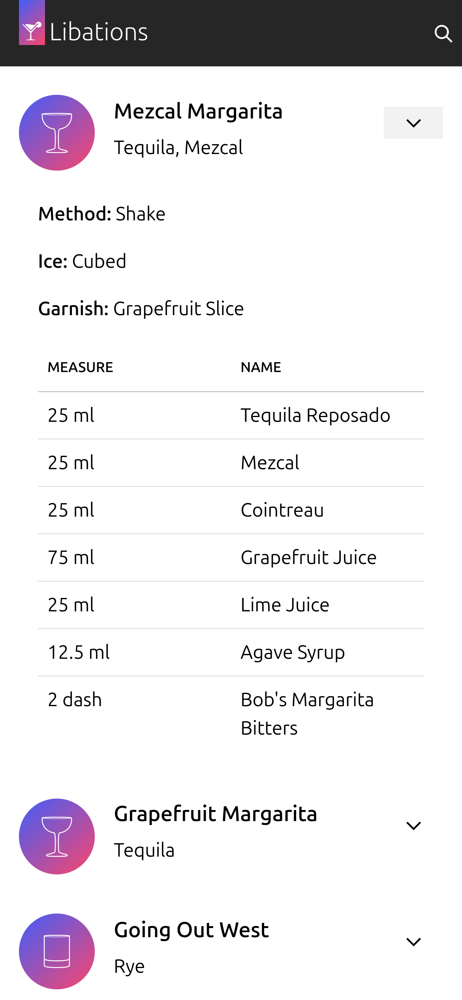

## Introduction

I'm a long-time, self-professed connoisseur of cocktails. I've always enjoyed making (and drinking!) the classics, but I also like experimenting with new base spirits, techniques, bitters etc.

Over the years, I've collected recipes from a variety of sources. Some originated from books (such as [Cocktail Codex](https://www.amazon.co.uk/dp/160774970X) and [Cocktails Made Easy](https://www.amazon.co.uk/dp/1770857753)), others from websites ([Difford's Guide](https://www.diffordsguide.com/)), and most importantly those that I've either guessed from things I've drunk elsewhere (like my favourite bar in Bristol, [The Milk Thistle](https://milkthistlebristol.com/)), or modifications to recipes from the referenced sources.

I wanted somewhere to store all these variations: somewhere that I could search easily from my iPhone (which is nearly always close to me when I'm making drinks). I wanted each recipe to fit in its entirety on my iPhone screen without the need to scroll.

Around the time I started thinking about this problem, I also learned about [`tsnet`](https://tailscale.com/kb/1244/tsnet) and was desperate for an excuse to try it out - and thus [Libations](https://github.com/jnsgruk/libations) was born as the product of two things I love: [Tailscale](https://tailscale.com/) and cocktails!

## tswhat?

Some time ago, Tailscale released a Go library named [`tsnet`](https://tailscale.com/kb/1244/tsnet). To quote the website:

> tsnet is a library that lets you embed Tailscale inside of a Go program

In this case, the embedded Tailscale works slightly different to how `tailscaled` works (by default, anyway...). Rather than using the universal TUN/TAP driver in the Linux kernel, `tsnet` instead uses a userspace TCP/IP networking stack, which enables the process embedding it to make direct connections to other devices on your [tailnet](https://tailscale.com/kb/1136/tailnet) as if it were "just another machine". This makes it easy to embed, and drops the requirement for the process to be privileged enough to access `/dev/tun`.

One of the things I like about how `tsnet` presents applications as devices on the tailnet, is that you can employ [ACLs](https://tailscale.com/kb/1018/acls) to control who and what on your tailnet can access _the application_, rather than _the device_. I've solved this problem before by putting applications in [their own `systemd-nspawn` container](https://github.com/jnsgruk/nixos-config/blob/main/host/common/services/servarr/lib.nix) and joining those containers to my tailnet. Another nice option is [`tsnsrv`](https://github.com/boinkor-net/tsnsrv) which essentially acts as a Tailscale-aware proxy for individual applications, but in this case I wanted to bake it into the application - which I would _only_ access over my tailnet.

Getting started with `tsnet` couldn't be easier:

```bash
mkdir tsnet-app; cd tsnet-app
go mod init tsnet-app
go get tailscale.com/tsnet
```

That will get you set up with a basic Go project, with the `tsnet` library available. Create a new `main.go` file with the following contents:

```go
package main

import (
	"fmt"
	"log"
	"net/http"

	"tailscale.com/tsnet"
)

func main() {
    // Create a new tsnet server instance
	s := tsnet.Server{Hostname: "tsnet-test"}
	defer s.Close()

    // Have the tsnet server listen on :8080
	ln, err := s.Listen("tcp", ":8080")
	if err != nil {
		log.Fatal(err)
	}
	defer ln.Close()

    // Define a very simple handler with a simple Hello, World style message
	handler := http.HandlerFunc(func(w http.ResponseWriter, r *http.Request) {
		fmt.Fprintf(w, "<html><body><h1>Hello from %s, tailnet!</h1>\n", s.Hostname)
	})

    // Start an HTTP server on the tsnet listener
	err = http.Serve(ln, handler)
	if err != nil {
		log.Fatal(err)
	}
}
```

This is about the most minimal example I could contrive. The code creates a simple instance of `tsnet.Server` with the hostname `tsnet-app`, listens on port `8080` and serves up a simple `Hello, World!` style message. On running the application you'll see the following:

```bash
❯ go run .
2024/08/13 15:03:37 tsnet running state path /home/jon/.config/tsnet-tsnet-app/tailscaled.state
2024/08/13 15:03:37 tsnet starting with hostname "tsnet-test", varRoot "/home/jon/.config/tsnet-tsnet-app"
2024/08/13 15:03:38 LocalBackend state is NeedsLogin; running StartLoginInteractive...
2024/08/13 15:03:43 To start this tsnet server, restart with TS_AUTHKEY set, or go to: https://login.tailscale.com/a/deadbeeffeebdaed
```

Clicking the link will open a page in your browser that runs you through Tailscale's authentication flow, after which you should be able to `curl` the page directly from any of your devices (assuming you're not doing anything complicated with ACLs that might prevent it)!

```bash
❯ tailscale status
# ...
100.93.165.28   kara                 jnsgruk@     linux   -
100.106.82.10   tsnet-test           jnsgruk@     linux   -
# ...

❯ curl http://tsnet-test:8080
<html><body><h1>Hello from tsnet-test, tailnet!</h1>
```

The library has a pretty small API surface, all of which is documented on [pkg.go.dev](https://pkg.go.dev/tailscale.com/tsnet).

## Libations

For my cocktail app, I wanted to employ a similar, albeit simplified, set of techniques that I [use to build this blog](https://jnsgr.uk/2024/01/building-a-blog-with-go-nix-hugo/). I love Go's ability to embed static files that can be served as web assets.

### Recipe Schema

I wanted to represent recipes in a format that could be updated by hand if necessary, and easily parsed into a web frontend. I decided to use JSON for this, representing the recipes as a list:

```json
[
  {
    "id": 10,
    "name": "New York Sour",
    "base": ["Bourbon"],
    "glass": ["12oz Lowball"],
    "method": ["Dry Shake", "Shake"],
    "ice": ["Cubed"],
    "ingredients": [
      { "name": "Lemon Juice", "measure": "20", "unit": "ml" },
      { "name": "Sugar", "measure": "20", "unit": "ml" },
      { "name": "Red Wine", "measure": "10", "unit": "ml" },
      { "name": "Bourbon", "measure": "40", "unit": "ml" },
      { "name": "Egg White", "measure": "20", "unit": "ml" }
    ],
    "garnish": ["Lemon Sail"],
    "notes": "Use claret or malbec"
  }
]
```

This schema is able to capture all the relevant details from the different formats I've seen over the years. It would take some time to format my favourites into this schema, but that was always going to be the case.

I was fortunate enough to get access to the recipe collection from a well regarded cocktail bar in the UK. Unfortunately it was given to me in a hard-to-parse PDF, which resulted in many hours of playing with OCR tools and manual data cleaning - but enabled me to bootstrap the app with around 450 high quality recipes. I didn't include their recipes in the libations [repository](https://github.com/jnsgruk/libations), but I did include some of my own favourite concoctions in a [sample recipe file](https://github.com/jnsgruk/libations/blob/dc1e50c60ba992a01dfab82d7550ca76a2655efd/static/sample.json). My [Mezcal Margarita](https://github.com/jnsgruk/libations/blob/dc1e50c60ba992a01dfab82d7550ca76a2655efd/static/sample.json#L2-L20) gets pretty good reviews 😉.

### Server

The server implementation needed to fulfil a few requirements:

- Parse a specific recipes file, optionally passed via the command line
- Have an embedded filesystem to contain static assets and templates
- Be able to render HTML templates with the given recipes
- Listen on either a tailnet (via `tsnet`), or locally (for testing convenience)
- When listening on the tailnet, listen on HTTPS, redirecting HTTP traffic accordingly

I wanted to keep dependencies to a minimum to make things easier to maintain over time. The `tsnet` library pulls in a few indirect dependencies, but everything else Libations uses is in the Go standard library.

The recipes JSON schema is very simple, and is modelled with a couple of Go structs:

```go
// Ingredient represents the name and quantity of a given ingredient in a recipe.
type Ingredient struct {
	Name    string
	Measure string
	Unit    string
}

// Drink represents all of the details for a given drink.
type Drink struct {
	ID          int
	Name        string
	Base        []string
	Glass       []string
	Method      []string
	Ice         []string
	Ingredients []Ingredient
	Garnish     []string
	Notes       string
}
```

The [`parseRecipes`](https://github.com/jnsgruk/libations/blob/dc1e50c60ba992a01dfab82d7550ca76a2655efd/main.go#L73-L101) function checks whether or not the user passed the path to a specific recipe file, or whether it should default to parsing the sample recipes file. Once it's determined the right file to parse, and validated its existence, it unmarshals the JSON using the Go standard library.

Users have the option of passing the `-local` flag when starting Libations, which bypasses `tsnet` completely and starts a local HTTP listener on the specific port. This makes for easier testing when iterating through changes to the web UI and other elements:

```go
// ...
addr := flag.String("addr", ":8080", "the address to listen on in the case of a local listener")
local := flag.Bool("local", false, "start on local addr; don't attach to a tailnet")

// ...
var listener *net.Listener
if *local {
    listener, err = localListener(*addr)
} else {
    listener, err = tailscaleListener(*hostname, *tsnetLogs)
}
if err != nil {
    slog.Error("failed to create listener", "error", err.Error())
    os.Exit(1)
}
//...
```

Setting up the `tsnet` server and listener is only [mildly more complicated](https://github.com/jnsgruk/libations/blob/dc1e50c60ba992a01dfab82d7550ca76a2655efd/main.go#L141-L183) -- but mostly due to my requirement that all HTTP traffic is redirected to HTTPS, using the [LetsEncrypt](https://letsencrypt.org/) certificates that Tailscale [provides automatically](https://tailscale.com/kb/1153/enabling-https). The redirects are handled by a separate Goroutine in this case:

```go
// Start a standard HTTP server in the background to redirect HTTP -> HTTPS.
go func() {
    httpLn, err := tsnetServer.Listen("tcp", ":80")
    if err != nil {
        slog.Error("unable to start HTTP listener, redirects from http->https will not work")
        return
    }

    slog.Info(fmt.Sprintf("started HTTP listener with tsnet at %s:80", hostname))

    err = http.Serve(httpLn, http.HandlerFunc(func(w http.ResponseWriter, r *http.Request) {
        newURL := fmt.Sprintf("https://%s%s", r.Host, r.RequestURI)
        http.Redirect(w, r, newURL, http.StatusMovedPermanently)
    }))
    if err != nil {
        slog.Error("unable to start http server, redirects from http->https will not work")
    }
}()
```

With the correct listener selected, I create an `http.ServeMux` to [handle routing to static assets and rendering templates](https://github.com/jnsgruk/libations/blob/dc1e50c60ba992a01dfab82d7550ca76a2655efd/main.go#L103-L124), and pass that mux to the `http.Serve` method from the Go standard library - and that's it! At the time of writing the Go code totals 235 lines - not bad!

### Web Interface

The web interface was designed primarily for mobile devices, and I've not yet done the work to make it excellent for larger-screened devices - though it's certainly bearable. It's also read-only at the moment: you can browse all the recipes, and there is a simple full-text search which can narrow the list of recipes down by searching for an ingredient, method, glass type, notes, etc.

As mentioned in [an earlier post](https://jnsgr.uk/2024/05/tracking-software-across-teams/), I'm a big fan of the [Vanilla Framework](https://vanillaframework.io/), which is a "simple, extensible CSS framework" from [Canonical](https://canonical.com), and is used for all of Canonical's apps and websites. Given that I had some prior experience using it, I decided to use it again here. I started using my tried and tested recipe of Vanilla + [Hugo](https://gohugo.io), but later [reverted](https://github.com/jnsgruk/libations/commit/d2783cf1adebd2432e832b27b335d2037d485da2) to using simple HTML templates with Go's [`html/template`](https://pkg.go.dev/html/template) package.

The result is a set of [templates](https://github.com/jnsgruk/libations/tree/main/templates), which iterate over the recipe data from the JSON file, and output nicely styled HTML elements:

[](01.png)

There is nothing fancy going on here - it's nearly all stock Vanilla Framework. I do specify some [overrides](https://github.com/jnsgruk/libations/blob/main/static/css/overrides.css) to make the colours a bit less Ubuntu-ish, but that's it!

One detail I'm pleased with is the dynamic drink icons. The icons indicate the type of glass the particular drink should be served in. This is a simple trick: for each drink the HTML template renders a [`glass-icon`](https://github.com/jnsgruk/libations/blob/dc1e50c60ba992a01dfab82d7550ca76a2655efd/templates/glass-icon.html) partial, which reads the glass type specified in the recipe, and renders the [appropriate SVG file](https://github.com/jnsgruk/libations/tree/dc1e50c60ba992a01dfab82d7550ca76a2655efd/templates/icons) which is then [coloured with CSS](https://github.com/jnsgruk/libations/blob/dc1e50c60ba992a01dfab82d7550ca76a2655efd/static/css/overrides.css#L42).

## Packaging for NixOS

There were two main tasks in this category: creating the Nix package itself, and writing a simple NixOS module that would make it simple for me to run it on my NixOS server.

The project uses a [Flake](https://nixos.wiki/wiki/Flakes) to provide the package, overlay and module. The standard library in Nix has good tooling for Go applications now, meaning the [derivation](https://github.com/jnsgruk/libations/blob/dc1e50c60ba992a01dfab82d7550ca76a2655efd/nix/libations.nix) is short:

```nix
{
  buildGo122Module,
  lastModifiedDate,
  lib,
  ...
}:

let
  version = builtins.substring 0 8 lastModifiedDate;
in
buildGo122Module {
  pname = "libations";
  inherit version;
  src = lib.cleanSource ../.;
  vendorHash = "sha256-AWvaHyJL7Cm+zCY/vTuTAsgLbVy6WUNfmaGbyQOzMMQ=";
}
```

I haven't cut any versioned releases of Libations at the time of writing - I'm using the last modified date of the flake to version the binaries.

The [module](https://github.com/jnsgruk/libations/blob/dc1e50c60ba992a01dfab82d7550ca76a2655efd/nix/module.nix) starts the application with `systemd`, and optionally provides it with a recipes file. There are four options defined at the time of writing: `services.libations.{enable,recipesFile,tailscaleKeyFile,package}`:

```nix
options = {
  services.libations = {
    enable = mkEnableOption "Enables the libations service";

    recipesFile = mkOption {
      type = nullOr path;
      default = null;
      example = "/var/lib/libations/recipes.json";
      description = ''
        A file containing drinks recipes per the Libations file format.
        See https://github.com/jnsgruk/libations.
      '';
    };

    tailscaleKeyFile = mkOption {
      type = nullOr path;
      default = null;
      example = "/run/agenix/libations-tsauthkey";
      description = ''
        A file containing a key for Libations to join a Tailscale network.
        See https://tailscale.com/kb/1085/auth-keys/.
      '';
    };

    package = mkPackageOption pkgs "libations" { };
  };
};
```

The `tailscaleKeyFile` option enables the service to automatically join a tailnet using an API key, rather than prompting the user to click a link and authorise manually.

These options are translated into a simple `systemd` unit:

```nix
config = mkIf cfg.enable {
  systemd.services.libations = {
    description = "Libations cocktail recipe viewer";
    wantedBy = [ "multi-user.target" ];
    after = [ "network.target" ];
    environment = {
      "XDG_CONFIG_HOME" = "/var/lib/libations/";
    };
    serviceConfig = {
      DynamicUser = true;
      ExecStart = "${cfg.package}/bin/libations -recipes-file ${cfg.recipesFile}";
      Restart = "always";
      EnvironmentFile = cfg.tailscaleKeyFile;
      StateDirectory = "libations";
      StateDirectoryMode = "0750";
    };
  };
}
```

The `XDG_CONFIG_HOME` variable is set so that `tsnet` stores it's state in `/var/lib/libations`, rather than trying to store it in the home directory of the [dynamically created user](https://0pointer.net/blog/dynamic-users-with-systemd.html) for the `systemd` unit.

I use [agenix](https://github.com/ryantm/agenix) on my NixOS machines to manage encrypted secrets, and for this project I used it to encrypt both the initial Tailscale [auth key](https://tailscale.com/kb/1085/auth-keys), and my super-secret recipe collection! The configuration to provide the secrets and configure the server to run libations is available [on Github](https://github.com/jnsgruk/nixos-config/blob/0f4df26871c1cacc5d9c24cdd46e495c808f6639/host/common/services/libations.nix), but looks like so:

```nix
{ config, self, ... }:
{
  age.secrets = {
    libations-auth-key = {
      file = "${self}/secrets/thor-libations-tskey.age";
      owner = "root";
      group = "root";
      mode = "400";
    };

    libations-recipes = {
      file = "${self}/secrets/thor-libations-recipes.age";
      owner = "root";
      group = "root";
      mode = "444";
    };
  };

  services.libations = {
    enable = true;
    recipesFile = config.age.secrets.libations-recipes.path;
    tailscaleKeyFile = config.age.secrets.libations-auth-key.path;
  };
}
```

As a result, the application is now available at `https://libations`, with a valid LetsEncrypt certificate, on all of my machines! 🎉

## Summary

This was a really fun project. It felt like a fun way to explore `tsnet`, and resulted in something that I've used a lot over the past year. I don't have many plans to adjust things in the near future - though I do find myself wanting a nice interface to add new recipes from time to time.

And now for the twist: three weeks ago I gave up drinking alcohol (likely for good), so now I'm on a mission to find some non-alcoholic recipes to make life a little tastier! I suspect this will be hard work - and I'll certainly miss some of my favourites, but my wife and I have already found some compelling alternatives.

If you've got a favourite recipe (alcoholic or not) and you liked the article, then perhaps open a PR and add it to the [sample recipes file](https://github.com/jnsgruk/libations/blob/main/static/sample.json)!
