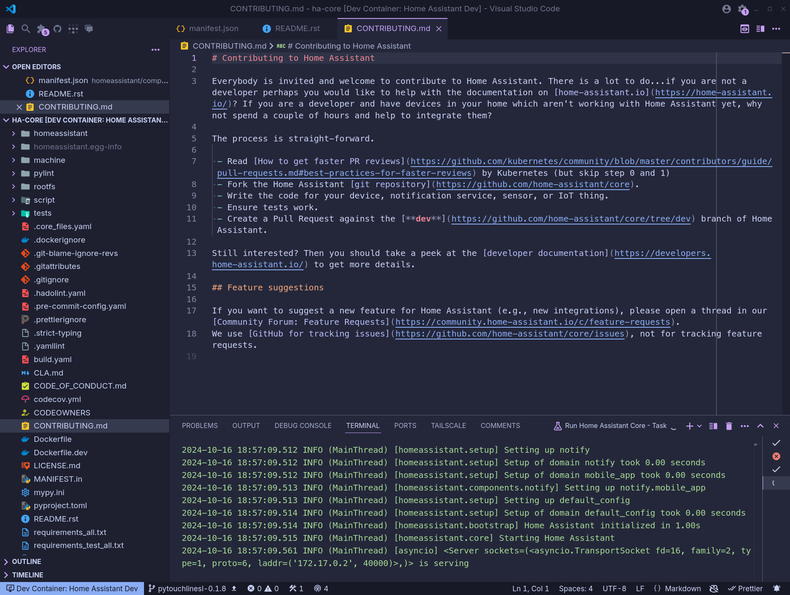
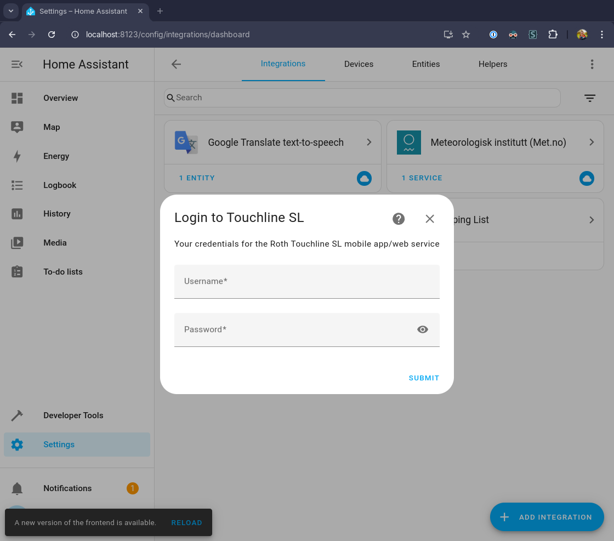
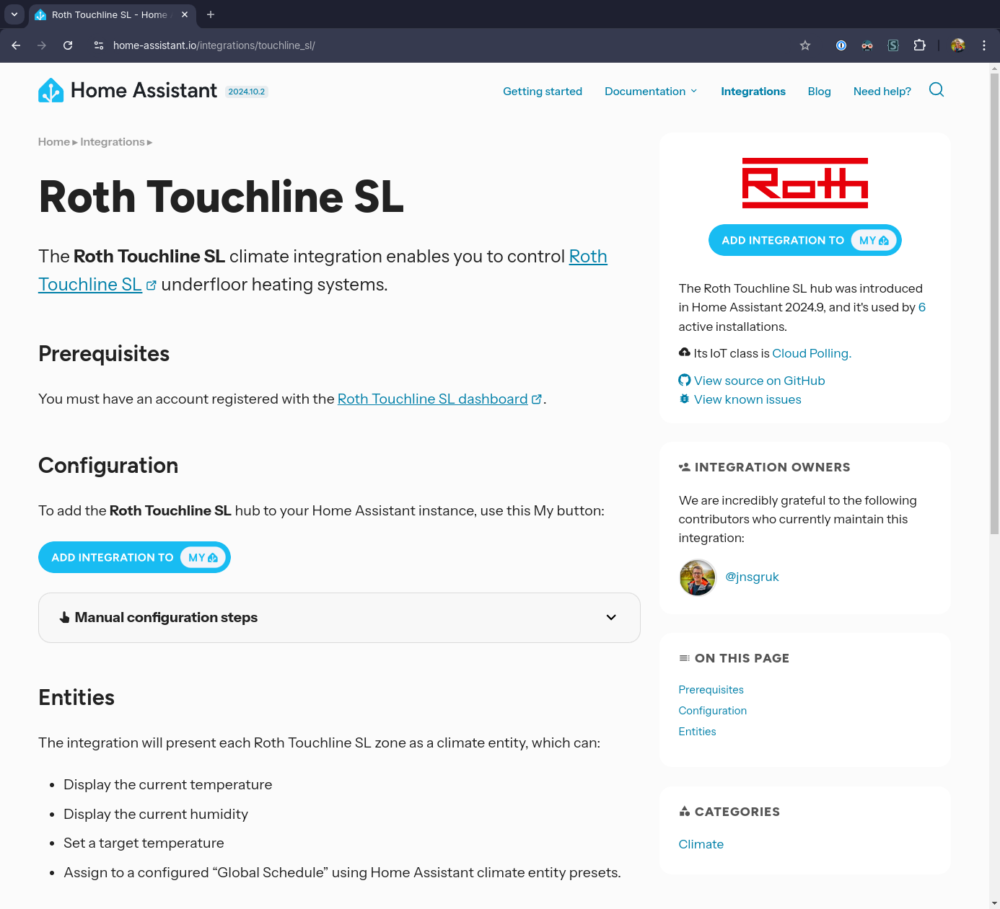
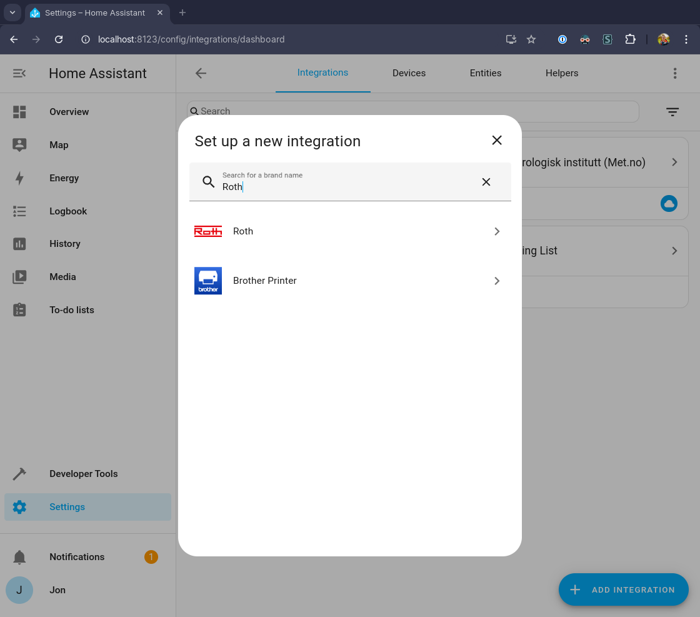
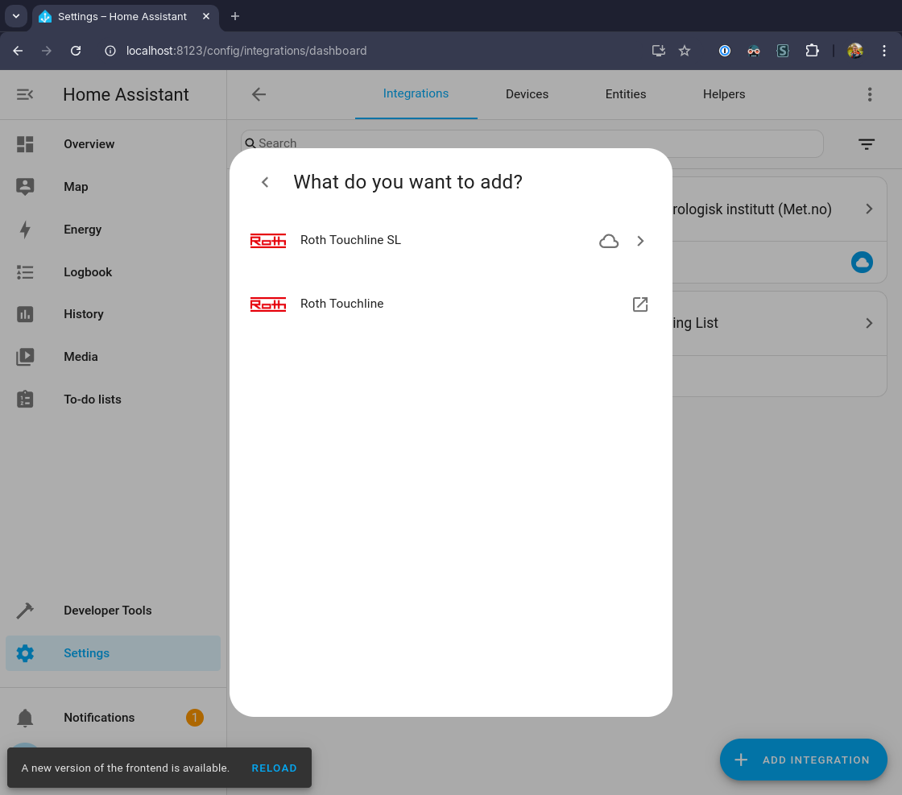
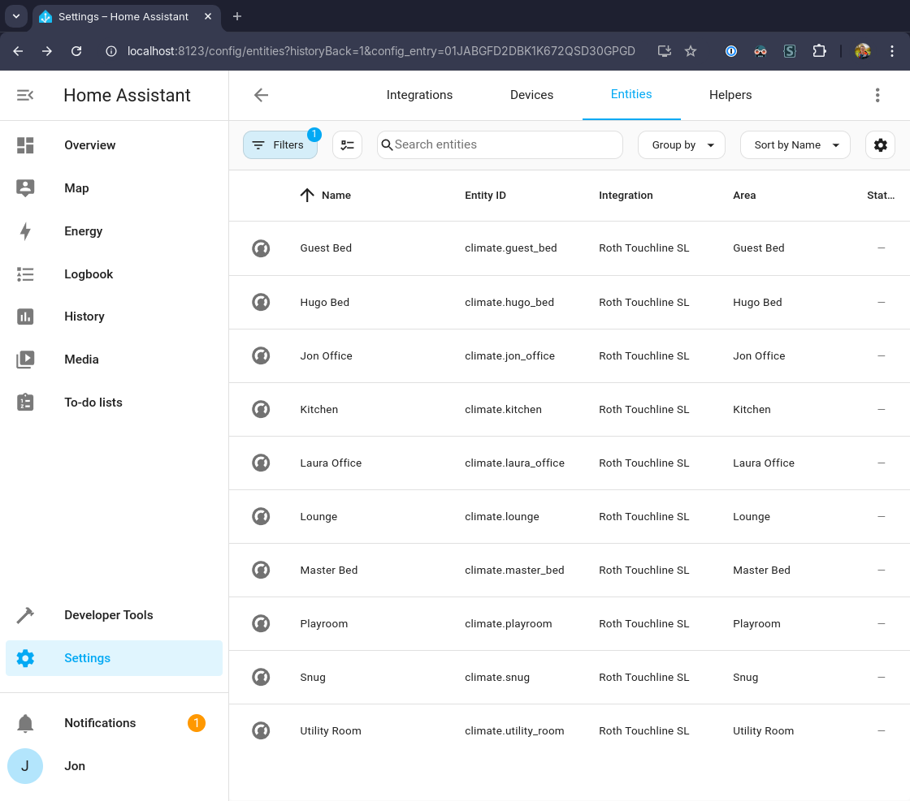
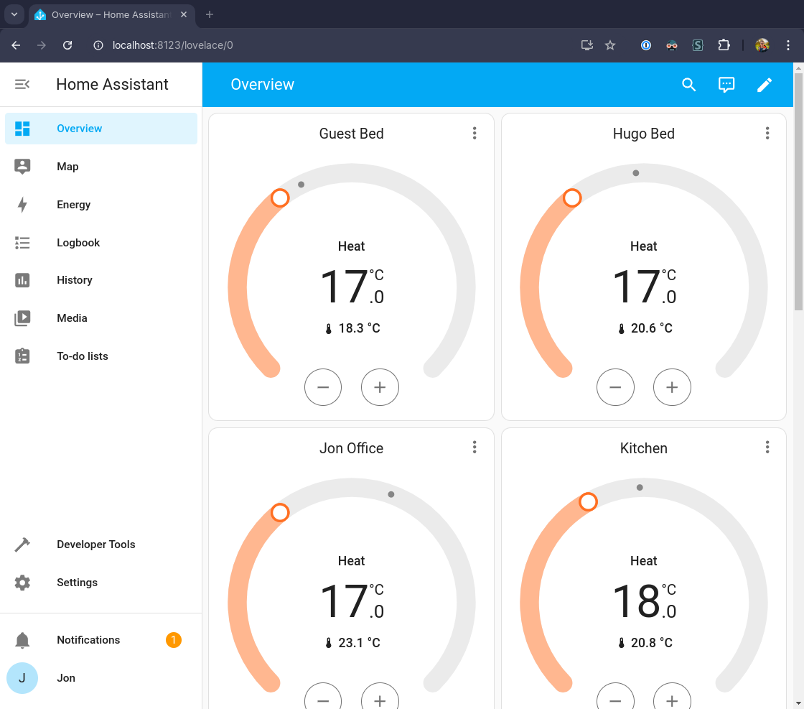
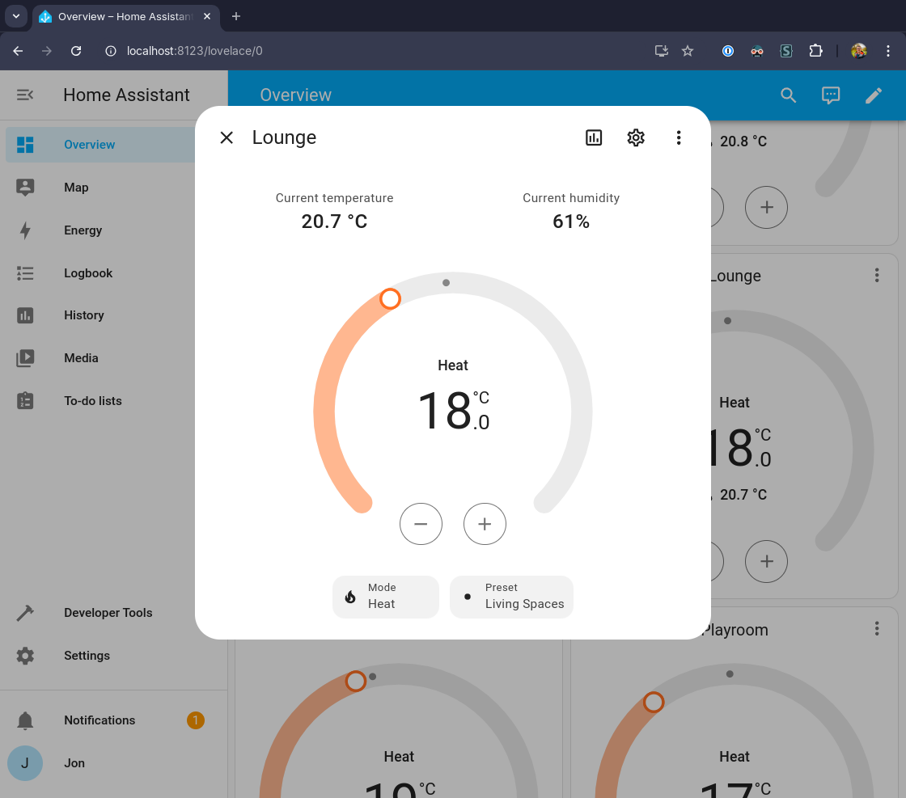

## Introduction

In my [last post](https://jnsgr.uk/2024/09/pytouchlinesl/) I described the first steps toward creating a new [Home Assistant](https://www.home-assistant.io/) integration for the underfloor heating system in my house. In that post I outlined in detail how I set about creating a Python client for the API provided by the underfloor heating controller vendor.

In this post, I'll describe the development setup, project structure and contribution process for building and landing a Home Assistant Core integration. I don't consider myself an expert here, but I've documented my journey here in the hope that my experience might be useful to potential future contributors.

The finished integration can be seen in the Home Assistant [docs](https://www.home-assistant.io/integrations/touchline_sl/) under the name `touchline_sl`, and the code can be found [on Github](https://github.com/home-assistant/core/tree/dev/homeassistant/components/touchline_sl).

## Development Setup

The Home Assistant documentation [recommends](https://developers.home-assistant.io/docs/development_environment/) the use of Visual Studio Code with a [devcontainer](https://containers.dev/). This was a very quick way to get a working environment up and running, especially given that I already use Visual Studio Code for most of my programming, so I was immediately familiar.

The repository provides some [tasks](https://code.visualstudio.com/Docs/editor/tasks) to help get started, including a task named [`Run Home Assistant Core`](https://github.com/home-assistant/core/blob/72f1c358d97dd387e8d7d8e537cfb0554b274124/.vscode/tasks.json#L5), which takes care of setting up the runtime environment, installing dependencies and starting the server. Neat!

There are also a set of [pre-commit](https://pre-commit.com/) hooks set up to ensure you don't make any common mistakes, accidentally violate the formatting/static-typing rules for the project, forget to update `requirements.txt` files, etc.

This turned out to be a really nice way to get started, and if you're new to Home Assistant Core development, I'd recommend giving this "batteries-included" approach a go. If it's not for you, the project provides [manual setup instructions](https://developers.home-assistant.io/docs/development_environment#manual-environment) too.

[](01.png)

## Integration Basics

According to the [documentation](https://developers.home-assistant.io/docs/architecture_components):

> \[An] integration is responsible for a specific domain within Home Assistant. Integrations can listen for or trigger events, offer actions, and maintain states.

Where a domain is...

> a short name consisting of characters and underscores. This domain has to be unique and cannot be changed.

Err, right... while this _is_ an accurate statement, it's perhaps not the most enlightening for the budding new integration developer! At their core, integrations are Python modules that take information about a given system (like an underfloor heating system, or a smart plug, or a light bulb) and represent information about them in a format compatible with one of Home Assistant's archetypes for [devices](https://developers.home-assistant.io/docs/device_registry_index)/[sensors](https://developers.home-assistant.io/docs/core/entity/sensor)/[platforms](https://developers.home-assistant.io/docs/creating_platform_index)/[entities](https://developers.home-assistant.io/docs/core/entity).

In this case, we'll be representing [Climate Entities](https://developers.home-assistant.io/docs/core/entity/climate/), which have the sort of properties you might expect - `target_temperature`, `current_humidity`, `current_temperature`, etc.

To use Home Assistant's terms, in my setup:

- The platform is the underfloor heating system
- The platform consists of some devices, in this case the physical thermostats in each room of my house
- The devices each represent one or more climate entities (humidity, temperature, etc.)

## File Structure

The [basic file structure](https://github.com/home-assistant/core/tree/dev/homeassistant/components/touchline_sl) can be laid down with some [scaffold tooling](https://developers.home-assistant.io/docs/creating_component_index), but even in its finished state, my integration doesn't have many files:

```bash
.
├── __init__.py      # the component file
├── climate.py       # ties info from the api into home assistant terms
├── config_flow.py   # defines the fields/flow for integration config
├── const.py         # constants used across the integration
├── coordinator.py   # data update coordinator
├── manifest.json    # defines project dependencies and metadata
├── strings.json     # defines strings displayed in various ui elements
└── translations     # a directory containing one file per language
    └── en.json      # english translation of strings.json
```

And to give an idea of the scale of the project in its completed form:

```
----------------------------------------------------------------------
Language            files          blank        comment           code
----------------------------------------------------------------------
Python                  5             71             27            215
JSON                    3              0              0             82
----------------------------------------------------------------------
SUM:                    8             71             27            297
----------------------------------------------------------------------
```

### `manifest.json`

Starting with the most simple first! The `manifest.json` describes the integration: what its name is, where its documentation is found, who owns the code and the libraries it depends on:

```json
{
  "domain": "touchline_sl",
  "name": "Roth Touchline SL",
  "codeowners": ["@jnsgruk"],
  "config_flow": true,
  "documentation": "https://www.home-assistant.io/integrations/touchline_sl",
  "integration_type": "hub",
  "iot_class": "cloud_polling",
  "requirements": ["pytouchlinesl==0.1.8"]
}
```

Here I selected `cloud_polling` as the `iot_class`, because my integration reaches out periodically to the API, polling for new information. You'll note also that the integration requires my [`pytouchlinesl`](https://pypi.org/project/pytouchlinesl/) library in order to run.

### `__init__.py`

Typically for integrations, this file defines how to setup the integration, and how to unload it. You can see the full source of my implementation [on Github](https://github.com/home-assistant/core/blob/82e9792b4d44c653cfc38c495e8e6907d08878cd/homeassistant/components/touchline_sl/__init__.py).

I define an `async_setup_entry()` method which takes care of:

- [Establishing a coordinator per TouchlineSL module](https://github.com/home-assistant/core/blob/82e9792b4d44c653cfc38c495e8e6907d08878cd/homeassistant/components/touchline_sl/__init__.py#L28-L30)
- Performing the [initial hydration of data](https://github.com/home-assistant/core/blob/82e9792b4d44c653cfc38c495e8e6907d08878cd/homeassistant/components/touchline_sl/__init__.py#L32-L37)
- [Registering each TouchlineSL module as a device](https://github.com/home-assistant/core/blob/82e9792b4d44c653cfc38c495e8e6907d08878cd/homeassistant/components/touchline_sl/__init__.py#L42-L51) in Home Assistant's [Device Registry](https://developers.home-assistant.io/docs/device_registry_index?_highlight=device), which is where Home Assistant "keeps track of devices"

There is a shortened, annotated version of the method below:

```python
async def async_setup_entry(hass: HomeAssistant, entry: TouchlineSLConfigEntry) -> bool:
    """Set up Roth Touchline SL from a config entry."""
    account = TouchlineSL(...)

    coordinators: list[TouchlineSLModuleCoordinator] = [
        TouchlineSLModuleCoordinator(hass, module)
        for module in await account.modules()
    ]
    # ...
    device_registry = dr.async_get(hass)
    # Create a new Device for each coorodinator to represent each module
    for c in coordinators:
        module = c.data.module
        device_registry.async_get_or_create(
            config_entry_id=entry.entry_id,
            identifiers={(DOMAIN, module.id)},
            name=module.name,
            # ...
        )

    entry.runtime_data = coordinators
    await hass.config_entries.async_forward_entry_setups(entry, PLATFORMS)
    return True
```

Before returning `async_setup_entry()` [invokes](https://github.com/home-assistant/core/blob/82e9792b4d44c653cfc38c495e8e6907d08878cd/homeassistant/components/touchline_sl/__init__.py#L54) `async_forward_entry_setups()`. This ensures that `async_setup_entry()` in `climate.py` is called to ensure each of the climate entities is registered.

The `PLATFORMS` variable is a list of platform types that the integration supports, [in this case](https://github.com/home-assistant/core/blob/82e9792b4d44c653cfc38c495e8e6907d08878cd/homeassistant/components/touchline_sl/__init__.py#L17) a single-item list containing just `Platform.CLIMATE`, which is how `async_forward_entry_setups` knows to invoke the `async_setup_entry()` method in `climate.py`:

```python
from homeassistant.const import Platform
# ...
PLATFORMS: list[Platform] = [Platform.CLIMATE]
# ...
```

To initialise the integration, the user must authenticate with the Roth API so that module details are fetched before constructing the coordinator. Thus, before this code is executed, the user must go through the config flow...

### `config_flow.py`

Despite the final implementation being quite simple, this is probably one of the areas I found most challenging to get right. There are some [docs](https://developers.home-assistant.io/docs/config_entries_config_flow_handler/) but they only scratch the surface, and implementations in other integrations seem to vary quite dramatically (mostly depending on when they were written).

I went through a few iterations of this config flow, mostly because I had originally implemented the ability to select a specific module from the user's account. The review process guided me toward simply logging into the account, then enrolling each of the modules associated with the account - since users can always disable entities they don't wish to manage in Home Assistant.

The `config_flow.py` defines which input fields need to be presented to the user, and then passes on the relevant information needed to set up the integration. In my implementation, the code:

- Prompts the user for their username and password
- Authenticates with the service and fetches the user's unique ID
- Registers that unique ID, aborting if the specified account has already been used
- Creates a config entry in Home Assistant that stores the user's credentials

The config flow also has some basic error handling that can distinguish the difference between poor credentials, networking issues, etc. The full implementation can be seen [on Github](https://github.com/home-assistant/core/blob/4964470e9c2c168f5004188bf77417764fc4977c/homeassistant/components/touchline_sl/config_flow.py), but the important parts are highlighted in the following snippet:

```python
# ...
class TouchlineSLConfigFlow(ConfigFlow, domain=DOMAIN):
    # ...
    async def async_step_user(
        self, user_input: dict[str, Any] | None = None
    ) -> ConfigFlowResult:
        # ...
        if user_input is not None:
            try:
                account = TouchlineSL(
                    username=user_input[CONF_USERNAME],
                    password=user_input[CONF_PASSWORD],
                )
                # Use the credentials to fetch unique user id
                await account.user_id()
            except RothAPIError as e:
                # ...
            else:
                # Set unique ID, abort setup if already used
                unique_account_id = await account.user_id()
                await self.async_set_unique_id(str(unique_account_id))
                self._abort_if_unique_id_configured()

                # Create a config entry containing the user's credentials
                return self.async_create_entry(
                    title=user_input[CONF_USERNAME], data=user_input
                )

        return self.async_show_form(
            step_id="user", data_schema=STEP_USER_DATA_SCHEMA, errors=errors
        )
```

What caught me out was how the fields are given titles/descriptions. These attributes are all configured in the [`strings.json`](https://github.com/home-assistant/core/blob/4964470e9c2c168f5004188bf77417764fc4977c/homeassistant/components/touchline_sl/strings.json), where the `config` map contains keys for each of the config "steps".

The code above defines a step named `user`, since the method name is `async_step_user`. The step's name, description and input fields are defined in the [`strings.json`](https://github.com/home-assistant/core/blob/4964470e9c2c168f5004188bf77417764fc4977c/homeassistant/components/touchline_sl/strings.json):

```json
{
  "config": {
    "flow_title": "Touchline SL Setup Flow",
    "error": {
      "cannot_connect": "[%key:common::config_flow::error::cannot_connect%]"
      // ...
    },
    "step": {
      "user": {
        "title": "Login to Touchline SL",
        "description": "Your credentials for the Roth Touchline SL mobile app/web service",
        "data": {
          "username": "[%key:common::config_flow::data::username%]",
          "password": "[%key:common::config_flow::data::password%]"
        }
      }
    },
    "abort": {
      "already_configured": "[%key:common::config_flow::abort::already_configured_device%]"
    }
  }
  // ...
}
```

The values displayed to the user are pulled from the translation files at runtime depending on their language configuration. In my integration, the corresponding `translations/en.json` contains the following fields that map to those defined above:

```json
{
  "config": {
    "flow_title": "Touchline SL Setup Flow",
    "error": {
      "cannot_connect": "Failed to connect"
      // ...
    },
    "step": {
      "user": {
        "data": {
          "password": "Password",
          "username": "Username"
        },
        "description": "Your credentials for the Roth Touchline SL mobile app/web service",
        "title": "Login to Touchline SL"
      }
    },
    "abort": {
      "already_configured": "Device is already configured"
    }
  }
  // ...
}
```

In hindsight, this is covered in the [docs](https://developers.home-assistant.io/docs/config_entries_config_flow_handler/#defining-your-config-flow), but it definitely didn't click with me when I was going through it, so it seemed worth calling out! The net result of this setup is a configuration dialog that looks like so:

[](04.png)

### `coordinator.py`

This was an addition I made during the review process (more on that later), and appears to be the preferred way to implement the [fetching of data](https://developers.home-assistant.io/docs/integration_fetching_data#coordinated-single-api-poll-for-data-for-all-entities) from upstream APIs. By implementing a `DataUpdateCoordinator`, Home Assistant can ensure that a single coordinated poll happens across all entities managed by an integration. If an integration manages many entities for which it needs to fetch/update details, the coordinator helps ensure that the API is called only as often as is needed.

The coordinator class is very simple: it defines a single method `_async_update_data` which returns the data for the device its coordinating. As the developer, you can specify the type of the data returned by the coordinator. I chose to represent this as a Python `dataclass`:

```python
@dataclass
class TouchlineSLModuleData:
    module: Module
    zones: dict[int, Zone]
    schedules: dict[str, GlobalScheduleModel]
```

The coordinator is initialised with some basic information such as a name and an update interval:

```python
# ...
class TouchlineSLModuleCoordinator(DataUpdateCoordinator[TouchlineSLModuleData]):
    def __init__(self, hass: HomeAssistant, module: Module) -> None:
        super().__init__(
            hass,
            logger=_LOGGER,
            name=f"Touchline SL ({module.name})",
            update_interval=timedelta(seconds=30),
        )

        self.module = module
```

The `_async_update_data` method then queries the API, and returns data in the newly defined format:

```python
async def _async_update_data(self) -> TouchlineSLModuleData:
    try:
        zones = await self.module.zones()
        schedules = await self.module.schedules()
    except RothAPIError as error:
        # ...
    # Return the data using our dataclass from above
    return TouchlineSLModuleData(
        module=self.module,
        zones={z.id: z for z in zones},
        schedules={s.name: s for s in schedules},
    )
```

You can see the full implementation [on Github](https://github.com/home-assistant/core/blob/4964470e9c2c168f5004188bf77417764fc4977c/homeassistant/components/touchline_sl/coordinator.py).

### `climate.py`

And finally, on to the business logic of tying fields from the upstream API into the relevant attributes in Home Assistant!

The first task handled by this file is registering each of the climate entities by iterating over each zone, in each coordinator's module:

```python
# ...
async def async_setup_entry(
    hass: HomeAssistant,
    entry: TouchlineSLConfigEntry,
    async_add_entities: AddEntitiesCallback,
) -> None:
    """Set up the Touchline devices."""
    coordinators = entry.runtime_data
    async_add_entities(
        TouchlineSLZone(coordinator=coordinator, zone_id=zone_id)
        for coordinator in coordinators
        for zone_id in coordinator.data.zones
    )
# ...
```

Home Assistant entities have well-defined APIs - the [docs](https://developers.home-assistant.io/docs/core/entity/climate/) for climate entities show the supported attributes and their data types. I used a combination of the docs, and the [source code](https://github.com/home-assistant/core/blob/3cbadb1bd23fa1174055aad75fe4d469b0a743bb/homeassistant/components/climate/__init__.py) to establish how to implement [my `ClimateEntity`](https://github.com/home-assistant/core/blob/3cbadb1bd23fa1174055aad75fe4d469b0a743bb/homeassistant/components/touchline_sl/climate.py), which boiled down to the following interface:

```python
class TouchlineSLZone(CoordinatorEntity[TouchlineSLModuleCoordinator], ClimateEntity):
    # Construct a Touchline SL climate zone.
    def __init__(self, coordinator: TouchlineSLModuleCoordinator, zone_id: int) -> None:
    # Handle updated data from the coordinator.
    @callback
    def _handle_coordinator_update(self) -> None:
    # Return the device object from the coordinator data.
    @property
    def zone(self) -> Zone
    # Report if the device is available.
    @property
    def available(self) -> bool
    #Set new target temperature.
    async def async_set_temperature(self, **kwargs: Any) -> None
    # Assign the zone to a particular global schedule.
    async def async_set_preset_mode(self, preset_mode: str) -> None
    # Populate attributes with data from the coordinator.
    def set_attr(self) -> None:
```

Arguably the most important part here is `set_attr()`. which takes care of mapping fields from the objects provided by my `pytouchlinesl` library to attributes on the climate entity:

```python
def set_attr(self) -> None:
    """Populate attributes with data from the coordinator."""
    schedule_names = self.coordinator.data.schedules.keys()

    self._attr_current_temperature = self.zone.temperature
    self._attr_target_temperature = self.zone.target_temperature
    self._attr_current_humidity = int(self.zone.humidity)
    self._attr_preset_modes = [*schedule_names, CONSTANT_TEMPERATURE]

    if self.zone.mode == "constantTemp":
        self._attr_preset_mode = CONSTANT_TEMPERATURE
    elif self.zone.mode == "globalSchedule":
        schedule = self.zone.schedule
        self._attr_preset_mode = schedule.name
```

The full implementation is [on Github](https://github.com/home-assistant/core/blob/3cbadb1bd23fa1174055aad75fe4d469b0a743bb/homeassistant/components/touchline_sl/climate.py).

## Testing

Testing is (understandably) a little complicated. The [requirements](https://developers.home-assistant.io/docs/development_testing#writing-tests-for-integrations) for landing code for an integration stipulate that you must include unit tests for any config/options flows. In my case, this meant the following:

- Implementing a mock TouchlineSL [client fixture](https://github.com/home-assistant/core/blob/72f1c358d97dd387e8d7d8e537cfb0554b274124/tests/components/touchline_sl/conftest.py#L32) to ensure that the unit tests don't try to reach out to the real Roth API
- Implementing a mock [config entry fixture](https://github.com/home-assistant/core/blob/72f1c358d97dd387e8d7d8e537cfb0554b274124/tests/components/touchline_sl/conftest.py#L51)
- A unit test for a [successful config flow execution](https://github.com/home-assistant/core/blob/72f1c358d97dd387e8d7d8e537cfb0554b274124/tests/components/touchline_sl/test_config_flow.py#L24)
- A parametrised unit test for [unsuccessful config flow](https://github.com/home-assistant/core/blob/72f1c358d97dd387e8d7d8e537cfb0554b274124/tests/components/touchline_sl/test_config_flow.py#L54) due to possible exceptions when hitting the API
- A unit test to ensure that multiple config flows [resulting in the same user ID fail](https://github.com/home-assistant/core/blob/72f1c358d97dd387e8d7d8e537cfb0554b274124/tests/components/touchline_sl/test_config_flow.py#L92)

To me this feels like the bare minimum, and unfortunately doesn't really provide any confidence that the integration actually functions correctly. I'm hoping to improve this in the future, but for now further testing has been manual.

## Docs & Brand

As I was creating the Pull Request to contribute my integration, I was prompted by the template to link to further PRs that added the documentation and brand assets for my integration. I used the existing `touchline` docs as a template and modified them for my integration. The docs [pull request](https://github.com/home-assistant/home-assistant.io/pull/34441) added a single file `touchline_sl.markdown` containing 29 lines, which results in some nicely [rendered docs](https://www.home-assistant.io/integrations/touchline_sl/) on the Home Assistant website:

[](08.png)

There were already branding assets for Roth as part of the `touchlinesl` integration that was previously merged. Based on some review feedback, I [created](https://github.com/home-assistant/brands/pull/5797) a new [Integration Brand](https://developers.home-assistant.io/docs/creating_integration_brand) named `roth`, with which both the `touchline` and `touchline_sl` integrations are associated. This has the nice effect of grouping them when setting up a new integration:

[](02.png)
[](03.png)

## Contribution Process

I submitted my first efforts for review in [home-assistant/core#124557](https://github.com/home-assistant/core/pull/124557). The checklist guided me nicely through what needed to be done, and overall the process went pretty smoothly, and pretty quickly (despite the 117 comments!). The process took a little under two days in total. I was also fortunate with my timing, since my code landed the day before the next beta release was cut, so it shipped relatively quickly.

I'd like to offer my sincere thanks to [@joostlek](https://github.com/joostlek) who not only reviewed my code extremely quickly, but took the time to explain things to me both in the Github PR, but also by proactively reaching out to me on the Home Assistant Discord, which I really appreciated.

I got _a lot_ of feedback, which I expected. This was my first attempt at writing code for Home Assistant, and it's a pretty large and well established project. I do think the project could do with some better developer documentation, which would dramatically reduce the burden of effort on reviewers and give contributors a better chance of "getting it right".

One might argue I could have done _more_ reading and _more_ research - though I spent a good amount of time reading both the documentation and the source code of other integrations. I'm not sure I'd ever have reached the conclusions that [@joostlek](https://github.com/joostlek) kindly nudged me toward.

Overall, my implementation was more brief, more simple and more efficient as a result of the review process, and based on my experience I'd advocate for having a go if you've been on the fence! Often submitting code to such a project can be daunting, but as with my experience when contributing to `nixpkgs`, if you go in with an open mind you're sure to learn something from the process.

## Results

I'm really pleased with the results. However obtuse the developer experience felt at times, there is no denying that what I was able to get from my 297 lines of implementation code is quite staggering. I was super impressed that just by following the conventions I was able to get such intuitive controls, a full graphable history of temperatures and such a wide variety of ways to display the information in my various dashboards.

Once set up, you're able to get a view of all the different zones imported by the module (the names of each zone are pulled from the upstream API if the zones are named, and each can be associated with a given area in Home Assistant):

[](05.png)

The default dashboard displays thermostat controls for each zone. These allow you to see the current and target temprature, as well as adjust the target temperature if you need to:

[](06.png)

Expanding the thermostat cards gives you a more detailed view, showing the mode and the "Preset". My implementation maps "Presets" to "Global Schedules" configured in the Roth module:

[](07.png)

## Summary

And that's a wrap! I learned a bunch writing this integration, and the resulting user experience is quite a lot better than I get with the default Roth application.

My next mission is to use the information from these climate entities to automate opening the Velux windows in the roof when things get warm in the summer, but I've got a lot to learn about Home Assistant in the mean time!
