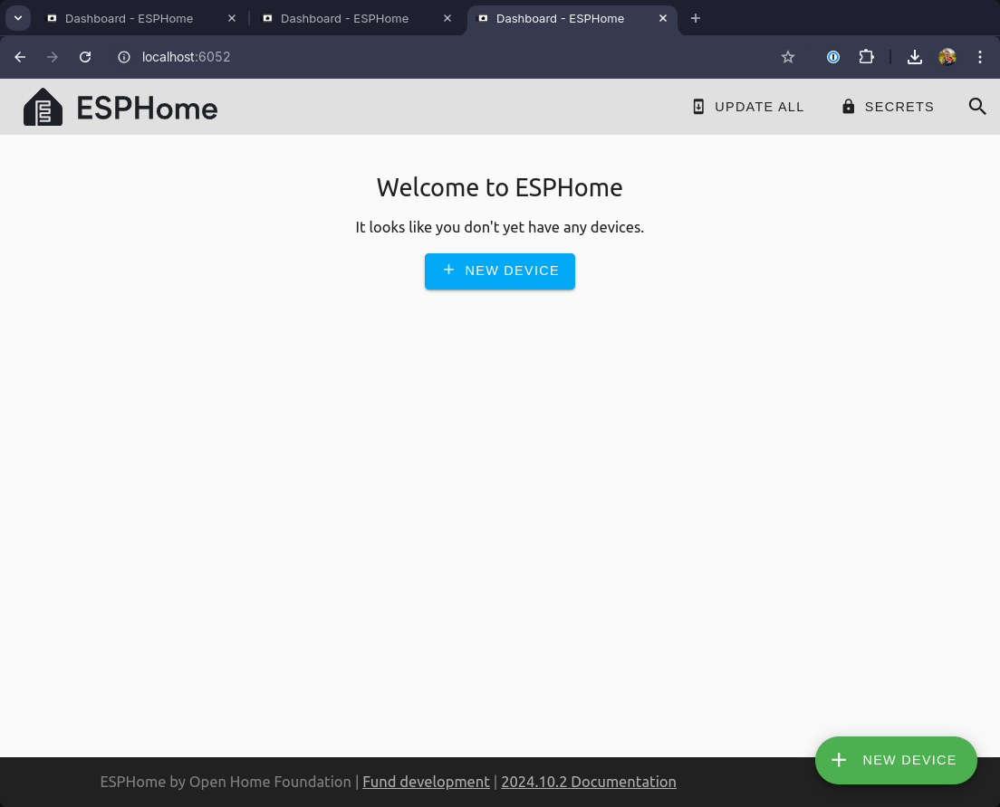

## Introduction

This year we put a wood-fired hot tub in our back garden. It's a total indulgence and a real treat. I originally purchased the tub for my wife, but I must admit to having grown quite fond of it myself!

The tub itself is made from Canadian Redwood Cedar. The photo below was taken shortly after it was assembled, so there is still a little bit of leakage which stopped a few days later once the wood had expanded. The 30kW wood burner is the most effective way to heat the tub (which holds around 1700l of water), but there is also a small electric heater in line with the pump & filter which are stashed behind the tub.

There is something wonderfully simple and low-tech about the whole arrangement, but naturally I wanted to get an understanding of the energy usage, and get a reading on the temperature so that I could more accurately set it up for when we wanted to use it. Part of the reasoning for understanding the energy usage was to ensure that the pump and UV filter only fire up when the house is generating enough solar energy to cover it.

A picture paints a thousand words, so you can see what I'm talking about below:

[](01.jpg)

## Energy Usage Monitoring

Starting with the easy part: monitoring the energy usage for each of the components. What you can't see in the picture above is the following:

- An [Elecro Vulcan 3kw heater](https://vulcanpools.co.uk/product/splasher/)
- An [evoUV 15w](https://evolutionaqua.com/evouv) UV clarifier
- A [Crystal Enterprises CC2513](http://www.crystalclearpond.co.uk/product_info.php/products_id/2860) pump
- A [Crystal Enterprises CC3030](http://www.cheshireluxurypools.co.uk/product_info.php/products_id/2873) filter unit

The UV filter, heater and sand filter are all essentially "in line" - when the pump is switched on, water is pulled from the bottom of the tub, through the UV clarifier, sand filter and heater, and then back into the tub (not necessarily in that order!). The heater has a thermostat in it so that it can cut in/out depending on the desired temperature as the water passes through.

In reality, the 3kw heater would take 12-15 hours to heat the tub from scratch, which is why we use the burner that usually takes around 1.5-2 hours. The electric heater _is_ good for maintaining the temperature once the initial heating has been done.

I've had quite a lot of success with [TP-Link Tapo P110](https://www.tp-link.com/uk/home-networking/smart-plug/tapo-p110/) smart plugs. They're very cheap, and there is already a competent Home Assistant integration for them. The only downside is that they require a proprietary app for initial setup. After having bought a few of these, I learned about [Tasmota](https://templates.blakadder.com/index.html), and will probably buy smart plugs compatible with this or similar open source firmwares in the future.

My friends from the [Self Hosted Podcast](https://selfhosted.show) seem to recommend buying pre-flashed smart devices from [cloudfree.shop](https://cloudfree.shop), which I'll certainly consider next time.

All of the above said - the TP-Link plugs work great for this use-case. I've got one for the pump and one for the heater. The pump is configured to run for 2 hours a day during peak daylight hours, and the heater can be toggled as and when I need it. The result, when added to Home Assistant is some neat energy monitoring and the ability to toggle things on and off easily when I need:

[](02.png)

In an alternative view that summarises power usage for my home, there is a neat section covering the usage from individual devices (all connected to smart plugs):

[](03.png)

As you can see - the heater is incredibly power-hungry, and as a result we hardly use it. In the two hours it ran on the day shown above, it consumed almost twice the energy that my main workstation used _all day_. We now constrain it's use to a couple of hours per day in the summer months when solar generation is at its peak - otherwise we just heat the tub with the wood burner as we want.

## Temperature Sensor: Initial Solution

When the tub originally arrived, I looked around for an internet-connected pool thermometer, and was quite surprised at the lack of options. I had assumed this was something relatively common. I ended up ordering an [Inkbird IBS-P02R](https://inkbird.com/collections/25-off-pool-thermometers/products/wireless-pool-thermometer-set-ibs-p02r) kit.

The kit comprises a small floating thermometer, and a display unit that communicates wirelessly with the thermometer. I picked this particular model because the display unit can be connected to Wi-Fi and then checked on through an app. I had (naively...) assumed that I'd be able to get access through some sort of API, but that turned out not to be the case.

Overall, this solution worked _okay_. The temperature is reported in 5/10/15 minute intervals according to the configuration, and I had no issues with range/connectivity even though the tub is some distance from my house (and the house is heavily insulated with triple glazing!).

The [Inkbird app for iOS](https://apps.apple.com/us/app/inkbird/id1589369968) leaves a lot to be desired, though. I found the user experience pretty frustrating. The web service was often slow to respond, and it required an annoying number of clicks to get to the information I wanted.

While researching the different ways I could get access to the information, I re-discovered the [Inkbird IBS-P01B](https://inkbird.com/products/bluetooth-pool-thermometer-ibs-p01b) which is a very similar thermometer to the one I'd bought, but communicates over bluetooth. I'd initially ruled this out since my server is well out of bluetooth range, but I'd also been looking for an excuse to play with an ESP32-based microcontroller...

## Temperature Sensor: Homemade Solution

After a little bit of research I ended up ordering the following:

- 1x [Inkbird IBS-P01B](https://inkbird.com/products/bluetooth-pool-thermometer-ibs-p01b) thermometer
- 1x [ESP32-WROOM-32U](https://www.amazon.co.uk/gp/product/B0D7ZGT9PM/) development board

The former was ordered from AliExpress, and the latter from Amazon. I chose the ESP32-WROOM-32U specifically because it has an external antenna. Given the eventual placement of the ESP32 and the location of the hot tub, I wanted to maximise the chances of establishing a good bluetooth connection.

This was to be my first foray into ESP32/Arduino type development. I'd read (and heard...) lots about [ESPHome](https://esphome.io/index.html), and given my goal was to integrate with Home Assistant, this felt like the right route.

### Connecting the ESP32

The first step was to flash ESPHome onto the device. The development board I bought comes with a [CP2012](https://www.sparkfun.com/datasheets/IC/cp2102.pdf) USB to UART bridge on the board, so connecting the device to my machine was as simple as plugging it in with a MicroUSB cable.

Before the device can be flashed, it needs to be put into programming mode. In my case, the board has a handy `BOOT` button. The process for entering programming mode was therefore (starting with the device unplugged and powered down):

- Press and hold the `BOOT` button
- Connect the ESP32 over USB
- Wait a few seconds
- Release the `BOOT` button

Other development boards may not have a button, but all it really does is bridge `GPIO0` and `GND` on the board which can be done with a wire, too. There are good docs on the connection process on the ESPHome [website](https://esphome.io/guides/physical_device_connection).

### ESPHome Support

ESPHome doesn't natively support the IBS-P01B, but after [some reading](https://community.home-assistant.io/t/inkbird-ibs-p01b-temp-readings/324402/5) it seemed that the underlying messaging format/protocol is similar enough to the [IBS-TH1](https://inkbird.com/products/bluetooth-thermometer-ibs-th1) and [IBS-TH2](https://inkbird.com/products/hygrometer-ibs-th2) that the same [configuration](https://esphome.io/components/sensor/inkbird_ibsth1_mini.html) can be used.

I also came across this [blog post](https://blog.rpanachi.com/monitoring-swimming-pool-temperature-cheap-sensor-esphome) where the author had manually created an ESPHome configuration that appeared to work, and with the exact same hardware.

Nonetheless - to my mind, simpler is better most of the time, so I set about creating a simple configuration using the supported ESPHome platform.

### ESPHome Dashboard

There are a few different ways to get started with ESPHome. You can "install" [using Docker](https://esphome.io/guides/getting_started_command_line#installation), which seems to be the preferred method (passing through `/dev/ttyUSBx` to the container for USB connectivity), or [manually](https://esphome.io/guides/installing_esphome) using Python packages.

I tried to follow the [instructions](https://esphome.io/guides/getting_started_hassio) to get started with Home Assistant, but it seems this is not compatible with "unsupervised" Home Assistant servers like mine.

The `esphome` package is readily available in `nixpkgs`, so I was able to get started and fire up the dashboard like so:

```
❯ nix run unstable#esphome -- dashboard .
2024-11-12 14:47:19,072 INFO Starting dashboard web server on http://0.0.0.0:6052 and configuration dir ....
```

Browsing to `http://localhost:6052` yielded me the following page:

[](04.png)

### Creating a Firmware

I proceeded to create a new device, and entered some basic information about my Wifi network:

[](05.png)

This is where things got interesting (for me, at least!). It turns out that the ESPHome dashboard makes use of the [Web Serial API](https://developer.mozilla.org/en-US/docs/Web/API/Web_Serial_API) to program the ESP32 chip over USB from the browser. Given that my board was already connected and in programming mode, this was pretty simple!

The first time I tried this, I got a permission error. After looking through the messages in my kernel's ring buffer with `journalctl -k`, and looking at the permissions on the `/dev/ttyUSB0` device, it seemed likely that the issue was the `root`:`root` ownership with limited permissions. I solved this by running the following:

```bash
sudo chown root:users /dev/ttyUSB0
sudo chmod g+rwx /dev/ttyUSB0
```

This changed the group of the serial device to the same group as my user, then gave the group read, write and execute permissions. I retried in the browser and the device was flashed with the new firmware, connecting it to my network! Once the device was online, it appeared as such in the ESPHome dashboard, and I cooked up the following configuration by studing the docs on the [`inkbird_ibsth1_mini`](https://esphome.io/components/sensor/inkbird_ibsth1_mini.html) sensor component:

```yaml
substitutions:
  name: esphome-web-caf3b8
  friendly_name: Tub Monitor

esphome:
  name: ${name}
  friendly_name: ${friendly_name}
  min_version: 2024.6.0
  name_add_mac_suffix: false
  project:
    name: esphome.web
    version: dev

esp32:
  board: esp32dev
  framework:
    type: arduino

web_server:
improv_serial:
logger:
api:
ota:
  - platform: esphome

wifi:
  # Pulled in from a separate secrets.yaml
  ssid: !secret wifi_ssid
  password: !secret wifi_password

esp32_ble_tracker:
  scan_parameters:
    active: true
    continuous: true
    duration: 1min

sensor:
  - platform: inkbird_ibsth1_mini
    # Bluetooth MAC address of my IBS-P01B
    mac_address: <redacted>
    temperature:
      name: "Tub Temperature"
    battery_level:
      name: "Tub Monitor Battery"
```

A few points on the above:

- The device setup wizard created a `secrets.yaml` which can hold secrets to be referenced with the `!secret <secret name>` syntax. This is the same format as [used by Home Assistant](https://www.home-assistant.io/docs/configuration/secrets/).
- Specifying `web_server:` enables a small embedded web server that can be used to check status (see below!).
- I had to specify the MAC address of the pool thermometer, which I collected using the [Bluetooth Inspector](https://apps.apple.com/us/app/bluetooth-inspector/id1509085044) app for iOS.

I clicked `Install` in the top right of the window, and the firmware was compiled and flashed to the device! This time I was able to flash over Wifi since the device was now connected to my network as a result of the onboarding process:

[](06.png)

After selecting "Wirelessly", and waiting for the firmware to be flashed, the logs shortly started flowing in:

[](07.png)

To double check things were working, I then browsed to the IP address of the ESPHome device, and was greeted with a simple page that shows the current state of the device:

[](08.png)

Adding to Home Assistant was as simple as adding a new integration of type ESPHome and specifying the IP address of the device!

### 3D Printing an Enclosure

The final part of my build was to create a small enclosure for the device that would house the antenna correctly. I found a nice [model](https://www.printables.com/model/762529-esp32-wroom-32u-casing) on Printables, which printed pretty fast on my BambuLab X1 Carbon printer.

The photo below shows the device in place on the window sill, with the hot tub just visible in the background:

[](09.jpg)

## Home Assistant Dashboard

With all this in place, all that remained was tying the information into my Home Assistant dashboard:

[](10.jpg)

The above shows the hot tub temperature, as well as the battery level of the IBS-P01 sensor. Beneath, I've added basic controls and measurements available through the Tapo Home Assistant integration, which allows me to quickly toggle the pump and heater, and see their daily energy usage at a glance.

If you look closely, you'll see the room temperatures resulting from the Roth underfloor heating integration I [wrote about](https://jnsgr.uk/2024/10/writing-a-home-assistant-integration/) previously.

## Summary

We're super pleased with our tub - it was built by Andy from [Rustic Tubs](https://rustictubs.com/). If you're considering one and you're in the UK, you could do a lot worse. It's beautifully crafted, and Andy was really helpful and communicative throughout the process.

This was my first foray into ESP32-based projects, and I was pleasantly surprised with how seamless the process was. The ESPHome docs were clear, and the no-hassle flashing through the browser was a nice way to get started.

I hope this post is useful to people who are just getting started, and feel free to reach out if I've missed something!
