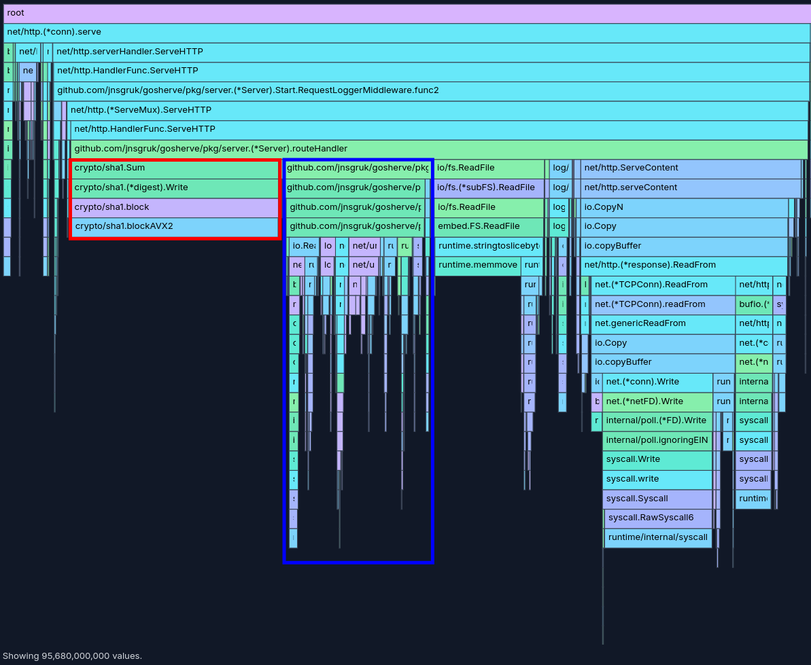
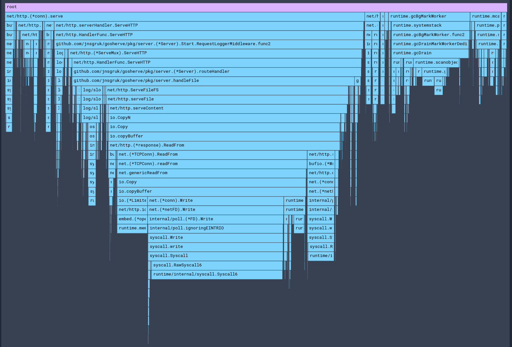
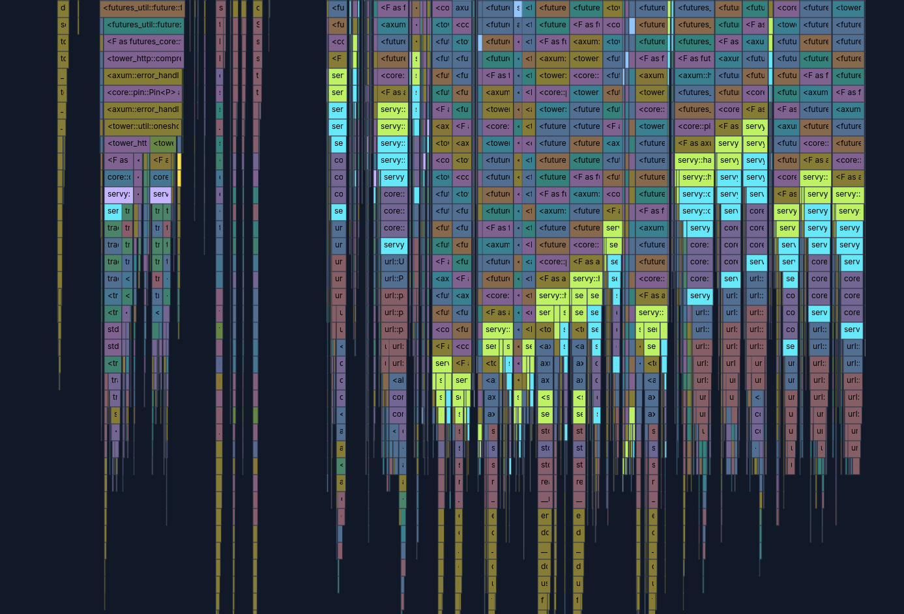

## Introduction

Over the past couple of weeks, I've been teaching myself [Rust](https://www.rust-lang.org/). I don't have a pressing need to write much Rust right now, but I'm intrigued by the promises of memory safety, and have been increasingly impressed at the quality of some of the software that the community produces. I also think that the concepts popularised by Rust, such as the [borrow checker](https://doc.rust-lang.org/1.8.0/book/references-and-borrowing.html), will stick around in computing for many years to come and I'd like to have more hands-on experience with that.

The Rust language also encourages the ideas of safety and soundness - sound code is (approximately) code that can't cause memory corruption or exhibit undefined behaviour. You can read more in this excellent post [Safety and Soundness in Rust](https://jacko.io/safety_and_soundness.html).

This blog post started out life as a post about Rust and my experience learning it, but I got interested in the performance of the server implementation I came up with and the post evolved into a post more about profiling and load testing!

## Learning Rust

It's been a little while since I dug into a new programming language, so I thought I'd mention how I went about it. In general I'm someone who learns best "by doing". I normally try to read through some of the basic concepts, then jump to a project that will enable me to exercise them quite quickly. Fortunately, Rust has an _excellent_ official guide in the form of the [Rust Book](https://doc.rust-lang.org/book/), which covers everything from the obligatory `Hello, World!`, to concurrency, memory safety, publishing packages on [crates.io](https://crates.io) and more. I thoroughly recommend it.

I've also picked up a copy of [Rust for Rustaceans](https://rust-for-rustaceans.com/) which was recommended by a couple of different colleagues - I intend to work through this next.

So, after working through the Rust Book over the course of about a week in my spare time, I needed a project!

## Rewriting `gosherve` in Rust

In my [first post](https://jnsgr.uk/2024/01/building-a-blog-with-go-nix-hugo/#serving-the-blog) on this blog I talked about a small Go project I wrote several years ago named [`gosherve`](https://github.com/jnsgruk/gosherve). This was one of my first Go projects - a simple web server that can serve some static assets, and a set of short-links/redirects which are specified in a Github Gist. It's been happily running my website for several years, and it felt like a small, but ambitious enough project for my first adventure into Rust - particuarly as over the years `gosherve` has grown Prometheus [metrics](https://github.com/jnsgruk/gosherve/blob/4ea0fdb6ca3bc18b2557c06b8c11460b2f7f76ea/pkg/server/metrics.go) and the ability to serve assets from [an embedded filesystem](https://github.com/jnsgruk/jnsgr.uk/blob/3240a0104c01ae672a6f5f7b0529ad08bcbc8af2/main.go#L24).

As I anticipated, naming the new project was the hardest part. I landed on **servy**, at least for now. I'm reasonably happy with [the code](https://github.com/jnsgruk/servy) - at the time of writing:

- It can serve redirects
- It can serve embedded web assets
- It provides a metrics server on a separate port
- It has reasonable unit/integration test coverage

One of the things I love about Go is the built-in ability to embed static assets into a binary through the `//go:embed` directive, which gives you a pointer to an embedded filesystem. I was able to achieve a similar effect in Rust with [`axum-embed`](https://docs.rs/axum-embed/latest/axum_embed/), which in turn builds upon [`rust-embed`](https://docs.rs/crate/rust-embed/latest).

I used Nix to create different variants of the build (i.e. a ["vanilla"](https://github.com/jnsgruk/servy/blob/71a337317defc779c6c55d486e20d104c5d478f2/nix/servy.nix) build, and one that serves my website by creating a [derivation](https://github.com/jnsgruk/servy/blob/71a337317defc779c6c55d486e20d104c5d478f2/nix/jnsgruk-content.nix) just for the web content, and another for the [`jnsgruk` binary](https://github.com/jnsgruk/servy/blob/71a337317defc779c6c55d486e20d104c5d478f2/nix/jnsgruk.nix)).

You can run a copy of this website (frozen in time just before I wrote this post!) by running `nix run github:jnsgruk/servy#jnsgruk`, or build a container for it by running `nix build github:jnsgruk/servy#jnsgruk-container`.

I was expecting the Rust binary to be quite a lot smaller. I'm not sure why. The old (Go) binary weighs in at **68MB**, where the new Rust binary comes in at **67MB**.

So I was right! I guess?! The result here is relatively uninteresting - a good chunk of both binaries is just the static assets (images!) that make up this site. At the time of writing the [`jnsgruk-content`](https://github.com/jnsgruk/servy/blob/71a337317defc779c6c55d486e20d104c5d478f2/nix/jnsgruk-content.nix) derivation evaluates at around 57MB - meaning there is 10MB and 9MB respectively for Go and Rust added by the _actual server code_.

## Basic Load Testing with `k6`

I've been looking for an excuse to play with [k6](https://k6.io/) for a while. According to the [documentation](https://grafana.com/docs/k6/latest/):

> Grafana k6 is an open-source, developer-friendly, and extensible load testing tool. k6 allows you to prevent performance issues and proactively improve reliability.

In very simple terms, to use `k6` you define a script (in Javascript) that outlines a set of requests to make, their success criteria and (optionally) the strategy for ramping up load on the server. It has _many_ more features than I used for this project, but I was impressed with how simple it was to get started. I began by running the following (grabbing `k6` from `nixpkgs`):

```shell
# Start a shell with k6 available
❯ nix shell github:NixOS/nixpkgs/nixos-unstable#k6
# Init a new k6 script
❯ k6 new
Initialized a new k6 test script in script.js. You can now execute it by running `k6 run script.js`.
```

Now I just needed to work out what I wanted to test! I wanted a relatively simple test that requested a mix of web assets and redirects for a sustained period, to see how much throughput I could achieve with each of the server implementations. The template came with some sensible setup for the number of VUs (virtual users) and duration of the test:

```js
import { check } from "k6"
import http from "k6/http"

export const options = {
  // A number specifying the number of VUs to run concurrently.
  vus: 10,
  // A string specifying the total duration of the test run.
  duration: "30s",
}
// ...
```

VUs are an emulation of a user interacting with your service; each of them is an agent which will execute the test script. Each time the script is executed (by a VU), that's known as an "iteration".

I wanted to test a variety of requests, so I first generated a list of valid URLs for my server. I used [`cariddi`](https://github.com/edoardottt/cariddi) which is a web crawler written in Go, combined with `jq` to create a list of valid paths in a JSON file:

```shell
# Start a shell with k6 available
❯ nix shell github:NixOS/nixpkgs/nixos-unstable#cariddi
# Run cariddi and generate the paths.json
❯ echo http://localhost:8080 \
  | cariddi -- -plain \
  | cut -d"/" -f4- \
  | jq -r -nR '[inputs | select(length>0)]' > paths.json
```

Similarly I generated a list of valid redirects:

```shell
❯ curl -s "https://gist.githubusercontent.com/jnsgruk/b590f114af1b041eeeab3e7f6e9851b7/raw" \
    | cut -d" " -f1 \
    | jq -r -nR '[inputs | select(length>0)]' > redirects.json
```

Now in my `k6` script, I was able to read those files to create a list of URLs to [batch](https://grafana.com/docs/k6/latest/javascript-api/k6-http/batch/) `GET` during the load test:

```js
// Allow the host to be overridden by the 'K6_HOST' env var.
const host = __ENV.K6_HOST || "http://localhost:8080"
// Read the list of paths/redirects.
const assets = JSON.parse(open(`./paths.json`))
const redirects = JSON.parse(open(`./redirects.json`))

export default function () {
  // Batch requests to redirects and static assets.
  const responses = http.batch(
    [...assets, ...redirects].map((p) => {
      return ["GET", `${host}/${p}`, null, { redirects: 0 }]
    })
  )

  // For each response, ensure we get a 200/301/308/404
  // response - we shouldn't see anything else.
  responses.forEach((r) => {
    check(r, {
      status: (res) => {
        return [200, 301, 308, 404].includes(res.status)
      },
    })
  })
}
```

I'm using a pretty naive [check](https://grafana.com/docs/k6/latest/using-k6/checks/) function here, though they can be expanded to check for other conditions in the response body, the size of the response, etc.

You can see my final test script [on Github](https://github.com/jnsgruk/server-bench/blob/6db6c179649f44bb2f0fcc6a2441d8fc38b24f03/scripts/script.js).

Finally, I ran `k6` and let it rip! This initial run was against `servy`, running on my workstation:

```shell
❯ k6 run script.js

         /\      Grafana   /‾‾/
    /\  /  \     |\  __   /  /
   /  \/    \    | |/ /  /   ‾‾\
  /          \   |   (  |  (‾)  |
 / __________ \  |_|\_\  \_____/

     execution: local
        script: script.js
        output: -

     scenarios: (100.00%) 1 scenario, 10 max VUs, 1m0s max duration (incl. graceful stop):
              * default: 10 looping VUs for 30s (gracefulStop: 30s)

INFO[0030] [k6-reporter v2.3.0] Generating HTML summary report  source=console

    ✓ status

    checks.........................: 100.00% ✓ 1331889      ✗ 0
    data_received..................: 148 GB  4.9 GB/s
    data_sent......................: 163 MB  5.4 MB/s
    http_req_blocked...............: avg=2.41µs   min=390ns   med=1.72µs   max=17.3ms   p(90)=3.6µs    p(95)=4.91µs
    http_req_connecting............: avg=4ns      min=0s      med=0s       max=462.21µs p(90)=0s       p(95)=0s
    http_req_duration..............: avg=501.25µs min=42.08µs med=139.77µs max=45.41ms  p(90)=291.59µs p(95)=419.65µs
      { expected_response:true }...: avg=501.25µs min=42.08µs med=139.77µs max=45.41ms  p(90)=291.59µs p(95)=419.65µs
    http_req_failed................: 0.00%   ✓ 0            ✗ 1331889
    http_req_receiving.............: avg=379.39µs min=4.13µs  med=29.07µs  max=45.23ms  p(90)=108.31µs p(95)=177.05µs
    http_req_sending...............: avg=4.45µs   min=960ns   med=3.48µs   max=3.36ms   p(90)=6.83µs   p(95)=8.79µs
    http_req_tls_handshaking.......: avg=0s       min=0s      med=0s       max=0s       p(90)=0s       p(95)=0s
    http_req_waiting...............: avg=117.4µs  min=33.65µs med=98.19µs  max=23.03ms  p(90)=176.34µs p(95)=225.09µs
    http_reqs......................: 1331889 44333.219428/s
    iteration_duration.............: avg=38.08ms  min=4.92ms  med=45.46ms  max=80.35ms  p(90)=47.68ms  p(95)=48.53ms
    iterations.....................: 7881    262.326742/s
    vus............................: 10      min=10         max=10
    vus_max........................: 10      min=10         max=10


running (0m30.0s), 00/10 VUs, 7881 complete and 0 interrupted iterations
default ✓ [======================================] 10 VUs  30s
```

Nice! Between the 10 VUs we configured, `k6` managed nearly 8000 iterations, and my new server responded with a total of 148GB of data!

## Nix-ified Load Testing

Now I'd figured out the basics of `k6`, I wanted to create some infrastructure that would allow me to run load tests in _consistent environments_ against both old and new implementations of my server.

A couple of ideas came to mind here - the first of which was the NixOS [integration test driver](https://nixcademy.com/posts/nixos-integration-tests/). I absolutely love this feature of Nix, and the scripts for interacting with the driver are nice and simple to maintain. One slight irritation in this case is that the test machines don't have access to the internet - which is where the redirects map is fetched from in my precompiled server binaries. It's certainly possible to get clever with a fake redirects server and some DNS shennanigans in the test machines, but I opted instead to build simple `nixosConfiguration`s which could be started as VMs, similar to the approach taken in a [previous post](https://jnsgr.uk/2024/02/nixos-vms-in-github-actions/).

I wanted to automate:

- The creation of a VM with both the Go and Rust versions of my server
- The generation of the `paths.json` and `redirects.json` files I created above
- Running the `k6` load test
- Fetching the results from the load test

### Defining Test VMs

I created a new repository with a `flake.nix` which took `nixpkgs`, my `jnsgr.uk` repo and my `servy` repo as inputs, pinned to the latest revisions at the time of writing:

```nix
{
  description = "web server benchmarking flake";

  inputs = {
    nixpkgs.url = "github:nixos/nixpkgs/nixpkgs-unstable";
    jnsgruk-go.url = "github:jnsgruk/jnsgr.uk/3240a0104c01ae672a6f5f7b0529ad08bcbc8af2";
    jnsgruk-rust.url = "github:jnsgruk/servy/71a337317defc779c6c55d486e20d104c5d478f2";
  };

  # ...
}
```

Next up I needed a virtual machine definition, which I first defined as a `nixosConfiguration` in the flake's outputs:

```nix
{
  # ... inputs ...
  outputs = { self, nixpkgs, jnsgruk-go, jnsgruk-rust, ... }:
    let
      forAllSystems = nixpkgs.lib.genAttrs [ "x86_64-linux" "aarch64-linux" ];
    in
    {
      # A minimal NixOS virtual machine which used for testing craft applications.
      nixosConfigurations = forAllSystems (system: {
        benchvm = nixpkgs.lib.nixosSystem {
          specialArgs = {
            inherit self system;
            jnsgruk-go = jnsgruk-go.packages.${system}.jnsgruk;
            jnsgruk-rust = jnsgruk-rust.packages.${system}.jnsgruk;
          };
          modules = [ ./vm.nix ];
        };
      });
    };
}
```

The actual machine configuration lives in [vm.nix](https://github.com/jnsgruk/server-bench/blob/6db6c179649f44bb2f0fcc6a2441d8fc38b24f03/vm.nix). This is a standard NixOS configuration, with the addition of some elements that define the specs of the virtual machine used to boot it (cores, memory, disk, etc.). In this case the machine is configured with just a `root` user, and the password `password`. This is not an ideal setup from a security standpoint, but these VMs were only run on my workstation (behind NAT) for a short period of time and the plain text password eased the automation I'm about to describe. A more robust approach would have been to put my SSH public keys into the authorized keys definition for the user, but then you folks wouldn't have been able to play along as easily!

In this particular configuration, the VM is set up like so:

```nix
virtualisation = {
  forwardPorts = [{
      from = "host";
      host.port = 2222;
      guest.port = 22;
  }];
  cores = 4;
  memorySize = 4096;
  diskSize = 10000;
};
```

With that in place, we can now boot the VM (in the background):

```shell
❯ nix run .#nixosConfigurations.benchvm.config.system.build.vm -- --daemonize --display none
❯ ssh -p 2222 root@localhost
The authenticity of host '[localhost]:2222 ([127.0.0.1]:2222)' can't be established.
ED25519 key fingerprint is SHA256:icnH3EQAzmjdfCkyPWFljQWaVSCaXdP2M+ekKXd0NlY.
This key is not known by any other names.
Are you sure you want to continue connecting (yes/no/[fingerprint])? yes
Warning: Permanently added '[localhost]:2222' (ED25519) to the list of known hosts.
(root@localhost) Password:

[root@benchvm:~]#
```

### Wrapping `k6`

Now on to automating the test itself. When configuring the VM, I made sure to include a `systemd` [unit](https://github.com/jnsgruk/server-bench/blob/6db6c179649f44bb2f0fcc6a2441d8fc38b24f03/vm.nix#L34-L56) for each of the server implementations, so next I wanted to write a simple script that would execute the load test for each implementation and fetch the results.

Before that, I modified the `k6` script to not only output a report to `stdout`, but also to a text file, a JSON file and a rendered HTML file (I didn't know at the time which I'd prefer, and I wanted to survey the options!). I achieved this by defining the [`handleSummary`](https://grafana.com/docs/k6/latest/results-output/end-of-test/custom-summary/#about-handlesummary) function [in the `k6` script](https://github.com/jnsgruk/server-bench/blob/6db6c179649f44bb2f0fcc6a2441d8fc38b24f03/scripts/script.js#L31-L38):

```javascript
export function handleSummary(data) {
  return {
    "summary.json": JSON.stringify(data),
    "summary.html": htmlReport(data),
    "summary.txt": textSummary(data, { enableColors: false, indent: "" }),
    stdout: "\n" + textSummary(data, { enableColors: true, indent: "" }) + "\n\n",
  }
}
```

First I scripted the generation of the paths and the execution of the test script, and packaged the combination up as a Nix package for installation into the test machine. This is just a `bash` [script](https://github.com/jnsgruk/server-bench/blob/6db6c179649f44bb2f0fcc6a2441d8fc38b24f03/scripts/k6test) which ensures only the specified implementation is running (with `systemd`), generates the list of URLs to test and then runs `k6` against the server. That script is packaged as a [Nix package](https://github.com/jnsgruk/server-bench/blob/6db6c179649f44bb2f0fcc6a2441d8fc38b24f03/flake.nix#L70-L94) called `k6test` which contains both my `bash` script and the `k6` test script; the Nix package is then [added to the VM configuration](https://github.com/jnsgruk/server-bench/blob/6db6c179649f44bb2f0fcc6a2441d8fc38b24f03/vm.nix#L58).

### Automating Test Execution

I borrowed the [`vm-exec`](https://github.com/jnsgruk/crafts-flake/blob/51025f3c4ea463644935dae8434f82a606a56742/test/vm-exec) script from a past project, renaming it [`benchvm-exec`](https://github.com/jnsgruk/server-bench/blob/6db6c179649f44bb2f0fcc6a2441d8fc38b24f03/scripts/benchvm-exec), and created a new script called [`benchvm-test`](https://github.com/jnsgruk/server-bench/blob/6db6c179649f44bb2f0fcc6a2441d8fc38b24f03/scripts/benchvm-test):

```bash
#!/usr/bin/env bash
set -euo pipefail
info() { echo -e "\e[92m[$HOSTNAME] $*\e[0m"; }

# Set some SSH options to ignore host key errors and make logging quieter.
# This is a bad idea in general, but here is used to faciliate comms with
# a brand new VM each time.
SSH_OPTS=(-P 2222 -o "UserKnownHostsFile=/dev/null" -o "StrictHostKeyChecking=no")

info "Running k6test against $1"
benchvm-exec k6test "$1"

info "Collecting results files"
sshpass -ppassword scp "${SSH_OPTS[@]}" root@localhost:summary.json "summary-${1}.json"
sshpass -ppassword scp "${SSH_OPTS[@]}" root@localhost:summary.html "summary-${1}.html"
sshpass -ppassword scp "${SSH_OPTS[@]}" root@localhost:summary.txt "summary-${1}.txt"

info "Results available in summary-${1}.txt, summary-${1}.json and summary-${1}.html"
```

This was the final piece of the puzzle for now; after building [and packaging](https://github.com/jnsgruk/server-bench/blob/6db6c179649f44bb2f0fcc6a2441d8fc38b24f03/flake.nix#L60-L67) this script and [defining the test VM as a package](https://github.com/jnsgruk/server-bench/blob/6db6c179649f44bb2f0fcc6a2441d8fc38b24f03/flake.nix#L50) in the flake, I'd enabled the following workflow:

```shell
# Start the devShell for the server-bench project
❯ nix develop github:jnsgruk/server-bench
# Build & run the VM
❯ run-benchvm-vm --daemonize --display none
# Start, and load test the gosherve based server
❯ benchvm-test jnsgruk-go
# Start, and load test the Rust based server
❯ benchvm-test jnsgruk-rust
# All done, power down the VM
❯ benchvm-exec poweroff
```

Excellent! Now on to some actual testing!

## Initial Load Test Results

Having seen the results for `servy` earlier, I started up the existing `gosherve` based server and ran the same test, only to discover quite a delta in the results. Where `servy` managed 4.9 GB/s throughout the test, `gosherve` only achieved 697 MB/s (sending 21GB in total). The full results are in the details box below, but overall it managed much lower performance across the board on the measurements that `k6` makes.

<details>
<summary>Initial <code>gosherve</code> load-test results</summary>
<pre>
checks.........................: 100.00% ✓ 189449      ✗ 0
data_received..................: 21 GB   697 MB/s
data_sent......................: 26 MB   848 kB/s
http_req_blocked...............: avg=2.02µs   min=400ns    med=1.42µs   max=19.76ms  p(90)=2.29µs   p(95)=2.77µs
http_req_connecting............: avg=203ns    min=0s       med=0s       max=19.52ms  p(90)=0s       p(95)=0s
http_req_duration..............: avg=9.3ms    min=29.49µs  med=9.36ms   max=152.39ms p(90)=13.16ms  p(95)=14.76ms
  { expected_response:true }...: avg=9.3ms    min=29.49µs  med=9.36ms   max=152.39ms p(90)=13.16ms  p(95)=14.76ms
http_req_failed................: 0.00%   ✓ 0           ✗ 189449
http_req_receiving.............: avg=106.56µs min=4.88µs   med=48.7µs   max=6.01ms   p(90)=215.06µs p(95)=381.38µs
http_req_sending...............: avg=4.81µs   min=950ns    med=3.97µs   max=19.71ms  p(90)=5.93µs   p(95)=6.98µs
http_req_tls_handshaking.......: avg=0s       min=0s       med=0s       max=0s       p(90)=0s       p(95)=0s
http_req_waiting...............: avg=9.19ms   min=22.85µs  med=9.26ms   max=152.2ms  p(90)=12.96ms  p(95)=14.51ms
http_reqs......................: 189449  6281.256789/s
iteration_duration.............: avg=268.14ms min=176.88ms med=250.61ms max=433.23ms p(90)=334.14ms p(95)=342.1ms
iterations.....................: 1121    37.1672/s
vus............................: 10      min=10        max=10
vus_max........................: 10      min=10        max=10
</pre>
</details>

I was quite surprised by this: my expectation was that the Go HTTP server would outperform what I'd put together in Rust. I decided to look a little deeper and see if I could figure out why, or at least why the delta was so big.

## Profiling `gosherve` with Parca

For last couple of years, I've been playing with [Parca](https://parca.dev), which is a continuous profiling tool written in Go by the folks at Polar Signals. I wrote about it back in 2022 [on Charmhub](https://discourse.charmhub.io/t/continuous-profiling-for-juju-parca-on-machines-and-kubernetes/6815), demonstrating how Parca could be used for profiling applications deployed with Juju.

### Instrumenting `gosherve`

There are two components to the open source Parca offering - the server backend, and a zero-instrumentation, eBPF-based [agent](https://github.com/parca-dev/parca-agent) which can be used for on-CPU profiling of any workload. Because `gosherve` is Go based, I didn't need the agent so long as I enabled the `pprof` endpoint in my server, which is trivial for almost any Go application. I took [`main.go`](https://github.com/jnsgruk/jnsgr.uk/blob/3240a0104c01ae672a6f5f7b0529ad08bcbc8af2/main.go) and applied the following changes to ensure that I could hit the `pprof` endpoints on port `6060`:

```diff
diff --git a/main.go b/main.go
index 964ceb2..374c440 100644
--- a/main.go
+++ b/main.go
@@ -10,6 +10,9 @@ import (
        "log/slog"
        "os"

+       "net/http"
+       _ "net/http/pprof"
+
        "github.com/jnsgruk/gosherve/pkg/logging"
        "github.com/jnsgruk/gosherve/pkg/server"
 )
@@ -29,6 +32,11 @@ func main() {
        flag.Parse()
        logging.SetupLogger(*logLevel)

+       go func() {
+               http.ListenAndServe(":6060", nil)
+               slog.Info("pprof server started on port 6060")
+       }()
+
        // Create an fs.FS from the embedded filesystem
        fsys, err := fs.Sub(publicFS, "public")
        if err != nil {
```

Next I fired up Parca (having [first packaged it](https://github.com/NixOS/nixpkgs/pull/359635) for NixOS 😉) and [configured it](https://github.com/jnsgruk/server-bench/blob/6db6c179649f44bb2f0fcc6a2441d8fc38b24f03/parca/parca.yaml#L11) to scrape the new `jnsgruk` binary while I ran the same test against it, which resulted in the following profile (which you can [explore yourself on pprof.me](https://pprof.me/20cdda5097bf379ffd282679e29ee32b)):

[](01.png)

Looking at this, we can see that around a third of the time was spent in garbage collection. This seemed high; it was more prominent on this run than others but it was persistently a high portion of the CPU time. Something to loop back to! However, inside the route handler itself there are two things that stood out to me:

[](02.png)

### Initial optimisations

In the red box, you can see about a third of the time spent in the route handler was in creating SHA1 sums, which is happening [here](https://github.com/jnsgruk/gosherve/blob/4ea0fdb6ca3bc18b2557c06b8c11460b2f7f76ea/pkg/server/route_handler.go#L70) to calculate the [ETag](https://developer.mozilla.org/en-US/docs/Web/HTTP/Headers/ETag) for content before serving it. This could probably be optimised - either by changing how the ETag is calculated (i.e. not hashing the whole file contents), or by caching ETags in memory, particularly given that in the case of my website, `gosherve` only serves assets which are embedded (read only) in the binary, so the ETag will never change for a given file for a particular compiled binary.

In the blue box, we can see that another third of the time spent is on refreshing the redirects. This seemed strange; the redirects don't change throughout the life of the test, and we're only requesting known redirects from our `redirects.json` file. This seemed much more likely to be a culprit in the poor load test results, because unlike calculating a SHA1 sum (which is almost entirely CPU-bound), this function is making an outbound (TLS) connection to Github and potentially blocking on IO before parsing the response, rechecking the redirects map for a match, etc.

As I looked at the code, I noticed an obvious (and somewhat embarrassing!) mistake I'd made when implementing `gosherve`. Because the server tries to parse redirects _before_ looking for files with a matching path, every request for a file causes the redirects map to be updated from its upstream source 🤦. Looking back at the new `servy` implementation, I hadn't made the same mistake - perhaps this was the reason the Rust version was _so much faster_?

I made a [small change](https://github.com/jnsgruk/gosherve/commit/4ea0fdb6ca3bc18b2557c06b8c11460b2f7f76ea) to `gosherve` and re-ran the test, which resulted in [this profile](https://pprof.me/e216e90fb0176ffbf11e7fac23b99682) and quite a substantial bump in request performance!

```shell
checks.........................: 100.00% ✓ 913783       ✗ 0
data_received..................: 101 GB  3.4 GB/s
data_sent......................: 123 MB  4.1 MB/s
http_req_blocked...............: avg=3.21µs   min=390ns   med=2.12µs   max=14.12ms p(90)=4.19µs   p(95)=5.7µs
http_req_connecting............: avg=70ns     min=0s      med=0s       max=14.09ms p(90)=0s       p(95)=0s
http_req_duration..............: avg=1.8ms    min=42.12µs med=899.13µs max=31.31ms p(90)=4.86ms   p(95)=6.45ms
  { expected_response:true }...: avg=1.8ms    min=42.12µs med=899.13µs max=31.31ms p(90)=4.86ms   p(95)=6.45ms
http_req_failed................: 0.00%   ✓ 0            ✗ 913783
http_req_receiving.............: avg=261.88µs min=4.85µs  med=63.59µs  max=17.8ms  p(90)=620.15µs p(95)=1.31ms
http_req_sending...............: avg=8.21µs   min=1.05µs  med=5.21µs   max=8.73ms  p(90)=9.87µs   p(95)=13.07µs
http_req_tls_handshaking.......: avg=0s       min=0s      med=0s       max=0s      p(90)=0s       p(95)=0s
http_req_waiting...............: avg=1.53ms   min=30.81µs med=656.71µs max=30.76ms p(90)=4.38ms   p(95)=5.91ms
http_reqs......................: 913783  30435.133157/s
iteration_duration.............: avg=55.5ms   min=28.86ms med=55.18ms  max=77.07ms p(90)=61.02ms  p(95)=62.98ms
iterations.....................: 5407    180.089545/s
vus............................: 10      min=10         max=10
vus_max........................: 10      min=10         max=10
```

The overall throughput increased by five times, with a decrease in latency across the board. Still around a third less overall throughput than the Rust server, but a huge improvement nonetheless.

I subsequently experimented with (naively) removing the ETag calculation to see whether or not it was worth implementing some caching - but it actually resulted in very little difference in throughput and CPU utilisation. Besides, while the calculation takes some CPU time, in a real-life deployment it reduces the overall load on the server by ensuring that `http.ServeContent` only sends actual content when there is a new version, relying more heavily on the user's browser cache. My `k6` tests (deliberately) weren't sending the right headers (such as [`If-None-Match`](https://developer.mozilla.org/en-US/docs/Web/HTTP/Headers/If-None-Match)) to benefit from the behaviour one might expect from a browser, and it was just requesting the same files over and over again with the equivalent of a cold/empty cache.

### Reducing Allocations

Now back to all those allocations, and the time spent in garbage collection as a result... `gosherve` was spending about a third of it's time in the `io.ReadFile` function, and given the amount of time spent in garbage collection, any optimisation made to the number of allocations on the heap would likely yield another big performance increase.

The problem lied in the [`routeHandler`](https://github.com/jnsgruk/gosherve/blob/4ea0fdb6ca3bc18b2557c06b8c11460b2f7f76ea/pkg/server/route_handler.go#L63-L67), where I was reading the entire contents of each file that was being served into memory. `fs.ReadFile` makes an allocation the size of the file it's reading, meaning the contents of the file end up on the heap. In a situation like our load test - this means the entire contents of my website ended up on the heap, and the Go runtime was busily garbage collecting to clean up.

I looked around at alternative ways to implement the same functionality in a more efficient manner. In Go 1.22, [`http.ServeFileFS`](https://pkg.go.dev/net/http@master#ServeFileFS) was introduced as a counterpart to [`http.ServeFile`](https://pkg.go.dev/net/http@master#ServeFile). `http.ServeFileFS` operates on an `fs.FS` rather than the host filesystem. Under the hood, rather than reading the whole file into memory `ServeFileFS` is using `io.Copy` and thus [`io.copyBuffer`](https://cs.opensource.google/go/go/+/refs/tags/go1.23.3:src/io/io.go;l=407) which allocates a single buffer that fits on the stack - fewer allocations means less memory usage, and less time spent occupying cores with garbage collection!

The change to `gosherve` was pretty [simple](https://github.com/jnsgruk/gosherve/commit/c5647476a8c6bcdf703ef685809ad06007774b6f) - you can see a slightly shortened diff below:

```diff
diff --git a/pkg/server/route_handler.go b/pkg/server/route_handler.go
index 2417e45..e0c9d68 100644
--- a/pkg/server/route_handler.go
+++ b/pkg/server/route_handler.go
@@ -1,7 +1,6 @@
  // snip!

-	// Try reading the file and return early if that fails
-	b, err := fs.ReadFile(*s.webroot, filepath)
-	if err != nil {
-		return false
-	}
-
 	w.Header().Set("Cache-Control", "public, max-age=31536000, must-revalidate")
-	w.Header().Set("ETag", fmt.Sprintf(`"%d-%x"`, len(b), sha1.Sum(b)))
+	w.Header().Set("ETag", fmt.Sprintf(`"%s-%d-%x"`, fi.Name(), fi.Size(), sha1.Sum([]byte(fi.ModTime().String()))))

-	http.ServeContent(w, r, filepath, time.Now(), bytes.NewReader(b))
+	http.ServeFileFS(w, r, *s.webroot, filepath)
 	s.metrics.responseStatus.WithLabelValues(strconv.Itoa(http.StatusOK)).Inc()
 	l.Info("served file", slog.Group("response", "status_code", http.StatusOK, "file", filepath))


```

This change also necessitated a change to ETag calculation, which now only hashes the filename, size and modified time. There is a slight oddity in that files from an embedded filesystem have their timestamps all fixed (to avoid changes in static files messing with build reproducibility), but since the files cannot change during a binary's lifetime, the ETag calculated from the modified timestamp is still just as valid.

I quickly made a new build of `jnsgruk` using a [locally referenced](https://go.dev/ref/mod#go-mod-file-replace) copy of `gosherve` and ran `k6`/`parca` to check the outcome. You can explore the profile yourself [on pprof.me](https://pprof.me/d28a5d25a34c4ed742cf397e72b43ed3):

[](04.png)

Here you can clearly see that the runtime is spending _much_ less time in garbage collection, and the call to `io.Copy`/`io.copyBuffer` without the calls to `fs.ReadFile`. It's now also much harder to spot the ETag generation - likely because we're now only hashing a small string, rather than the whole file contents.

The `k6` results came back as follows 🚀:

```shell
checks.........................: 100.00% ✓ 1525300      ✗ 0
data_received..................: 170 GB  5.7 GB/s
data_sent......................: 207 MB  6.9 MB/s
http_req_blocked...............: avg=4µs      min=410ns   med=2.36µs   max=18.47ms p(90)=5.02µs   p(95)=6.77µs
http_req_connecting............: avg=40ns     min=0s      med=0s       max=17.98ms p(90)=0s       p(95)=0s
http_req_duration..............: avg=999.6µs  min=42.17µs med=645.03µs max=24.22ms p(90)=2.34ms   p(95)=3.09ms
  { expected_response:true }...: avg=999.6µs  min=42.17µs med=645.03µs max=24.22ms p(90)=2.34ms   p(95)=3.09ms
http_req_failed................: 0.00%   ✓ 0            ✗ 1525300
http_req_receiving.............: avg=245.43µs min=4.64µs  med=75.29µs  max=23.48ms p(90)=626.08µs p(95)=1.18ms
http_req_sending...............: avg=9.69µs   min=1µs     med=5.49µs   max=19.54ms p(90)=10.86µs  p(95)=14.46µs
http_req_tls_handshaking.......: avg=0s       min=0s      med=0s       max=0s      p(90)=0s       p(95)=0s
http_req_waiting...............: avg=744.47µs min=28.09µs med=395.81µs max=20.62ms p(90)=1.89ms   p(95)=2.58ms
http_reqs......................: 1525300 50823.211595/s
iteration_duration.............: avg=34.41ms  min=11.91ms med=34.44ms  max=67.75ms p(90)=37.6ms   p(95)=38.61ms
iterations.....................: 8716    290.418352/s
vus............................: 10      min=10         max=10
vus_max........................: 10      min=10         max=10
```

The Go server is now in the lead! There isn't a huge margin here between the Rust server and the Go server, but this is about the sort of difference I was expecting based on the reading I'd done before doing the testing.

## Profiling `servy`?

I _did_ profile `servy` using `parca-agent`, but I've yet to look at the results in detail. The profile is a lot more complex (see below), partially as a result of how much work is going on under the hood when standing up an `axum` server with `hyper`, `tower` and `tokio`. I'm going to spend some more time with this profile over the coming weeks, but you can explore it for yourself [on pprof.me](https://pprof.me/e6e8ad8c98d4c1406363312a9cec09b1/?color_by=filename).

[](05.png)

If you do play with the profile on `pprof.me`, try filtering by function name and entering `servy`, and you'll see the parts of the code I wrote highlighted on the profile to explore:

[](06.png)

By the time you read this, the [`parca-agent` should be upstream](https://github.com/NixOS/nixpkgs/pull/360132) into `nixpkgs`, but in the mean time you can pull the package I included in the `server-bench` repo and use that:

```shell
# Start the devShell for the server-bench project
❯ nix develop github:jnsgruk/server-bench
# Start the agent
❯ sudo parca-agent -- \
  --remote-store-address="grpc.polarsignals.com:443" \
  --remote-store-bearer-token="$TOKEN" \
  --node="$HOSTNAME"

# Or, on Ubuntu (see polarsignals.com/docs/setup-collection-snaps)
❯ sudo snap install --classic parca-agent
```

In my Nix example above, I'm sending profiles to [Polar Signals Cloud](https://www.polarsignals.com/), but you can also set the `remote-store-address` to the address of a locally running `parca` instance no problem.

Depending on the language you're profiling, you'll either need to include debug info in the binary you're profiling (which is what I did), or upload your source/debug info manually. There are more instructions for that [in the docs](https://www.polarsignals.com/docs/rust).

## Final Results & Comparisons

I wanted to gather some test results from all three targets across a number of different machine configurations; my website runs on a teeny-tiny [Fly.io](https://fly.io) instance with 1 vCPU and 256MB RAM, so I was interested to see how performance changed on machines with varying configurations. I've included a summary in the table below which highlights just the `data_received` measurement from each test, and you can see the full reports from `k6` by expanding the details box:

<details>
<summary>Expand for full `k6` reports</summary>
<details>
<summary>1 vCPU/256MB RAM/1 VUs - <code>gosherve</code> (old)</summary>
<pre>
checks.........................: 100.00% ✓ 23322      ✗ 0
data_received..................: 2.6 GB  86 MB/s
data_sent......................: 3.1 MB  105 kB/s
http_req_blocked...............: avg=2.41µs   min=400ns    med=1.28µs   max=1.04ms   p(90)=1.87µs   p(95)=2.27µs
http_req_connecting............: avg=50ns     min=0s       med=0s       max=508.13µs p(90)=0s       p(95)=0s
http_req_duration..............: avg=7.57ms   min=49.54µs  med=7.71ms   max=143.13ms p(90)=9.42ms   p(95)=10.65ms
  { expected_response:true }...: avg=7.57ms   min=49.54µs  med=7.71ms   max=143.13ms p(90)=9.42ms   p(95)=10.65ms
http_req_failed................: 0.00%   ✓ 0          ✗ 23322
http_req_receiving.............: avg=98.03µs  min=4.46µs   med=57.25µs  max=7.69ms   p(90)=177.19µs p(95)=250.6µs
http_req_sending...............: avg=5.7µs    min=970ns    med=3.1µs    max=480.07µs p(90)=4.79µs   p(95)=9.26µs
http_req_tls_handshaking.......: avg=0s       min=0s       med=0s       max=0s       p(90)=0s       p(95)=0s
http_req_waiting...............: avg=7.47ms   min=37.26µs  med=7.62ms   max=142.9ms  p(90)=9.24ms   p(95)=10.33ms
http_reqs......................: 23322   776.881114/s
iteration_duration.............: avg=217.52ms min=187.06ms med=198.66ms max=359.52ms p(90)=276.89ms p(95)=280.19ms
iterations.....................: 138     4.59693/s
vus............................: 1       min=1        max=1
vus_max........................: 1       min=1        max=1
</pre>
</details>

<details>
<summary>1 vCPU/256MB RAM/1 VUs - <code>gosherve</code></summary>
<pre>
checks.........................: 100.00% ✓ 158691      ✗ 0
data_received..................: 18 GB   587 MB/s
data_sent......................: 21 MB   714 kB/s
http_req_blocked...............: avg=1.89µs   min=379ns   med=1.08µs   max=1.15ms   p(90)=1.62µs   p(95)=1.98µs
http_req_connecting............: avg=11ns     min=0s      med=0s       max=655.05µs p(90)=0s       p(95)=0s
http_req_duration..............: avg=1.04ms   min=48.25µs med=537.57µs max=31.33ms  p(90)=2.63ms   p(95)=3.66ms
  { expected_response:true }...: avg=1.04ms   min=48.25µs med=537.57µs max=31.33ms  p(90)=2.63ms   p(95)=3.66ms
http_req_failed................: 0.00%   ✓ 0           ✗ 158691
http_req_receiving.............: avg=91.12µs  min=3.66µs  med=20.8µs   max=23.05ms  p(90)=156.29µs p(95)=287.17µs
http_req_sending...............: avg=6.47µs   min=900ns   med=2.57µs   max=2.22ms   p(90)=4.06µs   p(95)=6.21µs
http_req_tls_handshaking.......: avg=0s       min=0s      med=0s       max=0s       p(90)=0s       p(95)=0s
http_req_waiting...............: avg=949.02µs min=35.88µs med=466.14µs max=31.3ms   p(90)=2.46ms   p(95)=3.47ms
http_reqs......................: 158691  5287.057691/s
iteration_duration.............: avg=31.95ms  min=21.16ms med=30.39ms  max=107.46ms p(90)=36.19ms  p(95)=41.18ms
iterations.....................: 939     31.284365/s
vus............................: 1       min=1         max=1
vus_max........................: 1       min=1         max=1
</pre>
</details>

<details>
<summary>1 vCPU/256MB RAM/1 VUs - <code>servy</code></summary>
<pre>
checks.........................: 100.00% ✓ 148213      ✗ 0
data_received..................: 16 GB   547 MB/s
data_sent......................: 18 MB   605 kB/s
http_req_blocked...............: avg=1.5µs    min=350ns   med=971ns    max=1.11ms   p(90)=1.48µs  p(95)=1.82µs
http_req_connecting............: avg=11ns     min=0s      med=0s       max=451.97µs p(90)=0s      p(95)=0s
http_req_duration..............: avg=928.79µs min=69.84µs med=671.38µs max=55.59ms  p(90)=1.57ms  p(95)=2.18ms
  { expected_response:true }...: avg=928.79µs min=69.84µs med=671.38µs max=55.59ms  p(90)=1.57ms  p(95)=2.18ms
http_req_failed................: 0.00%   ✓ 0           ✗ 148213
http_req_receiving.............: avg=136.98µs min=3.76µs  med=17.14µs  max=46.31ms  p(90)=103.7µs p(95)=192.52µs
http_req_sending...............: avg=5.33µs   min=890ns   med=2.35µs   max=2.99ms   p(90)=3.69µs  p(95)=5.05µs
http_req_tls_handshaking.......: avg=0s       min=0s      med=0s       max=0s       p(90)=0s      p(95)=0s
http_req_waiting...............: avg=786.47µs min=55.89µs med=629.47µs max=17.92ms  p(90)=1.43ms  p(95)=1.96ms
http_reqs......................: 148213  4940.080272/s
iteration_duration.............: avg=34.19ms  min=16.57ms med=25.68ms  max=109.45ms p(90)=55.08ms p(95)=57.83ms
iterations.....................: 877     29.231244/s
vus............................: 1       min=1         max=1
vus_max........................: 1       min=1         max=1
</pre>
</details>

<details>
<summary>2 vCPU/4GB RAM/10 VUs - <code>gosherve</code> (old)</summary>
<pre>
checks.........................: 100.00% ✓ 116272      ✗ 0
data_received..................: 13 GB   426 MB/s
data_sent......................: 16 MB   518 kB/s
http_req_blocked...............: avg=2.25µs   min=380ns    med=1.06µs   max=4.3ms    p(90)=1.69µs   p(95)=2.05µs
http_req_connecting............: avg=475ns    min=0s       med=0s       max=4.27ms   p(90)=0s       p(95)=0s
http_req_duration..............: avg=15.37ms  min=29.8µs   med=14.28ms  max=145.82ms p(90)=24.79ms  p(95)=29.78ms
  { expected_response:true }...: avg=15.37ms  min=29.8µs   med=14.28ms  max=145.82ms p(90)=24.79ms  p(95)=29.78ms
http_req_failed................: 0.00%   ✓ 0           ✗ 116272
http_req_receiving.............: avg=174.41µs min=4.15µs   med=28.84µs  max=21.95ms  p(90)=241.72µs p(95)=703.97µs
http_req_sending...............: avg=7.22µs   min=890ns    med=2.98µs   max=5.58ms   p(90)=5.8µs    p(95)=9.15µs
http_req_tls_handshaking.......: avg=0s       min=0s       med=0s       max=0s       p(90)=0s       p(95)=0s
http_req_waiting...............: avg=15.19ms  min=22.98µs  med=14.11ms  max=144.5ms  p(90)=24.48ms  p(95)=29.37ms
http_reqs......................: 116272  3837.442876/s
iteration_duration.............: avg=439.41ms min=323.27ms med=430.04ms max=567.74ms p(90)=505.87ms p(95)=516.96ms
iterations.....................: 688     22.706763/s
vus............................: 10      min=10        max=10
vus_max........................: 10      min=10        max=10
</pre>
</details>

<details>
<summary>2 vCPU/4GB RAM/10 VUs - <code>gosherve</code></summary>
<pre>
checks.........................: 100.00% ✓ 362167       ✗ 0
data_received..................: 40 GB   1.3 GB/s
data_sent......................: 49 MB   1.6 MB/s
http_req_blocked...............: avg=2.23µs   min=360ns   med=770ns    max=12.31ms  p(90)=1.34µs   p(95)=1.66µs
http_req_connecting............: avg=117ns    min=0s      med=0s       max=1.84ms   p(90)=0s       p(95)=0s
http_req_duration..............: avg=4.7ms    min=32.38µs med=3.94ms   max=47.81ms  p(90)=9.04ms   p(95)=11.63ms
  { expected_response:true }...: avg=4.7ms    min=32.38µs med=3.94ms   max=47.81ms  p(90)=9.04ms   p(95)=11.63ms
http_req_failed................: 0.00%   ✓ 0            ✗ 362167
http_req_receiving.............: avg=196.28µs min=3.38µs  med=15.42µs  max=25.62ms  p(90)=142.41µs p(95)=896.21µs
http_req_sending...............: avg=8.44µs   min=890ns   med=2.19µs   max=18.13ms  p(90)=3.63µs   p(95)=6.34µs
http_req_tls_handshaking.......: avg=0s       min=0s      med=0s       max=0s       p(90)=0s       p(95)=0s
http_req_waiting...............: avg=4.5ms    min=25.57µs med=3.77ms   max=45.46ms  p(90)=8.74ms   p(95)=11.13ms
http_reqs......................: 362167  12040.737924/s
iteration_duration.............: avg=140.21ms min=80.54ms med=139.82ms max=221.91ms p(90)=153.25ms p(95)=157.95ms
iterations.....................: 2143    71.24697/s
vus............................: 10      min=10         max=10
vus_max........................: 10      min=10         max=10
</pre>
</details>

<details>
<summary>2 vCPU/4GB RAM/10 VUs - <code>servy</code></summary>
<pre>
checks.........................: 100.00% ✓ 464412       ✗ 0
data_received..................: 51 GB   1.7 GB/s
data_sent......................: 57 MB   1.9 MB/s
http_req_blocked...............: avg=1.99µs   min=360ns   med=720ns    max=14.38ms  p(90)=1.13µs   p(95)=1.42µs
http_req_connecting............: avg=92ns     min=0s      med=0s       max=6.71ms   p(90)=0s       p(95)=0s
http_req_duration..............: avg=3.67ms   min=44.91µs med=3.07ms   max=60.17ms  p(90)=5.9ms    p(95)=7.98ms
  { expected_response:true }...: avg=3.67ms   min=44.91µs med=3.07ms   max=60.17ms  p(90)=5.9ms    p(95)=7.98ms
http_req_failed................: 0.00%   ✓ 0            ✗ 464412
http_req_receiving.............: avg=206.58µs min=3.41µs  med=14.06µs  max=56.96ms  p(90)=56.97µs  p(95)=143.43µs
http_req_sending...............: avg=7.12µs   min=870ns   med=1.62µs   max=14.84ms  p(90)=3.01µs   p(95)=5.78µs
http_req_tls_handshaking.......: avg=0s       min=0s      med=0s       max=0s       p(90)=0s       p(95)=0s
http_req_waiting...............: avg=3.45ms   min=35.61µs med=3.01ms   max=24.64ms  p(90)=5.7ms    p(95)=7.54ms
http_reqs......................: 464412  15448.582291/s
iteration_duration.............: avg=109.3ms  min=63.59ms med=108.88ms max=161.77ms p(90)=120.71ms p(95)=124.65ms
iterations.....................: 2748    91.41173/s
vus............................: 10      min=10         max=10
vus_max........................: 10      min=10         max=10
</pre>
</details>

<details>
<summary>16 vCPU/16GB RAM/10 VUs - <code>gosherve</code> (old)</summary>
<pre>
checks.........................: 100.00% ✓ 119990      ✗ 0
data_received..................: 13 GB   439 MB/s
data_sent......................: 16 MB   534 kB/s
http_req_blocked...............: avg=2.05µs   min=440ns    med=1.55µs   max=972.62µs p(90)=2.32µs   p(95)=2.74µs
http_req_connecting............: avg=38ns     min=0s       med=0s       max=275.54µs p(90)=0s       p(95)=0s
http_req_duration..............: avg=14.82ms  min=35.49µs  med=15.16ms  max=148.26ms p(90)=21.12ms  p(95)=23.89ms
  { expected_response:true }...: avg=14.82ms  min=35.49µs  med=15.16ms  max=148.26ms p(90)=21.12ms  p(95)=23.89ms
http_req_failed................: 0.00%   ✓ 0           ✗ 119990
http_req_receiving.............: avg=104.7µs  min=5.07µs   med=43.71µs  max=8.96ms   p(90)=228.22µs p(95)=396.05µs
http_req_sending...............: avg=4.52µs   min=940ns    med=3.99µs   max=944.81µs p(90)=6.28µs   p(95)=7.86µs
http_req_tls_handshaking.......: avg=0s       min=0s       med=0s       max=0s       p(90)=0s       p(95)=0s
http_req_waiting...............: avg=14.71ms  min=23.97µs  med=15.05ms  max=148.25ms p(90)=20.95ms  p(95)=23.7ms
http_reqs......................: 119990  3957.203279/s
iteration_duration.............: avg=426.57ms min=343.33ms med=422.38ms max=526.97ms p(90)=491ms    p(95)=502.47ms
iterations.....................: 710     23.415404/s
vus............................: 10      min=10        max=10
vus_max........................: 10      min=10        max=10
</pre>
</details>

<details>
<summary>16 vCPU/16GB RAM/10 VUs - <code>gosherve</code></summary>
<pre>
checks.........................: 100.00% ✓ 1297244     ✗ 0
data_received..................: 144 GB  4.8 GB/s
data_sent......................: 175 MB  5.8 MB/s
http_req_blocked...............: avg=2.83µs   min=419ns   med=1.63µs   max=7.97ms   p(90)=2.95µs   p(95)=3.78µs
http_req_connecting............: avg=2ns      min=0s      med=0s       max=142.69µs p(90)=0s       p(95)=0s
http_req_duration..............: avg=1.22ms   min=31.96µs med=697.97µs max=36.9ms   p(90)=3.16ms   p(95)=4.07ms
  { expected_response:true }...: avg=1.22ms   min=31.96µs med=697.97µs max=36.9ms   p(90)=3.16ms   p(95)=4.07ms
http_req_failed................: 0.00%   ✓ 0           ✗ 1297244
http_req_receiving.............: avg=234.98µs min=4.21µs  med=39.77µs  max=35.6ms   p(90)=640.71µs p(95)=1.24ms
http_req_sending...............: avg=7.19µs   min=930ns   med=3.91µs   max=30.11ms  p(90)=6.84µs   p(95)=9.22µs
http_req_tls_handshaking.......: avg=0s       min=0s      med=0s       max=0s       p(90)=0s       p(95)=0s
http_req_waiting...............: avg=980.01µs min=19.74µs med=465.75µs max=16.64ms  p(90)=2.75ms   p(95)=3.68ms
http_reqs......................: 1297244 43221.02723/s
iteration_duration.............: avg=39.08ms  min=23.12ms med=38.84ms  max=76ms     p(90)=43.87ms  p(95)=45.71ms
iterations.....................: 7676    255.745723/s
vus............................: 10      min=10        max=10
vus_max........................: 10      min=10        max=10
</pre>
</details>

<details>
<summary>16 vCPU/16GB RAM/10 VUs - <code>servy</code></summary>
<pre>
checks.........................: 100.00% ✓ 1407770      ✗ 0
data_received..................: 156 GB  5.2 GB/s
data_sent......................: 172 MB  5.7 MB/s
http_req_blocked...............: avg=2.28µs   min=420ns   med=1.64µs   max=3.96ms   p(90)=3µs      p(95)=3.94µs
http_req_connecting............: avg=2ns      min=0s      med=0s       max=292.26µs p(90)=0s       p(95)=0s
http_req_duration..............: avg=512.52µs min=40.21µs med=177.39µs max=45.65ms  p(90)=444.41µs p(95)=623.84µs
  { expected_response:true }...: avg=512.52µs min=40.21µs med=177.39µs max=45.65ms  p(90)=444.41µs p(95)=623.84µs
http_req_failed................: 0.00%   ✓ 0            ✗ 1407770
http_req_receiving.............: avg=324.43µs min=4.02µs  med=26.56µs  max=45.31ms  p(90)=88.04µs  p(95)=147.94µs
http_req_sending...............: avg=4.33µs   min=969ns   med=3.35µs   max=4.11ms   p(90)=5.86µs   p(95)=7.31µs
http_req_tls_handshaking.......: avg=0s       min=0s      med=0s       max=0s       p(90)=0s       p(95)=0s
http_req_waiting...............: avg=183.74µs min=31.45µs med=132.09µs max=8.96ms   p(90)=344.35µs p(95)=465.04µs
http_reqs......................: 1407770 46854.747614/s
iteration_duration.............: avg=36.03ms  min=5.19ms  med=45.31ms  max=77.29ms  p(90)=48.06ms  p(95)=48.95ms
iterations.....................: 8330    277.247027/s
vus............................: 10      min=10         max=10
vus_max........................: 10      min=10         max=10
</pre>
</details>
</details>

|                         | `gosherve (old)` | `gosherve`  | `servy`     |
| :---------------------- | :--------------- | :---------- | :---------- |
| 1 vCPU/256MB RAM/1 VUs  | 86MB/s           | **587MB/s** | 547MB/s     |
| 2 vCPU/4GB RAM/10 VUs   | 426MB/s          | 1.3GB/s     | **1.7GB/s** |
| 16 vCPU/16GB RAM/10 VUs | 439MB/s          | 4.8GB/s     | **5.2GB/s** |

Interestingly, it seems that the `servy` variant actually outperformed `gosherve` again in these VM-based tests, where it didn't when run directly on my machine. In any case, the gap is now _much_ smaller between the two, and `gosherve` still seems to maintain an edge on very small machines.

Note I had to drop the VUs to `1` on the smallest iteration, or I was seeing all three of the variants getting OOM-killed!

I also added a [new flake input](https://github.com/jnsgruk/server-bench/blob/6db6c179649f44bb2f0fcc6a2441d8fc38b24f03/flake.nix#L6) in the `server-bench` repo that adds the `gosherve` based repo again, but pinned to the pre-optimised version.

As such, if you want to try reproducing any of these results and measure old vs. new vs. `servy`, you just need to do the following:

```shell
# Start the devShell for the server-bench project
❯ nix develop github:jnsgruk/server-bench
# Build & run the VM
❯ run-benchvm-vm --daemonize --display none
# Edit the core/memory count as required
❯ vim vm.nix
# Start, and load test a server, choosing your variety
❯ benchvm-test <jnsgruk-go-old|jnsgruk-go|jnsgruk-rust>
# Power down the VM
❯ benchvm-exec poweroff
```

The results will be gathered in a collection of `summary-*.<txt|html|json>` files for you to inspect.

## Summary

This was supposed to be a blog about learning Rust, but I'm pleased with where it ended up! This was by no means a particularly in-depth dive into measuring the performance of web servers, focusing almost entirely on the request throughput. There are other factors that could be taken into consideration - such as the resulting memory pressure on the machine, CPU usage, etc. I may come back to this in another post with more comprehensive measurement of both.

Hopefully this post illustrated the power of load testing and profiling tools - even when only used at quite a surface level, and demonstrated how Nix can be used to create robust structures around existing tools to help with such workflows.

I owe a thank you to [Frederic](https://github.com/brancz) from Polar Signals, who gave me a bunch of helpful tips along the way while I was using Parca and profiling `gosherve`. After my initial improvement in the request handler, Frederic helped me track down and remove the use of `fs.ReadFile` and further improve the performance of `gosherve`.

I'm still very early in my Rust development, so if you've spotted something horrible in `servy`, or you've got experience with `k6` and `parca`, then reach out and let me know! I'd love to see the creative ways people use these tools.

The performance gap between `servy` and `gosherve` is now quite narrow. Close enough, in fact, that they seem to win over one another depending on different conditions in the test environment, and never by a particularly high margin. I haven't migrated this site over yet, but perhaps I will in the near future. Besides, Fly.io are [already kindly limiting the damage](https://github.com/jnsgruk/jnsgr.uk/blob/3240a0104c01ae672a6f5f7b0529ad08bcbc8af2/fly.toml#L27-L30) that can be done by too many requests for me!

See you next time!
