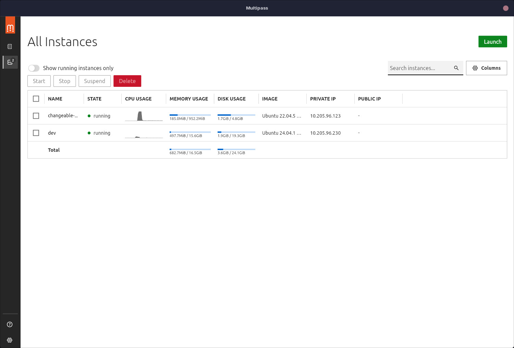
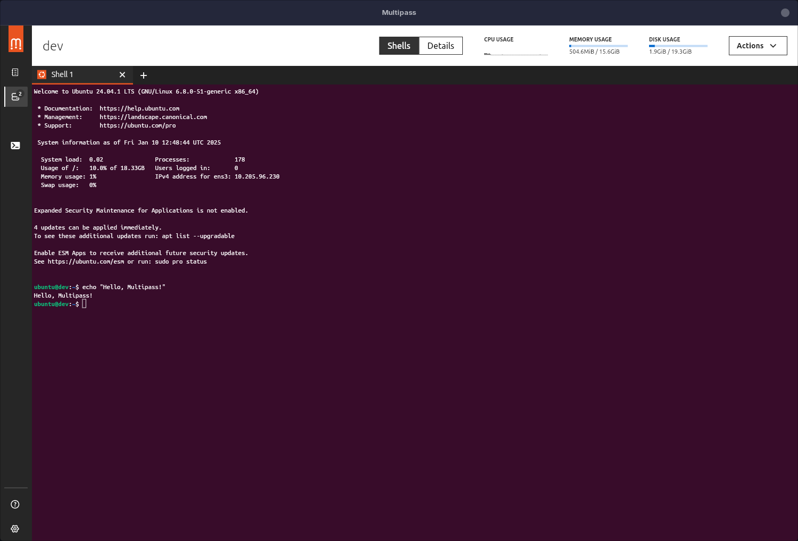

## Introduction

The very first application I ever packaged in [nixpkgs](https://github.com/NixOS/nixpkgs) was [Multipass](https://multipass.run). Multipass is, according to the website:

> a CLI to launch and manage VMs on Windows, Mac and Linux that simulates a cloud environment with support for cloud-init.

I wrote in [some detail](https://jnsgr.uk/2024/06/desktop-vms-lxd-multipass/) about how I use Multipass and LXD on my workstation to create and manage VMs for testing and development. Last year Multipass shipped a new GUI written from the ground up in Flutter. It provides a clean, modern way to launch, manage and interact with VMs. When the GUI first shipped, I briefly attempted to get it to build with Nix, but some combination of my lack of knowledge, and the maturity of the Flutter tooling in `nixpkgs` at the time meant I never finished it.

As version [`1.15.0`](https://github.com/canonical/multipass/releases/tag/v1.15.0) was in its release candidate stage, I decided to have another go!

This post will break down the process into steps, but if you'd like the tl;dr, take a look at the [pull request](https://github.com/NixOS/nixpkgs/pull/363626).

[](02.png)

## Housekeeping

Before getting started on packaging the GUI, I did some housekeeping on the Multipass package. First order of business was to simply [bump the version](https://github.com/NixOS/nixpkgs/pull/363626/commits/ee43b0f9fd7d15f5869ffbe0c014e4d1983d3058) to `1.15.0` and ensure the package still built, which it did.

Last year, [RFC 140](https://github.com/NixOS/rfcs/pull/140) was introduced to simplify the directory structure of `nixpkgs`, introducing a new `pkgs/by-name` directory which will (eventually) render [`pkgs/top-level/all-packages.nix`](https://github.com/NixOS/nixpkgs/blob/master/pkgs/top-level/all-packages.nix) useless. This new structure will make finding package definitions much easier, as they'll all be arranged alphabetically by the first two characters of their name. Using the Multipass example, rather than `pkgs/tools/virtualization/multipass/default.nix`, the new preferred path would be `pkgs/by-name/mu/multipass/package.nix`. There was a [talk](https://media.ccc.de/v/nixcon-2023-35713-not-all-packages-anymore-nix) at NixCon 2023 which summarised this nicely if you'd like more information.

As I was going to be carrying out some hefty work on Multipass by introducing the GUI, I took the opportunity to move to the new scheme as part of the changes.

## Restructuring

The Multipass package carries a few patches, and is already reasonably involved, so I decided that the best route forward was to create separate files for `multipassd`/`multipass` (the server & command line client binaries, written in C++, and already packaged) and `multipass.gui` (the new Flutter application). Thus the new structure for the package looks like so:

```bash
.
# Derivation files
├── gui.nix
├── multipassd.nix
├── package.nix
# Lock file for Fluter app
├── pubspec.lock.json
# Update script for daemon/cli & GUI
├── update.sh
# Patches
├── cmake_no_fetch.patch
├── cmake_warning.patch
├── lxd_socket_path.patch
├── test_unreachable_call.patch
└── vcpkg_no_install.patch
```

## Using `symlinkJoin`

This package now takes a more unusual shape. Because the GUI is essentially a entirely separate application, written with a different toolkit in a different language, but I wanted the two to be installed as part of the overall `multipass` package, I decided to use two completely separate derivations and use [`symlinkJoin`](https://nixos.org/manual/nixpkgs/stable/#trivial-builder-symlinkJoin) to bundle the two together. According to the manual, `symlinkJoin`:

> can be used to put many derivations into the same directory structure. It works by creating a new derivation and adding symlinks to each of the paths listed. It expects two arguments, name, and paths. name (or alternatively pname and version) is the name used in the Nix store path for the created derivation. paths is a list of paths that will be symlinked. These paths can be to Nix store derivations or any other subdirectory contained within.

This is particularly useful for the Multipass package, because the Multipass GUI dynamically-links against libraries that are built as part of the `multipassd` derivation, and linking the two derivations in this way ensures that all those files are located correctly at runtime without any extra plumbing.
This allowed me to keep the top-level [`package.nix`](https://github.com/NixOS/nixpkgs/blob/113da45159c3ba1bedc9663e27d3174435db76bf/pkgs/by-name/mu/multipass/package.nix) relatively simple (annotated below):

```nix
{
# ... snip ...
}:
let
  name = "multipass";
  version = "1.15.0";

  # Fetch the source just once, to be used in both the multipassd and GUI derivations
  multipass_src = fetchFromGitHub {
    owner = "canonical";
    repo = "multipass";
    rev = "refs/tags/v${version}";
    hash = "sha256-RoOCh1winDs7BZwyduZziHj6EMe3sGMYonkA757UrIU=";
    fetchSubmodules = true;
  };

  # Shared metadata between derivations.
  commonMeta = {
    homepage = "https://multipass.run";
    license = lib.licenses.gpl3Plus;
    maintainers = with lib.maintainers; [ jnsgruk ];
    platforms = [ "x86_64-linux" ];
  };

  # Build the multipass server & client binaries from the shared source
  # and common metadata.
  multipassd = callPackage ./multipassd.nix {
    inherit commonMeta multipass_src version;
  };

  # Build the multipass GUI using shared source and common metadata.
  multipass-gui = callPackage ./gui.nix {
    inherit commonMeta multipass_src multipassd version;
  };
in
# Create the top-level `multipass` package using `symlinkJoin`
symlinkJoin {
  inherit version;
  pname = name;

  # Join both of the newly created derivations
  paths = [ multipassd multipass-gui ];

  # Ensure tests are run, and define a (new) update script.
  passthru = {
    tests = lib.optionalAttrs stdenv.hostPlatform.isLinux {
      inherit (nixosTests) multipass;
    };
    updateScript = ./update.sh;
  };

  meta = commonMeta // {
    description = "Ubuntu VMs on demand for any workstation";
  };
}
```

### Building the GUI

Normally the server, client and GUI binaries are all built as part of a single invocation of `cmake`. We can't do that here, so the [early code](https://github.com/NixOS/nixpkgs/blob/859919e56a721a3a158242baa891e101673ce8ed/pkgs/by-name/mu/multipass/multipassd.nix#L110-L111) I put into the `multipass` package when I failed to package the GUI before still stood - essentially stopping `cmake` from trying to build the Flutter GUI:

```nix
{
  # We'll build the flutter application separately using buildFlutterApplication
  cmakeFlags = [ "-DMULTIPASS_ENABLE_FLUTTER_GUI=false" ];
}
```

Next, I created [`gui.nix`](https://github.com/NixOS/nixpkgs/blob/859919e56a721a3a158242baa891e101673ce8ed/pkgs/by-name/mu/multipass/gui.nix) which uses the [`pkgs.buildFlutterApplication`](https://nixos.org/manual/nixpkgs/stable/#ssec-dart-flutter) helper. The derivation is annotated below:

```nix
{
  # Passed in from the package.nix shown above
  commonMeta,
  multipass_src,
  multipassd,
  version,
  # ... snip ...
}:
flutter327.buildFlutterApplication {
  inherit version;
  pname = "multipass-gui";
  src = multipass_src;

  # Ensure we build in the correct directory for the GUI code.
  sourceRoot = "${multipass_src.name}/src/client/gui";

  # To make the builds as deterministic as possible, nixpkgs reads the pubspec.lock
  # file for the Flutter application and downloads/caches the correct versions of
  # flutter packages to be used in the build. It does this with `pub2nix`.
  #
  # Here I use a JSON representation of the pubspec.lock file committed into nixpkgs.
  pubspecLock = lib.importJSON ./pubspec.lock.json;

  # Some of the Flutter dependencies used are pulled from Github (branches) directly, so this
  # ensures that the versions/commits are pinned for future builds.
  gitHashes = {
    dartssh2 = "sha256-2pypKwurziwGLZYuGaxlS2lzN3UvJp3bRTvvYYxEqRI=";
    hotkey_manager_linux = "sha256-aO0h94YZvgV/ggVupNw8GjyZsnXrq3qTHRDtuhNv3oI=";
    system_info2 = "sha256-fly7E2vG+bQ/+QGzXk+DYba73RZccltdW2LpZGDKX60=";
    tray_menu = "sha256-riiAiBEms+9ARog8i+MR1fto1Yqx+gwbBWyNbNq6VTM=";
    window_size = "sha256-71PqQzf+qY23hTJvcm0Oye8tng3Asr42E2vfF1nBmVA=";
    xterm = "sha256-h8vIonTPUVnNqZPk/A4ZV7EYCMyM0rrErL9ZOMe4ZBE=";
  };

  # ... snip ...

  # The Multipass GUI relies on protobuf for API communication; ensure the
  # Dart protobuf definitions are compiled before we build.
  preBuild = ''
    mkdir -p lib/generated

    # Generate the Dart gRPC code for the Multipass GUI.
    protoc \
      --plugin=protoc-gen-dart=${lib.getExe protoc-gen-dart} \
      --dart_out=grpc:lib/generated \
      -I ../../rpc \
      ../../rpc/multipass.proto \
      google/protobuf/timestamp.proto
  '';

  # Libraries built by multipassd are linked dynamically at runtime; multipassd must
  # be installed for the GUI to function.
  runtimeDependencies = [ multipassd ];

  # Housekeeping to ensure the icons/desktop files are correctly installed.
  postFixup = ''
    mv $out/bin/multipass_gui $out/bin/multipass.gui

    install -Dm444 $out/app/multipass-gui/data/flutter_assets/assets/icon.png \
      $out/share/icons/hicolor/256x256/apps/multipass.gui.png

    cp $out/share/applications/multipass.gui.autostart.desktop \
      $out/share/applications/multipass.gui.desktop
  '';

  # ... snip ..
}
```

## Update Script

That was enough to ensure that the GUI worked correctly. My concern now lied with the maintenance of the package. The process for updating the derivation now involved:

- Bumping the version string
- Updating the source hashes
- Updating the `pubspec.lock.json` file
- Updating the `gitHashes` of the Flutter dependencies

This seemed a little convoluted and error prone to handle manually each time, so I decided to implement an update script for the package to take care of future version bumps. Thankfully `nixpkgs` has good provision for this, allowing package maintainers to specify `passthru.updateScript` to a derivation, which I did [here](https://github.com/NixOS/nixpkgs/blob/c0b4b9614390535f61f103fff1e48255a588fa4b/pkgs/by-name/mu/multipass/package.nix#L55).

I won't post the [full update script](https://github.com/NixOS/nixpkgs/blob/c0b4b9614390535f61f103fff1e48255a588fa4b/pkgs/by-name/mu/multipass/update.sh) here, as it's lots of unsightly `bash`! Essentially the script takes care of determining the latest version released on Github by using `curl`, then [updates the `pubspec.lock.json`](https://github.com/NixOS/nixpkgs/blob/c0b4b9614390535f61f103fff1e48255a588fa4b/pkgs/by-name/mu/multipass/update.sh#L11-L18) using a combination of `curl`/`yj`, then finally works through updating the source hash for the Multipass repo, gRPC fork it uses, and each of the git hashes for the Flutter dependencies.

This can be invoked from within the `nixpkgs` repo with:

```bash
nix-shell maintainers/scripts/update.nix --argstr package multipass
```

## Summary

Overall, this turned out cleaner than I expected, though it took me longer to figure out than this post might suggest. My hope is that this will a useful reference to anybody trying to package Flutter applications with Nix, and if you're a user of the `multipass` package, check out the shiny new GUI that's available to you! The GUI is available from `1.15.0` onwards, which at the time of writing means you'll need to install the package from `nixos-unstable` or similar (sadly I didn't land the change in time for NixOS 24.11).

In my opinion, the Multipass team have done a lovely job on the GUI - and for many users this will provide a much improved onboarding experience. Nice work 😎

[](03.png)
