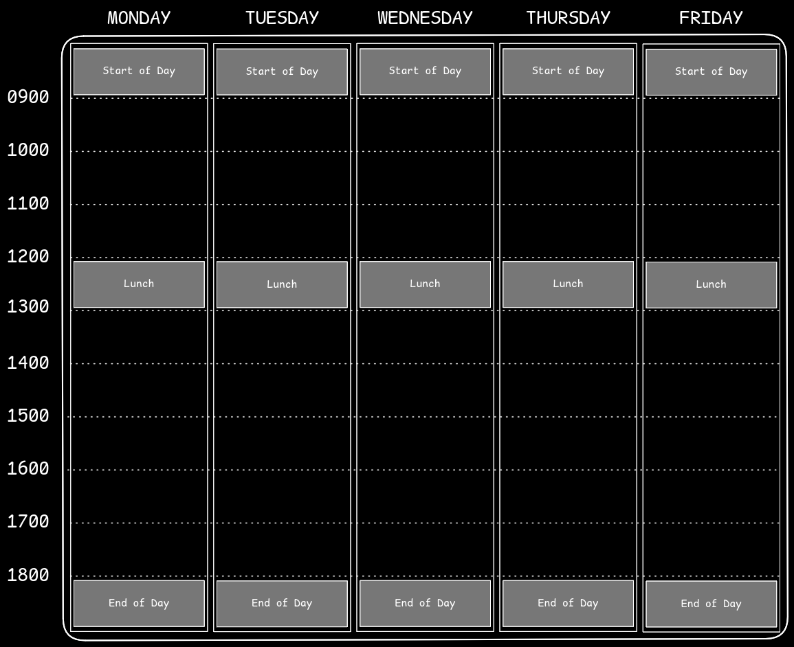
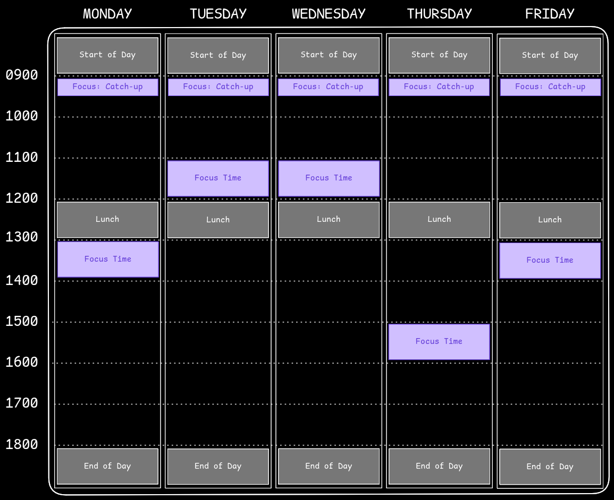
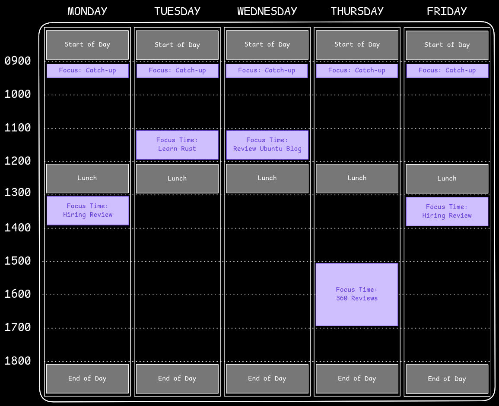
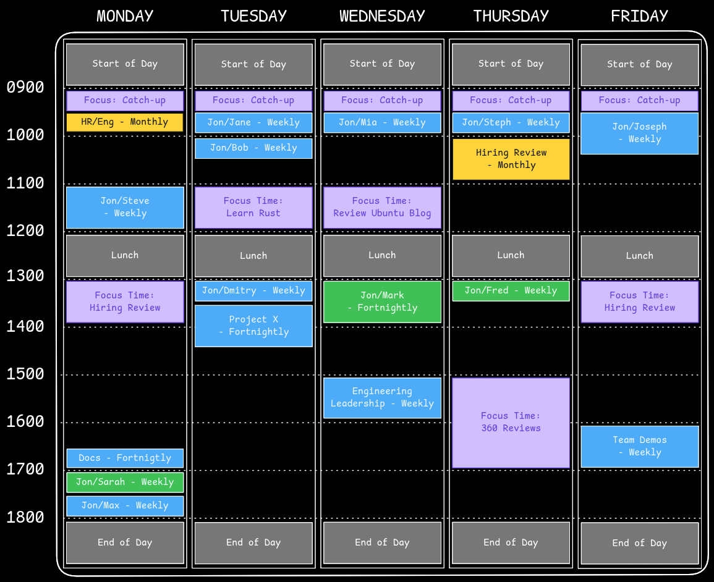
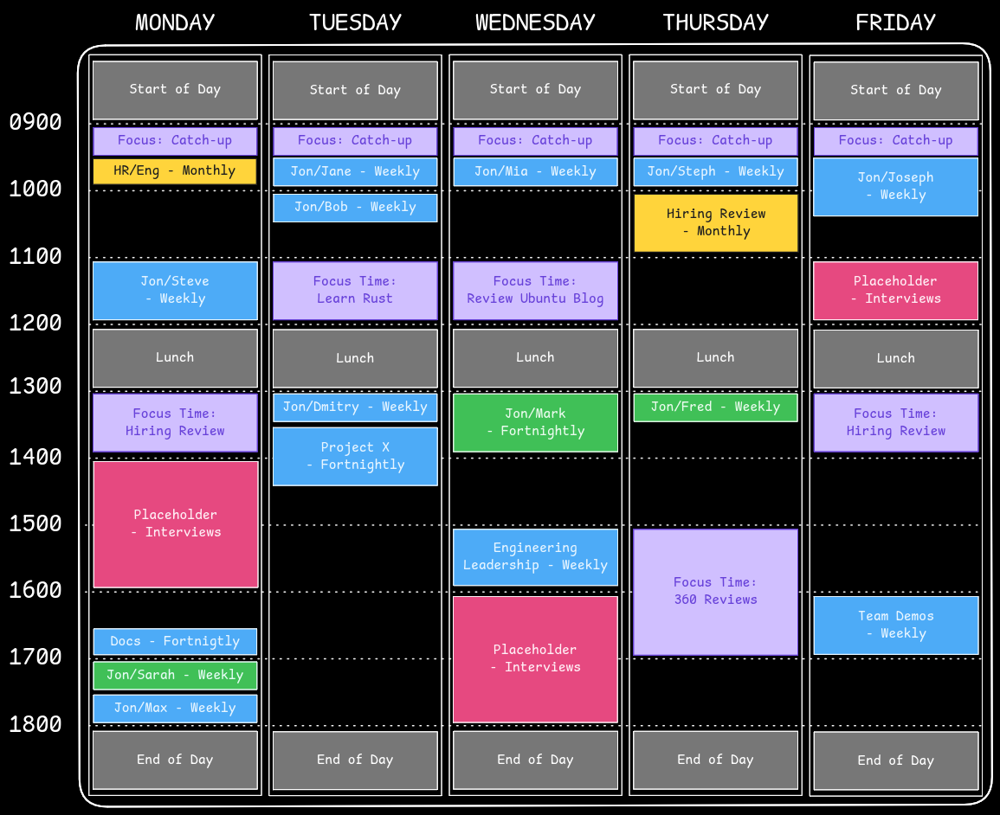

## Introduction

I've been working remotely full-time for 4 years at Canonical, with the majority of that time spent in a senior engineering leadership position. Canonical was my first fully-remote job, and a significant step up in leadership responsibility from my previous jobs. Over the past 4 years, I've made a series of realisations about calendar management - essentially how to get the very most from my time at work, while trying to prevent work spilling out into my personal life too much.

I hope this post will be relatable to anyone in a role where they use digital, bookable calendars at work - but I expect it to be most applicable to folks in Software Engineering, and particularly to those in senior+ engineer positions, or in technical management roles.

Staying on top of your calendar can help you manage your own time better, it can help you achieve more at work and set reasonable work-life boundaries, it can help your colleagues understand how you spend your time, what you're working on, and when it might be appropriate to book time with you.

## Bound Your Day

The first step in taking control of your calendar is to bound your day. In more conventional workplaces, where everyone commutes into an office, people's working patterns are frequently more predictable. With remote, globally distributed work, that all goes out of the window. Your 9-5 might be in the middle of the night for one of your colleagues - and as your company grows into more and more countries and time-zones things only get more complicated. In other situations, some of your colleagues may work part-time.

One way to help colleagues book time with you smoothly is by clearly indicating when your day starts, when it ends, and when you'll break for lunch.

Here's an indicative example of how I set up my calendar:

Some of you are raising your eyebrow over taking an _hour for lunch_ every day, but hear me out. This time is not just used for the critical act of feeding yourself, but also giving you time to catch up (undisturbed) if you need to: check your emails and reply to those Slack/Teams/Mattermost messages on your terms. Enforcing a break in the middle of the day will help you maintain focus throughout the morning: be present in meetings, work on that design specification uninterrupted, or work on your planned professional development without the anxiety that you'll fall irrecoverably behind.

Depending on your role, there may be times when people need to get hold of you _right now_, and for those cases you should let them know how to do that, and break you out of your routine. For me, the [bat phone](https://en.wikipedia.org/wiki/Bat_phone) of choice is [Signal](https://signal.org/). No matter how much I might silence my work email notifications, or use Do Not Disturb on my work chat client, Signal is about the only app that never gets silenced because it's what I use to communicate with those closest to me - so my colleagues know to use that if they need to, and that frees me up to concentrate on the day and not get too distracted by a stream of instant messages and emails.

It's also perfectly valid to use that time to eat and go for a walk or something else that gives your brain a chance to recover or process what it needs to from the morning.

## Make Space For Focus

You will likely know when you work best. For me it's in the mornings. Once I've been to the gym, had breakfast and my morning coffee, my brain is in the best state for focusing on complex work until the early afternoon.

My current role also means I get a lot of email, and a lot of instant messages. Because of the global nature of the company, these tend to keep coming overnight. As a result, I like to set aside 30 minutes every morning assigned to "Catch Up". In that time, I respond to emails and messages I've received overnight, review my schedule for the rest of the day, and set up [Obsidian](https://obsidian.md) for note-taking throughout the day (see [How I Computer in 2024](http://localhost:1313/2024/07/how-i-computer-in-2024/#productivity-apps)).

Next, ensure you set aside _at least_ one hour per day for focused work. This is one of the most common things I see colleagues neglect, particularly those who are new to leadership positions. People will often quickly become overwhelmed by meetings: suddenly invited to a swathe of group meetings, team 1:1s, daily/weekly/fortnightly/monthly rituals, leadership meetings, etc. Before long there's no slack in their day to actually _think_ about their work.

Many people find they're more effective when they have time to think, plan, and write as appropriate. An hour a day is a minimum, but at least by blocking it out your guarantee that minimum.

I try to have these occur at the same times each week where possible to make it easier for my colleagues to understand my schedule. I also label these slots with _what_ I'll focus on in that time. In my calendar these are recurring events named "Focus Time", then every Monday during my "Catch Up" slot, I figure out what's important to get done in that week, and label each slot with what I plan to work on. This is helps my colleagues understand what I'm working on, but on busy days it also helps me avoid wasting time on deciding what to work on when I become free between meetings - my calendar tells me what to work on!

Once I've conducted my Monday "Catch Up" each week, the focus blocks in my calendar look more like this:

In the above example, I've extended the Thursday slot to get something specific done. I generally avoid planning contiguous focus blocks for more than 2 or 3 hours. Much beyond that, and most people will begin to lose focus and become less effective, more frustrated and ultimately get less done. In most cases I find I'm better taking a break to do something else, then coming back to the task later.

Depending on your role and responsibilities, these slots may occupy more of less of your week. In individual contributor (IC) roles, I'd expect to see more of these in a week, but the principles still apply. Keep them to reasonable lengths, and label up how you're spending your time. As an IC Software Engineer, you might label these slots with specific Jira tickets, you might label some as "Pair Programming" and others with elements of Professional Development you're working on.

## Plan Regular Meetings

In general I try to be deliberate about the meetings I attend. In most leadership positions there are some which are an inescapable reality. These might include:

- Team 1:1s
- Leadership Syncs
- Project Reviews
- Planning Meetings
- Mentoring/Coaching

These will vary in length and cadence. Prefer scheduling your most demanding meetings at the time of day when you're at your best. For me this principle translates into scheduling most of my team 1:1s in the morning (time-zones permitting!).

If you have regular fortnightly meetings, try to ensure that there is something scheduled on the "off weeks" at the same time (could be a meeting, or a focus block). I've found this prevents accidentally scheduling regular meetings that clash on alternating weeks when you're already committed fortnightly in that time slot - a surprisingly easy mistake for you and your colleagues to make!

I find it helpful to label meetings with their cadence. This may not help day-to-day, but can help in reviewing how you spend your time (more on that later).

In my current role, I attend a business review every six weeks. For me this means that the Tuesday and Thursday afternoon in those weeks from 1400-1800 are taken up by business review activity. As a result, I make sure there are no recurring meetings in those times to avoid a scramble to re-arrange them all every six weeks. On the plus side - in the off-weeks these are great spots to use for interviews, document review and other ad-hoc meetings.

## Commitment Placeholders

You may have reoccurring tasks each week that are less predictable. This could be interviews, customer calls, or anything where you expect to perform a certain number each week, but can't always predict the exact timings in advance.

My personal approach to this is to ensure there is enough [blank space](#blank-space) in my calendar each week to absorb these events, but an alternate approach is to add placeholders in your calendar that indicate when you would prefer for those events to be scheduled. This can save time and round-trips via email/instant messenger, and reduce the number of times you're booked for something at a time that doesn't suit you.

This will take some experimentation while you understand your average weekly commitment, and when those events are most likely to occur, but might look something like this:

## Maintain Blank Space

This might be the most important point in the whole post: make sure there is blank space in your calendar _every day_ outside of your regular planned events.

This can be hard to achieve, and depending on your role may not manifest in _actually having_ blank space each day, but if your work week is already 100% booked with regular events and planned work, how will you respond to unplanned events? Unexpected customer meetings? Without any blank space in your calendar, you're destined to spend an unhealthy amount of time worrying about or rearranging your calendar, let alone struggle to get things done.

A good test of this is to look forward 2-3 weeks from now in your calendar. What does it look like? If there is no blank space in your calendar, then start reviewing regular commitments and get it back under control.

I recently re-read [It Doesn't Have To Be Crazy At Work](https://uk.bookshop.org/p/books/it-doesn-t-have-to-be-crazy-at-work-jason-fried/1364337?ean=9780008323448), having read it first some years ago. The vast majority of the material covered is extremely compelling. While there are some minor points that don't quite resonate with me, the general principle that we should stop glorifying packed schedules and competing with our colleagues to be the busiest or the most overworked is absolutely spot on.

If you're in a leadership position this is not just for your benefit, but for everyone around you too. People look to leadership for their example. Organisations and teams mimic the habits of their leaders over time, so if you're in work at 6am and heading out a 9pm every day, and your schedule is always back-to-back, there's a good chance others will copy, talk about, and expect those behaviours of others (yes, even if you tell them they don't have to, and you don't expect it of them, and...).

## Review Regularly

Even if you do all of the above, your calendar will fill up over time. You'll get invited to the next important monthly review meeting, perhaps collect an extra report or two, take responsibility for a major project, or be asked to mentor a colleague. There are countless ways in which your blank space will get eaten up.

In my experience it's important to pick a cadence on which you review all of your regular engagements for necessity, length and frequency. At Canonical we have a company roadmap sprints of some sort every 3 months, and I've found that to be a useful cadence (and reminder) to review my calendar. After each sprint, I spend one of my focus blocks staring at my calendar trying to work out which planned meetings are still useful and effective, and which I'm going to either stop attending or reduce the frequency of.

A couple of examples where I'll "trim the fat":

- Group meetings that have grown too large over time, and become less effective.
- Mentoring or coaching engagements where significant progress has been made, and perhaps the frequency can be reduced, or maybe the relationship with your mentee is good enough that you can revert to ad-hoc scheduling when they need assistance
- Placeholders that are going unused week-to-week

## Remote Work and Flexibility

One of the advantages of remote work is the flexibility it affords employees, but it's important to be respectful of that privilege. The foundations of most effective workplaces are trust and respect.

If you're fortunate enough to work remotely, then you should take advantage of that, but it's also important to stay accountable and make it predictable where you can. If you go to the gym every Wednesday at 10am, then put that in your calendar and make it clear on your calendar where that time is made up. That way, your colleagues can plan around it.

As an example, I like mountain biking and I find the Winter (in the UK) pretty miserable. I go mountain biking on a Monday afternoon from 1300-1600, but then I work on a Monday from 1900-2200. This actually works well for my role - a number of my reports are in the US or Australia, and returning to work on a Monday evening means I can do our 1:1s in their time-zone without asking them to work late/early. For me the benefit is actually seeing daylight for a decent length of time in the middle of the day, and getting time to do something I love.

For me the key to doing this respectfully is transparency and consistency in my calendar. If the weather is rubbish on a Monday and I don't feel like biking, I do something else on Monday afternoons and I still meet my US/APAC colleagues in the evening. I don't randomly move that time off to a Tuesday morning and rearrange all my meetings. This consistency makes it easy to plan around, and easy to predict, but still gives me plenty of chances to go biking.

## Tips & Tricks

Beyond the basic principles, there are some other tricks that can help you get the most from your calendar, and ensure it works for you and not the other way around!

- **Buffer Time**: Give yourself a few minutes between meetings. Whether it be to get up and stretch your legs, grab a drink or whatever. I have Google Calendar set up so that it defaults to 25 minute and 50 minute meetings, rather than 30 minutes and 60 minutes. On the days I'm disciplined enough to stick to that, it gives me a few valuable minutes between meetings to reset.
- **Colour Coding**: Colour coding items in your calendar can help you subconsciously prepare for what's coming, as well as help you see where you spend the majority of your time. In my calendar, dark blue is used for regular team meetings, yellow for interviews and HR topics, purple for focus blocks, green for meetings with external people and peach for business/commerical review calls.
- **Task Management**: When I'm asked to review a document, write something or do something which will take me more than 5 minutes, I put that task in my calendar. If Bob asks me to review a pull request and I think it'll take me 30 minutes, I create a 30 minute event in some of the blank space named "Review PR for Bob". This ensures I get the time I need, and Bob gets to see when I've planned the work.

## TODO:

- Other material: Staff Engineer book
- Be flexible
