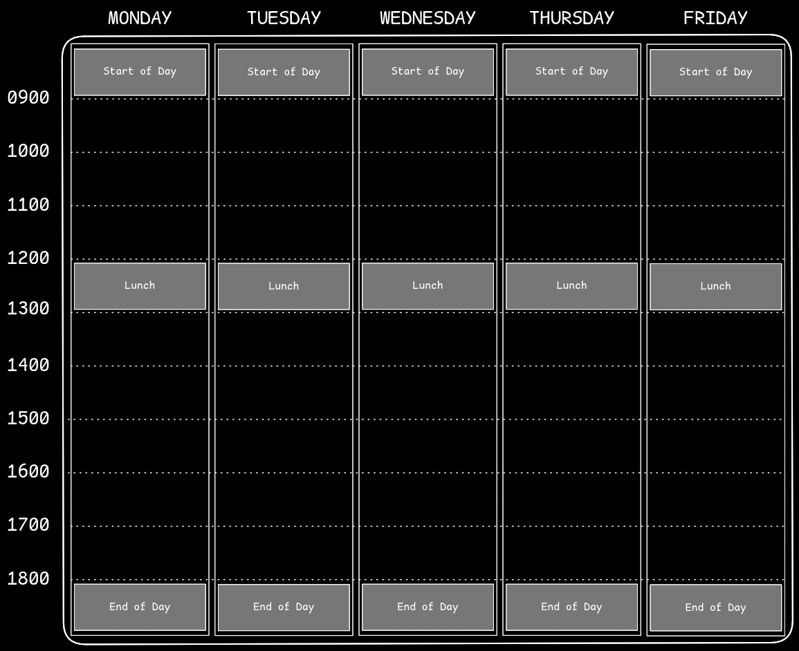
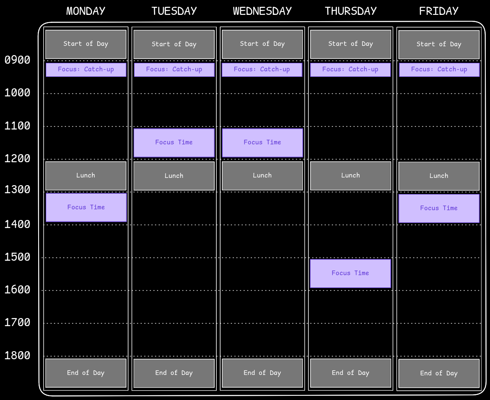
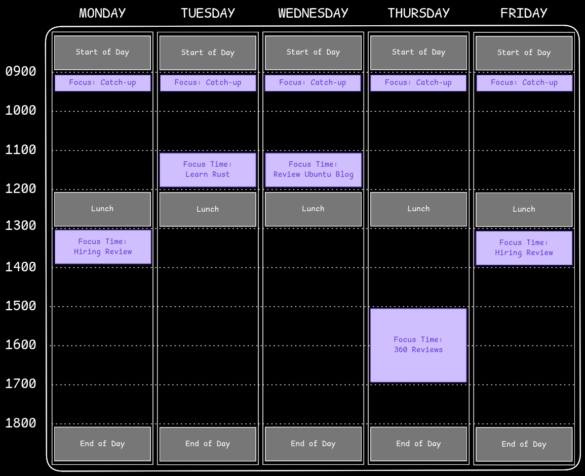
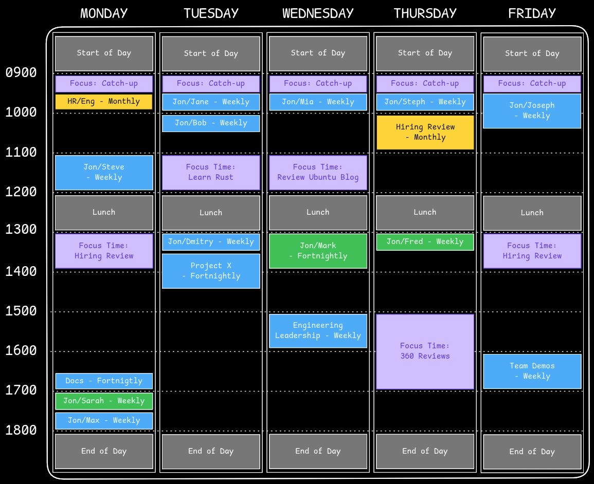
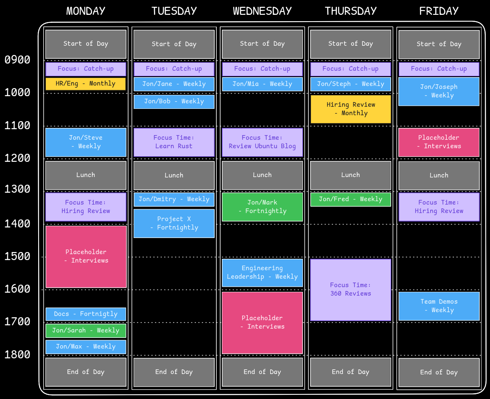

## Introduction

Over the past few years, I've come to a series of realisations about how I can get the most from my calendar, or rather how to get the most from my time at work, while preventing work from spilling out into my personal life too much.

Staying on top of my calendar has helped me manage my time better. It helps me get more done, and set reasonable work-life boundaries. Calendar management helps my colleagues understand how I spend my time, what I'm working on, and when it might be best to book my time.

## Bound Your Day

The first step toward taking control of your calendar is to bound your day. In more conventional workplaces where everyone commutes into an office, working patterns are frequently more predictable. With a remote, globally distributed workforce things are harder to predict. Your 9-5 might be in the middle of the night for others, and either you or your colleagues might have flexible working arrangements that make their work hours less obvious.

One way to help colleagues book time with you smoothly is by clearly indicating when your day starts, when it ends, and when you'll break for lunch. Your calendar tool might do a good job of this already.

Here's an indicative example of how I set up my calendar:

Some of you are raising your eyebrow over taking an _hour for lunch_ every day, but hear me out. This time is not just used for the critical act of feeding yourself, but gives you the chance to get some fresh air, rest your eyes and give your brain a chance to focus on something else for a while. How many times have you solved a complicated problem in the shower? This is the same thing.

Indicating to your colleagues through status messages that you're on a break on Slack/Mattermost/Teams/whatever can also be helpful.

There may be occasions when people need to get hold of you _right now_, and you should let them know how to do that. For me, the [bat phone](https://en.wikipedia.org/wiki/Bat_phone) of choice is [Signal](https://signal.org/). No matter how much I silence my work email notifications, or use Do Not Disturb on Mattermost, Signal is the only app that never gets silenced because it's what I use to communicate with those closest to me - so my colleagues know to use that if they need to, and that frees me up to concentrate on the day and not get too distracted by a stream of instant messages and emails.

## Make Space For Focus

There are two kinds of focus time I need in my day: one to triage emails and messages, respond to "new tasks" and another to progress "planned work".

Like many others, I get a lot of email and instant messages. Because of the global nature of my company, these tend to keep coming overnight. I like to set aside 30 minutes every morning assigned to "Catch Up". In that time, I respond to emails and messages I've received overnight, review my schedule for the rest of the day, and set up [Obsidian](https://obsidian.md) for note-taking (see [How I Computer in 2024](https://jnsgr.uk/2024/07/how-i-computer-in-2024/#productivity-apps)). As a side-effect of this, I'm always up to date by the time I start my first meeting each day.

For planned work, I set aside at least one hour per day. This is often neglected, leading to people becoming overwhelmed by meetings: group meetings, team 1:1s, daily/weekly/fortnightly/monthly rituals, leadership meetings, etc. Before long, there's no slack in their day to actually _think_ about their work.

An hour a day is a minimum, but at least by blocking it out you guarantee that minimum. Depending on your role and responsibilities, these slots may occupy more of less of your week.

These occur at the same times each week in my calendar where possible, making it easier for my colleagues to plan meetings when they need to. I label these slots with what I'll focus on in that time. In my calendar these are recurring events named "Focus Time", then every Monday during my "Catch Up" slot, I figure out what's important to get done in that week, and label each slot with what I plan to work on. You might label a slot with the Jira ticket you'll tackle, the specific Professional Development activity you're planning, the document you'll review or maybe it's a Pair Programming session with a colleague.

In my experience, this practice helps my colleagues understand what I'm working on, but on busy days it also helps me avoid wasting time deciding what to work on when I become free between meetings - my calendar tells me!

Once I've conducted my Monday "Catch Up" each week, the focus blocks in my calendar look more like this:

In the above example, I've extended the Thursday slot to get something specific done. I avoid planning contiguous focus blocks for more than 2 or 3 hours. Much beyond that, and most people will begin to lose focus, become less effective and more frustrated, ultimately getting less done. I find I'm better taking a break to do something else, then coming back to the task later with fresh eyes.

## Plan Regular Meetings

I try to be deliberate about the meetings I attend. In most roles there are meetings which are an inescapable reality. These might include:

- Team 1:1s
- Leadership Syncs
- Project Reviews
- Planning Meetings
- Mentoring/Coaching
- Demos

These will vary in length and cadence. Try to schedule your most demanding meetings at the time of day when you're at your best; for me this translates into scheduling most of my team 1:1s in the morning (timezones permitting!).

If you have regular fortnightly meetings, try to ensure that there is something scheduled on the "off weeks" at the same time. This will prevent accidentally scheduling a weekly meeting in a slot where you're already committed fortnightly - a surprisingly easy mistake.

I find it helpful to label meetings with their cadence. This may not help day-to-day, but can help in reviewing how you spend your time (more on that later).

In my current role, I attend a business review every six weeks. In these weeks, Tuesday and Thursday afternoons are consumed by business review activity. As a result, I make sure there are no recurring meetings in those times to avoid a scramble to re-arrange them all every six weeks. In weeks where I don't have Business Reviews, these are great spots to use for focus time, interviews, and other ad-hoc meetings.

## Maintain Blank Space

This might be the most important point in the whole post: ensure there is blank space in your calendar _every day_ outside of your regular planned events.

This can be hard to achieve, and may not manifest in you _actually having_ blank space by the time each day starts, but if your work week is already 100% booked with regular events and planned work, how will you respond to unplanned events? Unexpected customer meetings? Without any blank space in your calendar, you're destined to spend an unhealthy amount of time worrying about or rearranging your calendar, and struggle to get things done.

I'm able to be more present in meetings, more able to ignore notifications and distractions when I know there will be time in the day to get around to them. If there is never any space for these tasks, I'm easily distracted by staying on top of message notifications, emails, etc.

A good test of this is to look forward 2-3 weeks from now in your calendar. What does it look like? If there is no blank space in your calendar, then start reviewing regular commitments and get it back under control.

I recently re-read [It Doesn't Have To Be Crazy At Work](https://uk.bookshop.org/p/books/it-doesn-t-have-to-be-crazy-at-work-jason-fried/1364337?ean=9780008323448), having read it first some years ago. While there are some minor points that don't quite resonate with me, the general principle that we should stop glorifying packed schedules and competing with our colleagues to be the busiest or the most overworked is absolutely spot on.

If you're in a leadership position, this is not just for your benefit but for everyone around you too. People look to leadership for their example; organisations and teams mimic the habits of their leaders over time. If you're in work from 6am to 9pm every day and your schedule is constantly back-to-back, there's a good chance others will copy, glorify, and expect those behaviours of others (yes, even if you tell them they don't have to, and you don't expect it of them, and...).

## Bookable Placeholders

You may have recurring tasks each week that are less predictable. This could be interviews, customer calls, or anything where you expect to perform a certain number each week, but can't always predict the exact timings in advance.

My approach is to use blank space for this, but an alternate approach is to add placeholders in your calendar that indicate when you would prefer for those events to be scheduled. This can save time and round-trips via email/instant message, and reduce the number of times you're booked for something at a time that doesn't suit you.

Most calendaring tools will allow you to mark time like this in your calendar without it showing you as "Busy". This will take some experimentation while you understand your average weekly commitment and when those events are most likely to occur, but might look something like this:

## Review Regularly

Even if you do all of the above, your calendar will fill up over time. You'll get invited to the next important monthly review meeting, perhaps collect an extra report or two, take responsibility for a major project, or be asked to mentor a colleague. There are countless ways in which your blank space can get eaten up, and when your calendar becomes cluttered, it's likely to create a higher mental load which distracts you from the work you really need to get done.

Pick a cadence on which you review all of your regular engagements for necessity, length and frequency. At Canonical we have company roadmap sprints every 3 months, and I've found that to be a useful cadence (and reminder) to review my calendar. After each sprint, I spend one of my focus blocks staring at my calendar trying to work out which planned meetings are still useful and effective, and which I'm going to either stop attending or reduce the frequency of.

A couple of examples where I'll "trim the fat":

- Group meetings that have grown too large over time, and become less effective.
- Mentoring or coaching engagements where significant progress has been made, and the frequency can be reduced. Perhaps the relationship with the person you're mentoring is good enough that you can revert to ad-hoc scheduling when they need assistance.
- Placeholders that are going unused week-to-week.

## Remote Work and Flexibility

One of the advantages of remote work is the flexibility it affords employees, but it's important to be respectful of that privilege. The foundations of most effective workplaces are trust and respect. A structured and well-planned calendar doesn't mean reducing flexibility - in many cases a structured calendar can enable more flexibility.

If you're fortunate enough to work remotely, then you should take advantage of that, but it's also important to stay accountable and make it predictable where you can. If you go to the gym every Wednesday at 10am, then put that in your calendar and make it clear on your calendar where that time is made up. That way, your colleagues can plan around it.

I like mountain biking and I find the winter (in the UK) pretty miserable. I go mountain biking on a Monday afternoon from 1300-1600, but then I work on a Monday from 1900-2200. This actually fits in with my role - a number of my reports are in the US or Australia, and returning to work on a Monday evening means I can do our 1:1s in their timezone without asking them to work late/early.

For me the benefit is actually seeing daylight for a decent length of time in the middle of the day. If the weather is poor and I don't feel like biking, I do something else on Monday afternoons, but I still keep that commitment to my US/APAC colleagues in the evening. This consistency makes it easy to plan around, but still gives me plenty of chances to go biking.

## Tips & Tricks

There are some other tricks that can help you get the most from your calendar:

- **Buffer Time**: Give yourself a few minutes between meetings. Whether it be to get up and stretch your legs, grab a drink or whatever. I configure Google Calendar to default to 25 minute and 50 minute meetings, rather than 30 minutes and 60 minutes. On the days I'm disciplined enough to stick to that, it gives me a few valuable minutes between meetings to pee!
- **Colour Coding/Emojis**: I used to dismiss this, but have come to really appreciate it. Distinctively marking items in your calendar can help you subconsciously prepare for what's coming, as well as help you see where you spend the majority of your time. I use dark blue regular meetings, yellow "People" meetings, purple for focus blocks, green for external meetings and orange for business/commerical review calls.
- **Task Management**: When I'm asked to do something which will take me more than 5 minutes, I generally put that task in my calendar. If I'm asked to review a pull request and I think it'll take me 30 minutes, I create a 30 minute event in some of the blank space named "Review PR #113". This ensures I get the time I need, and the requester gets to see when I've planned the work.

## Summary

This post summarises a collection of lessons I've learned over time. Each of these have incrementally improved my time management at work. I feel more productive and less stressed, which means I find it easier to switch off from work in the evening and at weekend.

My final note is on flexibility. Most of this article describes principles - ideas you should _try_ to implement. In reality, collaboration and calendar management across teams and timezones is hard. In my experience applying these principles helps account for the "messier" weeks in my work schedule and helps me keep order, but nonetheless you won't always have total control and you might need to be flexible to accommodate some of your colleagues.

Until next time!

(And thanks to my wife Laura for helping me refine and edit this post!)
