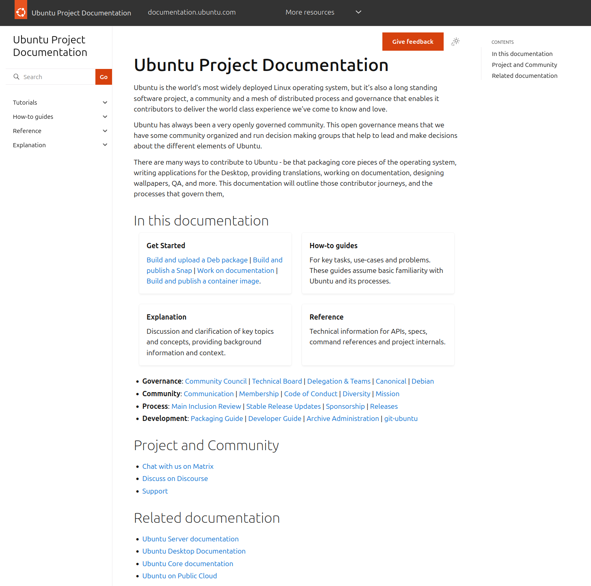

> This article was originally posted [on the Ubuntu Discourse](https://discourse.ubuntu.com/t/58694), and is reposted here. I welcome comments and further discussion in that thread.

## Introduction

Back in February I [wrote some thoughts](https://jnsgr.uk/2025/02/engineering-ubuntu-for-the-next-20-years/) on Ubuntu's documentation and its role within the community. For a mostly-online software community, documentation is one of our most critical forms of communication.

In the last two years there has been lots of focus on the technical aspects of our documentation (how-to guides, tutorials, etc.), but I'd like to focus more on what I'm calling the "Ubuntu Project Documentation" over the coming months.

Documentation isn't only about technical how-to guides and tutorials, nor is it only about troubleshooting or satisfying particular use-cases. Our documentation can set the tone for the project, give a means for the community to state an intent, and guide both current and future contributors in their daily work.

Ubuntu has a lot of documentation, most of which has grown organically over the last 20 years, but it's not always easy to find or understand. Our documentation should illuminate and inspire a path to contribution. It should provide direction and clarity on complex issues, reference on technology and past decisions, and precision in the execution of process.

Our project documentation should detail what makes Ubuntu happen. How are decisions made? What are the teams contributing to Ubuntu? How are those teams appointed? What are their responsibilities? If you're on the Main Inclusion Review (MIR) team and you're assigned a package to review, what steps should you take? How does package sponsorship work, and who should you contact if you're stuck? How are the Access Control Lists (ACLs) updated for packages and package sets, and who can make those changes? What does the journey look like from first time package bug-fixer to Ubuntu Core Developer?

These are all examples of questions that we, the collective conscious of Ubuntu, know the answers to, yet it is still difficult to find up-to-date answers to these questions, often requiring input from some of our busiest and most knowledgeable contributors to settle discussions and answer basic queries.

If a potential contributor identifies a bug in a package, there should be one authoritative source of information on where the package source can be located, how it can be pulled, built and tested, and how to work with a sponsor to land changes. Such a process is satisfying for contributors, making it more likely they'll stay engaged, and therefore benefits the distribution's longevity and sustainability.

Answering questions and mentoring people will remain a central part of our community's role, but many of the first questions asked could be serviced by better documentation.

## The Challenge

Much of the required content already exists. The venerable [Ubuntu Wiki](https://wiki.ubuntu.com/) was the go-to destination for such documentation, but has become outdated both technologically and in the content it serves. This degradation gained pace as we diversified the number of destinations that documentation could live: the Wiki, Discourse, Github, Launchpad, etc.

The Ubuntu Community team have made significant efforts over the past months to centralise the documentation for [membership](https://ubuntu.com/community/membership), our [code of conduct](https://ubuntu.com/community/ethos/code-of-conduct) and project [governance](https://ubuntu.com/community/governance). I also called out the renewed [Stable Release Update (SRU)](https://documentation.ubuntu.com/sru/en/latest/) documentation in my first post for having made its first steps toward a new and improved structure.

These examples prove we have all the skills we need to write *excellent* documentation. Throughout the 25.10 cycle, I intend to put some focus on this, consolidating as much of our content into modern formats as possible, thereby making it as accessible as possible.

In doing this work, I hope to:

- Illustrate contributor journeys across disciplines
- Create resilience in the project by reducing the "[bus factor](https://en.wikipedia.org/wiki/Bus_factor)"
- Increase the accessibility and ergonomics of our documentation
- Enable more efficient, asynchronous collaboration on a wide range of tasks

## End Goal

To quote the [Canonical.com](https://canonical.com/documentation) page on Documentation Practice:

> we have embarked on a comprehensive, long-term project to transform documentation. Our aim is to create and maintain documentation product and practice that will represent a standard of excellence. We want documentation to be the best it possibly can be.

At the heart of this mission [Diátaxis](https://diataxis.fr/): a way of thinking about documentation. Diátaxis "prescribes approaches to content, architecture and form that emerge from a systematic approach to understanding the needs of documentation users".

You'll have seen Diátaxis in use across many of our product documentation pages: the [Juju docs](https://documentation.ubuntu.com/juju/3.6/), the [MAAS docs](https://maas.io/docs), the [Pebble docs](https://documentation.ubuntu.com/pebble/), the [Rockcraft docs](https://documentation.ubuntu.com/rockcraft/en/latest/) and many more.

Most of those existing sites are specific - they document a particular *product* or *ecosystem* which neatly scopes the documentation structure, but the Diátaxis framework can also be used to bring structure, precision and clarity to the documentation of the Ubuntu project as a whole.

Earlier this month I surveyed the various documentation sites in use by Canonical and the Ubuntu Community, and settled on three common themes around which we will structure our renewed project documentation:

- **Governance**: in which membership, code of conduct, team structures, communication practices, delegation, mission, software licensing and 3rd-party software guidelines will be documented.
- **Develop Ubuntu**: documentation for current and aspiring Ubuntu developers, including how to package software for Ubuntu, how to merge packages from Debian, how to sponsor packages, how to use `git-ubuntu` and conduct "[+1 Maintenance](https://wiki.ubuntu.com/PlusOneMaintenanceTeam)", etc.
- **Archive Administration**: the nuts and bolts of managing Ubuntu's prolific software repositories: how to manage seeds, configure phased updates, conduct an MIR, run an SRU process, etc.

These categories were not immediately obvious, and they're not necessarily mutually exclusive, but they fell out quite naturally when trying to logically organise our existing content.

During the process, I came up with this rough sketch:

This illustrates how multiple categories of documentation from different corners of Ubuntu might come together in a single landing page. To give an idea of how we might further break down existing content by type, then category:

This may not be the final structure, but it's indicative of how we can use Diátaxis to break down large documentation premises into smaller, more digestible and more ergonomic pieces.

## The Plan

During the Ubuntu 25.10 cycle, we'll be dedicating two of our [Technical Authors](https://canonical.com/documentation/work-and-careers) to make this happen. One of these authors has been largely responsible for overhauling the [Ubuntu Server docs](https://documentation.ubuntu.com/server/), but both are very familiar with Diátaxis and the tooling we using to deliver documentation.

Throughout this process, we'll likely come across outdated, poorly reviewed or incorrect documentation, but as we work through the process of consolidating, we can note where this has happened and get it on our backlog to fix.

Perhaps we'll find items which lend themselves to inclusion in the [Canonical Open Documentation Academy](https://canonical.com/documentation/open-documentation-academy), or maybe we'll need to reach out to some of our less active community members for clarification, but once the structure is in place we'll at least have a place to collaborate.

Once the transition is complete, there will be an authoritative source for project documentation that is easy to navigate, easy to contribute to and with a well-defined review process that encourages progress over gatekeeping.

## Summary

Documentation is the backbone of a thriving open-source community, guiding contributors, setting expectations, and ensuring long-term sustainability.

While Ubuntu has extensive documentation, much of it is scattered, outdated, or difficult to navigate. By leveraging the Diátaxis framework, we aim to bring structure, clarity, and accessibility to Ubuntu Project Documentation. Our focus will be on governance, development, and archive administration, ensuring that key processes and responsibilities are well-documented and easy to follow.

With dedicated technical authors and community collaboration, the Ubuntu 25.10 cycle will mark a significant step toward making our documentation searchable, structured, and sustainable.

I hope this effort will empower contributors, reduce reliance on institutional knowledge, and create a more resilient project for the next generation of Ubuntu developers and users.
