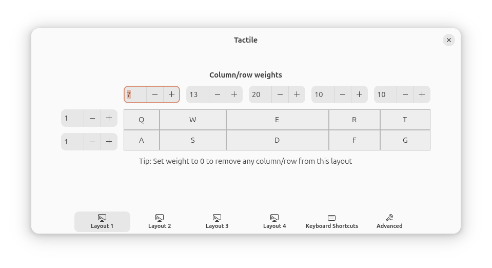

Following my appointment as VP Engineering for Ubuntu, I moved all of my machines from NixOS to Ubuntu. Being responsible for decisions that affect millions of Ubuntu users comes with, in my opinion, the obligation to *use* the product and live with those decisions myself.

Following years of running Arch Linux and NixOS, I imagined this would be uncomfortable, but was pleasantly surprised. In this post, I'll outline my setup and a new philosophy for how I configure my machines.

Last year, I wrote [in detail](https://jnsgr.uk/2024/07/how-i-computer-in-2024/) about my setup. Consider this post a "diff" on what's changed since.

## Recap: Why NixOS?

NixOS affords a seemingly endless selection of applications, desktop environments and when combined with [Home Manager](https://github.com/nix-community/home-manager) it provides a consistent way to manage the configuration of almost all aspects of a system.

People have argued that this is overkill, and results in needlessly complex configurations that produce difficult to read error messages, and make a system more difficult to troubleshoot.

While I had some troubles adopting NixOS, I consistently felt that the positives outweighed the negatives: I loved being able to overlay individual packages and tweak fundamentals of the system in a machine specific way. I also liked being able to trivially reuse configuration for app and hardware configuration across my machines in a single [flake](https://github.com/jnsgruk/nixos-config), which remains (to my amazement) one of my most popular GitHub repositories.

As I planned my move to Ubuntu, I decided to change the way I used my computer to avoid fighting my machine, and any feeling that I could be missing out on the ~~complexity~~ flexibility I'd become so used to.

## Adopting "JFUI"

The guiding principle for my new way of thinking is **JFUI: Just F\*cking Use It**!

The primary motivation behind JFUI is to pick applications for which the defaults are close enough to my preferences, then use them with as little (or no) configuration as possible.

By employing this principle, I should spend less of my time updating my configuration files as things change, and spend less time obsessing over every last theme detail for each application on my machine.

I've spent years collecting [repositories full of dotfiles](https://github.com/jnsgruk/dotfiles), which contains the ~2500 lines of configuration and scripts I used prior to moving to NixOS. As of today, the most recent commit in [my Nix flake](https://github.com/jnsgruk/nixos-config), `cloc` reports:

```
---------------------------------------------------
Language             files   blank  comment    code
---------------------------------------------------
Nix                    113     401      232    3666
Bourne Again Shell       3      25       30      95
Bourne Shell             1      17        0      83
Markdown                 1      19        1      81
YAML                     4       8        3      51
diff                     1       1        7       6
---------------------------------------------------
SUM:                   123     471      273    3982
---------------------------------------------------
```

And that seems like *a lot* to me! Yet this number omits my Visual Studio Code configuration (a further 200 lines of JSON), various browser configurations, etc.

So I challenged myself to set up my Ubuntu machines with as little configuration as possible and to choose apps with better defaults.

## Desktop Environment

It'd been a long time since I'd used a computer regularly without a tiling window manager. I switched to [sway](https://swaywm.org/) in 2019, and to [Hyprland](https://hypr.land/) in 2023.

I've built a lot of muscle memory by using a consistent keymap across both environments. I [use](https://jnsgr.uk/2024/07/how-i-computer-in-2024/) a 57" ultrawide monitor, and the idea of using it *without tiling* seemed like total anarchy to me.

But it didn't take me long to adapt to using GNOME again. Despite abstaining from it for years, I've always appreciated the visual design of GNOME and often used their apps as part of my tiling experience ([Files](https://apps.gnome.org/en-GB/Nautilus/), [Papers](https://apps.gnome.org/en-GB/Papers/), [Loupe](https://apps.gnome.org/en-GB/Loupe/)).

Features such as the keyring, light/dark mode switching worked for me under Sway/Hyprland, but it always required complex, fragile configuration. The out of the box experience for configuring WiFi networks and Bluetooth devices feels modern, and like a part of the OS, rather than a kit of parts. In my latter few months of running Hyprland, I struggled more with consistent theming and stability as Hyprland evolved separately from the themes and apps I liked.

I don't attribute any blame for this; it's a natural side effect of combining lots of independent and often complex parts from across the Linux desktop ecosystem, and I was consciously running pre 1.0 software knowing there would be issues because I enjoyed the overall experience.

### GNOME Extensions

This is the area where I violated JFUI the most, though some of it is temporary as I get further away from my existing workflow. I disable the Ubuntu dock, desktop icons, app indicators and Ubuntu tiling assistant. While the tiling assistant was a great step up on what came before it, it fell short of what I needed to manage windows on my large display.

I took inspiration from [Omakub](https://omakub.org/), which is where I discovered [Tactile](https://extensions.gnome.org/extension/4548/tactile/) - a GNOME extension for tiling windows to a custom on-screen grid using the keyboard. I've found this to be invaluable, and easily the best window management experience for GNOME. I've customised the grid to the following ratios (using `gsettings` in a script):

[](01.png)

I've grown to like [Space Bar](https://extensions.gnome.org/extension/5090/space-bar/) - it provides desktop workspaces akin to those in Sway/Hyprland which enabled me to use the muscle memory I'd developed over years. As I've progressed, I think I *could* live without Space Bar and use the native workspace features in GNOME, so I'll experiment with that soon.

The final two are somewhat simpler: [Emoji Copy](https://extensions.gnome.org/extension/6242/emoji-copy/) (mapped to `Super + E`) and [Clipboard History](https://extensions.gnome.org/extension/4839/clipboard-history/) (mapped to `Super + V`), functions that were previously enabled by [`wofi`](https://github.com/SimplyCEO/wofi) with a couple of plugins and lots of configuration.

## Editors

I spend a lot of time in an editor. As I wrote [last year](https://jnsgr.uk/uses), I've been using `neovim` and Visual Studio Code for some years. I never "managed" Visual Studio Code with NixOS because I always found their settings sync to be quite sufficient.

My [`nvim` config](https://github.com/jnsgruk/nixos-config/blob/aad045010b1ac61d271858dd5f4c2fa8dcb6e5d4/home/common/shell/vim.nix) wasn't too complicated - though it is made to look simpler because Home Manager abstracts away the details of managing plugins. I hadn't taken the time to set up language server support, code completion or other creature comforts that one might expect from an editor in 2025.

I'd dabbled before with [Helix](https://helix-editor.com/), a modal command-line editor not dissimilar from `vim`. Helix comes with a lot more out of the box: it supports the Language Server Protocol (LSP), has many built in colour schemes, supports fuzzy finding files/buffers, project wide search and more. The keymap took some practice, but my entire configuration amounts to 8 lines including some blank lines and provides many more modern features.

```toml
theme = "catppuccin_macchiato"

[editor]
cursorline = true
text-width = 100
rulers = [100]

[editor.lsp]
display-inlay-hints = true
```

There is a separate file with some LSP configuration, but only a few more lines. Once I got this set up, I spent about 8 weeks using *just* Helix to make sure that the keymap and operating model were sufficiently burned in to my mind. I've been really impressed - Helix is fast, the default features are great and I don't anticipate returning to `vim`.

On the desktop side, I'd was intrigued by [Zed](https://zed.dev/). I don't always feel the need for a desktop editor, but there are projects that I prefer working on in a more graphical environment. I last tried Zed about 18 months ago and found it a little too sparse on features, but things have really evolved since then and there is an encouraging rate of change on the project. I've been using it most days for the last 4-5 months, and while it still lacks some of the polish (and features) of Visual Studio Code, it's significantly lighter on resources, and I'm much happier with the defaults (details below)

```json
{
  "ui_font_size": 18,
  "buffer_font_size": 18,
  "theme": {
    "mode": "system",
    "light": "Catppuccin Latte",
    "dark": "Catppuccin Macchiato"
  },
  "buffer_font_family": "MesloLGMDZ Nerd Font Mono",
  "ui_font_family": ".SystemUIFont",
  "base_keymap": "SublimeText",
}
```

## Terminal

I switched to `zsh` around 2013 and have used it every day since: starting with the infamous [Oh My Zsh](https://ohmyz.sh/), [powerlevel9k](https://github.com/Powerlevel9k/powerlevel9k), and subsequently [powerlevel10k](https://github.com/romkatv/powerlevel10k), and finally settling on [Starship](https://starship.rs/) with a couple of `zsh` plugins such as [`zsh-autosuggestions`](https://github.com/zsh-users/zsh-autosuggestions) and [`zsh-syntax-highlighting`](https://github.com/zsh-users/zsh-syntax-highlighting).

My `zsh` config had become quite complex - an area in which NixOS/Home Manager really helped by providing (mostly)neat abstractions for plugins and `starship` integration, but the equivalent configuration on Ubuntu would have been 100s of lines of `zsh`, notwithstanding the need to load plugins in the right order, etc.

Most of the configuration I was doing with `zsh` was to imitate [`fish`](https://fishshell.com/). I'd tried `fish` in the past, but reverted when I couldn't use `sudo !!`, or `/some/command $!` and other tricks. I'd been following `fish`'s rewrite and decided to give it another go, and have stuck with it since. It fits my JFUI mantra perfectly, leaving me with just a few lines of config for essentially identical functionality:

```bash
set fish_greeting ""

fish_add_path ~/.nix-profile/bin
fish_add_path ~/.local/bin
fish_add_path ~/.cargo/bin
fish_add_path ~/go/bin
fish_add_path ~/scripts

if status is-interactive
    starship init fish | source
    fzf --fish | source
    atuin init fish --disable-up-arrow | source
end

set -gx EDITOR hx
set -gx SUDO_EDITOR hx
```

I still occasionally fall foul of typing `sudo !!`, but overall I've found `fish` to be an excellent interactive shell replacement. In particular, the native tab completion support is leagues ahead of anything I ever managed to configure with `zsh`.

I moved from Alacritty to [Ghostty](https://ghostty.org/), which has been absolutely excellent. It's wicked fast, it has my favourite colour scheme built in, and I just love the way [@mitchellh](https://github.com/mitchellh) has set the project up for success in the long term. It also fits in nicely with my minimally configured applications, with excellent defaults out of the box.

```ini
theme = catppuccin-macchiato
font-family = MesloLGMDZ Nerd Font Mono
font-size = 14
window-padding-x = 10
window-padding-y = 10
window-decoration = false
```

Finally: [tmux](https://github.com/tmux/tmux), which I had been happily using for many years, but slowly collecting configuration for. I decided to give [Zellij](https://zellij.dev/) a try, and haven't looked back. It also has a hellishly complicated configuration in my case 😉:

```kdl
theme "catppuccin-macchiato"
default_layout "compact"
show_startup_tips false
```

## Software Availability

I always felt incredibly spoiled by the vast availability of software for NixOS, and even more so that the contribution model was so simple that I was able to augment to collection myself.

On Ubuntu, I use Snaps wherever possible and fall back to archive and installing software with `apt` where it makes sense. If neither of those have what I need, I use the Nix package manager, which works well on Ubuntu. While some of the "additional" software might be installable using `go install`, or `cargo install`, or other package managers like `brew`, `flakpak`, `npm`, etc., I wanted to keep things as simple as possible, so if it's not available from Ubuntu-native sources I get it from `nixpkgs`.

I've included what I'm actually getting from the Snap store (63 snaps), and from `nixpkgs` (21 packages) below.

<details>
<summary>Installed snaps</summary>
<pre>
❯ snap list | tail -n+2
agendrr 0.1.1 3 latest/stable jnsgruk* -
astral-uv 0.7.13 627 latest/stable lengau classic
audacity 3.7.1 1208 latest/candidate snapcrafters* -
bare 1.0 5 latest/stable canonical** base
bitwarden 2025.5.1 140 latest/stable bitwarden** -
charmcraft 3.4.6 6672 latest/stable canonical** classic
code 18e3a1ec 197 latest/stable vscode** classic
core 16-2.61.4-20250508 17212 latest/stable canonical** core
core18 20250523 2887 latest/stable canonical** base
core20 20250526 2599 latest/stable canonical** base
core22 20250528 2010 latest/stable canonical** base
core24 20250526 1006 latest/stable canonical** base
desktop-security-center 0+git.f7ad73a 59 1/stable/… canonical** -
discord 0.0.98 243 latest/candidate snapcrafters* -
docker 28.1.1+1 3265 latest/stable canonical** -
dotrun 1.4.8 85 latest/stable canonicalwebteam -
ffmpeg-2404 7.1.1 75 latest/stable snapcrafters* -
firefox 139.0.4-1 6316 latest/stable/… mozilla** -
firmware-updater 0+git.22198be 167 1/stable/… canonical** -
ghstat 0.4.1 91 latest/stable jnsgruk* -
ght 1.11.7 110 latest/edge tbmb -
gimp 3.0.4 525 latest/stable snapcrafters* -
gnome-3-28-1804 3.28.0-19-g98f9e67.98f9e67 198 latest/stable canonical** -
gnome-3-34-1804 0+git.3556cb3 93 latest/stable canonical** -
gnome-42-2204 0+git.38ea591 202 latest/stable/… canonical** -
gnome-46-2404 0+git.d9f8bf6-sdk0+git.c8a281c 90 latest/stable canonical** -
go 1.24.4 10907 latest/stable canonical** classic
gopls 0.19.0 1089 latest/stable alexmurray* classic
goreleaser 2.10.2 1060 latest/stable caarlos0 classic
gtk-common-themes 0.1-81-g442e511 1535 latest/stable/… canonical** -
helix 25.01.1 91 latest/stable lauren-brock classic
icloudpd 1.28.1 12 latest/stable jnsgruk* -
jhack 0.4.4.0.13 461 latest/stable ppasotti -
jq 1.5+dfsg-1 6 latest/stable mvo* -
juju 3.6.7 31266 3/stable canonical** -
kubectl 1.33.2 3609 latest/stable canonical** classic
lxd 5.21.3-c5ae129 33110 5.21/stable canonical** -
mattermost-desktop 5.12.1 789 latest/stable snapcrafters* -
mesa-2404 24.2.8-snap183 887 latest/stable canonical** -
multipass 1.15.1 14535 latest/stable canonical** -
node 22.16.0 10226 22/stable iojs** classic
obsidian 1.8.10 47 latest/stable obsidianmd classic
pinta 3.0.1 56 latest/stable james-carroll* -
prompting-client 0+git.d542a5d 104 1/stable/… canonical** -
rambox 2.4.1 44 latest/stable ramboxapp** -
rockcraft 1.12.0 3367 latest/stable canonical** classic
ruff 0.11.13 1377 latest/stable lengau -
rustup 1.27.1 1471 latest/stable canonical** classic
shellcheck v0.10.0 1725 latest/stable koalaman -
shfmt 3.5.1 33 latest/stable ankushpathak -
signal-desktop 7.58.0 799 latest/candidate snapcrafters* -
snap-store 0+git.90575829 1270 2/stable/… canonical** -
snapcraft 8.9.4 15082 latest/stable canonical** classic
snapd 2.68.5 24718 latest/stable canonical** snapd
snapd-desktop-integration 0.9 253 latest/stable/… canonical** -
sublime-merge 2102 95 latest/stable snapcrafters* classic
thonny 4.1.7 239 latest/stable sameersharma2006 -
thunderbird 128.11.1esr-1 737 latest/stable canonical** -
todoist 9.17.0 1340 latest/stable doist** -
typescript-language-server 4.3.4 211 latest/stable alexmurray* -
yazi shipped 293 latest/stable sxyazi classic
yq v4.44.5 2634 latest/stable mikefarah -
zellij 0.42.2 41 latest/stable dominz88 classic
</pre>
</details>

<details>
<summary>Installed Nix packages</summary>
<pre>
❯ nix profile list | grep -Po "Name:[ ]*\K.+\$"
atuin
bash-language-server
cargo-udeps
deadnix
fzf
gh
gofumpt
nil
nixd
nixfmt-rfc-style
prettier
pyright
python-lsp-server
spread
starship
statix
taplo
terraform-ls
typos-lsp
vscode-langservers-extracted
yaml-language-server
</pre>
</details>

I continue to find Nix development shells useful, and even [use one](https://github.com/jnsgruk/jnsgr.uk/blob/5f9f2fe2ced2416e8a1fb3116d88d1b51c9fdbc7/flake.nix#L99-L122) to develop this site.

## Configuration Management

In the past I've used all kinds of scripts, Ansible playbooks and dotfile managers to solve this problem, and its a problem that was solved very elegantly by NixOS/Home Manager. I experimented with Home Manager on Ubuntu to manage dotfiles and configuration, but found the experience had more rough edges than I would like, and didn't really adhere to my JFUI principles.

I've settled on a directory full of idempotent, single-purpose scripts which get executed by a wrapper named `provision`. This is somewhat inspired by [Omakub](https://omakub.org/), but without the menus and configuration they supply to allow their users some customisation. The scripts install packages, write configuration with tools like `gsettings` and symlink configuration into place where needed:

```
❯ ls
app-1password      dev-python               tool-agendrr
app-chrome         dev-rust                 tool-atuin
app-flameshot      font-meslo               tool-gearlever
app-ghostty        hw-yubikey               tool-gh
app-obsidian       kara-audioengine         tool-git
app-pinta          kara-backup              tool-helix
app-rambox         kara-data-disk           tool-junction
app-signal         kara-hiring-automation   tool-lxd
app-sublime-merge  kara-hiring-reports      tool-multipass
app-thunderbird    provision                tool-podman
app-todoist        system-flatpak           tool-spread
configs            system-fs                tool-starship
dev-charms         system-gnome             tool-syncthing
dev-containers     system-gnome-extensions  tool-tailscale
dev-go             system-nix               tool-zed
dev-node           system-shell             tool-zellij
```

An example of a specific script, such as `tool-zellij`:

```bash
#!/usr/bin/env bash
set -e
DIR=$( cd "$( dirname "${BASH_SOURCE[0]}" )" && pwd )
sudo snap install --classic zellij
mkdir -p "${HOME}/.config/zellij"
ln -sf "${DIR}/configs/zellij/config.kdl" "${HOME}/.config/zellij/config.kdl"
```

The `provision` script is similarly simple (and naive):

```bash
#!/usr/bin/env bash
set -ex
DIR=$( cd "$( dirname "${BASH_SOURCE[0]}" )" && pwd )

sudo apt-get update
sudo apt-get upgrade -y

categories="system hw dev tool app font $(hostname)"
for c in $categories; do
        for x in ${c}-*; do
                source $x
        done
done
```

This is *just about* satisfactory. I've got into the habit of only ever installing software by creating the relevant script and configuration. If I don't need it to persist, the work gets done in an ephemeral LXD container/VM then thrown away.

I'm working on a better solution for this named `miso`, short for "Make It So". This a homegrown, multi-host configuration management tool for my machines that draws inspiration from `cloud-init`, `home-manager`, `terraform` and a few others. I'll write about that in a future post when the code is a little more complete, but there is an example of an early configuration format I'm targeting available as a [gist](https://gist.github.com/jnsgruk/64b7418183bd3abfbe68e878907608e3).

Everything in the linked config file is currently implemented and working with a decent suite of integration tests - but I've got a lot of tidying to do with error handling and such before I release it.

## So What About Nix?

I thoroughly enjoyed my adventures with Nix, and I consider having learned how to package software with Nix and use the available tooling to manage servers, desktops and development shells to have been incredibly worthwhile.

Even *if* I were to never touch Nix again, the general packaging and distribution engineering skills I learned have been invaluable, and I'm grateful to everyone who helped me on that journey through Matrix chats, Pull Requests and Mastodon interactions.

I remain active on the ~35 packages in [`nixpkgs`](https://github.com/NixOS/nixpkgs) for which I'm the maintainer. I continue to use Nix for development shells, CI and for certain packages on my Ubuntu machines. I have archived my [flake](https://github.com/jnsgruk/nixos-config) for now because it's not being maintained, but I've left it there in case there are any patterns that might be useful for others.

## Summary

Ubuntu has been very stable on my desktop, server and both of my laptops. I've enjoyed the level of integration and polish that comes with no effort in the desktop environment, and managing less configuration has been a freeing experience - even if some of my apps no longer have matching themes 😱.

Provisioning and configuration management are less structured and more cumbersome in Ubuntu, but that has driven me to build my own tool which was good fun, and gave me a nice challenge to solve through my journey learning Rust! I hope to learn from the project in a way that helps inform the development of Ubuntu itself in future releases.

If you're into numbers, here are the stats for my renewed "config" directory, which contains all of the text-based configuration & scripts for my machines:

```
----------------------------------------------------------
Language                files    blank   comment      code
----------------------------------------------------------
Bourne Again Shell         47      154        81       413
TOML                        3       13         1        53
Fish Shell                  1       13         3        38
JSON                        1        0         0        35
----------------------------------------------------------
SUM:                       52      180        85       539
----------------------------------------------------------
```

From 3982 lines, to 539 lines, and much of that could be reduced if it wasn't for the slightly repetitive nature of maintaining separate, idempotent scripts. Not bad.

As much as I feared the transition, my journey back to Ubuntu has been very enjoyable. I'm not "quitting Nix" or "over it", but at least for now I'm enjoying a less complex existence with my personal computers.

Thanks for reading!
