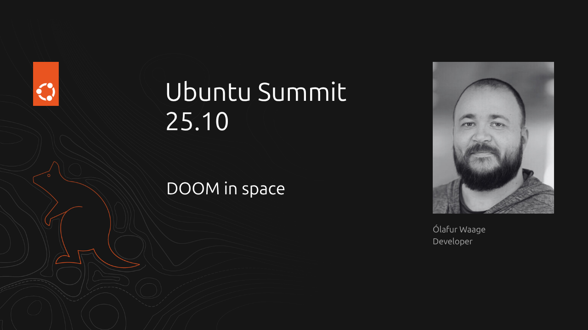
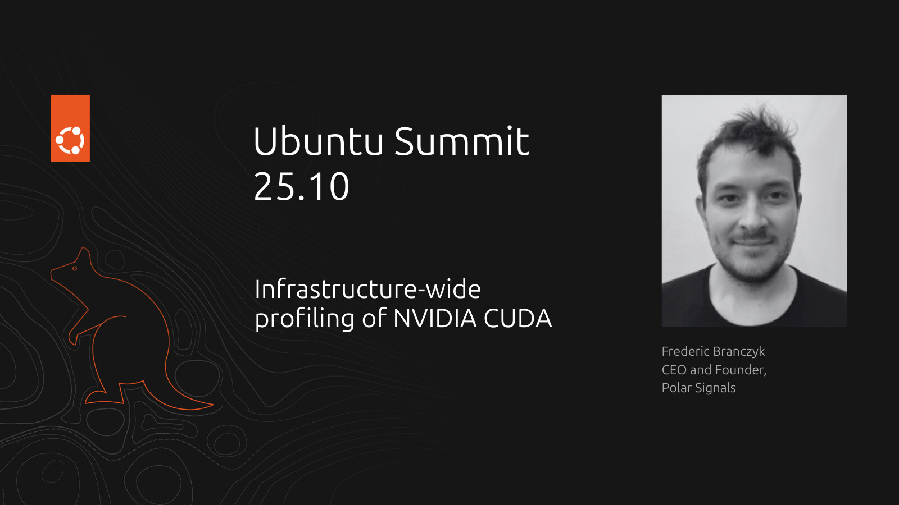
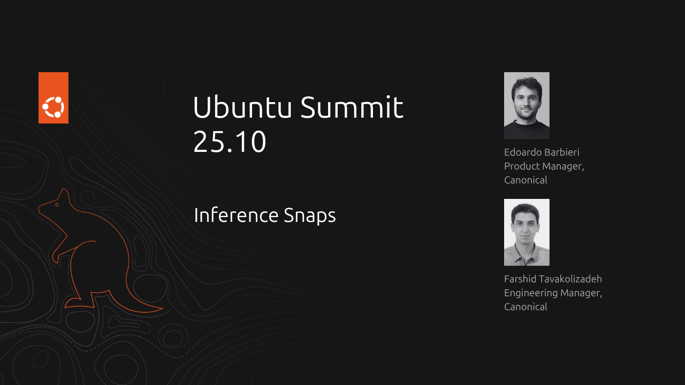
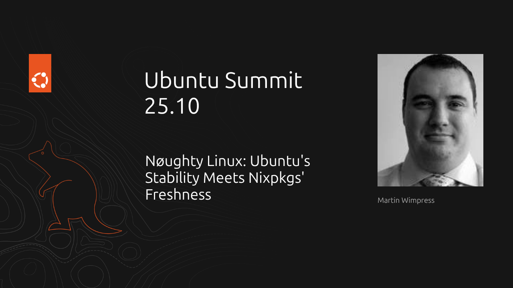
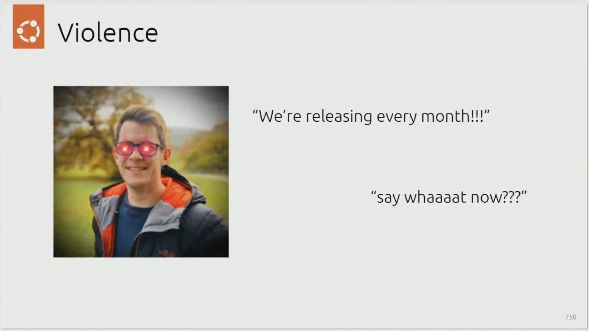

> This article was originally posted [on the Ubuntu Discourse](https://discourse.ubuntu.com/t/ubuntu-summit-25-10-personal-highlights/71509), and is reposted here. I welcome comments and further discussion in that thread.

I recently had the privilege of attending the [Ubuntu Summit 25.10](https://ubuntu.com/summit). Ubuntu Summits have a relatively long history. Some years ago Canonical ran the ‘Ubuntu Developer Summits (UDS)’, but recently the events were brought back and reimagined as the ‘Ubuntu Summit’.

For the most recent Summit, we tried out a new format. We invited a select few folks to come and give talks at our London office, with a small in-person crowd. In addition, the event was livestreamed, and we encouraged people to host "watching parties" across the world as part of [Ubuntu Local Communities (LoCos)](https://ubuntu.com/community/docs/locos?next=%2Fg1m%2F).

While Ubuntu may feature in the name, the event does not require talks to be centred on Ubuntu, and in fact is aiming to draw contributions from our partners and from right across the open source community, whether or not the content is relevant to Ubuntu or Canonical - it's designed to be a showcase for the very best of open source, and this year I felt that the talks were of a particularly high calibre.

In this post I'll highlight some of my favourite talks, in no particular order! If any of these catch your interest, you can see [when they were aired](https://discourse.ubuntu.com/t/ubuntu-summit-25-10-timetable/65271) and catch-up on the [Day 1](https://www.youtube.com/live/bEEamxJ60aI) and [Day 2](https://www.youtube.com/live/WvNgMEumSoA) streams.

## DOOM in Space

What a way to kick off the Summit! [DOOM in Space](https://discourse.ubuntu.com/t/doom-in-space/67019) was a talk given by [Ólafur Waage](https://olafurw.com/aboutme/), who introduced himself as a "professional keyboard typist"!

The talk was immediately after Mark Shuttleworth's opening remarks, and covered his journey in getting DOOM to run on the European Space Agency's [OPS-SAT](https://en.wikipedia.org/wiki/OPS-SAT) satellite. DOOM has famously been ported to [many devices](https://en.wikipedia.org/wiki/List_of_Doom_ports), though some were only questionably "running" the game.

Ólafur covered how he became involved in the project, and the unique approach they needed to take to guarantee success, since they would only get a very limited amount of time in order to conduct their "experiment" on the satellite.

Of particular note was the work done to integrate imagery from the OPS-SAT's onboard camera into the game, which involved some clever reassigning of colors in the game's original palette to more faithfully represent the imagery taken from the camera in-game.

## Infrastructure-Wide Profiling of Nvidia CUDA

[This talk](https://discourse.ubuntu.com/t/infrastructure-wide-profiling-of-nvidia-cuda/67248) was given by [Frederic Branczyk](https://github.com/brancz), CEO and Founder of [Polar Signals](https://polarsignals.com). Canonical has partnered with Polar Signals a couple of times in recent years. They were part of our journey to [enabling frame pointers by default](https://ubuntu.com/blog/ubuntu-performance-engineering-with-frame-pointers-by-default) on Ubuntu, and many of our teams have been using their zero-instrumentation [eBPF profiler](https://github.com/parca-dev/parca-agent).

While CPU profiling has been commonplace for developers for many years, giving the ability to analyse CPU and memory-bound workloads, profiling GPU workloads has been less prominent, and is particularly difficult in production.

Polar Signals advocate for "continuous profiling", which means running a profiler at all times, on all nodes, in production. The benefit of this is that when an issue occurs, you don't have to set up a profiler and try to reproduce the issue - you already have the data. It also negates the uncertainty of the impact a profiler might have on the code during reproduction. This would have been difficult with traditional profiling tools, but with technologies like [eBPF](https://ebpf.io/), the overhead of the profiler is incredibly low compared to the potential performance gains from acting on the data it produces.

In this talk, Frederic outlined the work they have done bringing infrastructure-wide profiling of CUDA workloads into Polar Signals Cloud. Their approach combines the [CUPTI profiling API](https://docs.nvidia.com/cupti/) with [USDT](https://docs.ebpf.io/linux/concepts/usdt/) probes and eBPF into a pipeline, relying upon the ability to inject a small library into CUDA workloads using the `CUDA_INJECTION64_PATH` without modification.

You can see more details [on their website](https://www.polarsignals.com/blog/posts/2025/10/22/gpu-profiling).

## Inference Snaps

This talk served as the first [public announcement](https://canonical.com/blog/canonical-releases-inference-snaps) of Inference Snaps from Canonical, which represents a few months of working combining many of the new technologies behind Snaps.

As Large Language Models continue to gain pace along with the rest of the AI community, silicon manufacturers are increasingly including dedicated hardware in commodity CPUs and GPUs, as well as shipping dedicated accelerators for some workloads.

AI models often need to be tuned in some way in order to work optimally - for example [quantisation](https://huggingface.co/docs/optimum/en/concept_guides/quantization) which aims to reduce the computational memory costs of running inference on a given model.

Inference snaps provide a hassle-free mechanism for users to obtain the "famous model" they want to work with, but automatically receive a version of that model which is optimised for the silicon in their machine, removing the need to spend hours on HuggingFace trying to identify the correct model to download that matches with their hardware.

Using our extensive partner network, we'll continue to work with multiple silicon vendors to ensure that models are available for the latest hardware as it drops, and provide a consistent experience to Ubuntu users that wish to work with AI.

Find out more in the [announcement](https://canonical.com/blog/canonical-releases-inference-snaps).

## Nøughty Linux: Ubuntu’s Stability Meets Nixpkgs’ Freshness

This [talk](https://discourse.ubuntu.com/t/noughty-linux-ubuntus-stability-meets-nixpkgs-freshness/69962) was a bit of a guilty pleasure for me! Delivered by [Martin Wimpress (wimpy)](https://wimpysworld.com/), the audience were shown how they could take a stock Ubuntu Server deployment, and use a collection of scripts to layer a cutting-edge GUI stack on top using [Nixpkgs](https://github.com/NixOS/nixpkgs).

Wimpy outlined his motivation as wanting to rely upon the stable kernel and hardware support offered by Ubuntu, but wanting to be more experimental with his desktop environment and utilities - preferring a tiling window management experience.

Having spent some years on NixOS, Wimpy was recently required to run a security "agent" for work, which was very difficult to enable on NixOS, but worked out of the box on Ubuntu. Recognising the need to make the switch, he was reluctant to move away from the workflow he'd built so much muscle-memory around - and so [Nøughty Linux](https://noughtylinux.org/) was born!

Nøughty Linux is not a Linux distribution, rather a set of configurations for an Ubuntu Server machine. It utilises [`nix-system-graphics`](https://github.com/soupglasses/nix-system-graphics) and [`system-manager`](https://github.com/numtide/system-manager) and is actually _very_ similar to a configuration I ran in my own [nixos-config](https://github.com/jnsgruk/nixos-config) repository for my laptop for a while - though Wimpy has chased down significantly more of the papercuts than I did!

## Are we stuck with the same Desktop UX forever?

[Scott Jenson](https://jenson.org/) delivered an incredibly engaging [talk](https://discourse.ubuntu.com/t/are-we-stuck-with-the-same-desktop-ux-forever/67253) in which he posited that desktop user experience has somewhat stagnated, and worse that many of the patterns we've become used to on the desktop are antiquated and unergonomic.

The crux of the talk was to focus on user _experience_, rather than user _interfaces_ - challenging developers to think about how people learn, and how desktops could benefit more from design affordances by rethinking some critical elements such as window management or text editing.

Using his years of experience at Apple, Symbian and Google, Scott delivered one of the most engaging conference talks I've seen, and I thoroughly recommend watching it on our YouTube channel!

## Honorable Mentions

In addition to the talks above, it was a delight to meet [Mark Schoolderman](https://cs.ru.nl/~M.Schoolderman/) from the [Trifecta Tech Foundation](https://trifectatech.org/) in-person, who led the work on [`sudo-rs`](https://github.com/trifectatechfoundation/sudo-rs) as part of our "Oxidising Ubuntu" story, and interesting to hear about the value the project derived from Ubuntu's [Main Inclusion Review](https://documentation.ubuntu.com/project/MIR/main-inclusion-review/) process as part of landing `sudo-rs` in `main`.

Equally, I was delighted that [Samuele Kaplun](https://github.com/kaplun) from [Proton](https://proton.me/) could join us to talk about the work we've been doing together on bringing first-class Snap packages for [Proton Mail](https://proton.me/mail), [Proton VPN](https://protonvpn.com/?ref=pme_lp_b2c_proton_submenu), [Proton Pass](https://proton.me/pass) and [Proton Authenticator](https://proton.me/authenticator) to the [Snap store](https://snapcraft.io/publisher/proton-ag), and their reasons for choosing Snaps, adventures with [confinement](https://snapcraft.io/docs/snap-confinement), and more.

I was delighted to see [Craig Loewen](https://www.craigloewen.com/) and [Clint Rutkas](https://www.linkedin.com/in/clintrutkas/) present on their [journey](https://discourse.ubuntu.com/t/engineering-wsl-in-the-open-a-deep-dive-into-open-sourcing-wsl-at-microsoft/67022) open sourcing the [Windows Subsystem For Linux (WSL)](https://en.wikipedia.org/wiki/Windows_Subsystem_for_Linux), which represents a growing proportion of Ubuntu users, and a key bridge to open source development for many.

Finally, thank you to [Utkarsh](https://github.com/utkarsh2102) for this wonderful slide as part of his talk on Ubuntu Snapshot Releases:

## Conclusion

Overall, I found the Ubuntu Summit 25.10 a really enjoyable event, with talks that were uniformly high in quality, charisma and creativity. I'm pleased that Canonical has broadened the Summit's reach and I hope it continues to serve as a platform to showcase the very best open source innovation.

Until next time!
