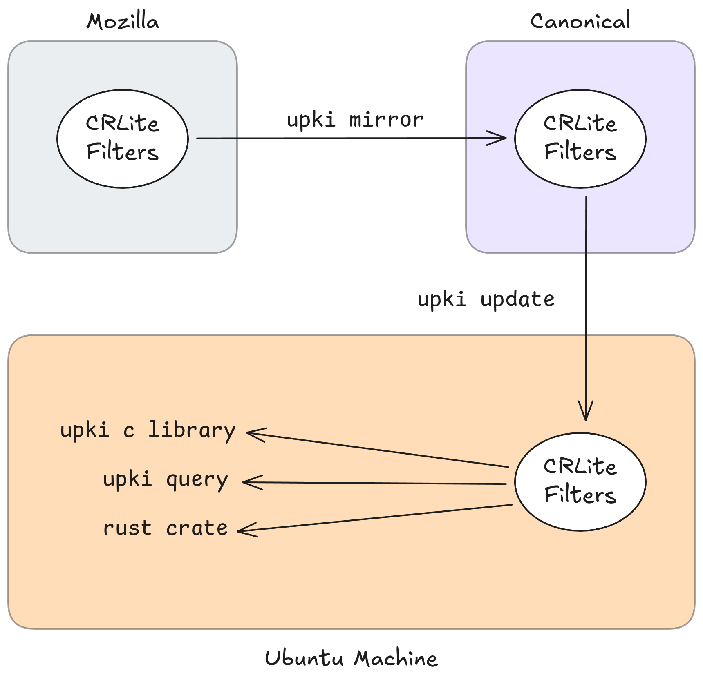

> This article was originally posted [on the Ubuntu Discourse](https://discourse.ubuntu.com/t/addressing-linuxs-missing-pki-infrastructure/73314), and is reposted here. I welcome comments and further discussion in that thread.

Earlier this year, [LWN](https://lwn.net/) featured an excellent article titled "[Linux's missing CRL infrastructure](https://lwn.net/Articles/1033809/)". The article highlighted a number of key issues surrounding traditional Public Key Infrastructure (PKI), but critically noted how even the available measures are effectively ignored by the majority of system-level software on Linux.

One of the motivators for the discussion is that the Online Certificate Status Protocol (OCSP) will cease to be supported by Let's Encrypt. The remaining alternative is to use Certificate Revocation Lists (CRLs), yet there is little or no support for managing (or even querying) these lists in most Linux system utilities.

To solve this, I'm happy to share that in partnership with [rustls](https://github.com/rustls/rustls) maintainers [Dirkjan Ochtman](https://dirkjan.ochtman.nl/) and [Joe Birr-Pixton](https://jbp.io/), we're starting the development of upki: a universal PKI tool. This project initially aims to close the revocation gap through the combination of a new system utility and eventual library support for common TLS/SSL libraries such as [OpenSSL](https://openssl-library.org/), [GnuTLS](https://gnutls.org/) and [rustls](https://github.com/rustls/rustls).

## The Problem

Online Certificate Authorities responsible for issuing TLS certificates have long had mechanisms for revoking known bad certificates. What constitutes a known bad certificate varies, but generally it means a certificate was issued either in error, or by a malicious actor of some form. There have been two primary mechanisms for this revocation: [Certificate Revocation Lists](https://datatracker.ietf.org/doc/html/rfc5280) (CRLs) and the [Online Certificate Status Protocol](https://datatracker.ietf.org/doc/html/rfc6960) (OCSP).

In July 2024, [Let’s Encrypt](https://letsencrypt.org/) [announced](https://letsencrypt.org/2024/07/23/replacing-ocsp-with-crls.html) the deprecation of support for the Online Certificate Status Protocol (OCSP). This wasn't entirely unexpected - the protocol has suffered from privacy defects which leak the browsing habits of users to Certificate Authorities. Various implementations have also suffered reliability issues that forced most implementers to adopt "soft-fail" policies, rendering the checks largely ineffective.

The deprecation of OCSP leaves us with CRLs. Both Windows and macOS rely on operating system components to centralise the fetching and parsing of CRLs, but Linux has traditionally delegated this responsibility to individual applications. This is done most effectively in browsers such as Mozilla Firefox, Google Chrome and Chromium, but this has been achieved with bespoke infrastructure.

However, Linux itself has fallen short by not providing consistent revocation checking infrastructure for the rest of userspace - tools such as curl, system package managers and language runtimes lack a unified mechanism to process this data.

The ideal solution to this problem, which is slowly [becoming more prevalent](https://letsencrypt.org/2025/12/02/from-90-to-45.html), is to issue short-lived credentials with an expiration of 10 days or less, somewhat removing the need for complicated revocation infrastructure, but reducing certificate lifetimes is happening slowly and requires significant automation.

## CRLite

There are several key challenges with CRLs in practice - the size of the list has grown dramatically as the web has scaled, and one must collate CRLs from all relevant certificate authorities in order to be useful. CRLite was originally proposed by researchers at IEEE S\&P and subsequently adopted in Mozilla Firefox. It offers a pragmatic solution to the problem of distributing large CRL datasets to client machines.

In a recent [blog post](https://hacks.mozilla.org/2025/08/crlite-fast-private-and-comprehensive-certificate-revocation-checking-in-firefox/), Mozilla outlined how their CRLite implementation meant that on average users "downloaded 300kB of revocation data per day, a 4MB snapshot every 45 days and a sequence of "delta-updates" in-between", which amounts to CRLite being 1000x more bandwidth-efficient than daily CRL downloads.

At its core, CRLite is a data structure compressing the full set of web-PKI revocations into a compact, efficiently queryable form. You can find more information about CRLite's design and implementation on [Mozilla's Security Blog](https://blog.mozilla.org/security/tag/crlite/).

## Introducing upki

Following our work on [oxidizing Ubuntu](https://jnsgr.uk/2025/03/carefully-but-purposefully-oxidising-ubuntu/), [Dirkjan](https://dirkjan.ochtman.nl/) reached out to me with a proposal to introduce a system-level utility backed by CRLite to non-browser users.

upki will be an open source project, initially packaged for Ubuntu but available to all Linux distributions, and likely portable to other Unix-like operating systems. Written in Rust, upki supports three roles:

- **Server-side mirroring tool**: responsible for downloading and mirroring the CRLite filters provided by Mozilla, enabling us to operate independent CDN infrastructure for CRLite users, and serving them to clients. This will insulate upki from changes in the Mozilla backend, and enable standing up an independent data source if required. The server-side tool will manifest as a service that periodically checks the Mozilla Firefox CRLite filters, downloads and validates the files, and serves them.

- **Client-side sync tool**: run regularly by a systemd-timer, network-up events or similar, this tool ensures the contents of the CDN are reflected in the on-disk filter cache. This will be extremely low on bandwidth and CPU usage assuming everything is up to date.

- **Client-side query tool**: a CLI interface for querying revocation data. This will be useful for monitoring and deployment workflows, as well as for users without a good C FFI.

The latter two roles are served by a single Rust binary that runs in different modes depending on how it is invoked. The server-side tool will be a separate binary, since its use will be much less widespread. Under the hood, all of this will be powered by Rust library crates that can be integrated in other projects via crates.io.

For the initial release, Canonical will stand up the backend infrastructure required to mirror and serve the CRLite data for upki users, though the backend will be configurable. This prevents unbounded load on Mozilla’s infrastructure and ensures long-term stability even if Firefox’s internal formats evolve.

## Ecosystem Compatibility

So far we've covered the introduction of a new Rust binary (and crate) for supporting the fetching, serving and querying of CRL data, but that doesn't provide much service to the existing ecosystem of Linux applications and libraries in the problem statement.

The upki project will also provide a shared object library for a stable ABI that allows C and C-FFI programs to make revocation queries, using the contents of the on-disk filter cache.

Once `upki` is released and available, work can begin on integrating existing crypto libraries such as OpenSSL, GNUtls and rustls. This will be performed through the shared object library by means of an optional callback mechanism these libraries can use to check the revocation lists before establishing a connection to a given server with a certificate.

## Timeline

While we've been discussing this project for a couple of months, ironing out the details of funding and design, work will soon begin on the initial implementation of upki.

Our aim is to make upki available as an opt-in preview for the release of Ubuntu 26.04 LTS, meaning we'll need to complete the implementation of the server/client functionality, and bootstrap the mirroring/serving infrastructure at Canonical before April 2026\.

In the following Ubuntu release cycle, the run up to Ubuntu 26.10, we'll aim to ship the tool by default on Ubuntu systems, and begin work on integration with the likes of NSS, OpenSSL, GNUtls and rustls.

## Summary

Linux has a clear gap in its handling of revocation data for PKIs. Over the coming months we're hoping to address that gap by developing upki not just for Ubuntu, but for the entire ecosystem. Thanks to Mozilla's work on CRLite, and the expertise of Dirkjan and Joe, we're confident that we'll deliver a resilient and efficient solution that should make a meaningful contribution to systems security across the web.

If you'd like to do more reading on the subject, I'd recommend the following:

- **LWN.net:** [Linux's missing CRL infrastructure](https://lwn.net/Articles/1033809/)
- **Mozilla Security Blog:** [CRLite Part 1: All Web PKI Revocations Compressed](https://blog.mozilla.org/security/2020/01/09/crlite-part-1-all-web-pki-revocations-compressed/)
- **Mozilla Security Blog:** [CRLite Part 2: End-to-End Design](https://blog.mozilla.org/security/2020/01/09/crlite-part-2-end-to-end-design/)
- **Let’s Encrypt:** [Replacing OCSP with CRLs](https://letsencrypt.org/2024/07/23/replacing-ocsp-with-crls.html)
- **IEEE Symposium on Security & Privacy:** [CRLite: A Scalable System for Pushing All TLS Revocations to All Browsers](https://www.google.com/search?q=https://ieeexplore.ieee.org/document/7958572)
