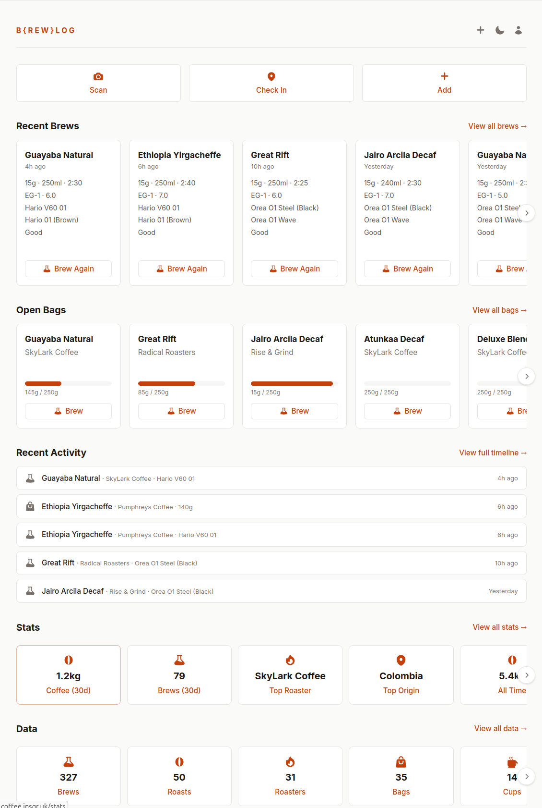
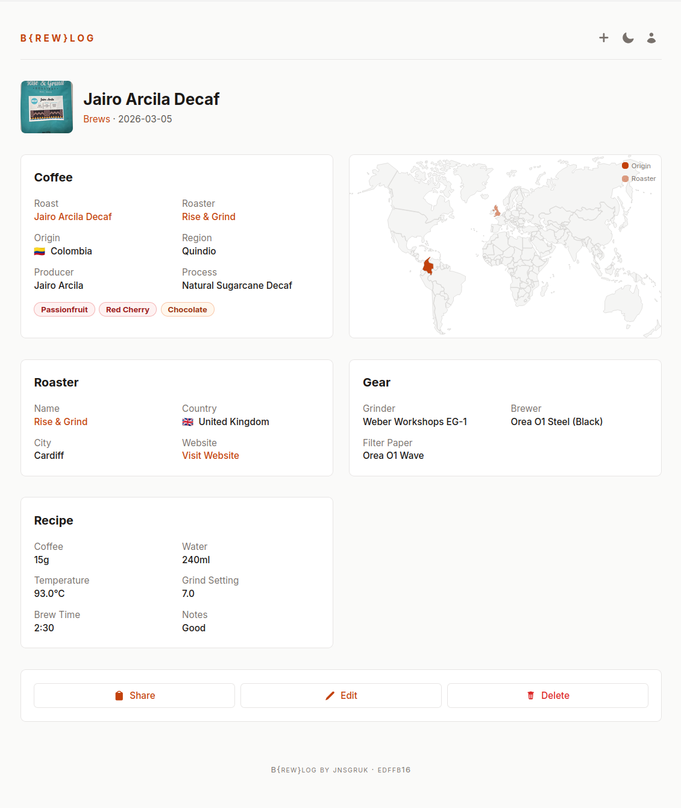
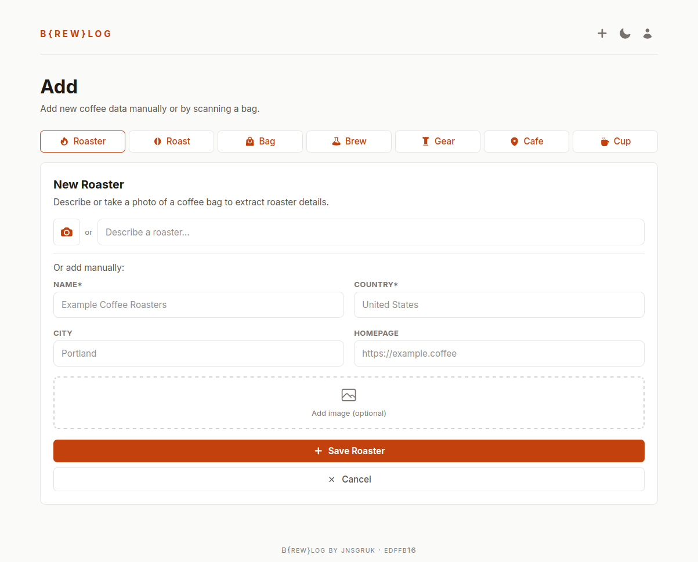

## Introduction

I’m really into speciality coffee. In July 2025 I started tracking my coffee habits with [Roastguide](https://roast.guide/), a delightfully designed iOS app for people with a similar obsession to mine. It does a good job of tracking brews, roasters and bags, but over time I found myself wanting the data in a system that I controlled. I wanted to be able to query it, back it up, and adjust some of the flows to work better for how I brew and consume coffee.

Despite my past scepticism of the previous generation of coding tools, recent developments have made them hard to ignore, and I wanted an excuse to build something substantial from scratch to get some experience.

So I built [b{rew}log](https://github.com/jnsgruk/brewlog), which is a self-hosted coffee logging platform. It tracks roasters, roasts, bags, brews, equipment, and cafe visits. It's live at [coffee.jnsgr.uk](https://coffee.jnsgr.uk) if you want to poke around and witness the depths of my strange filter coffee obsession!

This was by far the most complex project I'd built with [Claude Code](https://claude.com/product/claude-code), or agentic coding tools in general. I'm responsible for the technology choices, architecture, and visual design, but I wrote almost none of the code myself.

This post will cover the core features of Brewlog and how I designed the app, and finish with some observations and tips about agentic programming.

## Core Features

Brewlog tracks roasters, roasts, bags, brews, equipment, and cafe visits. The landing page you see below summarises details of my last few brews, currently open bags of coffee and how much remains in each and some basic stats. When logged in, it provides quick controls to repeat a brew, or brew a particular coffee:

[](01.png)

Brews are coffees I’ve made myself. Each brew is logged against a specific bag and captures the recipe (dose, water, time, temperature), the equipment used, and tasting notes. Over time this will build up a history of what I've brewed, how I brewed it and how much I use the brewing gear I've accumulated over time. The image below shows the detail page for a specific brew:

[](04.png)

Finally, brewlog tracks cafes I've visited, and "cups", which are coffees I've enjoyed, but not brewed myself.

The most fun part is the extensive stats page, which shows an interactive map of where my coffees are grown, roasted and drunk, as well as common flavour notes and brew times.

[](02.png)

### LLM-Powered Bag Scanning

Roastguide has a nice feature that allows you to take a picture of a bag of coffee and it'll fetch the details. If my understanding is correct, their implementation relies on a database of roasters and coffees that the creators maintain. My app wouldn't have access to that database, nor did I want to spend too much time building ingestion pipelines to store lots of data about all the possible coffees/roasters.

In brewlog, I implemented this feature using LLM extraction: I take a photo and send it to a multi-modal model hosted by [OpenRouter](https://openrouter.ai/). The [prompt](https://github.com/jnsgruk/brewlog/blob/edffb1679db3f17a8ed8e47735e8e1aff137e117/src/infrastructure/ai.rs#L11-L28) instructs the model to extract text from the image, perform a web search, and return a JSON object containing details of the coffee or roaster. OpenRouter enables me to switch models easily without worrying about API differences.

In practice this works surprisingly well. Most speciality coffee bags are covered in useful information, and vision models are good at reading it. The main failure modes I see are mixing up roast names from the web and occasionally inventing tasting notes, but the process includes a review step which makes those cheap to correct.

The cost is almost negligible per scan. I've been using [`google/gemini-2.5-flash`](https://openrouter.ai/google/gemini-2.5-flash) for the LLM extraction feature, which results in a cost of around $0.01 - $0.02 per scan.

[](03.png)

## Design Decisions

### Backend

Brewlog is built with Rust and [Axum](https://github.com/tokio-rs/axum) for the backend. I've been [learning Rust](https://jnsgr.uk/2024/12/experiments-with-rust-nix-k6-parca/) for a while now, and wanted to push further with a more substantial project. Templates are handled by [Askama](https://github.com/djc/askama), whose compile‑time templates worked well with Claude because template errors surface as Rust compiler errors, which are picked up and fixed by the agent automatically.

The database is [SQLite](https://www.sqlite.org/). A single file, easy to back up, easy to move around. For a single-user application like this, SQLite is more than sufficient and removes the need for a separate database server. [Migrations](https://github.com/jnsgruk/brewlog/tree/main/migrations) are embedded in the binary and [run automatically](https://github.com/jnsgruk/brewlog/blob/edffb1679db3f17a8ed8e47735e8e1aff137e117/src/infrastructure/database.rs#L38) on application startup.

### Frontend

I wanted the app to feel modern, but keep much of the rendering server-side. I didn't want to be serving a large client-side Javascript single-page application. I've been curious about the likes of [HTMX](https://htmx.org/), and the observations made in a post from last year on [building apps with Eta, HTMX and Lit](https://www.lorenstew.art/blog/eta-htmx-lit-stack) really resonated with me.

More recently I discovered [Datastar](https://data-star.dev/), which has similar goals to [HTMX](https://htmx.org/), but it's newer and results in cleaner, simpler templates. Where HTMX swaps HTML fragments, Datastar adds a reactive signal system and can patch both HTML and JSON data from the server.

This was a bit of a test for Claude Code, since Datastar was new enough that it likely didn't feature in the training data for the model, but its ability to read and digest the documentation was quite startling.

While occasionally the agent regressed to vanilla `fetch` calls, or manual Javascript DOM manipulation, I treated that as a hole in my instructions, not the model. Each time it happened I [updated](https://github.com/jnsgruk/brewlog/blob/main/CLAUDE.md#gotchas) CLAUDE.md to reinforce the Datastar patterns and prevent the agent making the same mistake again.

### Single User, Passkeys Only

Brewlog is deliberately single-user. I'm happy for people to self-host their own instance, but I don't have much interest in providing a service more widely. The codebase is structured such that making it multi-user wouldn't be a particularly complex task, but I'm not convinced I'll ever do it.

Perhaps unusually, authentication via username and password is not supported. Authentication is only supported using passkeys via [WebAuthn](https://webauthn.io/) or with an API token.

Passkeys are phishing-resistant and significantly more difficult to brute-force both from an academic and a practical standpoint, which removes an entire class of abuse vector for my service.

### Comprehensive CLI Client

One of the many things I've learned from [@niemeyer](https://github.com/niemeyer) during my time at Canonical is to ensure that when new API endpoints are added to such applications, a corresponding CLI command or flag lands at the same time.

He also illustrated to me the power of shipping a single binary that is both a server, and a client to itself. The brewlog binary runs the server that hosts the API and web UI, but also serves as a first-class API client for the app.

If you’re building an API‑backed app, I highly recommend this pattern. It keeps the surface area small and gives you (and an agent...) a first‑class, [scriptable](https://github.com/jnsgruk/brewlog/blob/main/scripts/bootstrap-db.sh) way to exercise the API and troubleshoot problems in data transformation.

### Domain-Driven Design

The codebase follows a domain-driven design approach with four layers: domain (business logic only, no external dependencies), infrastructure (database, HTTP clients, third-party APIs), application (HTTP server, routes, middleware, services), and presentation (CLI commands and web view models):

```text
┌─────────────────────────────────────────────────────────────┐
│  Presentation                                               │
│  ┌─────────────────────────┐  ┌──────────────────────────┐  │
│  │ CLI                     │  │ Web                      │  │
│  │  roasters, roasts, bags │  │  views, templates        │  │
│  │  brews, cups, gear ...  │  │  roasters, roasts, bags  │  │
│  └─────────────────────────┘  └──────────────────────────┘  │
├─────────────────────────────────────────────────────────────┤
│  Application                                                │
│  ┌──────────────┐ ┌──────────────────┐ ┌─────────────────┐  │
│  │ Routes       │ │ Services         │ │ Server / State  │  │
│  │  /api/*      │ │  BagService      │ │  Axum router    │  │
│  │  /app/*      │ │  BrewService     │ │  AppState (DI)  │  │
│  │              │ │  RoastService .. │ │                 │  │
│  └──────────────┘ └──────────────────┘ └─────────────────┘  │
├─────────────────────────────────────────────────────────────┤
│  Domain  (pure Rust — no framework dependencies)            │
│  ┌──────────────────────┐  ┌─────────────────────────────┐  │
│  │ Entities & Values    │  │ Repository Traits           │  │
│  │  coffee/ roasters,   │  │  trait RoasterRepository    │  │
│  │   roasts, bags,      │  │  trait RoastRepository      │  │
│  │   brews, cups, gear  │  │  trait BagRepository  ...   │  │
│  │  auth/ users,        │  │                             │  │
│  │   sessions, tokens   │  │ Errors, IDs, Listing,       │  │
│  │  analytics/          │  │ Formatting                  │  │
│  └──────────────────────┘  └─────────────────────────────┘  │
├──────────────────────────────────┬──────────────────────────┤
│  Infrastructure                  │                          │
│  ┌────────────────────────────┐  │  ┌───────────────────┐   │
│  │ Repositories (SQLite)      │  │  │ External Clients  │   │
│  │  SqlRoasterRepository      │  │  │  OpenRouter (AI)  │   │
│  │  SqlRoastRepository        │  │  │  Foursquare       │   │
│  │  SqlBagRepository  ...     │  │  │  WebAuthn         │   │
│  │  (implement domain traits) │  │  │  Backup           │   │
│  └────────────────────────────┘  │  └───────────────────┘   │
└──────────────────────────────────┴──────────────────────────┘
```

In this model, dependencies flow inward. The domain layer knows nothing about Axum, SQLite, or any other implementation detail. Repository traits are defined in the domain and implemented in the infrastructure layer. This creates flexibility in the future if, for example, I want to move to PostgreSQL rather than SQLite, or if I want to change how I store images, etc.

It also simplifies testing. The domain-driven design approach encourages loose coupling and practices like dependency injection, which usually lead to simpler integration tests. For example, I could ask the agent for focused tests against pure domain logic without pulling in Axum or SQLite.

## Agentic Coding Patterns

A big motivation for this project was to learn some new technology and skills, and it certainly did that, but it also reinforced some patterns I've been using for a while now.

### Pre-commit hooks as a contract

I've never been too fond of [pre-commit hooks](https://git-scm.com/book/en/v2/Customizing-Git-Git-Hooks). I've always been disciplined in using formatters and linters in projects, but never enjoyed having them set up to run automatically. This changed when I started working with agents.

I treat `pre‑commit` as a contract between me and the agent. The agent is instructed to always fix linting/testing failures before returning to me for input or declaring success. In particular, I've been using [prek](https://prek.j178.dev/), which is a Rust rewrite of [pre-commit](https://pre-commit.com/).

### Stricter lints for agents

With agents, I'm also more inclined toward stricter, more pedantic lints to enforce properties like maximum line count in a function or file. When I'm writing code myself I make these changes instinctively. It's obvious when a function becomes cumbersome when you're editing by hand, but I noticed early on that an agent seems much more comfortable with 100+ line functions than I am.

If you care about such constraints (function length, etc.), encode them as lints rather than hoping the agent internalises your preferences.

As an aside, I'd never used [flake-parts](https://flake.parts) before, but its ability to automatically configure pre-commit hooks and formatting tools like [treefmt](https://treefmt.com/latest/) in a Nix dev shell is really slick.

### Self-updating instructions

I hadn’t previously realised how good these tools are at writing their own instructions. I had been confused in the past at the length/complexity of `AGENTS.md`/`CLAUDE.md` files I'd seen, not realising that when you work with an agent to solve a problem, or remedy something it did, you can then prompt it to summarise what just happened in the `CLAUDE.md` file to prevent it from happening again.

### Plan Mode

To begin with I made extensive use of "Plan Mode". The premise is that the agent can explore the codebase, read docs online and work with you to plan new features, but it cannot make changes to the code or your system.

This had been working well for me, but there were a couple of occasions where it seemed to get stuck in a "doom loop" trying to plan its way out of a complex failure.

On one particular occasion, this lasted for over an hour. I then switched to "Agent Mode", gave it a follow-up prompt that instructed it to inspect a running application on Kubernetes directly using `kubectl`, and it was able to diagnose and solve the same problem in around 5 minutes. The problem here was that some "tools" are explicitly not permitted in "Plan Mode", but depending on what you're trying to achieve that can sometimes be a significant hindrance.

I've been favouring a different approach where I remain in "Agent Mode", and prompt the agent that I'd like to work on a plan in a shared document (e.g. `./plans/new-feature.md`), and that it may only edit that file until I say otherwise. I then work in a loop with the Agent where it writes a plan, I leave comments in-line in the file, and then it takes that into account - and repeat until I'm happy. Before asking the agent to implement the plan, I start a new session and ask it to implement the plan with fresh context. So far I've found this to be really effective.

### Worktrees and Parallel Agents

Pretty soon after starting work on more complicated features, I became interested in running parallel agents. Sometimes an agent can take a long time to work through a well-developed, and in that time I often felt I could be working my way through other items on my roadmap.

I initially tried to just run them concurrently on the same branch, but predictably they ended up fighting and making a bit of a mess. I've long been a fan of git [worktrees](https://git-scm.com/docs/git-worktree), and they're a perfect fit here - enabling me to run concurrent agents on separate instances of the codebase.

Even with worktrees, I still tend to work on orthogonal concerns so I don't end up with big merge conflicts, but being able to work on a frontend feature, a backend feature and the CI pipeline all at once is a nice upgrade.

### Visual prompting

When working on frontend components, I built a nice workflow around screenshotting the UI, marking it up with [Flameshot](https://flameshot.org/), then pasting the image back into Claude Code with the next prompt.

I found this to be a really effective way to drive iteration on web components. It felt closer to pair‑designing with a human: I’d circle spacing issues or misaligned elements, and the agent would propose CSS tweaks in response to what it saw.

## Summary

I had a blast building Brewlog, and I've been using it every day for about a month now. It's different from how I've approached projects in the past, in a way that's both liberating and terrifying in equal measures.

While some of the code in this project lacks the same attention to detail I might have applied, I likely would never have got around to building it without an agent.

I was surprised what the process taught me. Every day I hacked on Brewlog with Claude Code, I learned something. Whether that was something about Tailwind CSS, or an architectural pattern.

I think the key to useful output from these tools is that you remain the driver. You're still responsible what you ship, which means giving the generated code the appropriate amount of review.

Brewlog is live at [coffee.jnsgr.uk](https://coffee.jnsgr.uk) and runs comfortably on a free-tier instance on [fly.io](https://fly.io/).

If you’re into speciality coffee and like owning your data, give it a try and let me know how you get on.

Finally, I'd like to thank the authors of Roastguide for the amazing work they've done on their app, the attention they pay to their community on Discord, and the fact that they were willing to get me a dump of my data I could use to populate the first deployment of Brewlog!
