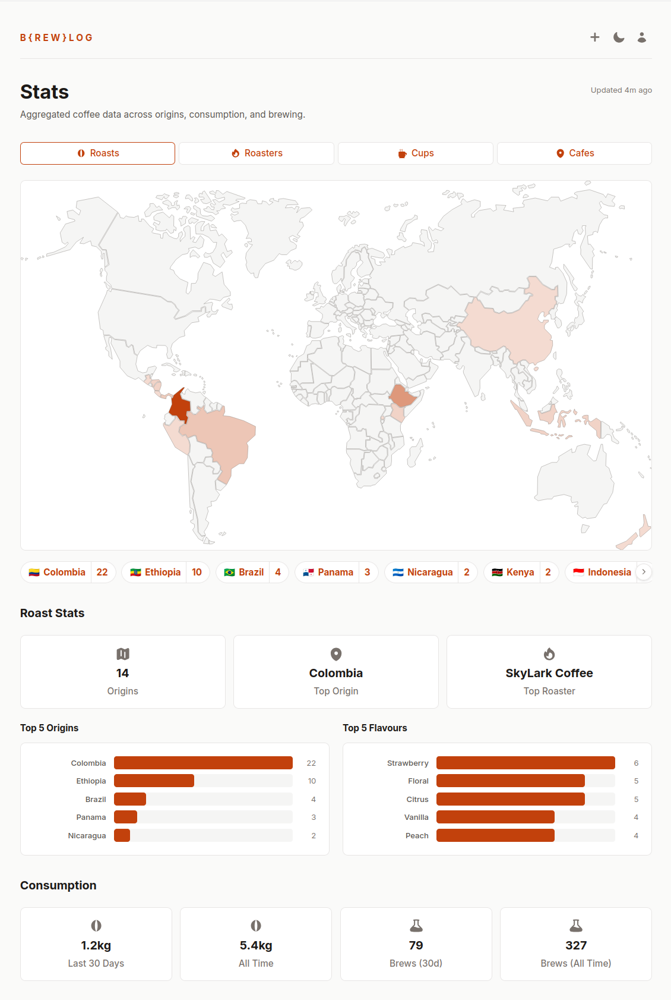

## Introduction

I’m really into speciality coffee. In July 2025 I started tracking my coffee habits with [Roastguide](https://roast.guide/), a delightfully designed iOS app for people with a similar obsession to mine. It does a good job of tracking brews, roasters and bags, but over time I found myself wanting the data in a system that I controlled. I wanted to be able to query it, back it up, and adjust some of the flows to work better for how I brew and consume coffee.

I’d been sceptical of agentic coding tools, but recent developments made them hard to ignore, and I wanted an excuse to build something substantial from scratch to see what they could actually do.

So I built [b{rew}log](https://github.com/jnsgruk/brewlog), which is a self-hosted coffee logging platform. It tracks roasters, roasts, bags, brews, equipment, and cafe visits. It's live at [coffee.jnsgr.uk](https://coffee.jnsgr.uk) if you want to poke around and witness the depths of my strange filter coffee obsession!

This was by far the most complex project I'd built with [Claude Code](https://claude.com/product/claude-code), or agentic coding tools in general. I'm responsible for the technology choices, architecture, and visual design, but I wrote almost none of the code myself.

## Core Features

Brewlog tracks roasters, roasts, bags, brews, equipment, and cafe visits. The landing page is below - from here I can see details of the last few brews (and repeat them), and track open bags of coffee and how much remains in each:

[](01.png)

Brews are coffees I’ve made myself. Each brew is logged against a specific bag and captures the recipe (dose, water, time, temperature), the equipment used, and tasting notes. Over time this will build up a history of what I've brewed, how I brewed it and how much I use the brewing gear I've accumulated over time. I also hope it'll give me some insight into the coffee I enjoy, and help me choose new roasts.

[](04.png)

Finally, brewlog tracks cafes I've visited, and "cups" which are coffees I've enjoyed, but not brewed myself.

The fun part is the pretty extensive stats page, which shows an interactive map of where my coffees are grown, roasted and drunk, as well as stats like common flavour notes and brew times.

[](02.png)

### LLM-Powered Bag Scanning

Roastguide has a nice feature that allows you to take a picture of a bag of coffee and it'll fetch the details. If my understanding is correct, their implementation relies on a database of roasters and coffees that the creators maintain. My app wouldn't have access to that database, nor did I want to spend too much time building ingestion pipelines to store lots of data about all the possible coffees/roasters.

In brewlog, I implemented this feature using LLM extraction. Essentially, I take a photo and send it to a multimodal model hosted by [OpenRouter](https://openrouter.ai/). The [prompt](https://github.com/jnsgruk/brewlog/blob/edffb1679db3f17a8ed8e47735e8e1aff137e117/src/infrastructure/ai.rs#L11-L28) instructs the model to extract text from the image, perform a web search, and return a JSON object containing details of the coffee or roaster. OpenRouter also lets me switch models easily without worrying about API differences.

In practice this works surprisingly well. Most speciality coffee bags are covered in useful information, and vision models are good at reading it. The main failure modes I see are mixing up roast names from the web and occasionally inventing tasting notes, but the form review step makes those cheap to correct.

The cost is almost negligible per scan. I've mostly been using [`google/gemini-2.5-flash`](https://openrouter.ai/google/gemini-2.5-flash) for the LLM extraction feature, and each scan costs between $0.01 - $0.02 on average.

[](03.png)

## Design Decisions

### Backend

Brewlog is built with Rust and [Axum](https://github.com/tokio-rs/axum) for the backend. I've been [learning Rust](https://jnsgr.uk/2024/12/experiments-with-rust-nix-k6-parca/) for a while now, and wanted to push further with a more substantial project. Templates are handled by [Askama](https://github.com/djc/askama), whose compile‑time templates turned out to be a boon for agentic coding because template errors surface as Rust compiler errors, which are easy to feed back to the agent to fix in a tight loop.

The database is [SQLite](https://www.sqlite.org/). A single file, easy to back up, easy to move around. For a single-user application like this, SQLite is more than sufficient and removes the need for a separate database server. [Migrations](https://github.com/jnsgruk/brewlog/tree/main/migrations) are embedded in the binary and [run automatically](https://github.com/jnsgruk/brewlog/blob/edffb1679db3f17a8ed8e47735e8e1aff137e117/src/infrastructure/database.rs#L38) on startup by the application.

### Frontend

I wanted the app to feel modern, but keep much of the rendering server-side. I didn't want to be serving a large client-side javascript application. I've been curious about the likes of [htmx](https://htmx.org/), and the observations made in a post from last year on [building apps with Eta, HTMX and Lit](https://www.lorenstew.art/blog/eta-htmx-lit-stack) really resonated with me.

More recently I became aware of [Datastar](https://data-star.dev/). Datastar occupies a similar space to [HTMX](https://htmx.org/) in that it enables server-driven interactivity without writing much JavaScript, but it's newer and in my opinion results in slightly cleaner templates. Where HTMX swaps HTML fragments, Datastar adds a reactive signal system and can patch both HTML and JSON data from the server.

When the agent regressed to vanilla fetch calls, or more manual Javascript DOM manipulation I treated that as a hole in my instructions, not the model, and [updated](https://github.com/jnsgruk/brewlog/blob/main/CLAUDE.md#gotchas) CLAUDE.md to reinforce the server‑driven Datastar pattern and prevent the agent making the same mistake again.

### Single User, No Passwords

Brewlog is deliberately single-user. I'm happy for people to self-host their own instance, but I don't have much interest in providing a service more widely. The codebase is structured such that making it multi-user wouldn't be a big lift, but I'm not convinced I'll ever do it.

Perhaps unusually, authentication via username and password is not supported. Authentication is only supported using passkeys via [WebAuthn](https://webauthn.io/) or with an API token. This was a deliberate choice - passkeys are phishing-resistant and significantly more difficult to brute-force both from an academic and a practical standpoint, which removes an entire class of abuse vectors.

### Comprehensive CLI Client

A habit I picked up from [@niemeyer](https://github.com/niemeyer) is ensuring that whenever a new API endpoint is added, the corresponding CLI command or flag lands at the same time.

I also learned from him the joy of shipping a single binary that can act both as a server, and a client to itself. With brewlog, the binary runs the server that hosts the API and web UI, but also serves as a first-class API client for managing data in the app.

If you’re building an API‑backed app with an agent, I highly recommend this pattern. It keeps the surface area small and gives both you and the agent a first‑class, [scriptable](https://github.com/jnsgruk/brewlog/blob/main/scripts/bootstrap-db.sh) way to exercise the API and troubleshoot problems in data transformation.

### Domain-Driven Design

The codebase follows a domain-driven design approach with four layers: domain (business logic only, no external dependencies), infrastructure (database, HTTP clients, third-party APIs), application (HTTP server, routes, middleware, services), and presentation (CLI commands and web view models).

```text
┌─────────────────────────────────────────────────────────────┐
│  Presentation                                               │
│  ┌─────────────────────────┐  ┌──────────────────────────┐  │
│  │ CLI                     │  │ Web                      │  │
│  │  roasters, roasts, bags │  │  views, templates        │  │
│  │  brews, cups, gear ...  │  │  roasters, roasts, bags  │  │
│  └─────────────────────────┘  └──────────────────────────┘  │
├─────────────────────────────────────────────────────────────┤
│  Application                                                │
│  ┌──────────────┐ ┌──────────────────┐ ┌─────────────────┐  │
│  │ Routes       │ │ Services         │ │ Server / State  │  │
│  │  /api/*      │ │  BagService      │ │  Axum router    │  │
│  │  /app/*      │ │  BrewService     │ │  AppState (DI)  │  │
│  │              │ │  RoastService .. │ │                 │  │
│  └──────────────┘ └──────────────────┘ └─────────────────┘  │
├─────────────────────────────────────────────────────────────┤
│  Domain  (pure Rust — no framework dependencies)            │
│  ┌──────────────────────┐  ┌─────────────────────────────┐  │
│  │ Entities & Values    │  │ Repository Traits           │  │
│  │  coffee/ roasters,   │  │  trait RoasterRepository    │  │
│  │   roasts, bags,      │  │  trait RoastRepository      │  │
│  │   brews, cups, gear  │  │  trait BagRepository  ...   │  │
│  │  auth/ users,        │  │                             │  │
│  │   sessions, tokens   │  │ Errors, IDs, Listing,       │  │
│  │  analytics/          │  │ Formatting                  │  │
│  └──────────────────────┘  └─────────────────────────────┘  │
├──────────────────────────────────┬──────────────────────────┤
│  Infrastructure                  │                          │
│  ┌────────────────────────────┐  │  ┌───────────────────┐   │
│  │ Repositories (SQLite)      │  │  │ External Clients  │   │
│  │  SqlRoasterRepository      │  │  │  OpenRouter (AI)  │   │
│  │  SqlRoastRepository        │  │  │  Foursquare       │   │
│  │  SqlBagRepository  ...     │  │  │  WebAuthn         │   │
│  │  (implement domain traits) │  │  │  Backup           │   │
│  └────────────────────────────┘  │  └───────────────────┘   │
└──────────────────────────────────┴──────────────────────────┘
```

In this model, dependencies flow inward. The domain layer knows nothing about Axum, SQLite, or any other implementation detail. Repository traits are defined in the domain and implemented in the infrastructure layer. This affords me a lot of flexibility in the future if, for example, I want to move to PostgreSQL rather than SQLite, or if I want to change how I store images, etc.

It also makes testing each part of the application simpler. The domain-driven design approach encourages loose coupling and practices like dependency injection, which usually lead to simpler integration tests. For example, I could ask the agent for focused tests against pure domain logic without pulling in Axum or SQLite.

## Agentic Coding Patterns

A big part of this project was to learn some new technology and skills, and it certainly did that, but it also reinforced some patterns I've been using for a while now.

### Pre-commit hooks as a contract

One thing I've never been too fond of, but have come around to when using agentic tools, is pre-commit hooks. I've always been very disciplined around using formatters and linters in projects, but never enjoyed having them set up to run automatically. I treat `pre‑commit` as a contract between me and the agent. The agent is instructed to always fix linting/testing failures before returning to me for input or declaring success.

### Stricter lints for agents

I'm also more inclined toward a stricter, more pedantic set of lints to enforce things like maximum line count in a function or file. When I'm writing code myself I make these changes instinctively because it's obvious when a function becomes cumbersome when you're editing by hand, but I noticed early on that the agent was much more comfortable with 100+ line functions than I am.

If you care about architectural constraints (function length, etc.), encode them as lints rather than hoping the agent internalises your preferences.

I'd never used [flake-parts](https://flake.parts) before, but it's ability to automatically configure pre-commit hooks and formatting tools like [treefmt](https://treefmt.com/latest/) in the Nix dev shell is really slick, and is something I will probably adopt going forward.

### Self-updating instructions

I hadn’t previously realised how good these tools are at writing their own instructions. I had baulked in the past at the length/complexity of `AGENTS.md` files I'd seen, not realising that there is quite a productive pattern where you work with an agent to solve a problem, or remedy something it did, then prompt it to summarise what just happened in the guidance file to prevent it from happening again.

### Visual prompting

When working on frontend components, I built a nice workflow around screenshotting the output of its work and marking it up with [Flameshot](https://flameshot.org/), then pasting the image back into Claude Code with the next prompt. I found this to be a really effective way to drive iteration on web components. This felt closer to pair‑designing with a human - I’d circle spacing issues or misaligned elements, and the agent would propose CSS tweaks in response to what it saw.

## Summary

This was a really fun project to build, and I've been using it every day for about a month now. It's different from how I've approached projects in the past, in a way that's both liberating and terrifying in equal measures.

While some of the code in this project lacks the same attention to detail I might have applied, I likely would never have got around to building it, and definitely not in the same timeframe, without a tool like Claude Code.

I was pleasantly surprised about what the process taught me. There are some software patterns in brewlog which I have known about, studied and designed into applications before, but not built myself. I reviewed most of the code going into the app, and the process of reviewing the code, iterating on it while building these patterns and eventually settling on the implementation taught me a lot, and I feel more informed about the trade-offs.

Brewlog is live at [coffee.jnsgr.uk](https://coffee.jnsgr.uk) and runs comfortably on a free-tier instance on [fly.io](https://fly.io/), and I’ve been using it every day for the past month.

If you’re into speciality coffee and like owning your data, give it a try and let me know how you get on.

Finally, I'd like to thank the authors of Roastguide for the amazing work they've done on their app, the attention they pay to their community on Discord, and the fact that they were willing to get me a dump of my data I could use to populate the first deployment of Brewlog!
