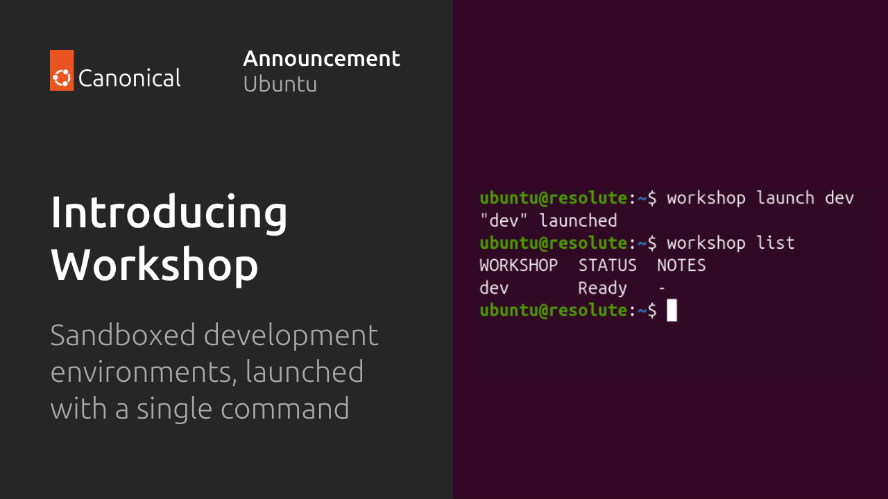
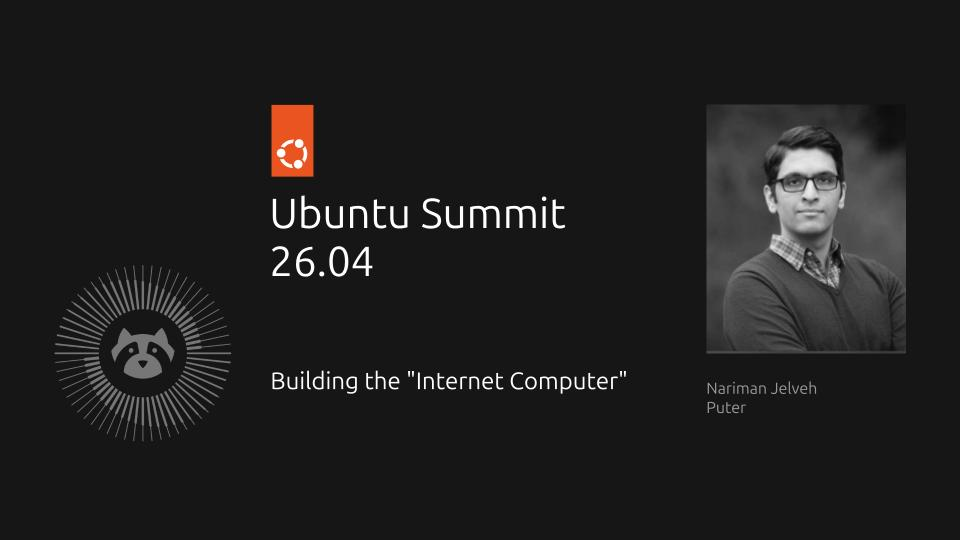
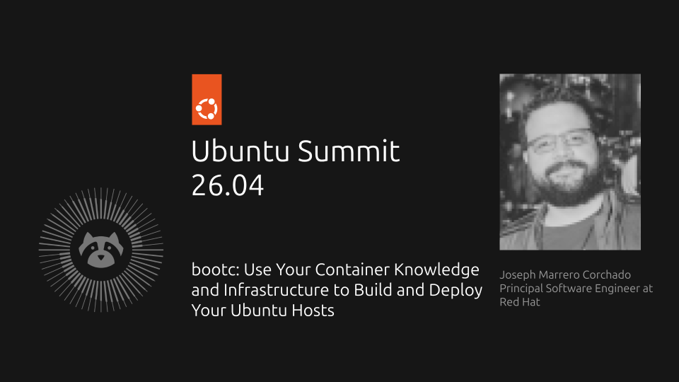
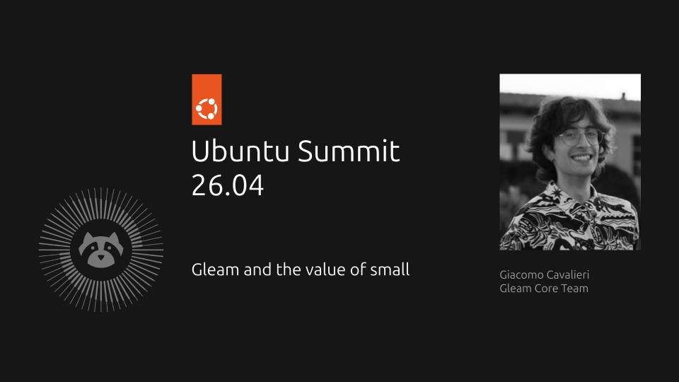
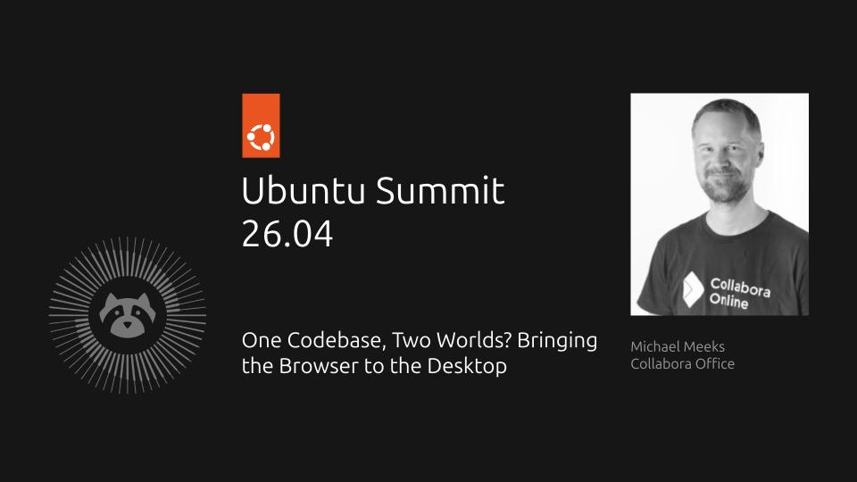
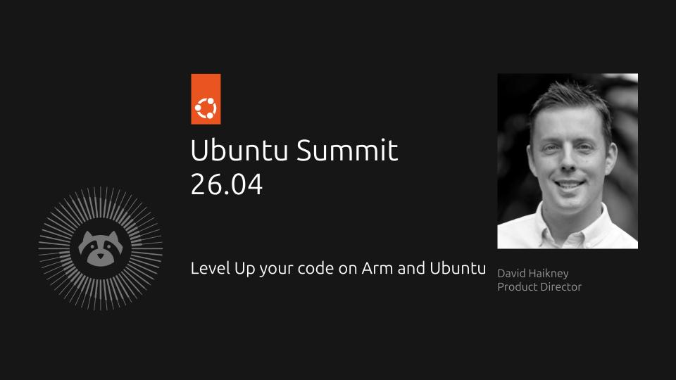

Last week I attended [Ubuntu Summit 26.04](https://ubuntu.com/summit). Ubuntu Summit is Canonical's twice-yearly "showcase for innovative and ambitious" work across Ubuntu, open source, and the wider technology ecosystem.

The format remained the same as the [Ubuntu Summit 25.10](https://jnsgr.uk/2025/11/ubuntu-summit-25/): a focused programme of talks, demos and community sessions, streamed for a wider audience. While many of the talks are anchored around Ubuntu or Canonical, this is not a requirement for submission.

The [Ubuntu Summit 26.04 playlist](https://www.youtube.com/playlist?list=PLwFSk464RMxkkvScqDkfHLIx8ox0hDIDV) already includes the [opening keynote](https://www.youtube.com/watch?v=jvJo8bOT7Lk), where I talked through AI in Ubuntu and the Ubuntu 26.04 LTS release. Some individual talk recordings are also available already, with the remaining recordings expected to follow in the coming days.

In this post I'll highlight some of my favourite moments of the Summit, starting with the launch of [Canonical Workshop](https://ubuntu.com/workshop), before moving through a few talks. If any of these catch your interest, you can see [when they aired](https://discourse.ubuntu.com/t/ubuntu-summit-26-04-timetable/81507) and follow the links through to the individual talk submissions!

## Canonical Workshop

Before getting into the talks, the first highlight for me was the public launch of [Canonical Workshop](https://ubuntu.com/workshop). The launch was covered [on the Canonical blog](https://canonical.com/blog/introducing-workshop-sandboxed-development-environments), and the [Summit recording](https://www.youtube.com/watch?v=ppElEgR_wEU) is already available.

I've been heavily involved in Workshop for the last three years, working with the brilliant [Dmitry Lyfar](https://github.com/dmitry-lyfar) (project lead) and Canonical's CTO, [Gustavo Niemeyer](https://github.com/niemeyer). Up until now, Workshop has been developed in a private GitHub repository, so announcing it publicly at the Summit was the perfect way for the project to go public!

The thing I like about Workshop is that it turns messy development environments into something repeatable and sandboxed, launchable with a single command. The original motivation was for simplifying work with silicon SDKs and other complex vendor toolchains where setting up the right environment can be painful, fragile and hard to reproduce.

Workshop helps teams package and reproduce their development environments, automate tasks in the codebase, and keep local and CI environments aligned - and it's based on technology (LXD, ZFS) that's already present on the vast majority of Ubuntu machines.

As it happens, Workshop turns out to be a perfect fit for the agentic engineering boom. Agents need contained workspaces, clear boundaries around host access, and environments that can be torn down, recreated and shared without much ceremony. Workshop gives that workflow a natural home on Ubuntu, while also making day-to-day developer environment management feel much more pleasant.

I implore you to have a play with Workshop - I think Dmitry and team have done an incredibly classy job of Workshop, and they're poised and ready to respond to any feedback you might have!

## Building the "Internet Computer"

[Building the "Internet Computer"](https://discourse.ubuntu.com/t/building-the-internet-computer/79577) was delivered by [Nariman Jelveh](https://github.com/jelveh), founder of [Puter](https://puter.com/), and was an excellent way to kick off the Summit: technically ambitious and wonderfully articulated.

Puter is an open source "internet OS": a desktop environment, filesystem, authentication layer, app hosting platform and set of cloud services that run in the browser. That description might sound like an old idea resurfacing, but the interesting part of the talk was in the detail. 

Nariman walked through how Puter is made to feel like a native environment while remaining a web platform, including the distributed filesystem, application sandboxing, and an API layer that enables developers to build against Puter as a *platform* rather than just a website.

The [recording is already available](https://www.youtube.com/watch?v=itPl9r9-LqE) if you want to watch the talk back.

## bootc for Ubuntu hosts

[bootc: Use Your Container Knowledge and Infrastructure to Build and Deploy Your Ubuntu Hosts](https://discourse.ubuntu.com/t/bootc-use-your-container-knowledge-and-infrastructure-to-build-and-deploy-your-ubuntu-hosts/79498) was given by [Joseph Marrero Corchado](https://github.com/jmarrero), a Principal Software Engineer at Red Hat.

The `bootc` pitch is straightforward: we already have mature workflows for building, testing, versioning and promoting OCI images, so why not apply more of that machinery to building and delivering operating systems? Rather than configuring a machine after installation and then trying to control drift with layers of automation, `bootc` lets you describe a bootable host as a container image and promote it through the same kind of pipeline you might already use for applications.

This was a particularly interesting talk to feature at the Summit, because Canonical is heading a different way for its implementation of an "immutable" offering for Ubuntu through Ubuntu Core. I wrote in detail about both Ubuntu Core and `bootc` in [a previous blog post](https://jnsgr.uk/2025/09/immutable-linux-paradox/) if you'd like more detail on the trade-offs.

What I love is that this difference didn't prevent the talk from appearing at the Summit. I understand that there is an audience for Ubuntu + `bootc`, and even if Canonical doesn't wish to pursue that path, I'm delighted that it exists in a community-maintained form and I'll be following along closely!

The [recording is available on YouTube](https://www.youtube.com/watch?v=1EkaitzSFFw). Joseph also shared an [Ubuntu 26.04 with bootc getting started guide](https://github.com/jmarrero/ubuntu-bootc/blob/main/GUIDE.md) after the talk.

## Gleam and the value of small

[Gleam and the value of small](https://discourse.ubuntu.com/t/gleam-and-the-value-of-small/80331) by [Giacomo Cavalieri](https://github.com/giacomocavalieri) was one of the standout presentations of the Summit for me, both in content and format. Rarely have I seen a conference talk delivered with such passion and panache. Giacomo was a phenomenal presenter and their slides were *outstanding*, too.

Gleam is a friendly, statically typed language for the Erlang VM and JavaScript runtimes. The talk's core argument was that the pursuit of being small is not just an aesthetic choice for a programming language: it is a maintenance strategy, a community strategy, and a way of protecting the long-term health of a project that does not have a large corporate owner behind it.

Rather than trying to sell Gleam through an exhaustive feature tour, Giacomo used the language's restraint as the subject of the talk: fewer moving parts, clear trade-offs, and a project culture that treats every new feature as a future maintenance commitment.

Many open source projects struggle not because they lack ideas, but because they accumulate too many of them without the maintainers to carry them in the long term, and Giacomo's talk provided a robust narrative to combat this problem. I'm definitely going to be having a play with Gleam! 😉

## Collabora Office as a snap

[One Codebase, Two Worlds? Bringing the Browser to the Desktop](https://discourse.ubuntu.com/t/one-codebase-two-worlds-bringing-the-browser-to-the-desktop/82466) was delivered by [Michael Meeks](https://people.gnome.org/~michael/), who works in [Collabora](https://www.collaboraonline.com/)'s Office division.

The talk walked through the problem of taking an established browser-based solution and bringing it to the Linux desktop without throwing away the work that made the browser version successful. That tension is common: users want desktop apps to feel native, but engineering teams often want to avoid maintaining entirely separate products for web and desktop, or having to learn the intricacies of the many different packaging formats available for Linux machines.

What I liked about this talk was how it highlighted some of the core benefits of Snaps and the ecosystem around them. Atomic updates, confinement, and the ability to build once and ship across many Linux distributions all help reduce the packaging burden, while still giving users a desktop application rather than asking them to live entirely in a browser tab.

I have a soft spot for talks that sit at the intersection of product and engineering concerns, and this was very much that. It was a great example of where good desktop packaging is not merely an implementation detail, but changed what is fundamentally practical for an upstream project to offer.

The [recording is available as "Snapping a Giant Office for the Linux Desktop"](https://www.youtube.com/watch?v=3DkNh636ANE).

## Arm Performix

[Level Up your code on Arm and Ubuntu](https://discourse.ubuntu.com/t/level-up-your-code-on-arm-and-ubuntu/79868) by [David Haikney](https://github.com/dhaikney) focused on performance engineering for Arm platforms running Ubuntu.

Arm is now present across a wide spread of systems, from edge devices to cloud platforms, and that makes performance work more important than ever. Porting code is one step but understanding how it behaves on real hardware, where it spends time, and how it can be tuned is the next. 

Software is sometimes "naively" ported to Arm platforms - where original codebases have often benefited from years of optimisation to utilise SIMD instructions and the like, early ports often don't enjoy the same benefits. Using a profiler can quickly identify how to turn naive ports into first-class Arm implementations.

David introduced [Arm Performix](https://developer.arm.com/servers-and-cloud-computing/arm-performix), a free performance toolkit for understanding and improving real-world performance on Arm architectures, and connected that with AI-assisted development and static analysis for porting and optimization work. The talk's framing treated Arm enablement as an engineering workflow rather than a checkbox.

## Honorable mentions

There were plenty of other talks I enjoyed. [Minimal rust rocks](https://discourse.ubuntu.com/t/minimal-rust-rocks/79639) continued the Rust theme that has been growing across the Ubuntu ecosystem, and its [recording is already available](https://www.youtube.com/watch?v=7StUGU9ZjmA). [DuckDB: Not Quack Science](https://discourse.ubuntu.com/t/duckdb-not-quack-science/79571), which also now has a [recording on YouTube](https://www.youtube.com/watch?v=q6S0Vv4u3iM), was a reminder of how much interesting infrastructure work is happening around data tools that are small enough to use locally but powerful enough to reshape large-scale workflows and deployments.

I was also pleased to see [upki: improving certificate revocation on Linux](https://discourse.ubuntu.com/t/upki-improving-certificate-revocation-on-linux/79576) on the schedule. This is a project I've written about a couple of times already: first when [announcing upki](https://jnsgr.uk/2025/12/addressing-linuxs-missing-pki-infra/) as an attempt to close Linux's missing CRL infrastructure, and then in [a progress update](https://jnsgr.uk/2026/02/upki-update/) covering the core revocation engine, CRLite mirroring, the C FFI, `rustls` integration and early packaging work.

## Conclusion

I really enjoyed Ubuntu Summit 26.04. It felt like a refinement on the format we trialled for the last Summit, and delivered a programme that balanced Ubuntu-specific work against a broader view of the open source world. The overall level of the talks was outstanding.

That breadth is exactly what I hope the Summit continues to provide. Ubuntu is at its best when it acts as a meeting point for people building across the stack, from hardware and kernels through packaging, developer tooling, applications and community.

Until next time! Ubuntu Summit 26.10 is scheduled for 12-13 November 2026.
